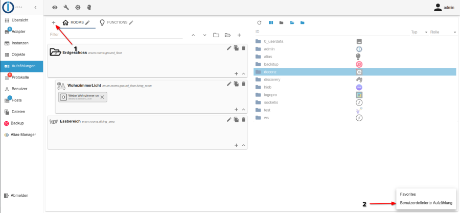

# Introduction

#### **WORK IN PROGRESS**

Changelo**g**\


Ich werde in den nächsten Tagen ein neues Update freischalten. Erstmal aber nur für die **Beta-Version**.

**WICHTIG: Vor einem Update zunächst aktuelle Einstellungen Backupen** &#x20;

* **Settings - General Settings - Export**

Es kann durchaus passieren, dass die App nach dem Update zunächst nicht mehr geht, wenn dies der Fall versuche Folgendes:

1. Alle App-daten löschen oder App neu installieren
2. Backup importieren

**Hier die wichtigesten neuerungen:**\
Advanded Widget:

* Es ist nun möglich ein **Popup Fenster** frei zu gestalten, mit allen verfügbaren Widgets: So ist es nun möglich ein Advanded Widget zu erstellen, wobei sich durch nur langes draufdrücken ein Fenster öffnet, welches weitere Widgets enthält (vergleiche Switch with slider)

Tabel:

* Dies ist ein neues Widget, wodurch es möglich ist eine Tabelle, welche in einem Datenpunkt als JSON Format gespeichert ist, Tabellarisch darstellen zu lassen
* Columns: Hier musst die verschiedenen Spalten angeben, die angezeigt werden sollen: Dabei entspricht das Feld: _Column key from json_ dem Spaltennamen in dem JSON Format und _Column name_ dem Spaltennamen, welche die App am Ende anzeigen soll

Info-tool (in Testphase und noch nicht vollständig):

* Dieses Tool soll für die verschiedenen Einstellungsfelder der Widgets eine kurze Erklären bereitstellen
* Aufgerufen werden kann es über das Fragezeichen oben Rechts, wenn man sich in den Widget-Einstellungen befindet

## Introduction

### Known Bugs

### Description

HioB ist eine App Anwendung, die es ermöglicht deine Geräte von deinem ioBroker über eine HandyApp zu steuern.

**Warum solltest man diese App benutzen**: Die App bietet eine Performante Lösung, um dein SmartHome über dein Handy zu bedienen. Zudem bietet die App eine einfache Einrichtung.

**ACHTUNG**: Die App ist noch einen sehr fürhen Entwicklungsstatus.

### Installation

Zunächst musst du den HioB Adapter manuell installieren:

* Der Adpater muss manuell über die Konsole installiert werden

```
npm install iobroker.hiob
iobroker add hiob 
```

* Nach der Installation wird ein gültiger und freier Port für den Adapter benötigt (z.B. 8090), dieser muss bei den Adapter-Einstellungen angeben werden

### App Einrichtung:

#### Installation:

* Installiere die App [hier](https://hiob.bachmaiers.de)

#### Geräte Einrichten

**Geräte Strucktur**

* Ein Gerät besteht aus mehreren Datenpunkte
* Die meisten Widgets benötigen dabei jeweils **nur ein** Datenpunkt des jeweiligen Gerätes

**Manuell in der App:**

* Es kann jederzeit Manuell ein Gerät unter "Device-Settings" hinzugefügt/bearbeitet werden
* Hierfür werden die ObjectIDs vom IoBroker-Datenpunkt benötigt

**Manuell im IoBroker (Empfohlen):**

*   Zunächst muss eine Aufzählungskategorie mit der ID „hiob“ erstellt werden

    
* Nun können Geräte in diese Kategorie hinzugefügt werden.
  * Füge **nur** Datenpunkte hinzu, die direkt angesteuert werden können (also keine Ordner o.ä)
  * Alle Kategorie-Elemente, die **Datenpunkte enthalten** werden später von der App als eigenes Device eingerichtet. (Im Foto oben, würde die App somit nur ein Gerät mit dem Namen "WohnzimmerLicht" und dessen Datenpunkt erstellen)
*   Daraufhin muss in der App folgendes gemacht werden:

    1. Bei „Update Enums“ auf „Update“ klicken
    2. Bei „Import Enums“ auf „Import“ klicken

    Daraufhin werden **alle Geräte** aus der HioB-Aufzählung importiert.

**Wichtig:** Füge nur einzelne Datenpunkte hinzu, die später auch in der App benötigt werden.

**Tipp:** Je nach Anzahl bzw. Komplexität des SmartHomes ist eine Gruppierung (z.B. nach Stockwerken, Räumen oder Gerätetypen) zu empfehlen.

#### Tabs/Screens Hinzufügen

* Unter "Screen-Settings" kannst du einen neuen Screen/Tab hinzufügen
* In jedem Screen kannst du (nachdem dem du diese hinzugefügt hast) verschiedene [Widgets](https://app.gitbook.com/s/YWLvuNyLNp6aa7cn2y33/\~/changes/oA9p3RZ4zPIZXkJxzQ1V/widgets)/Gruppen hinzufügen
* Die Reihenfolge kann nachträglich über Drag-and-Drop ändern

#### Widgets erstellen

* Widgets können unter "Widget-Settings" erstellt werden
* Der Name des Widget bestimmt dabei den Anzeigenamen unter "Widget-Settings"
* Der optionale "Value" des Widgtes bestimmt dabei den Anzeigetext auf der Hauptseite
* Um ein Widget benutzen zu können, muss dieses noch einem beliebigen Screen/Tab oder Gruppe unter "Screen-Settings" hinzugefügt werden
* Eine vollständige Liste aller Widgets kann [hier](widgets.md) gefunden werden
