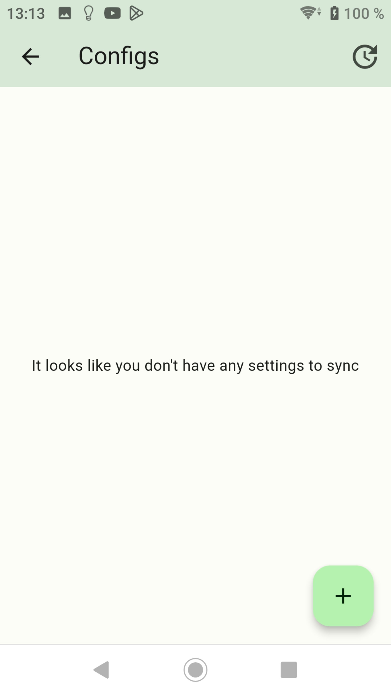
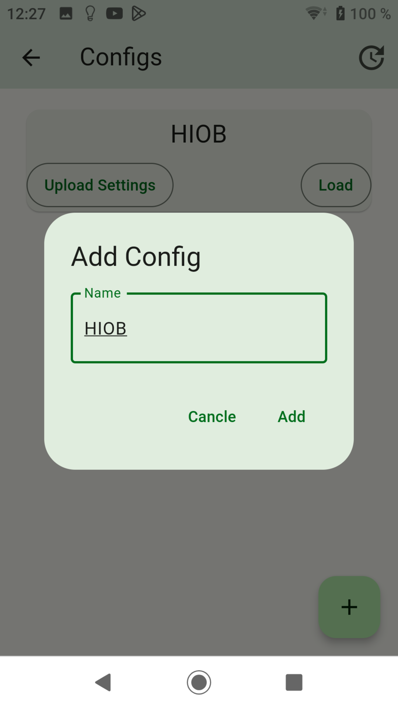
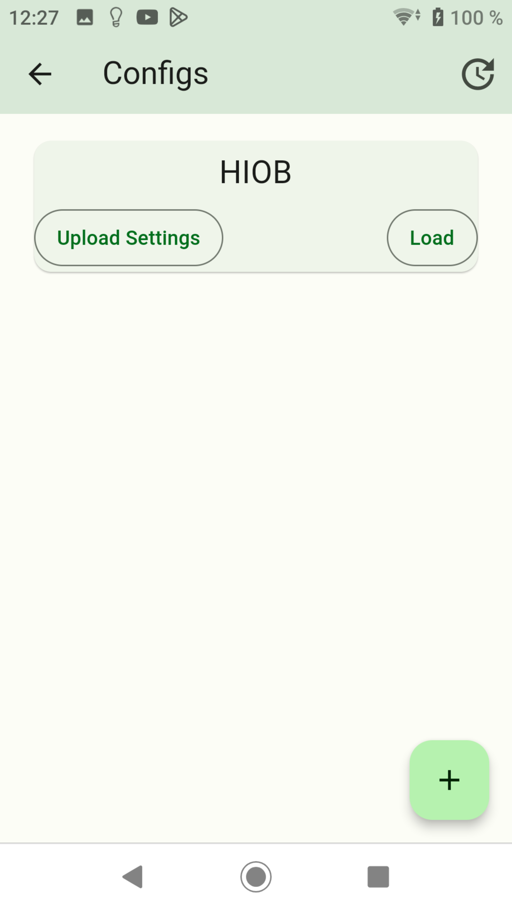
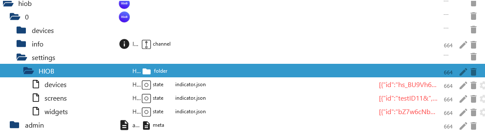

-   [Zurück zur Beschreibung](/docs/de/README.md)
-   [Schritt 1: Installation und APP Einrichtung](app.md)
-   [Schritt 2: ENUMS erstellen](enum.md)
-   [Schritt 3: Widgets erstellen](widgets.md)
-   [Schritt 4: Screens erstellen](sreens.md)

## Backups erstellen `Config Sync`

- Hier kann man seine Settings (Widgets, Screen und Device) in ioBroker speichern.
- Diese Backups können nur in ioBroker gelöscht werden. Hier den gewünschten Objektbaum unter `Settings` komplett löschen.
- Rechts unten das Pluszeichen drücken.

- Dort den Namen vom Backup-Ordner eintragen der erstellt werden soll.

- Danach speichern drücken.

- Nun den Button `Upload Settings` drücken um ein Backup zu erstellen. Jetzt können z. Bsp. andere Benutzer diese Settings mit dem Button `Load` laden. Natürlich sind mehrere Backups möglich.

-   [Zurück zur Beschreibung](/docs/de/README.md)
-   [Schritt 1: Installation und APP Einrichtung](app.md)
-   [Schritt 2: ENUMS erstellen](enum.md)
-   [Schritt 3: Widgets erstellen](widgets.md)
-   [Schritt 4: Screens erstellen](sreens.md)