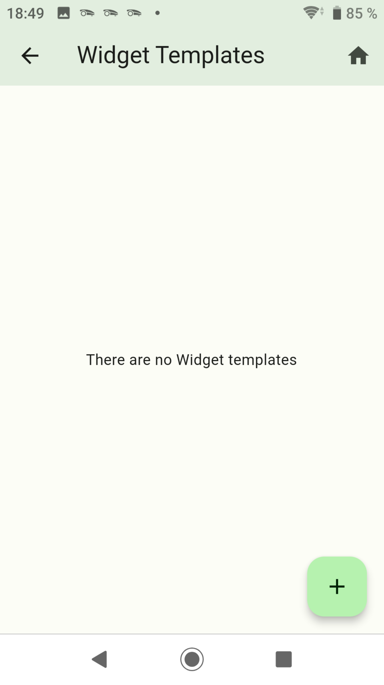
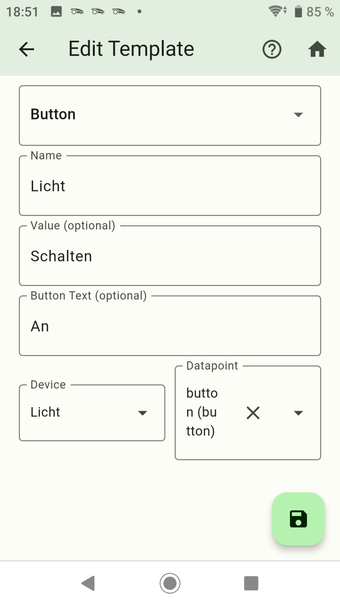
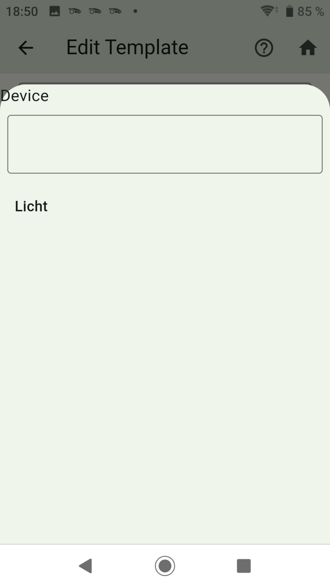
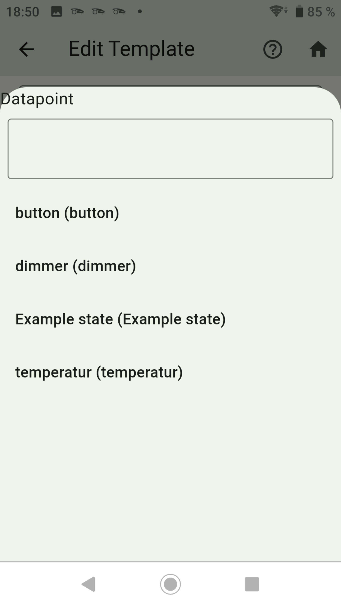
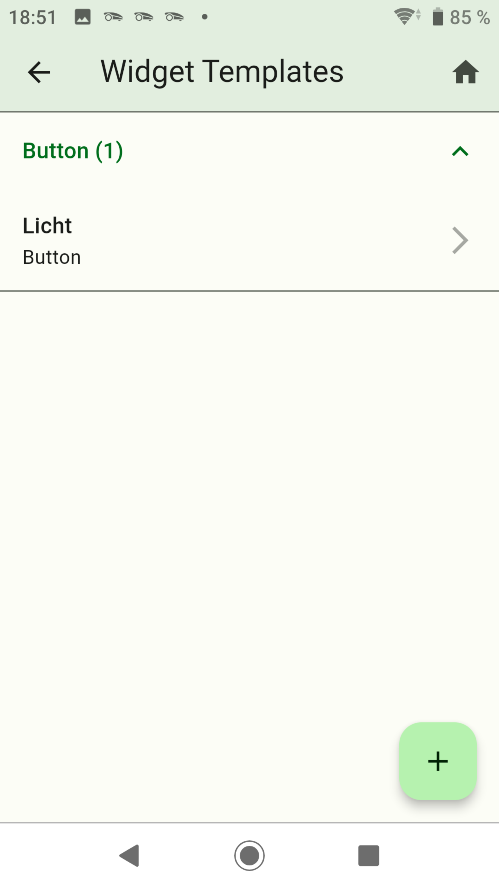

-   [Value erstellen](value.md)
-   [Advanced erstellen](advanced.md)
-   [Switch with Slider erstellen](switch_w_slider.md)
-   [Division Line erstellen](division.md)
-   [Web View erstellen](webview.md)
-   [Table erstellen](table.md)
-   [Graph (only sql Adapter) erstellen](graph.md)
-   [Color Palette erstellen](color.md)
-   [Network Media Player erstellen](media_player.md)

## Button

### Mit Button kann ein Datenpunkt auf wahr gesetzt werden

- Nach links wischen um ein Widget zu löschen.
- Rechts unten das Pluszeichen drücken.

- Dropdown: `Button` auswählen.
- Name: Name vom Widget
- Value (optional): Anzeigetext im Widget. Wird nichts angegeben wird der Name verwendet.
- Button Text (optional): Dieser Text wird im Button angezeigt

- Device: Die gewünschte Auflistung wählen.

- Datapoint: Auswahl der Datenpunkte aus der gewählten Auflistung.

- Danach speichern drücken.
- Durch langes drücken auf ein Widget wird auf den Kopiermodus gewechselt. Hier können Widgets ausgewählt werden von den eine Kopie erstellt werden soll.

-   [Value erstellen](value.md)
-   [Advanced erstellen](advanced.md)
-   [Switch with Slider erstellen](switch_w_slider.md)
-   [Division Line erstellen](division.md)
-   [Web View erstellen](webview.md)
-   [Table erstellen](table.md)
-   [Graph (only sql Adapter) erstellen](graph.md)
-   [Color Palette erstellen](color.md)
-   [Network Media Player erstellen](media_player.md)