-   [Button erstellen](button.md)
-   [Value erstellen](value.md)
-   [Advanced erstellen](advanced.md)
-   [Switch with Slider erstellen](switch_w_slider.md)
-   [Division Line erstellen](division.md)
-   [Web View erstellen](webview.md)
-   [Table erstellen](table.md)
-   [Graph (only sql Adapter) erstellen](graph.md)
-   [Network Media Player erstellen](media_player.md)

## Color Palette

### Mit Color Palette kann ein HEX an ein State übergeben werden

- Nach links wischen um ein Widget zu löschen.
- Rechts unten das Pluszeichen drücken.

## Color Widget

- Dropdown: `Color Palette` auswählen.
- Name: Name vom Widget
- Value (optional): Anzeigetext im Widget. Wird nichts angegeben wird der Name verwendet.
- Device: Die gewünschte Auflistung wählen.
- Datapoint: Auswahl der Datenpunkte aus der gewählten Auflistung - Der Wert muss ein STRING sein.
- Hex prefix (optional): Präfix vor dem Hex z. Bsp. 0x, # oder leer lassen
- Include Alpha Value: Alpha-Wert - [ARGB](#argb)
- Shades selection: Schattenfarben aktivieren [Schattierungen](#shades)
- Primary & Accent: Primärfarben und Akzentfarben mit Schattierungen [Farbpalette](#primary--accent)
- Primary: Primärfarben und ihre Schattierungen [Farbpalette](#primary)
- Accent: Akzentfarben und ihre Schattierungen [Farbpalette](#accent)
- Black and White: Schwarz-Weiß-Farben [Farbpalette](#black--white)
- Wheel: HSV-Farbradauswahl [Farbpalette](#wheel)

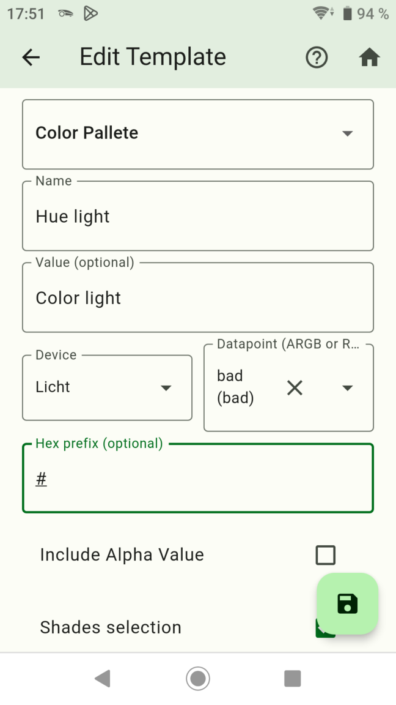
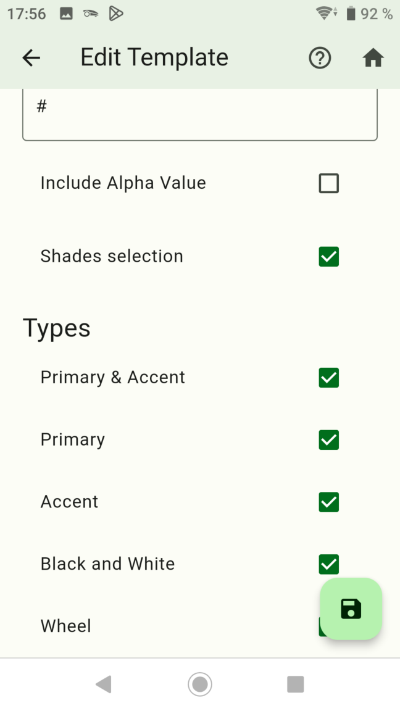

- Danach speichern drücken.
- Durch langes drücken auf ein Widget wird auf den Kopiermodus gewechselt. Hier können Widgets ausgewählt werden von den eine Kopie erstellt werden soll.

- Einen Screen erstellen

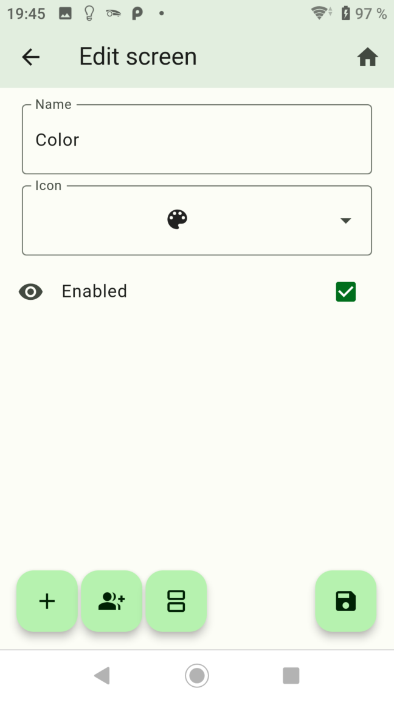

- Das Widget dem Screen hinzufügen.

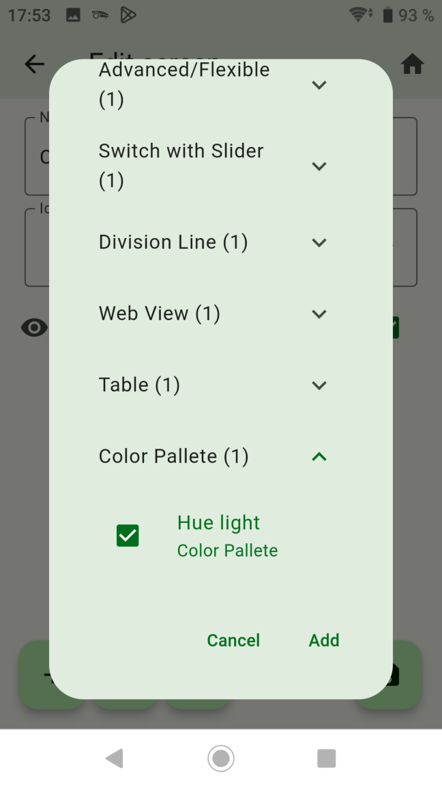

- Fertig! Auf das Widget klicken um die Farbpalette zu öffnen.

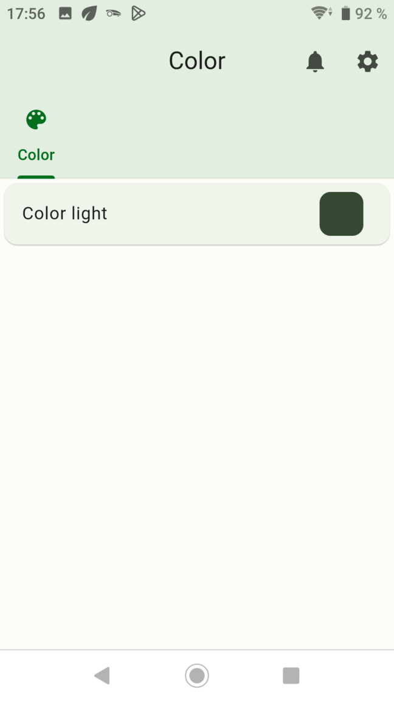

-   [Button erstellen](button.md)
-   [Value erstellen](value.md)
-   [Advanced erstellen](advanced.md)
-   [Switch with Slider erstellen](switch_w_slider.md)
-   [Division Line erstellen](division.md)
-   [Web View erstellen](webview.md)
-   [Table erstellen](table.md)
-   [Graph (only sql Adapter) erstellen](graph.md)
-   [Network Media Player erstellen](media_player.md)

## Shades

[Zurück](#color-widget)

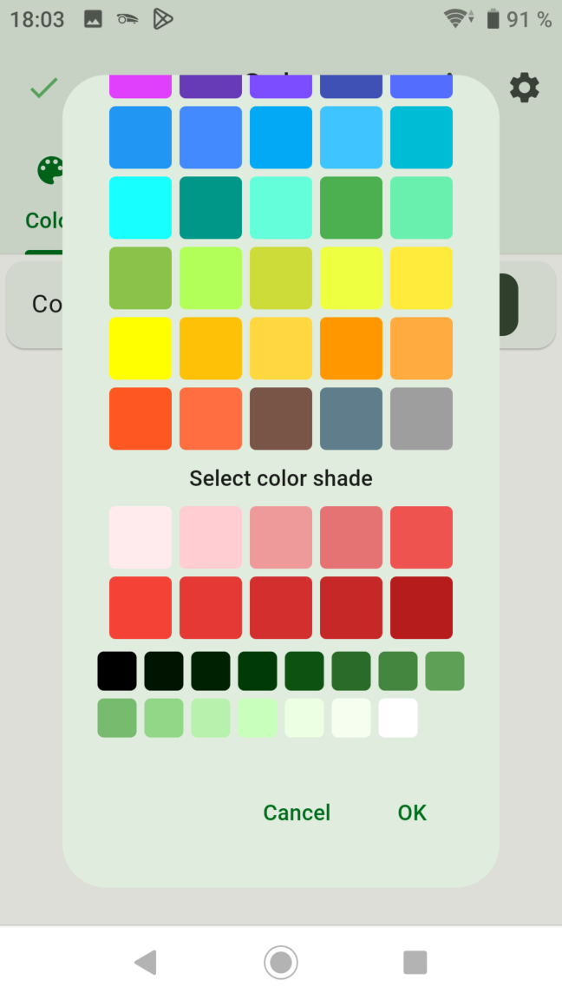

## Primary & Accent

[Zurück](#color-widget)

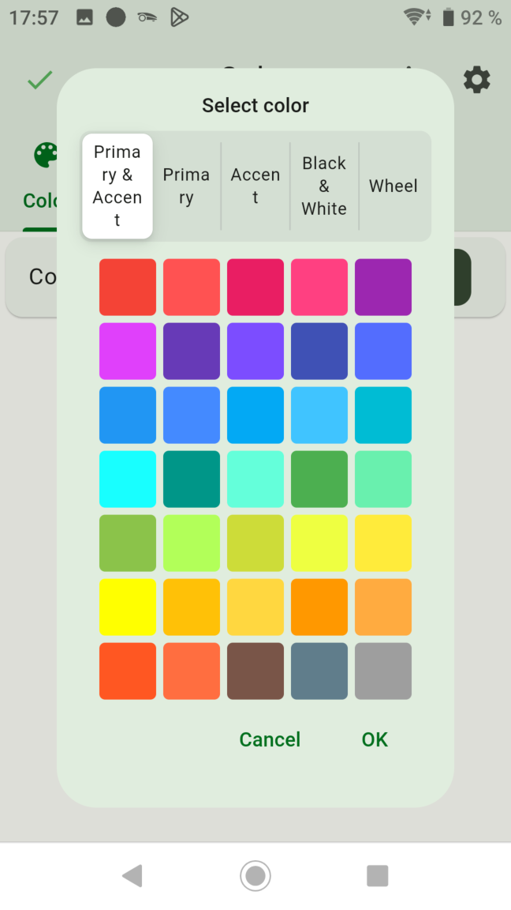

## Primary

[Zurück](#color-widget)

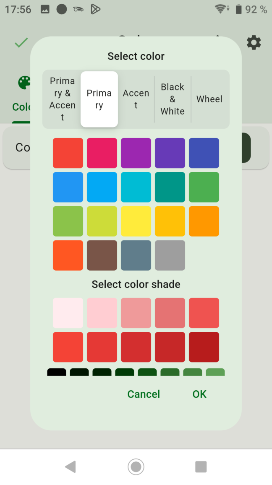

## Accent

[Zurück](#color-widget)

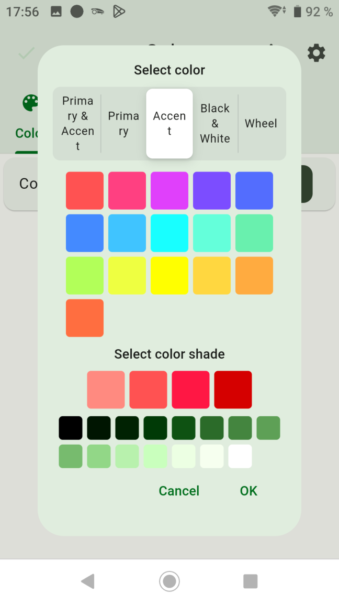

## Black & White

[Zurück](#color-widget)

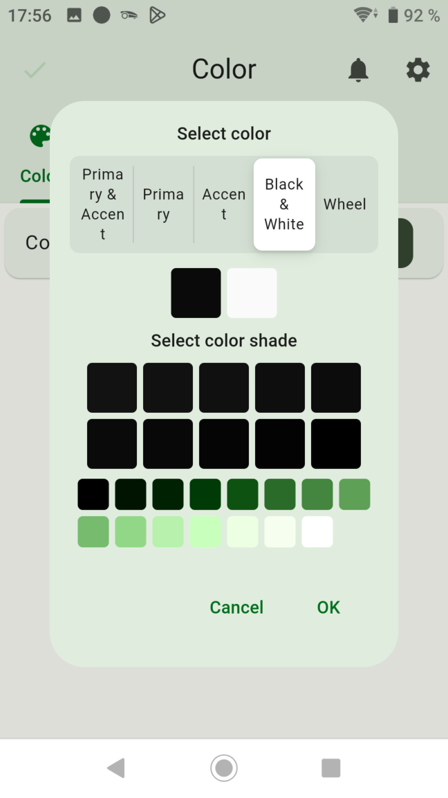

## Wheel

[Zurück](#color-widget)

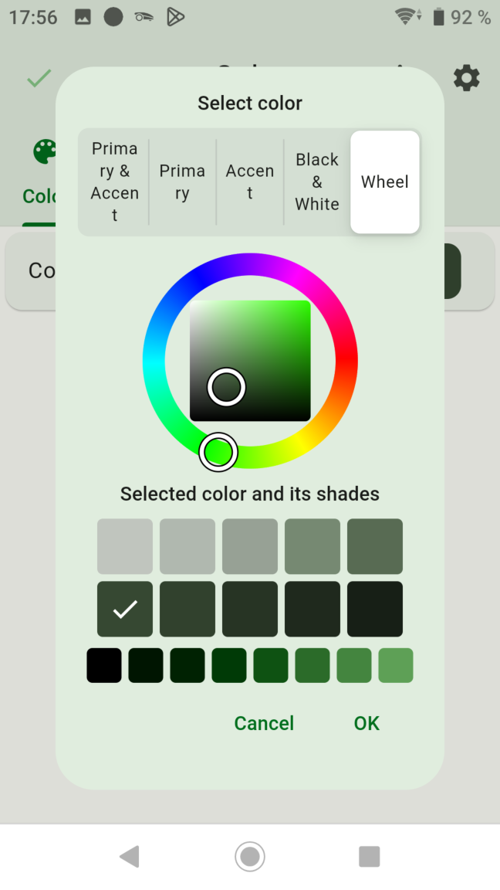

## ARGB

- `A` Transparent bis vollständig undurchsichtig
- `R` Rot
- `G` Grün
- `B` Blau
- `ARGB` == FFFFFFFF

[Zurück](#color-widget)