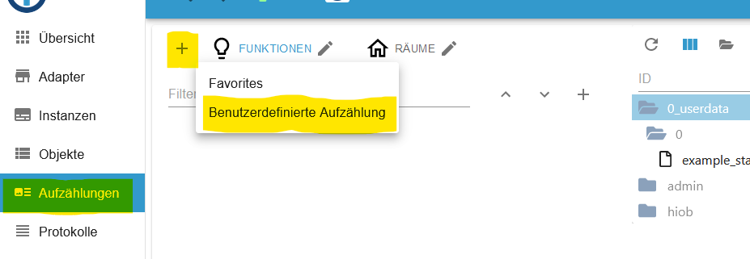
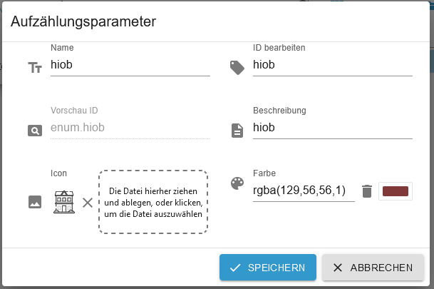
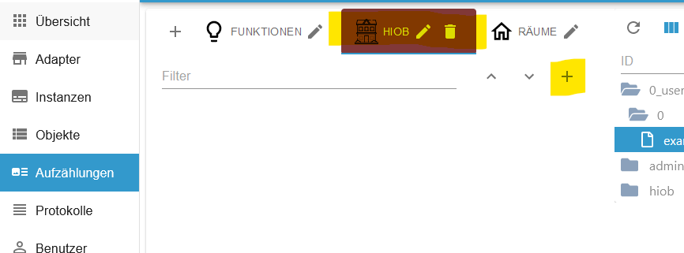
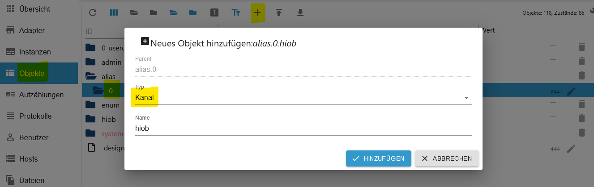
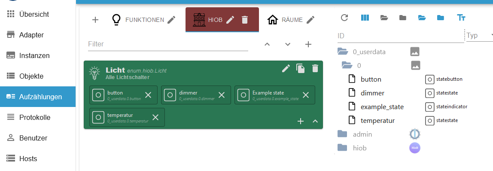

-   [Zurück zur Beschreibung](/docs/de/README.md)
-   [Schritt 1: Installation und APP Einrichtung](app.md)
-   [Schritt 3: Widgets erstellen](widgets.md)
-   [Schritt 4: Screens erstellen](sreens.md)
-   [Schritt 5: Backups erstellen](backups.md)

## Enums erstellen und APP `ioBroker Settings` + `Device Settings`

# Schritt 2: Aufzählung erstellen

1. Erstellt eine neue Aufzählung `hiob` (alles klein schreiben). Unter `Name` und `ID bearbeiten` muss zwingend `hiob` eingetragen werden. Die anderen Felder sind Optional.

2. Nun kann man beliebig viele Kategorien unter ENMU `hiob` erstellen. Es wäre vom Vorteil Katergorien wie Licht, Steckdosen oder Räume zu wählen. In der APP ist es dann etwas leichter die gewünschten Datenpunkte zu finden.

3. Es ist zu empfehlen Datenpunkte von Adapter als `alias` anzulegen. Hierzu wird der Adapter `alias-manager` empfohlen. Hier dann einen neuen `Kanal` erstellen und mit dem `alias-manager` dort die Datenpunkte hinzufügen. Datenpunkte unter 0_userdata.x oder javascript.x müssen nicht zwingend als alias angelegt werden.

4. Jetzt noch die gewünschten Datenpunkte in den hiob-Aufzählungen hineinziehen.

5. Zurück zur APP in `ioBroker Settings` und dort erst auf `Update` und danach `Sync` drücken.

6. In der APP nun zu `Device Settings` wechseln. Werden hier die Kategorien grün angezeigt, dann hat alles funktioniert. Sind die Kategorien rot, dann bitte erneut `Update` und danach `Sync` ausführen.
Mit wischen von rechts nach links können Kategorien gelöscht werden. Diese erscheinen wieder nach `Update` & `Sync`. Es ist möglich eigenen Kategorien anzulegen und in diesen neue Datenpunkte einzutragen. Diese müssen natürlich im ioBroker verhanden sein. Allerdings werden auch diese nach `Update` & `Sync` wieder gelöscht. Daher macht nach den Einstellungen/Änderungen ein Backup oder erstellt ein neues Backup!!!

7. Mit klickt auf das + Zeichen kann eine neue Kategorie angelegt werden. Hier einen Namen eintragen der gut zugeordnet werden kann.

8. Mit drücken auf `Add data point man.` können neue Datenpunkte hinzufügen werden. Die ID muss in ioBroker vorhanden sein. Bsp.: Name: Worx Party-Modus und ID: worx.0.702470273301009453d9.mower.partyModus. Es wäre aber besser alles über alias anzulegen und dann den Aufzählungen zuzuweisen.
Danach speichern drücken.

9. Tippt auf eine Kategorie um in die nächste Ansicht zu gelangen. Hier die Namen oder ID's ändern beziehungsweise neue Datenpunkte hinzufügen. Mit wischen von rechts nach links können Datenpunkte gelöscht werden. `Ignore/Override Devicestatus`: Verfügbarkeit vom Geräte wird ignoriert

10. Durch klicken auf das `i` erscheinen zusätzlich Informationen über den Datenpunkt.

# Add Enum funktioniert derzeit nicht!!!

-   [Zurück zur Beschreibung](/docs/de/README.md)
-   [Schritt 1: Installation und APP Einrichtung](app.md)
-   [Schritt 3: Widgets erstellen](widgets.md)
-   [Schritt 4: Screens erstellen](sreens.md)
-   [Schritt 5: Backups erstellen](backups.md)