-   [Zurück](/docs/de/example.md)
-   [Import Widgets](#import-widgets-json)
-   [Blockly Script](#blockly-script)

# ioBroker Logs

### 1.   Adapter Log Parser installieren

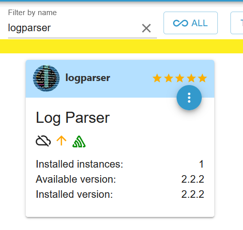

### 2.   Eigenen Filter setzen (Hier wurde Debug und All hinzugefügt)

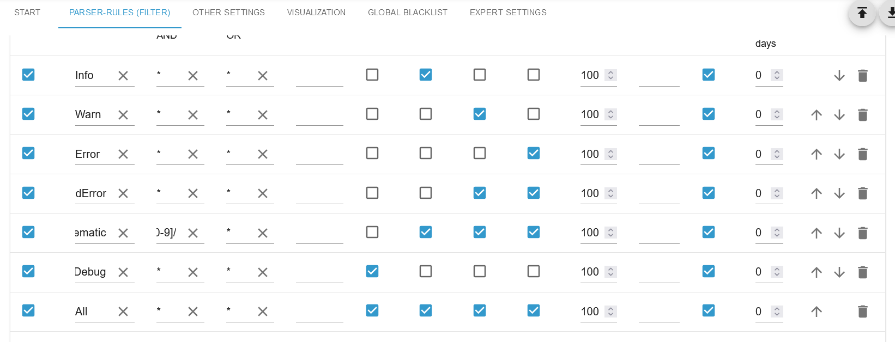

### 3.   Blockly Script importieren

[Blockly Script](#blockly-script)

### 4.   Gewünschte Einstellungen vornehmen

-   `max` Anzahl an Logs. Sollte nicht höher sein als die Anzahl in der Parser Instanz Einstellungen
-   `datapointname` Name vom Datenpunkt
-   `channelname` Name vom Ordner unter 0_userdata.0
-   `debuggen` Gibt Logs vom Script aus
-   `datapoint_logparser` Datenpunnkt vom Log Parser - Standard logparser.0.visualization.table0.json

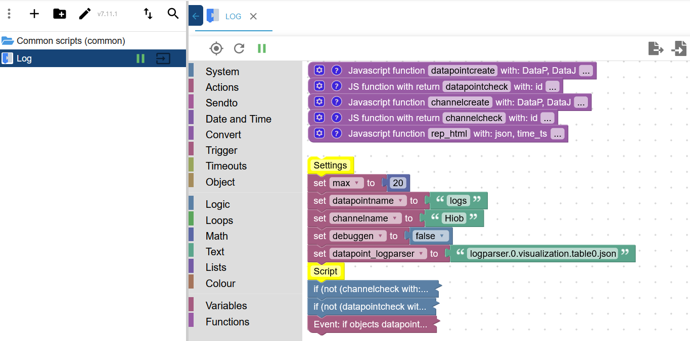

### 5.   Aufzählung erstellen

-   Datenpunkte `logparser.0.visualization.table0.selection` und `0_userdata.0.<name>.logparser` hinzufügen

  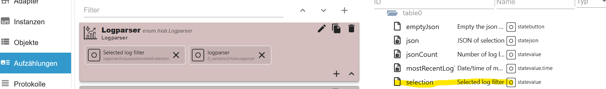

### 6.   Widget Advanced/Flebible erstellen

-   **Multi Selection und Datenpunkt auswählen**

  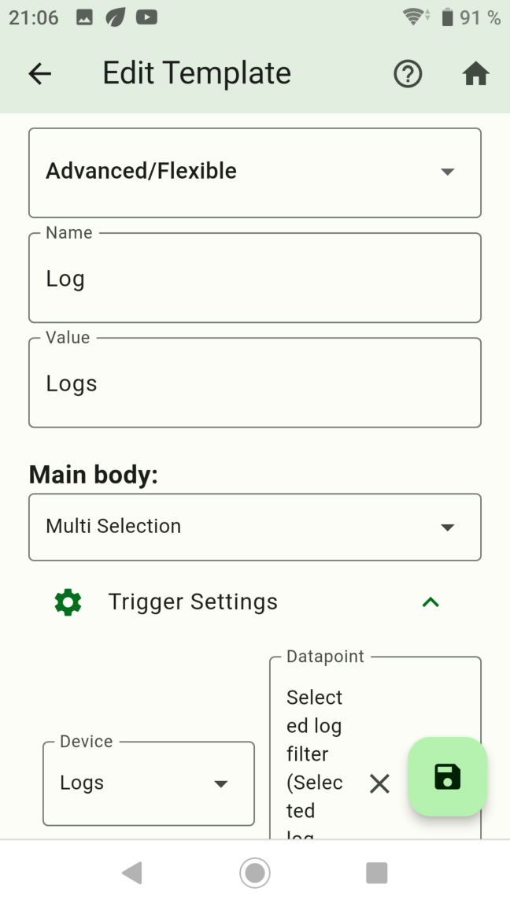

-   **Selection add anlegen**

  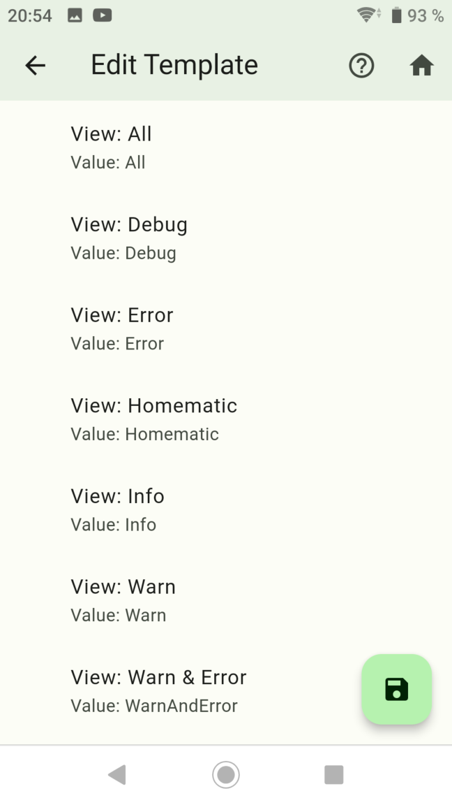

### 7.   Widget Table erstellen

-   **Table und Datenpunkt auswählen**

  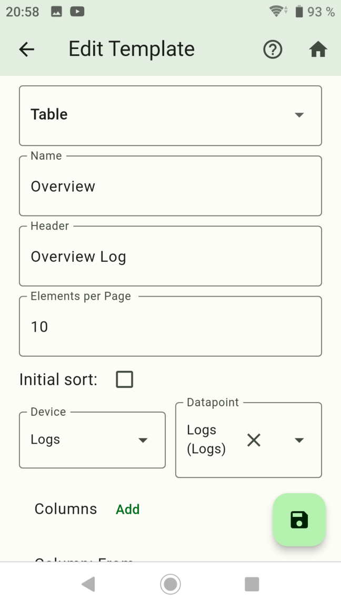

-   **Columns add anlegen**

  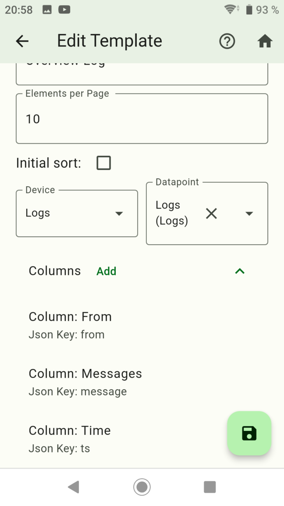

-   **Angelegte Widgets**

  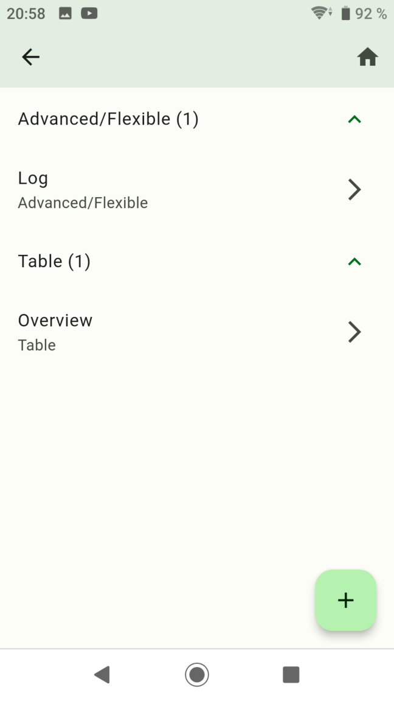

### 8.   Screen erstellen

-   **Widgets hinzufügen und eine Gruppe anlegen**

  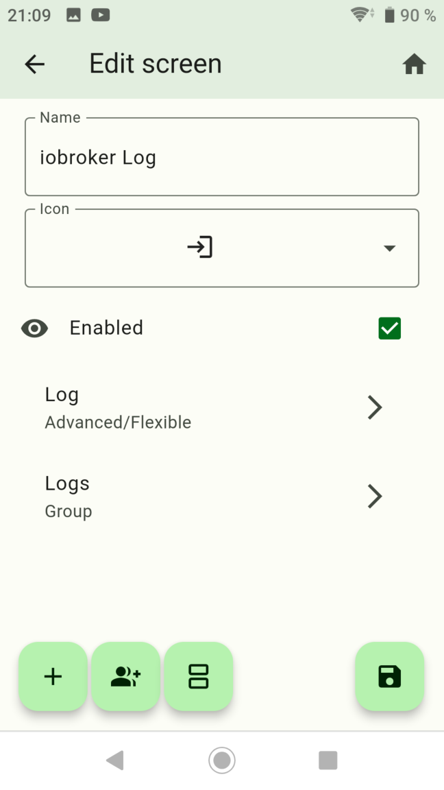

-   **Widgets der Gruppe hinzufügen**

  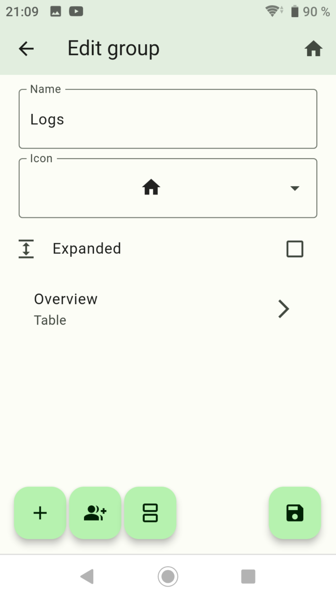

### 9.   Fertig

  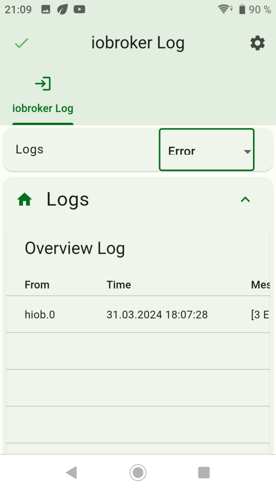

  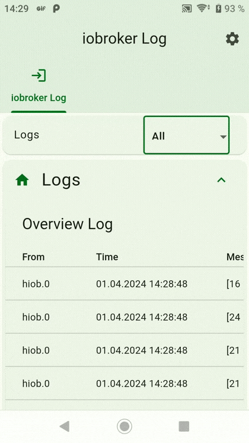

-   [Zurück](/docs/de/example.md)

# Import Widgets JSON

- `hiob.0.settings.Log.devices`
```JSON
[
  {
    "id": "7yIYFcj6nlG6DG7T",
    "name": "Logs",
    "iconWrapper": {
      "iconDataType": "flutterIcons",
      "iconDataId": "e318"
    },
    "objectID": "",
    "type": 1,
    "dataPoints": "[{\"id\":\"0_userdata.0.Hiob.logs\",\"name\":\"Logs\",\"type\":null,\"role\":\"json\",\"valueType\":null,\"otherDetails\":\"{\\\"id\\\":\\\"0_userdata.0.Hiob.logs\\\",\\\"name\\\":\\\"Logs\\\",\\\"type\\\":null,\\\"role\\\":\\\"json\\\",\\\"valueType\\\":null,\\\"otherDetails\\\":\\\"{\\\\\\\"name\\\\\\\":\\\\\\\"Logs\\\\\\\",\\\\\\\"id\\\\\\\":\\\\\\\"0_userdata.0.Hiob.logs\\\\\\\",\\\\\\\"role\\\\\\\":\\\\\\\"json\\\\\\\"}\\\"}\"},{\"id\":\"logparser.0.visualization.table0.selection\",\"name\":\"Selected log filter\",\"type\":null,\"role\":\"value\",\"valueType\":null,\"otherDetails\":\"{\\\"id\\\":\\\"logparser.0.visualization.table0.selection\\\",\\\"name\\\":\\\"Selected log filter\\\",\\\"type\\\":null,\\\"role\\\":\\\"value\\\",\\\"valueType\\\":null,\\\"otherDetails\\\":\\\"{\\\\\\\"name\\\\\\\":\\\\\\\"Selected log filter\\\\\\\",\\\\\\\"id\\\\\\\":\\\\\\\"logparser.0.visualization.table0.selection\\\\\\\",\\\\\\\"role\\\\\\\":\\\\\\\"value\\\\\\\"}\\\"}\"}]"
  }
]
```

- `hiob.0.settings.Log.screens`
```JSON
[
  {
    "id": "5CT80Hra22DBj2YBXsaR",
    "name": "iobroker Log",
    "iconWrapper": {
      "iconDataType": "flutterIcons",
      "iconDataId": "e3b2"
    },
    "index": 1,
    "enabled": true,
    "widgetIds": [
      {
        "widget": "Log",
        "id": "qnDTVc5X3KMzj-wgT8CGTERK2fPDxA=="
      },
      {
        "name": "Logs",
        "isExtended": false,
        "iconWrapper": {
          "iconDataType": "flutterIcons",
          "iconDataId": "e318"
        },
        "templates": [
          {
            "widget": "Overview",
            "id": "rvbPiQCvTUZnNNAFR28RW-_AMw4gpg=="
          }
        ]
      }
    ]
  }
]
```

- `hiob.0.settings.Log.widgets`
```JSON
[
  {
    "id": "qnDTVc5X3KMzj-wgT8CGTERK2fPDxA==",
    "name": "Log",
    "widget": {
      "type": "CustomWidgetType.advanced",
      "bodyTriggerAction": "{\"type\":\"TriggerActionType.multiSelection\",\"dataPoint\":\"logparser.0.visualization.table0.selection\",\"selections\":\"{\\\"Info\\\":\\\"Info\\\",\\\"Error\\\":\\\"Error\\\",\\\"Warn\\\":\\\"Warn\\\",\\\"Warn & Error\\\":\\\"WarnAndError\\\",\\\"Debug\\\":\\\"Debug\\\",\\\"Homematic\\\":\\\"Homematic\\\",\\\"All\\\":\\\"All\\\"}\"}",
      "subTitle": null,
      "subTitleDataPoint": null,
      "name": "Log",
      "value": "Logs",
      "bodyIconID": null,
      "customAlertDialogWidget": {
        "type": "CustomWidgetType.alertDialog",
        "name": "",
        "templates": [],
        "title": ""
      }
    }
  },
  {
    "id": "rvbPiQCvTUZnNNAFR28RW-_AMw4gpg==",
    "name": "Overview",
    "widget": {
      "type": "CustomWidgetType.table",
      "name": "Overview",
      "header": "Overview Log",
      "sortAsc": true,
      "initialSortColumn": 1,
      "initialSortEnabled": false,
      "elementsPerPage": 10,
      "dataPoint": "0_userdata.0.Hiob.logs",
      "columns": {
        "from": "From",
        "ts": "Time",
        "message": "Messages"
      }
    }
  }
]
```

-   [Zurück](/docs/de/example.md)

# Blockly Script
```BLOCKLY
<xml xmlns="https://developers.google.com/blockly/xml">
  <variables>
    <variable id="K,F@7o]a,1yc{W4Pz2X[">DataP</variable>
    <variable id="JcvirzSt4Zydn]^O4VO#">DataJ</variable>
    <variable id="J9#xnj]T_`pv_T8Z3j4P">id</variable>
    <variable id="Fn~g`zKlUpd?](O;)6NJ">json</variable>
    <variable id="IIq$?@)Xu7-!E(?VjE^N">time_ts</variable>
    <variable id="u`czP(#;.Q{GHhKW=4[Q">max</variable>
    <variable id="aEm$-b9Id#%@@q{SD:{T">datapointname</variable>
    <variable id="^$e!?JpvIt1Qh-]SBl!@">channelname</variable>
    <variable id="N){4B$~4B!QQ.f5r#d9h">debuggen</variable>
    <variable id="E)rAXto0,#kty+s^R^]H">datapoint_logparser</variable>
    <variable id="dSN5{8P[Ky6E,X,r~I/~">log_array</variable>
    <variable id="r0SdD!g$udUhXK,jhpw$">counter</variable>
    <variable id="0zcb*kTbLSli%3bh)L5M">new_log</variable>
    <variable id="aC];U-UD1HlFN%sxAR=%">i</variable>
  </variables>
  <block type="procedures_defcustomnoreturn" id="CJ8Zcc-xzs^SogX?vx}r" x="-487" y="-337">
    <mutation statements="false">
      <arg name="DataP" varid="K,F@7o]a,1yc{W4Pz2X["></arg>
      <arg name="DataJ" varid="JcvirzSt4Zydn]^O4VO#"></arg>
    </mutation>
    <field name="NAME">datapointcreate</field>
    <field name="SCRIPT">Y3JlYXRlU3RhdGUoRGF0YVAsIERhdGFKKTs=</field>
    <comment pinned="false" h="80" w="160">Beschreibe diese Funktion …</comment>
  </block>
  <block type="procedures_defcustomreturn" id="$KR-X@{G/.vido.W$31-" x="-487" y="-312">
    <mutation statements="false">
      <arg name="id" varid="J9#xnj]T_`pv_T8Z3j4P"></arg>
    </mutation>
    <field name="NAME">datapointcheck</field>
    <field name="SCRIPT">cmV0dXJuICEhJChpZCkubGVuZ3RoOw==</field>
    <comment pinned="false" h="80" w="160">Beschreibe diese Funktion …</comment>
  </block>
  <block type="procedures_defcustomnoreturn" id="-Sg^:tBR!;/FL|3na~kR" x="-487" y="-287">
    <mutation statements="false">
      <arg name="DataP" varid="K,F@7o]a,1yc{W4Pz2X["></arg>
      <arg name="DataJ" varid="JcvirzSt4Zydn]^O4VO#"></arg>
    </mutation>
    <field name="NAME">channelcreate</field>
    <field name="SCRIPT">c2V0T2JqZWN0KERhdGFQLCBEYXRhSik7IA==</field>
    <comment pinned="false" h="80" w="160">Beschreibe diese Funktion …</comment>
  </block>
  <block type="procedures_defcustomreturn" id="TPDWEp-dsh~Q5^kj{b@(" x="-487" y="-262">
    <mutation statements="false">
      <arg name="id" varid="J9#xnj]T_`pv_T8Z3j4P"></arg>
    </mutation>
    <field name="NAME">channelcheck</field>
    <field name="SCRIPT">Y29uc3Qgb2JqID0gYXdhaXQgZXhpc3RzT2JqZWN0QXN5bmMoaWQpOw0KcmV0dXJuIG9iajs=</field>
    <comment pinned="false" h="80" w="160">Beschreibe diese Funktion …</comment>
  </block>
  <block type="procedures_defcustomnoreturn" id="rUa@?AnC3I51$_VFJ=f1" x="-487" y="-237">
    <mutation statements="false">
      <arg name="json" varid="Fn~g`zKlUpd?](O;)6NJ"></arg>
      <arg name="time_ts" varid="IIq$?@)Xu7-!E(?VjE^N"></arg>
    </mutation>
    <field name="NAME">rep_html</field>
    <field name="SCRIPT">dmFyIHJlZ2V4ID0gLyg8KFtePl0rKT4pL2lnOw0KanNvblsic2V2ZXJpdHkiXSA9IGpzb25bInNldmVyaXR5Il0ucmVwbGFjZShyZWdleCwgIiIpOw0KaWYgKGpzb25bInNldmVyaXR5Il0gPT09ICJpbmZvIikgew0KICAgIGpzb25bInNldmVyaXR5Il0gPSAi4oS577iPICIgKyBqc29uWyJzZXZlcml0eSJdOw0KfSBlbHNlIGlmIChqc29uWyJzZXZlcml0eSJdID09PSAid2FybiIpIHsNCiAgICBqc29uWyJzZXZlcml0eSJdID0gIuKaoO+4jyAiICsganNvblsic2V2ZXJpdHkiXTsNCn0gZWxzZSBpZiAoanNvblsic2V2ZXJpdHkiXSA9PT0gImVycm9yIikgew0KICAgIGpzb25bInNldmVyaXR5Il0gPSAi4p2XICIgKyBqc29uWyJzZXZlcml0eSJdOw0KfSBlbHNlIGlmIChqc29uWyJzZXZlcml0eSJdID09PSAiZGVidWciKSB7DQogICAganNvblsic2V2ZXJpdHkiXSA9ICLwn5CeICIgKyBqc29uWyJzZXZlcml0eSJdOw0KfQ0KanNvblsidHMiXSA9IHRpbWVfdHM7</field>
    <comment pinned="false" h="80" w="160">Beschreibe diese Funktion …</comment>
  </block>
  <block type="comment" id="cI$jrK97N:PLv+z*`5Lr" x="-488" y="-187">
    <field name="COMMENT">Settings</field>
    <next>
      <block type="variables_set" id="j2KOMk[;mU#!~y|_H8J?">
        <field name="VAR" id="u`czP(#;.Q{GHhKW=4[Q">max</field>
        <value name="VALUE">
          <block type="math_number" id="5J[e?s,B=L7fd%YBMa_F">
            <field name="NUM">20</field>
          </block>
        </value>
        <next>
          <block type="variables_set" id="]yS,|W~8]0/Afo7CRXW`">
            <field name="VAR" id="aEm$-b9Id#%@@q{SD:{T">datapointname</field>
            <value name="VALUE">
              <block type="text" id="_F5,@EF)=`CC+%|z9*k9">
                <field name="TEXT">logs</field>
              </block>
            </value>
            <next>
              <block type="variables_set" id="%bgLK;_((nqWWZ%fQ[W;">
                <field name="VAR" id="^$e!?JpvIt1Qh-]SBl!@">channelname</field>
                <value name="VALUE">
                  <block type="text" id="byt;1%4$uIn!tgmz}^Nw">
                    <field name="TEXT">Hiob</field>
                  </block>
                </value>
                <next>
                  <block type="variables_set" id="M$S~zvsjpq9GpEsslUEW">
                    <field name="VAR" id="N){4B$~4B!QQ.f5r#d9h">debuggen</field>
                    <value name="VALUE">
                      <block type="logic_boolean" id="Jmv)IoRk1w5JqZtvja`S">
                        <field name="BOOL">FALSE</field>
                      </block>
                    </value>
                    <next>
                      <block type="variables_set" id="u/2mMr(%Kd_.?^]VEQ9.">
                        <field name="VAR" id="E)rAXto0,#kty+s^R^]H">datapoint_logparser</field>
                        <value name="VALUE">
                          <block type="text" id="M+lo5uUnF(yHS$#64xD(">
                            <field name="TEXT">logparser.0.visualization.table0.json</field>
                          </block>
                        </value>
                        <next>
                          <block type="comment" id="J,|#0*Mt[@T19.4t}CvM">
                            <field name="COMMENT">Script</field>
                            <next>
                              <block type="controls_if" id="Y`aH;7xr6%Lb=X^X(x}." collapsed="true">
                                <value name="IF0">
                                  <block type="logic_negate" id="O3A9n(6zlW53@Stf}mmx">
                                    <value name="BOOL">
                                      <block type="procedures_callcustomreturn" id="j9l:xIOu%e.AN{R6_x!H">
                                        <mutation name="channelcheck">
                                          <arg name="id"></arg>
                                        </mutation>
                                        <value name="ARG0">
                                          <block type="text_join" id="dw:Y1uT3k20JYWH/Z%cy">
                                            <mutation items="2"></mutation>
                                            <value name="ADD0">
                                              <block type="text" id="pVh(!7$!i68,1W2uE=GQ">
                                                <field name="TEXT">0_userdata.0.</field>
                                              </block>
                                            </value>
                                            <value name="ADD1">
                                              <block type="variables_get" id="P~2av2k`dIa!QEnrP;p%">
                                                <field name="VAR" id="^$e!?JpvIt1Qh-]SBl!@">channelname</field>
                                              </block>
                                            </value>
                                          </block>
                                        </value>
                                      </block>
                                    </value>
                                  </block>
                                </value>
                                <statement name="DO0">
                                  <block type="controls_if" id="=,lJl=J[.**OOeF4{p,=">
                                    <value name="IF0">
                                      <block type="variables_get" id="Pz^R)NB,3G#,!6|S=o;}">
                                        <field name="VAR" id="N){4B$~4B!QQ.f5r#d9h">debuggen</field>
                                      </block>
                                    </value>
                                    <statement name="DO0">
                                      <block type="debug" id="skaXT$+MMbp4Bdq;zxs.">
                                        <field name="Severity">log</field>
                                        <value name="TEXT">
                                          <shadow type="text" id="iv4_bT9x=W%XrvPzZch)">
                                            <field name="TEXT">text</field>
                                          </shadow>
                                          <block type="text_join" id="G**Okel*K0/hB/7@oYYD">
                                            <mutation items="3"></mutation>
                                            <value name="ADD0">
                                              <block type="text" id="7BI[b0],Wr9pYP:Oyud=">
                                                <field name="TEXT">Channel 0_userdata.0.</field>
                                              </block>
                                            </value>
                                            <value name="ADD1">
                                              <block type="variables_get" id="nClD|*RDt#)%fUe2HG4G">
                                                <field name="VAR" id="^$e!?JpvIt1Qh-]SBl!@">channelname</field>
                                              </block>
                                            </value>
                                            <value name="ADD2">
                                              <block type="text" id="jj$p1}lJ}YQ6ld5K{TH;">
                                                <field name="TEXT"> wird erstellt!</field>
                                              </block>
                                            </value>
                                          </block>
                                        </value>
                                      </block>
                                    </statement>
                                    <next>
                                      <block type="procedures_callcustomnoreturn" id="A#+-vRDkW]V[}x/Z].@6">
                                        <mutation name="channelcreate">
                                          <arg name="DataP"></arg>
                                          <arg name="DataJ"></arg>
                                        </mutation>
                                        <value name="ARG0">
                                          <block type="text_join" id="koGr!ieTD+4U,)ZUl{Ix">
                                            <mutation items="2"></mutation>
                                            <value name="ADD0">
                                              <block type="text" id="#*N-%YTdYt8@0d#[|a#:">
                                                <field name="TEXT">0_userdata.0.</field>
                                              </block>
                                            </value>
                                            <value name="ADD1">
                                              <block type="variables_get" id="/BZSdZD#TVd7KvWxK1S^">
                                                <field name="VAR" id="^$e!?JpvIt1Qh-]SBl!@">channelname</field>
                                              </block>
                                            </value>
                                          </block>
                                        </value>
                                        <value name="ARG1">
                                          <block type="convert_json2object" id="~X?Wc4)pe2d`UuoO$77-">
                                            <value name="VALUE">
                                              <block type="text" id="mM[5lk.FjT2CUBbO?lq*">
                                                <field name="TEXT">{"type": "channel", "common": {"name": "Hiob Log"}}</field>
                                              </block>
                                            </value>
                                          </block>
                                        </value>
                                      </block>
                                    </next>
                                  </block>
                                </statement>
                                <next>
                                  <block type="controls_if" id="WOsNuV1`Xc9Eum]Ya88m" collapsed="true">
                                    <mutation else="1"></mutation>
                                    <value name="IF0">
                                      <block type="logic_negate" id="J:uFpSAxpU;=E@^bSPoW">
                                        <value name="BOOL">
                                          <block type="procedures_callcustomreturn" id="sa;1VDmOW}@3sgz}BF#D">
                                            <mutation name="datapointcheck">
                                              <arg name="id"></arg>
                                            </mutation>
                                            <value name="ARG0">
                                              <block type="text_join" id="H3U5!$MCb@j0dQTjBDFY">
                                                <mutation items="4"></mutation>
                                                <value name="ADD0">
                                                  <block type="text" id="qIlehRK$Rqso(~6,Vp}c">
                                                    <field name="TEXT">0_userdata.0.</field>
                                                  </block>
                                                </value>
                                                <value name="ADD1">
                                                  <block type="variables_get" id="Hd*f@F]~VUfFqm/29]A.">
                                                    <field name="VAR" id="^$e!?JpvIt1Qh-]SBl!@">channelname</field>
                                                  </block>
                                                </value>
                                                <value name="ADD2">
                                                  <block type="text" id="Cu-66u%b.%U$`KVBx4[v">
                                                    <field name="TEXT">.</field>
                                                  </block>
                                                </value>
                                                <value name="ADD3">
                                                  <block type="variables_get" id="]CD[#6;Le3_~tA6f]3eT">
                                                    <field name="VAR" id="aEm$-b9Id#%@@q{SD:{T">datapointname</field>
                                                  </block>
                                                </value>
                                              </block>
                                            </value>
                                          </block>
                                        </value>
                                      </block>
                                    </value>
                                    <statement name="DO0">
                                      <block type="controls_if" id="za+:Kn/+MxKFlzZb7YLk">
                                        <value name="IF0">
                                          <block type="variables_get" id="L67^GVN-zsxr.8G%824L">
                                            <field name="VAR" id="N){4B$~4B!QQ.f5r#d9h">debuggen</field>
                                          </block>
                                        </value>
                                        <statement name="DO0">
                                          <block type="debug" id="7)5Kif3J974nYOt#c(S,">
                                            <field name="Severity">log</field>
                                            <value name="TEXT">
                                              <shadow type="text" id="bVeo-u@eMdgz9S`wT_f$">
                                                <field name="TEXT">text</field>
                                              </shadow>
                                              <block type="text_join" id="6l1?R#*KPr=*M_y*YHtM">
                                                <mutation items="4"></mutation>
                                                <value name="ADD0">
                                                  <block type="text" id="OggzQ4P]^GP09Ow{7=KB">
                                                    <field name="TEXT">Create 0_userdata.0.</field>
                                                  </block>
                                                </value>
                                                <value name="ADD1">
                                                  <block type="variables_get" id="5nrpR7V-h|O~v?c2zQ=W">
                                                    <field name="VAR" id="^$e!?JpvIt1Qh-]SBl!@">channelname</field>
                                                  </block>
                                                </value>
                                                <value name="ADD2">
                                                  <block type="text" id="K{[0NJ:wt_G@~mV{@}!7">
                                                    <field name="TEXT">.</field>
                                                  </block>
                                                </value>
                                                <value name="ADD3">
                                                  <block type="variables_get" id="MP0(nJxqW_UC0kK%SQvZ">
                                                    <field name="VAR" id="aEm$-b9Id#%@@q{SD:{T">datapointname</field>
                                                  </block>
                                                </value>
                                              </block>
                                            </value>
                                          </block>
                                        </statement>
                                        <next>
                                          <block type="procedures_callcustomnoreturn" id="1=WVx,e[e#RIn%5M~(OP">
                                            <mutation name="datapointcreate">
                                              <arg name="DataP"></arg>
                                              <arg name="DataJ"></arg>
                                            </mutation>
                                            <value name="ARG0">
                                              <block type="text_join" id="RjZY{8U0-}XwuH*09`wV">
                                                <mutation items="4"></mutation>
                                                <value name="ADD0">
                                                  <block type="text" id="8,`b[HAO;`c9Q*JMJ*ak">
                                                    <field name="TEXT">0_userdata.0.</field>
                                                  </block>
                                                </value>
                                                <value name="ADD1">
                                                  <block type="variables_get" id="0oPu~|WBX8Pi9Vs9o4%e">
                                                    <field name="VAR" id="^$e!?JpvIt1Qh-]SBl!@">channelname</field>
                                                  </block>
                                                </value>
                                                <value name="ADD2">
                                                  <block type="text" id="=#f)XkYy5$4{ppF7MxJW">
                                                    <field name="TEXT">.</field>
                                                  </block>
                                                </value>
                                                <value name="ADD3">
                                                  <block type="variables_get" id=")I}u{/31`pvsJd.Hj%Y4">
                                                    <field name="VAR" id="aEm$-b9Id#%@@q{SD:{T">datapointname</field>
                                                  </block>
                                                </value>
                                              </block>
                                            </value>
                                            <value name="ARG1">
                                              <block type="convert_json2object" id="52|Qgyk+k1S@B_WzytEH">
                                                <value name="VALUE">
                                                  <block type="text" id="{4Jv7nc1N2n10uiR*VAH">
                                                    <field name="TEXT">{"name": "Logs", "role": "json", "type": "string", "write": true, "read": true, "def": "[]"}</field>
                                                  </block>
                                                </value>
                                              </block>
                                            </value>
                                          </block>
                                        </next>
                                      </block>
                                    </statement>
                                    <statement name="ELSE">
                                      <block type="controls_if" id="31yl^QUB[fe0@XZ[2KQc">
                                        <value name="IF0">
                                          <block type="variables_get" id="5~NH4@xTVc*~~1PwKu_f">
                                            <field name="VAR" id="N){4B$~4B!QQ.f5r#d9h">debuggen</field>
                                          </block>
                                        </value>
                                        <statement name="DO0">
                                          <block type="debug" id="sWt@sFtJ/Y`T(I5grxJM">
                                            <field name="Severity">log</field>
                                            <value name="TEXT">
                                              <shadow type="text" id="D(34`pZ.W[!`Ccs+OkRm">
                                                <field name="TEXT">text</field>
                                              </shadow>
                                              <block type="text_join" id="K4xUVS*C~[.3TD#@Q;-(">
                                                <mutation items="5"></mutation>
                                                <value name="ADD0">
                                                  <block type="text" id="D-c5En^I](Y.^{KRJJcK">
                                                    <field name="TEXT">0_userdata.0.</field>
                                                  </block>
                                                </value>
                                                <value name="ADD1">
                                                  <block type="variables_get" id=",!kP#!Y]bK9+/dx}Ev|g">
                                                    <field name="VAR" id="^$e!?JpvIt1Qh-]SBl!@">channelname</field>
                                                  </block>
                                                </value>
                                                <value name="ADD2">
                                                  <block type="text" id="g:[}bECRfaYZqv4=`kc#">
                                                    <field name="TEXT">.</field>
                                                  </block>
                                                </value>
                                                <value name="ADD3">
                                                  <block type="variables_get" id="};S`PQ.04bNc6dL%X6LB">
                                                    <field name="VAR" id="aEm$-b9Id#%@@q{SD:{T">datapointname</field>
                                                  </block>
                                                </value>
                                                <value name="ADD4">
                                                  <block type="text" id="27-sC!JHYv#niUxAz.4y">
                                                    <field name="TEXT"> is available</field>
                                                  </block>
                                                </value>
                                              </block>
                                            </value>
                                          </block>
                                        </statement>
                                      </block>
                                    </statement>
                                    <next>
                                      <block type="on_ext" id="gamB_0{J(6g5L}QVTheh" collapsed="true">
                                        <mutation xmlns="http://www.w3.org/1999/xhtml" items="1"></mutation>
                                        <field name="CONDITION">ne</field>
                                        <field name="ACK_CONDITION"></field>
                                        <value name="OID0">
                                          <shadow type="field_oid" id="t1^I5kOC^xg^LF-z$T)6">
                                            <field name="oid">select ID</field>
                                          </shadow>
                                          <block type="variables_get" id="Ni^%(?O~9exL,lkW7gXE">
                                            <field name="VAR" id="E)rAXto0,#kty+s^R^]H">datapoint_logparser</field>
                                          </block>
                                        </value>
                                        <statement name="STATEMENT">
                                          <block type="variables_set" id="ME~Q=i#S6=]a@d2!OSx.">
                                            <field name="VAR" id="dSN5{8P[Ky6E,X,r~I/~">log_array</field>
                                            <value name="VALUE">
                                              <block type="convert_json2object" id="qUiS[-ymR-Kxq%O;-6(V">
                                                <value name="VALUE">
                                                  <block type="get_value" id="0e7`MBRu{+k_N?[Q{@I6">
                                                    <field name="ATTR">val</field>
                                                    <field name="OID">logparser.0.visualization.table0.json</field>
                                                  </block>
                                                </value>
                                              </block>
                                            </value>
                                            <next>
                                              <block type="variables_set" id="m=~5HUo.eklm}~_^WAED">
                                                <field name="VAR" id="r0SdD!g$udUhXK,jhpw$">counter</field>
                                                <value name="VALUE">
                                                  <block type="math_number" id=");]auO30lwZ)]r6kI3ji">
                                                    <field name="NUM">0</field>
                                                  </block>
                                                </value>
                                                <next>
                                                  <block type="variables_set" id="G=Q5acmN9BZoN=P:}PzC">
                                                    <field name="VAR" id="0zcb*kTbLSli%3bh)L5M">new_log</field>
                                                    <value name="VALUE">
                                                      <block type="lists_create_with" id="mvI2LV+iX#o*Cj:g(yk7">
                                                        <mutation items="0"></mutation>
                                                      </block>
                                                    </value>
                                                    <next>
                                                      <block type="controls_if" id="-F9(bEPau-X{*sXg2z@Z">
                                                        <value name="IF0">
                                                          <block type="variables_get" id="3|TL@K7[R^s7I2ca=`N{">
                                                            <field name="VAR" id="N){4B$~4B!QQ.f5r#d9h">debuggen</field>
                                                          </block>
                                                        </value>
                                                        <statement name="DO0">
                                                          <block type="debug" id="u:`(9gQNz?S==Ut/=u}$">
                                                            <field name="Severity">log</field>
                                                            <value name="TEXT">
                                                              <shadow type="text" id="bVeo-u@eMdgz9S`wT_f$">
                                                                <field name="TEXT">text</field>
                                                              </shadow>
                                                              <block type="text" id="a-Vz%7HJ$m/}eUm+6R-7">
                                                                <field name="TEXT">Trigger Logparser</field>
                                                              </block>
                                                            </value>
                                                          </block>
                                                        </statement>
                                                        <next>
                                                          <block type="controls_forEach" id="R_:tcwnj~pVIJh]u,i5!">
                                                            <field name="VAR" id="aC];U-UD1HlFN%sxAR=%">i</field>
                                                            <value name="LIST">
                                                              <block type="variables_get" id="#vf/i3Xg+uz^N~N@aye~">
                                                                <field name="VAR" id="dSN5{8P[Ky6E,X,r~I/~">log_array</field>
                                                              </block>
                                                            </value>
                                                            <statement name="DO">
                                                              <block type="math_change" id="??QK=g;gU[u3xg0#h62Y">
                                                                <field name="VAR" id="r0SdD!g$udUhXK,jhpw$">counter</field>
                                                                <value name="DELTA">
                                                                  <shadow type="math_number" id="$vg0-`ybK|iPh,-PA=)^">
                                                                    <field name="NUM">1</field>
                                                                  </shadow>
                                                                </value>
                                                                <next>
                                                                  <block type="procedures_callcustomnoreturn" id="z|JtGDK%b-kmh0S.IW?$">
                                                                    <mutation name="rep_html">
                                                                      <arg name="json"></arg>
                                                                      <arg name="time_ts"></arg>
                                                                    </mutation>
                                                                    <value name="ARG0">
                                                                      <block type="variables_get" id="_5P*K/tu3B6,j(An([8a">
                                                                        <field name="VAR" id="aC];U-UD1HlFN%sxAR=%">i</field>
                                                                      </block>
                                                                    </value>
                                                                    <value name="ARG1">
                                                                      <block type="convert_from_date" id="}O+UM,z2.kc6)-KU$H_o">
                                                                        <mutation xmlns="http://www.w3.org/1999/xhtml" format="true" language="false"></mutation>
                                                                        <field name="OPTION">custom</field>
                                                                        <field name="FORMAT">TT.MM.JJJJ SS:mm:ss</field>
                                                                        <value name="VALUE">
                                                                          <block type="get_attr" id="^}jfr*2R5V]vy2Z2c*sS">
                                                                            <value name="PATH">
                                                                              <shadow type="text" id="y|^/0#TdwaU0FmSX;3;o">
                                                                                <field name="TEXT">ts</field>
                                                                              </shadow>
                                                                            </value>
                                                                            <value name="OBJECT">
                                                                              <shadow type="get_object" id="w4~S_:m9v.b6g4@DZpsJ">
                                                                                <field name="OID">Object ID</field>
                                                                              </shadow>
                                                                              <block type="variables_get" id="4Xr~@tP@JOvj{xb0_Vcg">
                                                                                <field name="VAR" id="aC];U-UD1HlFN%sxAR=%">i</field>
                                                                              </block>
                                                                            </value>
                                                                          </block>
                                                                        </value>
                                                                      </block>
                                                                    </value>
                                                                    <next>
                                                                      <block type="lists_setIndex" id="o[*.i:Vfx]lhJKy!y2+}">
                                                                        <mutation at="false"></mutation>
                                                                        <field name="MODE">INSERT</field>
                                                                        <field name="WHERE">LAST</field>
                                                                        <value name="LIST">
                                                                          <block type="variables_get" id="(L[b9)%Lq(@7y8yGI]+2">
                                                                            <field name="VAR" id="0zcb*kTbLSli%3bh)L5M">new_log</field>
                                                                          </block>
                                                                        </value>
                                                                        <value name="TO">
                                                                          <block type="variables_get" id="+Dq}M%I6BdV9[Bd-~oG6">
                                                                            <field name="VAR" id="aC];U-UD1HlFN%sxAR=%">i</field>
                                                                          </block>
                                                                        </value>
                                                                        <next>
                                                                          <block type="controls_if" id="zHY,]qS+ryx)@ayb~tLt">
                                                                            <value name="IF0">
                                                                              <block type="variables_get" id="2D-Luop?;SU;E8!@q+b9">
                                                                                <field name="VAR" id="N){4B$~4B!QQ.f5r#d9h">debuggen</field>
                                                                              </block>
                                                                            </value>
                                                                            <statement name="DO0">
                                                                              <block type="debug" id="4oUpInoe`HN-@1sds;S.">
                                                                                <field name="Severity">log</field>
                                                                                <value name="TEXT">
                                                                                  <shadow type="text" id="bVeo-u@eMdgz9S`wT_f$">
                                                                                    <field name="TEXT">text</field>
                                                                                  </shadow>
                                                                                  <block type="text_join" id="}E1.lX=/d9_GWQ}W_[H=">
                                                                                    <mutation items="2"></mutation>
                                                                                    <value name="ADD0">
                                                                                      <block type="text" id="eJ|i}4JNJH^v0y/GPzC[">
                                                                                        <field name="TEXT">Counter: </field>
                                                                                      </block>
                                                                                    </value>
                                                                                    <value name="ADD1">
                                                                                      <block type="variables_get" id="1w4cbuGyH/{FEDFN_1/k">
                                                                                        <field name="VAR" id="r0SdD!g$udUhXK,jhpw$">counter</field>
                                                                                      </block>
                                                                                    </value>
                                                                                  </block>
                                                                                </value>
                                                                              </block>
                                                                            </statement>
                                                                            <next>
                                                                              <block type="controls_if" id="`lLTKrYr?j9k[WUPkV#k">
                                                                                <value name="IF0">
                                                                                  <block type="logic_compare" id="CtU|Pn%TUx-GWVmu*swy">
                                                                                    <field name="OP">EQ</field>
                                                                                    <value name="A">
                                                                                      <block type="variables_get" id="U12c*PuSk=_;W$K+OY8E">
                                                                                        <field name="VAR" id="r0SdD!g$udUhXK,jhpw$">counter</field>
                                                                                      </block>
                                                                                    </value>
                                                                                    <value name="B">
                                                                                      <block type="variables_get" id="pOr{M5~o$HqH+Onz4n)d">
                                                                                        <field name="VAR" id="u`czP(#;.Q{GHhKW=4[Q">max</field>
                                                                                      </block>
                                                                                    </value>
                                                                                  </block>
                                                                                </value>
                                                                                <statement name="DO0">
                                                                                  <block type="controls_flow_statements" id="ln~4n0CqiW*kEgVM~A`y">
                                                                                    <field name="FLOW">BREAK</field>
                                                                                  </block>
                                                                                </statement>
                                                                              </block>
                                                                            </next>
                                                                          </block>
                                                                        </next>
                                                                      </block>
                                                                    </next>
                                                                  </block>
                                                                </next>
                                                              </block>
                                                            </statement>
                                                            <next>
                                                              <block type="controls_if" id="v6]j@.b+WU*$`Pg(Ck8:">
                                                                <value name="IF0">
                                                                  <block type="variables_get" id="OpOuZ2ZQ3zj|cYvUY{dA">
                                                                    <field name="VAR" id="N){4B$~4B!QQ.f5r#d9h">debuggen</field>
                                                                  </block>
                                                                </value>
                                                                <statement name="DO0">
                                                                  <block type="debug" id="{x/k8o48j8c$|yWMZ1F^">
                                                                    <field name="Severity">log</field>
                                                                    <value name="TEXT">
                                                                      <shadow type="text" id="bVeo-u@eMdgz9S`wT_f$">
                                                                        <field name="TEXT">text</field>
                                                                      </shadow>
                                                                      <block type="text" id="-PZ=M@`b|lkO)R3^bs9r">
                                                                        <field name="TEXT">Save Logparser</field>
                                                                      </block>
                                                                    </value>
                                                                  </block>
                                                                </statement>
                                                                <next>
                                                                  <block type="control_ex" id="p$kpYx.l;gw;Qr@wYvsh">
                                                                    <field name="TYPE">true</field>
                                                                    <field name="CLEAR_RUNNING">FALSE</field>
                                                                    <value name="OID">
                                                                      <shadow type="field_oid" id="S1O~a#iM./L)[Z}F{Bii">
                                                                        <field name="oid">Object ID</field>
                                                                      </shadow>
                                                                      <block type="text_join" id="x_$b3@BYbdRfk$Cm(N.r">
                                                                        <mutation items="4"></mutation>
                                                                        <value name="ADD0">
                                                                          <block type="text" id="]bd(;(.Rh.$ll=^;wnvm">
                                                                            <field name="TEXT">0_userdata.0.</field>
                                                                          </block>
                                                                        </value>
                                                                        <value name="ADD1">
                                                                          <block type="variables_get" id="0R+=Dww[[TstxeEdkzqQ">
                                                                            <field name="VAR" id="^$e!?JpvIt1Qh-]SBl!@">channelname</field>
                                                                          </block>
                                                                        </value>
                                                                        <value name="ADD2">
                                                                          <block type="text" id="jXw3LlFepns~iKcBd2%1">
                                                                            <field name="TEXT">.</field>
                                                                          </block>
                                                                        </value>
                                                                        <value name="ADD3">
                                                                          <block type="variables_get" id="T[U8n*J|f}8%oeU/+RRh">
                                                                            <field name="VAR" id="aEm$-b9Id#%@@q{SD:{T">datapointname</field>
                                                                          </block>
                                                                        </value>
                                                                      </block>
                                                                    </value>
                                                                    <value name="VALUE">
                                                                      <shadow type="logic_boolean" id="K$dfwt[^1-,vF?IijWFf">
                                                                        <field name="BOOL">TRUE</field>
                                                                      </shadow>
                                                                      <block type="convert_object2json" id="0V{nvk~y^w|dqIIQE+fD">
                                                                        <field name="PRETTIFY">FALSE</field>
                                                                        <value name="VALUE">
                                                                          <block type="variables_get" id="aY/1VY(L_/S}M:APL~}o">
                                                                            <field name="VAR" id="0zcb*kTbLSli%3bh)L5M">new_log</field>
                                                                          </block>
                                                                        </value>
                                                                      </block>
                                                                    </value>
                                                                    <value name="DELAY_MS">
                                                                      <shadow type="math_number" id="D!S`d_*D1(};qXr5Sf+O">
                                                                        <field name="NUM">0</field>
                                                                      </shadow>
                                                                    </value>
                                                                  </block>
                                                                </next>
                                                              </block>
                                                            </next>
                                                          </block>
                                                        </next>
                                                      </block>
                                                    </next>
                                                  </block>
                                                </next>
                                              </block>
                                            </next>
                                          </block>
                                        </statement>
                                      </block>
                                    </next>
                                  </block>
                                </next>
                              </block>
                            </next>
                          </block>
                        </next>
                      </block>
                    </next>
                  </block>
                </next>
              </block>
            </next>
          </block>
        </next>
      </block>
    </next>
  </block>
</xml>
```

-   [Zurück](/docs/de/example.md)
