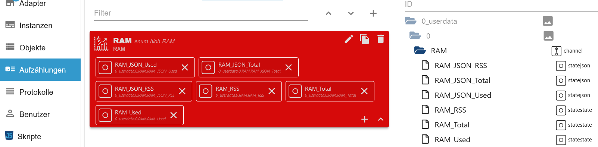

-   [Zurück](/docs/de/example.md)
-   [Import Widgets](#import-widgets-json)
-   [Blockly Script](#blockly-script---javascript-adapter--790)

# ioBroker RAM

### 1.   Blockly Script importieren

-   `channelname` Name vom Channel unter 0_userdata.0
-   `debugging` Aktiviert Logausgabe
-   [Blockly Script](#blockly-script---javascript-adapter--790)</br>


### 2.   Aufzählung erstellen
 -  Eine neue Aufzählung erstellen und die 6 States hinzufügen</br>


### 3.   Widgets Tables und Values erstellen

-   **Table und Datenpunkt für memRss auswählen**

  

-   **Columns add anlegen**

  

-   **Den Table kopieren für memTotal und memUsed**

  
  

-   **Table und Datenpunkt für memTotal auswählen**

  

-   **Table und Datenpunkt für memUsed auswählen**

  

-   **Value und Datenpunkt für memRss auswählen**

  

-   **Value und Datenpunkt für memTotal auswählen**

  

-   **Value und Datenpunkt für memUsed auswählen**

  

-   **Angelegte Widgets**

  

### 4.   Screen erstellen

-   **Screen anlegen**

  </br>
  

-   **Widgets hinzufügen und 3 Gruppen für memRss, memTotal und memUsed anlegen**

  

-   **In den jeweiligen Gruppen nun die Tables hinzufügen**

  </br>
  </br>
  

### 5.   Fertig

  </br>
  

-   [Zurück](/docs/de/example.md)

# Import Widgets JSON

- `hiob.0.settings.Memory.devices`
```JSON
[
  {
    "id": "GPo2Hksl4kHUAbpO",
    "name": "RAM",
    "iconWrapper": {
      "iconDataType": "flutterIcons",
      "iconDataId": "e318"
    },
    "objectID": "",
    "type": 1,
    "dataPoints": "[{\"id\":\"0_userdata.0.RAM.RAM_JSON_Used\",\"name\":\"RAM_JSON_Used\",\"type\":null,\"role\":\"json\",\"valueType\":null,\"otherDetails\":\"{\\\"name\\\":\\\"RAM_JSON_Used\\\",\\\"id\\\":\\\"0_userdata.0.RAM.RAM_JSON_Used\\\",\\\"role\\\":\\\"json\\\"}\"},{\"id\":\"0_userdata.0.RAM.RAM_JSON_Total\",\"name\":\"RAM_JSON_Total\",\"type\":null,\"role\":\"json\",\"valueType\":null,\"otherDetails\":\"{\\\"name\\\":\\\"RAM_JSON_Total\\\",\\\"id\\\":\\\"0_userdata.0.RAM.RAM_JSON_Total\\\",\\\"role\\\":\\\"json\\\"}\"},{\"id\":\"0_userdata.0.RAM.RAM_JSON_RSS\",\"name\":\"RAM_JSON_RSS\",\"type\":null,\"role\":\"json\",\"valueType\":null,\"otherDetails\":\"{\\\"name\\\":\\\"RAM_JSON_RSS\\\",\\\"id\\\":\\\"0_userdata.0.RAM.RAM_JSON_RSS\\\",\\\"role\\\":\\\"json\\\"}\"},{\"id\":\"0_userdata.0.RAM.RAM_RSS\",\"name\":\"RAM_RSS\",\"type\":null,\"role\":\"state\",\"valueType\":null,\"otherDetails\":\"{\\\"name\\\":\\\"RAM_RSS\\\",\\\"id\\\":\\\"0_userdata.0.RAM.RAM_RSS\\\",\\\"role\\\":\\\"state\\\"}\"},{\"id\":\"0_userdata.0.RAM.RAM_Total\",\"name\":\"RAM_Total\",\"type\":null,\"role\":\"state\",\"valueType\":null,\"otherDetails\":\"{\\\"name\\\":\\\"RAM_Total\\\",\\\"id\\\":\\\"0_userdata.0.RAM.RAM_Total\\\",\\\"role\\\":\\\"state\\\"}\"},{\"id\":\"0_userdata.0.RAM.RAM_Used\",\"name\":\"RAM_Used\",\"type\":null,\"role\":\"state\",\"valueType\":null,\"otherDetails\":\"{\\\"name\\\":\\\"RAM_Used\\\",\\\"id\\\":\\\"0_userdata.0.RAM.RAM_Used\\\",\\\"role\\\":\\\"state\\\"}\"}]"
  }
]
```

- `hiob.0.settings.Log.screens`
```JSON
[
  {
    "id": "l4PZ5y2s9B9mx5DSpsA1",
    "name": "Memory",
    "iconWrapper": {
      "iconDataType": "flutterIcons",
      "iconDataId": "e3db"
    },
    "index": 1,
    "enabled": true,
    "widgetIds": [
      {
        "widget": "memRss",
        "id": "kfRePJiR6xDXdrl5QxRz7POIOp2mwQ=="
      },
      {
        "name": "memRss",
        "isExtended": false,
        "iconWrapper": {
          "iconDataType": "flutterIcons",
          "iconDataId": "e3db"
        },
        "templates": [
          {
            "widget": "memRss",
            "id": "FrdmkW-z2TGx4jy_IJlJn0V3y70DJQ=="
          }
        ]
      },
      {
        "widget": "memTotal",
        "id": "JN7tVeBgb951cyLH"
      },
      {
        "name": "memTotal",
        "isExtended": false,
        "iconWrapper": {
          "iconDataType": "flutterIcons",
          "iconDataId": "e3db"
        },
        "templates": [
          {
            "widget": "memTotal",
            "id": "y0P7fM-Ur445p9yG"
          }
        ]
      },
      {
        "widget": "memUsed",
        "id": "2fkeB4cUPtbtXCK_"
      },
      {
        "name": "memUsed",
        "isExtended": false,
        "iconWrapper": {
          "iconDataType": "flutterIcons",
          "iconDataId": "e3db"
        },
        "templates": [
          {
            "widget": "memUsed",
            "id": "8KVNu6WUWofzFQZG"
          }
        ]
      }
    ]
  }
]
```

- `hiob.0.settings.Log.widgets`
```JSON
[
  {
    "id": "kfRePJiR6xDXdrl5QxRz7POIOp2mwQ==",
    "name": "memRss",
    "widget": {
      "type": "CustomWidgetType.simpleValue",
      "device": "GPo2Hksl4kHUAbpO",
      "dataPoint": "0_userdata.0.RAM.RAM_RSS",
      "round": 0,
      "name": "memRss Total",
      "value": null,
      "unit": "MB"
    }
  },
  {
    "id": "JN7tVeBgb951cyLH",
    "name": "memTotal",
    "widget": {
      "type": "CustomWidgetType.simpleValue",
      "device": "GPo2Hksl4kHUAbpO",
      "dataPoint": "0_userdata.0.RAM.RAM_Total",
      "round": 0,
      "name": "memRss Total_copy",
      "value": null,
      "unit": "MB"
    }
  },
  {
    "id": "2fkeB4cUPtbtXCK_",
    "name": "memUsed",
    "widget": {
      "type": "CustomWidgetType.simpleValue",
      "device": "GPo2Hksl4kHUAbpO",
      "dataPoint": "0_userdata.0.RAM.RAM_Used",
      "round": 0,
      "name": "memRss_copy",
      "value": null,
      "unit": "MB"
    }
  },
  {
    "id": "FrdmkW-z2TGx4jy_IJlJn0V3y70DJQ==",
    "name": "memRss",
    "widget": {
      "type": "CustomWidgetType.table",
      "name": "memRss",
      "header": "memRss",
      "sortAsc": true,
      "initialSortColumn": 1,
      "initialSortEnabled": false,
      "elementsPerPage": 10,
      "dataPoint": "0_userdata.0.RAM.RAM_JSON_RSS",
      "columns": {
        "name": "Adapter",
        "value": "RAM"
      }
    }
  },
  {
    "id": "y0P7fM-Ur445p9yG",
    "name": "memTotal",
    "widget": {
      "type": "CustomWidgetType.table",
      "name": "memRss_copy",
      "header": "Total",
      "sortAsc": true,
      "initialSortColumn": 1,
      "initialSortEnabled": false,
      "elementsPerPage": 10,
      "dataPoint": "0_userdata.0.RAM.RAM_JSON_Total",
      "columns": {
        "name": "Adapter",
        "value": "RAM"
      }
    }
  },
  {
    "id": "8KVNu6WUWofzFQZG",
    "name": "memUsed",
    "widget": {
      "type": "CustomWidgetType.table",
      "name": "memRss_copy",
      "header": "Used",
      "sortAsc": true,
      "initialSortColumn": 1,
      "initialSortEnabled": false,
      "elementsPerPage": 10,
      "dataPoint": "0_userdata.0.RAM.RAM_JSON_Used",
      "columns": {
        "name": "Adapter",
        "value": "RAM"
      }
    }
  }
]
```

-   [Zurück](/docs/de/example.md)

# Blockly Script - Javascript Adapter >= 7.9.0
```BLOCKLY
<block xmlns="https://developers.google.com/blockly/xml" type="on" id="[Kbw2|KUxp^nv$0T7JwM" collapsed="true" x="-262" y="202">
  <field name="OID">system.adapter.admin.0.memRss</field>
  <field name="CONDITION">any</field>
  <field name="ACK_CONDITION"></field>
  <statement name="STATEMENT">
    <block type="variables_set" id="!w6:Mp$CW8cM@hzS5J_p">
      <field name="VAR" id="feWY|[]2-+xb@bgF]y;*">ram_liste</field>
      <value name="VALUE">
        <block type="procedures_callcustomreturn" id="vv!fx?lV|b[D/%$^|kg!">
          <mutation name="ram_auslesen"></mutation>
        </block>
      </value>
      <next>
        <block type="timeouts_wait" id="0BQV:OyyU/TV?3,s^veB">
          <field name="DELAY">2000</field>
          <field name="UNIT">ms</field>
          <next>
            <block type="variables_set" id="YI[tr6tR+6u!,Q[_55Kw">
              <field name="VAR" id="vTnQ:rC$.hKAV3ipMSzt">single_count</field>
              <value name="VALUE">
                <block type="math_number" id="MHJ%kVG26*y5`/+G6`SH">
                  <field name="NUM">0</field>
                </block>
              </value>
              <next>
                <block type="controls_if" id="x6uG~B1u6ggLN(LAxT[6">
                  <value name="IF0">
                    <block type="variables_get" id="xvS]6`/%lt6mzo5!nte-">
                      <field name="VAR" id="N){4B$~4B!QQ.f5r#d9h">debuggen</field>
                    </block>
                  </value>
                  <statement name="DO0">
                    <block type="debug" id="Ad4)FcKddD?pjkH..aQK">
                      <field name="Severity">log</field>
                      <value name="TEXT">
                        <shadow type="text" id=";RgF`Kv^*2=3TpF*$#)^">
                          <field name="TEXT">test</field>
                        </shadow>
                        <block type="variables_get" id="?!ZB=h%m|02$do`nNl-)">
                          <field name="VAR" id="feWY|[]2-+xb@bgF]y;*">ram_liste</field>
                        </block>
                      </value>
                    </block>
                  </statement>
                  <next>
                    <block type="controls_forEach" id="!]#U0yXMrse^SL1;wf4N">
                      <field name="VAR" id="^W]6r43(MZaBmct*Ff1w">j</field>
                      <value name="LIST">
                        <block type="variables_get" id="w=F=#WZO8pcR-QVz)-XS">
                          <field name="VAR" id="feWY|[]2-+xb@bgF]y;*">ram_liste</field>
                        </block>
                      </value>
                      <statement name="DO">
                        <block type="variables_set" id="PxqA6F/[BHDX7v%%I..I">
                          <field name="VAR" id="?|j2Rh`MMKDYz(naM#1e">ram_gesamt</field>
                          <value name="VALUE">
                            <block type="math_number" id="2e5?p5.y8VxCQP|Oa.cG">
                              <field name="NUM">0</field>
                            </block>
                          </value>
                          <next>
                            <block type="variables_set" id="C}T6$tWTNd*n1__05^[(">
                              <field name="VAR" id="2|@n5yDEJpVt~^,IL;n8">isEven</field>
                              <value name="VALUE">
                                <block type="math_number" id="Jw}18ujWb).uyFhAJkJw">
                                  <field name="NUM">1</field>
                                </block>
                              </value>
                              <next>
                                <block type="math_change" id="QO]_mUSY%};w+2.It-BT">
                                  <field name="VAR" id="vTnQ:rC$.hKAV3ipMSzt">single_count</field>
                                  <value name="DELTA">
                                    <shadow type="math_number" id="6ymq^dUdR+dLs_G~.)*}">
                                      <field name="NUM">1</field>
                                    </shadow>
                                  </value>
                                  <next>
                                    <block type="variables_set" id="S=3LOQ:~s]T0aTiSMnuL">
                                      <field name="VAR" id="vu`NhW`#?$9Prcit1i2n">ram_array</field>
                                      <value name="VALUE">
                                        <block type="lists_create_with" id="s{:N%a5;oRdr`uG*Rwnq">
                                          <mutation items="0"></mutation>
                                        </block>
                                      </value>
                                      <next>
                                        <block type="controls_forEach" id="xVg|C9XHW-DYey?Q`T;.">
                                          <field name="VAR" id="_lH)Cld2.ZoFAvo;ME(R">dp</field>
                                          <value name="LIST">
                                            <block type="variables_get" id="HmG;emg|2YXbLR4#q5TK">
                                              <field name="VAR" id="^W]6r43(MZaBmct*Ff1w">j</field>
                                            </block>
                                          </value>
                                          <statement name="DO">
                                            <block type="controls_if" id="MfJ}uB2hnD{ExZ||F8{,">
                                              <mutation else="1"></mutation>
                                              <value name="IF0">
                                                <block type="math_number_property" id="{oN4~]_2;Zp)i?oIa!Kz">
                                                  <mutation divisor_input="false"></mutation>
                                                  <field name="PROPERTY">ODD</field>
                                                  <value name="NUMBER_TO_CHECK">
                                                    <shadow type="math_number" id="#BF:f^qxGKsR+lX`*Q{L">
                                                      <field name="NUM">0</field>
                                                    </shadow>
                                                    <block type="variables_get" id="pur-[VqzTgQI$Y9PqIRz">
                                                      <field name="VAR" id="2|@n5yDEJpVt~^,IL;n8">isEven</field>
                                                    </block>
                                                  </value>
                                                </block>
                                              </value>
                                              <statement name="DO0">
                                                <block type="variables_set" id="0LT/1btCOw0ZtSwp1{z9">
                                                  <field name="VAR" id="Q:!.%Nw?OrB(L/-~xc:`">value_dp</field>
                                                  <value name="VALUE">
                                                    <block type="logic_ternary" id=",(Ne.0H,Y54Pd3*pGTc?">
                                                      <value name="IF">
                                                        <block type="variables_get" id="zzDP880ZXqucp|Iclj#*">
                                                          <field name="VAR" id="_lH)Cld2.ZoFAvo;ME(R">dp</field>
                                                        </block>
                                                      </value>
                                                      <value name="THEN">
                                                        <block type="get_value_var" id="n7a9n#Vcs7=57zr*@-+C">
                                                          <field name="ATTR">val</field>
                                                          <value name="OID">
                                                            <shadow type="text" id="?8UgOyUfP8kw,[G~}q=9">
                                                              <field name="TEXT"></field>
                                                            </shadow>
                                                            <block type="variables_get" id="H%Wq$Z?U%JwxQK|W2rqo">
                                                              <field name="VAR" id="_lH)Cld2.ZoFAvo;ME(R">dp</field>
                                                            </block>
                                                          </value>
                                                        </block>
                                                      </value>
                                                      <value name="ELSE">
                                                        <block type="math_number" id="z[UO%XhUNF[oOIaB358o">
                                                          <field name="NUM">0</field>
                                                        </block>
                                                      </value>
                                                    </block>
                                                  </value>
                                                  <next>
                                                    <block type="math_change" id="+Pw2@Lax$-Zkx83(]QyN">
                                                      <field name="VAR" id="?|j2Rh`MMKDYz(naM#1e">ram_gesamt</field>
                                                      <value name="DELTA">
                                                        <shadow type="math_number" id="rr~Y.z%.|@f{fowAD9RT">
                                                          <field name="NUM">1</field>
                                                        </shadow>
                                                        <block type="variables_get" id="I!d3nb`G]zNdpT^V.}jP">
                                                          <field name="VAR" id="Q:!.%Nw?OrB(L/-~xc:`">value_dp</field>
                                                        </block>
                                                      </value>
                                                      <next>
                                                        <block type="math_change" id="t2LR$.b=VbyvBVX^*r}Z">
                                                          <field name="VAR" id="2|@n5yDEJpVt~^,IL;n8">isEven</field>
                                                          <value name="DELTA">
                                                            <shadow type="math_number" id="~b_nCE3BUgcX;[gNSQ8|">
                                                              <field name="NUM">1</field>
                                                            </shadow>
                                                          </value>
                                                          <next>
                                                            <block type="lists_setIndex" id="XvV*I(PHMNp{z2c$e9oa">
                                                              <mutation at="false"></mutation>
                                                              <field name="MODE">INSERT</field>
                                                              <field name="WHERE">LAST</field>
                                                              <value name="LIST">
                                                                <block type="variables_get" id="PfmD*%j?-_IpydKjBhrV">
                                                                  <field name="VAR" id="vu`NhW`#?$9Prcit1i2n">ram_array</field>
                                                                </block>
                                                              </value>
                                                              <value name="TO">
                                                                <block type="object_new" id="mE@xW?9,?X]Z7D1SiKm{">
                                                                  <mutation xmlns="http://www.w3.org/1999/xhtml">
                                                                    <attribute id="ATTR_0" name="name"></attribute>
                                                                    <attribute id="ATTR_1" name="value"></attribute>
                                                                    <attribute id="ATTR_2" name="sort"></attribute>
                                                                    <attribute id="ATTR_3" name="time"></attribute>
                                                                  </mutation>
                                                                  <value name="ATTR_0">
                                                                    <shadow type="text" id="vRfv()EtUcI]E_n3~H-f">
                                                                      <field name="TEXT"></field>
                                                                    </shadow>
                                                                    <block type="lists_getIndex" id=",GLR~?Ud~I-5yJg=K3,k">
                                                                      <mutation statement="false" at="true"></mutation>
                                                                      <field name="MODE">GET</field>
                                                                      <field name="WHERE">FROM_START</field>
                                                                      <value name="VALUE">
                                                                        <block type="variables_get" id="wF(,UpD?T`_;bf+HrTMt">
                                                                          <field name="VAR" id="^W]6r43(MZaBmct*Ff1w">j</field>
                                                                        </block>
                                                                      </value>
                                                                      <value name="AT">
                                                                        <block type="variables_get" id="1m)Wv;2nAjvr3Dln_1N_">
                                                                          <field name="VAR" id="2|@n5yDEJpVt~^,IL;n8">isEven</field>
                                                                        </block>
                                                                      </value>
                                                                    </block>
                                                                  </value>
                                                                  <value name="ATTR_1">
                                                                    <shadow type="text" id="+Ey1#UJ[9Lue,s~unByS">
                                                                      <field name="TEXT"></field>
                                                                    </shadow>
                                                                    <block type="text_join" id="[~{po~C`8mA@Frb:%9BI">
                                                                      <mutation items="2"></mutation>
                                                                      <value name="ADD0">
                                                                        <block type="math_round" id="0#`)`Na],BB.y*r%IZ8Q">
                                                                          <field name="OP">ROUND</field>
                                                                          <value name="NUM">
                                                                            <shadow type="math_number" id="S9Gd=P~XZI_;u$}do@4W">
                                                                              <field name="NUM">3.1</field>
                                                                            </shadow>
                                                                            <block type="variables_get" id="~W-;FGvnp{sc_6Ge/+A)">
                                                                              <field name="VAR" id="Q:!.%Nw?OrB(L/-~xc:`">value_dp</field>
                                                                            </block>
                                                                          </value>
                                                                        </block>
                                                                      </value>
                                                                      <value name="ADD1">
                                                                        <block type="text" id="AUePA-8eepdRBxm.`nSQ">
                                                                          <field name="TEXT"> MB</field>
                                                                        </block>
                                                                      </value>
                                                                    </block>
                                                                  </value>
                                                                  <value name="ATTR_2">
                                                                    <shadow type="text" id="475ZbgdPaN12w2pdPe^b">
                                                                      <field name="TEXT"></field>
                                                                    </shadow>
                                                                    <block type="math_round" id="wj~U+CITUYfCm+Bn{fE~">
                                                                      <field name="OP">ROUND</field>
                                                                      <value name="NUM">
                                                                        <shadow type="math_number" id="S9Gd=P~XZI_;u$}do@4W">
                                                                          <field name="NUM">3.1</field>
                                                                        </shadow>
                                                                        <block type="variables_get" id="l6wD6Nkgzp2^}=#PJGFr">
                                                                          <field name="VAR" id="Q:!.%Nw?OrB(L/-~xc:`">value_dp</field>
                                                                        </block>
                                                                      </value>
                                                                    </block>
                                                                  </value>
                                                                  <value name="ATTR_3">
                                                                    <shadow type="text" id="jG{oa5-tfxgs*;p+*sx%">
                                                                      <field name="TEXT"></field>
                                                                    </shadow>
                                                                    <block type="time_get" id="d@.Y`F,}SPRm=#,)O0LB">
                                                                      <mutation xmlns="http://www.w3.org/1999/xhtml" format="true" language="false"></mutation>
                                                                      <field name="OPTION">custom</field>
                                                                      <field name="FORMAT">TT.MM.JJJJ SS:mm:ss</field>
                                                                    </block>
                                                                  </value>
                                                                </block>
                                                              </value>
                                                            </block>
                                                          </next>
                                                        </block>
                                                      </next>
                                                    </block>
                                                  </next>
                                                </block>
                                              </statement>
                                              <statement name="ELSE">
                                                <block type="math_change" id=";pqTt!3V51uTHE`}e`0,">
                                                  <field name="VAR" id="2|@n5yDEJpVt~^,IL;n8">isEven</field>
                                                  <value name="DELTA">
                                                    <shadow type="math_number" id="%acs1+pxjjrVO};4LIsl">
                                                      <field name="NUM">1</field>
                                                    </shadow>
                                                  </value>
                                                </block>
                                              </statement>
                                            </block>
                                          </statement>
                                          <next>
                                            <block type="controls_if" id="WzjZKk[)uohm#.LW]dUy">
                                              <value name="IF0">
                                                <block type="variables_get" id="(c+P5TYH^v,_P}~?k2{e">
                                                  <field name="VAR" id="N){4B$~4B!QQ.f5r#d9h">debuggen</field>
                                                </block>
                                              </value>
                                              <statement name="DO0">
                                                <block type="debug" id="EpEWkn$/!Ps-ac~If+PI">
                                                  <field name="Severity">log</field>
                                                  <value name="TEXT">
                                                    <shadow type="text" id="-xn~65+HC,_lRVMWu-N4">
                                                      <field name="TEXT">test</field>
                                                    </shadow>
                                                    <block type="procedures_callcustomreturn" id="t!wk!Q`I7+r:L.SmEm5G">
                                                      <mutation name="sort_json">
                                                        <arg name="json_sort"></arg>
                                                      </mutation>
                                                      <value name="ARG0">
                                                        <block type="variables_get" id="A#Uol9LRSIe^nU~Lu8fr">
                                                          <field name="VAR" id="vu`NhW`#?$9Prcit1i2n">ram_array</field>
                                                        </block>
                                                      </value>
                                                    </block>
                                                  </value>
                                                </block>
                                              </statement>
                                              <next>
                                                <block type="control_ex" id="`{g9@$3XfIRq8Br06Sa2">
                                                  <field name="TYPE">true</field>
                                                  <field name="CLEAR_RUNNING">FALSE</field>
                                                  <value name="OID">
                                                    <shadow type="field_oid" id="f{68DtI|yIp!eo*B5}i!">
                                                      <field name="oid">Object ID</field>
                                                    </shadow>
                                                    <block type="lists_getIndex" id="(qG48^H0@bPjIrMC`:cw">
                                                      <mutation statement="false" at="true"></mutation>
                                                      <field name="MODE">GET</field>
                                                      <field name="WHERE">FROM_START</field>
                                                      <value name="VALUE">
                                                        <block type="variables_get" id="98p%@dkOo1tUnk;*Z4GO">
                                                          <field name="VAR" id="af^@dssmAq1jNyizijon">dp_list</field>
                                                        </block>
                                                      </value>
                                                      <value name="AT">
                                                        <block type="variables_get" id="VWu;h*dT{N.qY5D8*j)k">
                                                          <field name="VAR" id="vTnQ:rC$.hKAV3ipMSzt">single_count</field>
                                                        </block>
                                                      </value>
                                                    </block>
                                                  </value>
                                                  <value name="VALUE">
                                                    <shadow type="logic_boolean" id="m8,:;FLDjZIB#iUMC+%W">
                                                      <field name="BOOL">TRUE</field>
                                                    </shadow>
                                                    <block type="procedures_callcustomreturn" id="Y-UV.,~kRQ5^bth2Y$!~">
                                                      <mutation name="sort_json">
                                                        <arg name="json_sort"></arg>
                                                      </mutation>
                                                      <value name="ARG0">
                                                        <block type="variables_get" id="/p$qkR[G;`RbI+YI^^SY">
                                                          <field name="VAR" id="vu`NhW`#?$9Prcit1i2n">ram_array</field>
                                                        </block>
                                                      </value>
                                                    </block>
                                                  </value>
                                                  <value name="DELAY_MS">
                                                    <shadow type="math_number" id="Eses=!h]W0D-xBu3J@$)">
                                                      <field name="NUM">0</field>
                                                    </shadow>
                                                  </value>
                                                  <next>
                                                    <block type="control_ex" id="THYk|t3UfyXT=$[x[,m(">
                                                      <field name="TYPE">true</field>
                                                      <field name="CLEAR_RUNNING">FALSE</field>
                                                      <value name="OID">
                                                        <shadow type="field_oid" id="H{Ikf70O?nH_U?;A3lzn">
                                                          <field name="oid">Object ID</field>
                                                        </shadow>
                                                        <block type="lists_getIndex" id="oM%C7ftc266xLp9qnOw)">
                                                          <mutation statement="false" at="true"></mutation>
                                                          <field name="MODE">GET</field>
                                                          <field name="WHERE">FROM_START</field>
                                                          <value name="VALUE">
                                                            <block type="variables_get" id="cGa8U4P}|ejX6${bdRI}">
                                                              <field name="VAR" id="Yj^RJZlb.cQ?v/a[DJ!+">dp_total</field>
                                                            </block>
                                                          </value>
                                                          <value name="AT">
                                                            <block type="variables_get" id="G@l5]bv_Zi(oqhxPuu+`">
                                                              <field name="VAR" id="vTnQ:rC$.hKAV3ipMSzt">single_count</field>
                                                            </block>
                                                          </value>
                                                        </block>
                                                      </value>
                                                      <value name="VALUE">
                                                        <shadow type="logic_boolean" id="D(?5,Jm{i6YFI4(7yC-W">
                                                          <field name="BOOL">TRUE</field>
                                                        </shadow>
                                                        <block type="math_round" id=":@t?P%Y`GL(:K@OK3o7a">
                                                          <field name="OP">ROUND</field>
                                                          <value name="NUM">
                                                            <shadow type="math_number" id="pR;ab.7.qK+bak@dZFq3">
                                                              <field name="NUM">3.1</field>
                                                            </shadow>
                                                            <block type="variables_get" id="P9bST#aR`CUjWm)mn63f">
                                                              <field name="VAR" id="?|j2Rh`MMKDYz(naM#1e">ram_gesamt</field>
                                                            </block>
                                                          </value>
                                                        </block>
                                                      </value>
                                                      <value name="DELAY_MS">
                                                        <shadow type="math_number" id="Sci^D$QqY4[%DdOATH-Z">
                                                          <field name="NUM">0</field>
                                                        </shadow>
                                                      </value>
                                                    </block>
                                                  </next>
                                                </block>
                                              </next>
                                            </block>
                                          </next>
                                        </block>
                                      </next>
                                    </block>
                                  </next>
                                </block>
                              </next>
                            </block>
                          </next>
                        </block>
                      </statement>
                    </block>
                  </next>
                </block>
              </next>
            </block>
          </next>
        </block>
      </next>
    </block>
  </statement>
</block>
```

-   [Zurück](/docs/de/example.md)