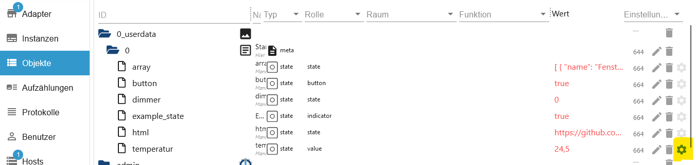
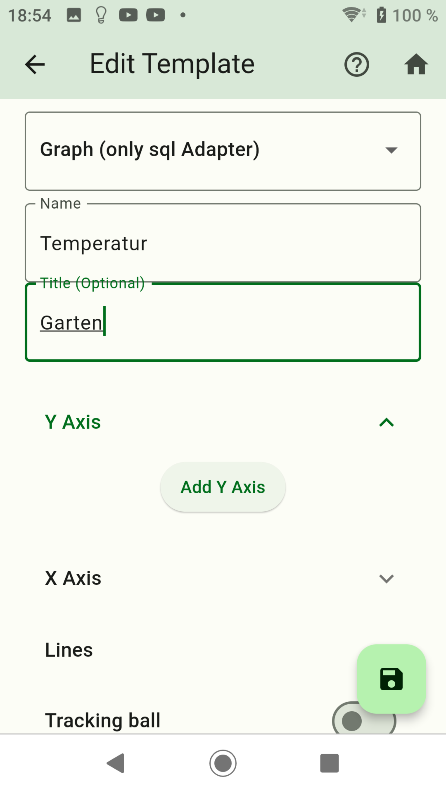
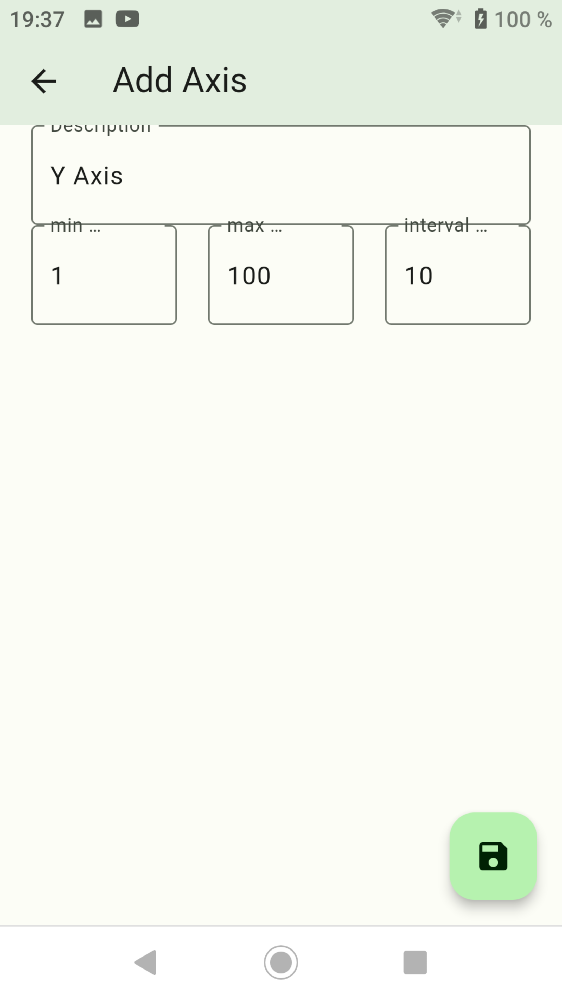
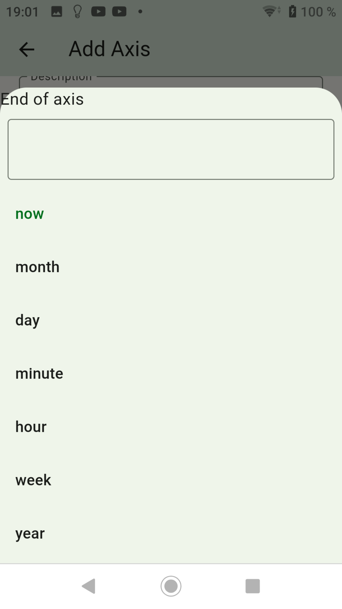
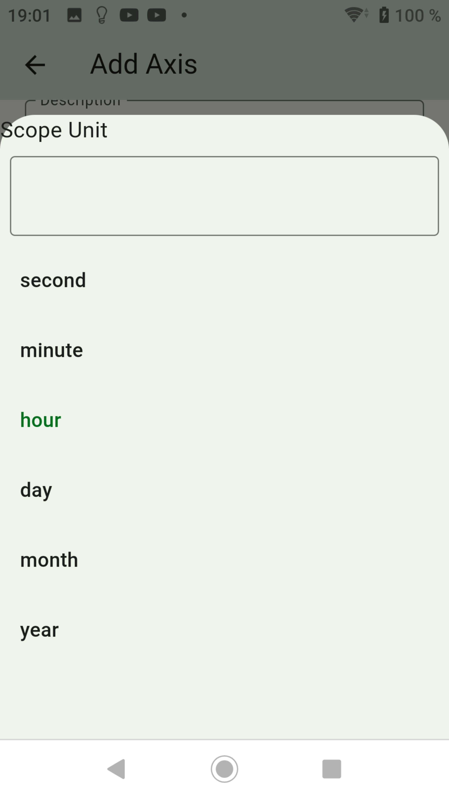
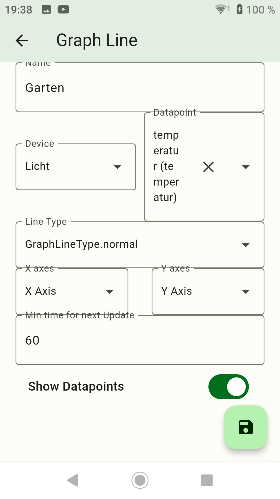
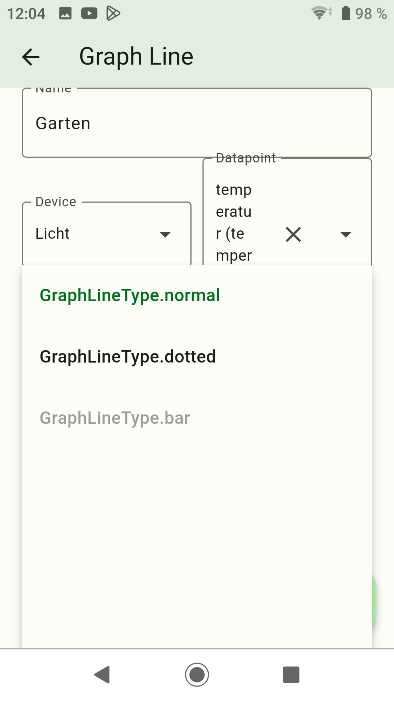
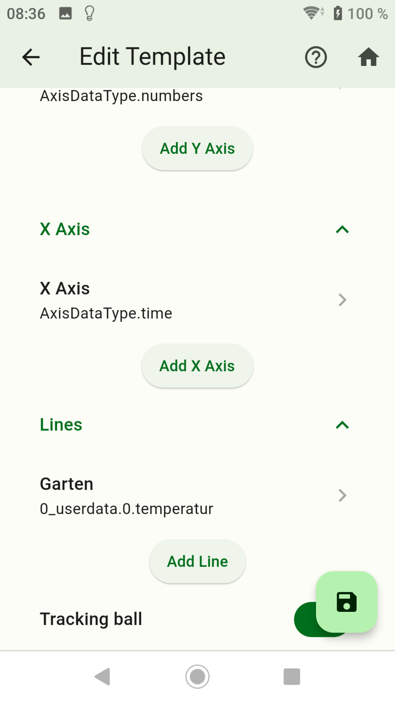
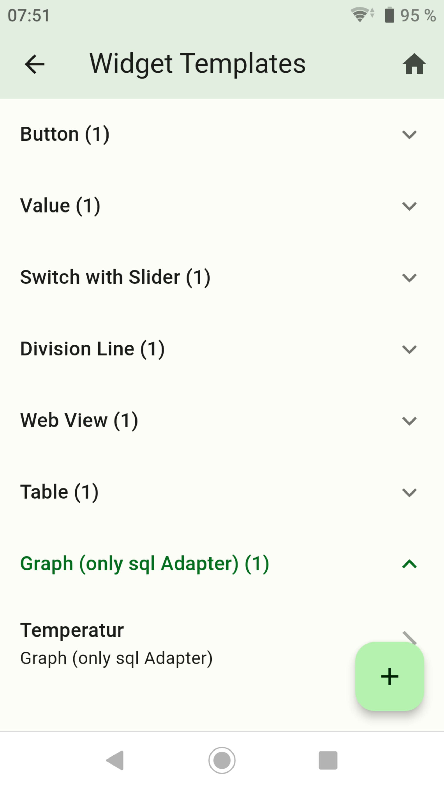
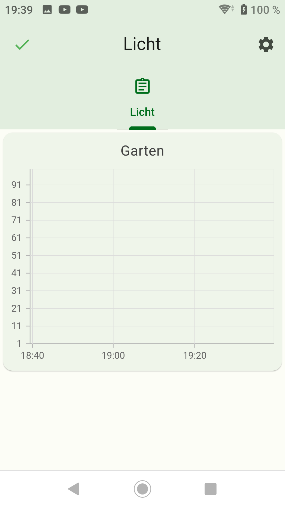

-   [Button erstellen](button.md)
-   [Value erstellen](value.md)
-   [Advanced erstellen](advanced.md)
-   [Switch with Slider erstellen](switch_w_slider.md)
-   [Division Line erstellen](division.md)
-   [Web View erstellen](webview.md)
-   [Table erstellen](table.md)
-   [Color Palette erstellen](color.md)
-   [Network Media Player erstellen](media_player.md)

## Graph (only sql Adapter)

### Mit Graph kann man Diagramme von Datenpunkte erzeugen, die von SQL- oder History-Adapter aufgezeichnet werden.

- Nach links wischen um ein Widget zu löschen.
- Rechts unten das Pluszeichen drücken.

- Es sollte erst eine Aufzeichnung gestartet werden. In den 2 Bilder wurde als Beispiel der SQL-Adapter verwendet. Benutzerdefinierte Einstellungen anklicken und SQL aktivieren.

- Dropdown: `Graph (only sql Adapter)` auswählen.
- Name: Name vom Widget
- Title: Kopftext vom Graph
- Y Axis: Die Gruppe Y Axis öffnen und `Button Add Y Axis` drücken.

- Nach links wischen um eine Y Achse zu löschen.
- Es können mehrere Y Axis (senkrechte Linie) angelegt werden, die dann bei der Erstellung der Line auswählbar sind.
- Description: Beschreibung der Skalierung
- min: Start Skalierung. Hier fange ich mit 1 an
- max: Ende Saklierung. Im Bsp. 100
- interval: Intervall der Skalierung. Im Bsp. ist 10 eingetragen. Somit wird 1,11,22,33,xxx angezeigt

- Nach links wischen um eine X Achse zu löschen.
- X Axis: Die Gruppe X Axis öffnen und `Button Add X Axis` drücken.
- Es können mehrere X Axis (waagerechte Linie) angelegt werden, die dann bei der Erstellung der Line auswählbar sind.
- Description: Beschreibung der Skalierung
- End of axis: Ende der Skalierung (Auswahlmöglichkeiten siehe Bild).
- Scope: Wie oft die Scope Unit angezeigt werden soll. Trägt man nun unter Scope Unit `hour` ein, wird eine Stunde angezeigt. Trägt man eine 4 ein, werden dann 4 Stunden angezeigt.
- Scope Unit: Hier die Einheit auswählen (Auswahlmöglichkeiten siehe Bild).

- Nach links wischen um eine Line zu löschen.
- Lines: Die Gruppe Lines öffnen und `Button Add Line` klicken.
- Es können mehrere Lines (Das Diagramm) angelegt werden.
- Name: Dieser Name wird im Diagramm als Header angezeigt
- Device: Die gewünschte Auflistung wählen.
- Datapoint: Auswahl vom Datenpunkt der von SQL überwacht wird.
- Line Type: Type der Linie auswählen (Auswahlmöglichkeiten siehe Bild).
- x axis: Auswahl aller X-Achse(n).
- y axis: Auswahl aller Y-Achse(n).
- Min time for next Update: Zeit wann spätestens aktualisiert werden soll. Bei APP Start wird automatisch aktualisiert.
- Show datapoint: Es wird der Datenpunktname angezeigt.

- Tracking ball: Auf an setzen wenn Markierungen gesetzt werden sollen.

- Danach speichern drücken.
- Durch langes drücken auf ein Widget wird auf den Kopiermodus gewechselt. Hier können Widgets ausgewählt werden von den eine Kopie erstellt werden soll.

- Fügt das Widget einem Screen zu.

-   [Button erstellen](button.md)
-   [Value erstellen](value.md)
-   [Advanced erstellen](advanced.md)
-   [Switch with Slider erstellen](switch_w_slider.md)
-   [Division Line erstellen](division.md)
-   [Web View erstellen](webview.md)
-   [Table erstellen](table.md)
-   [Color Palette erstellen](color.md)
-   [Network Media Player erstellen](media_player.md)