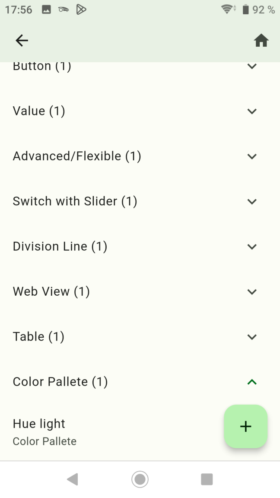
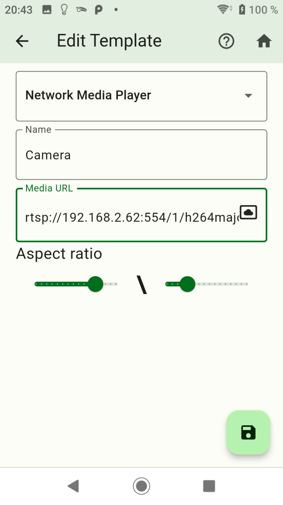
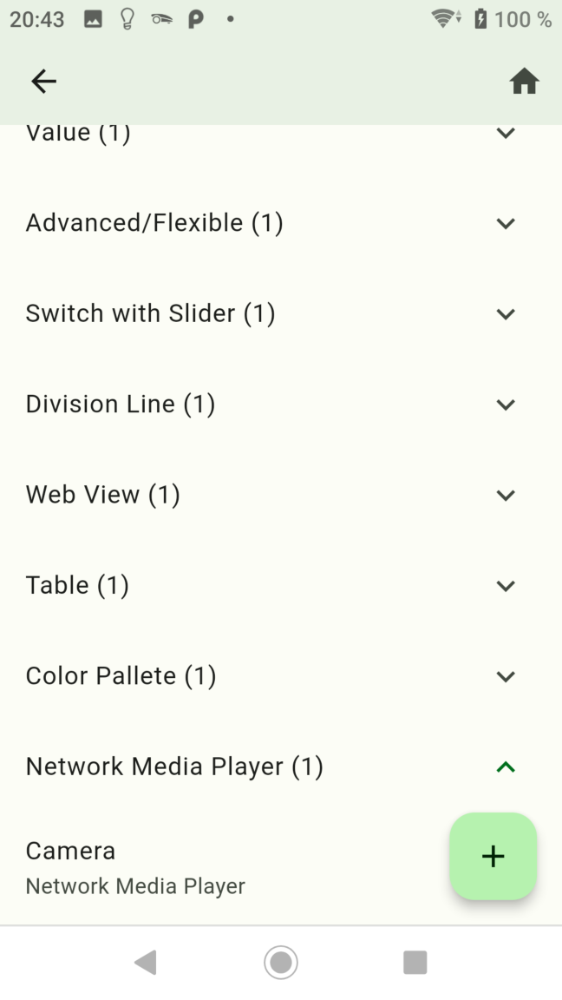
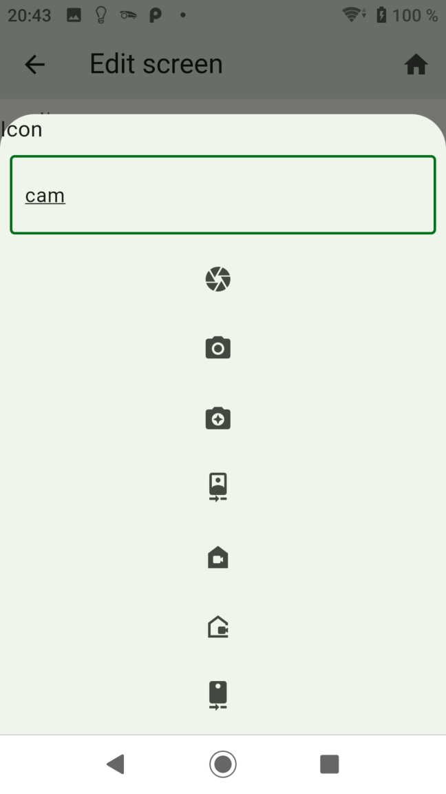
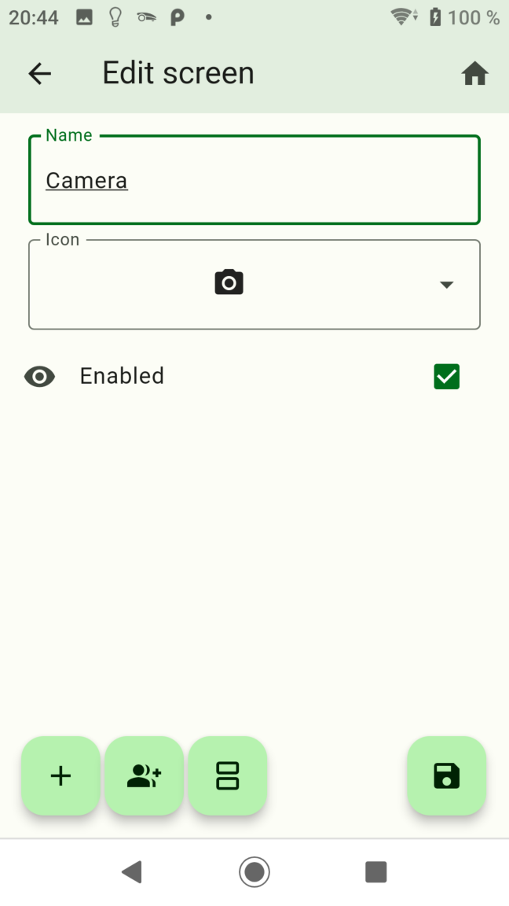
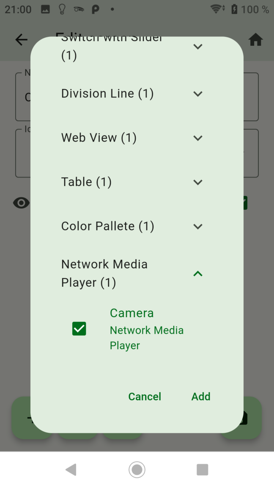
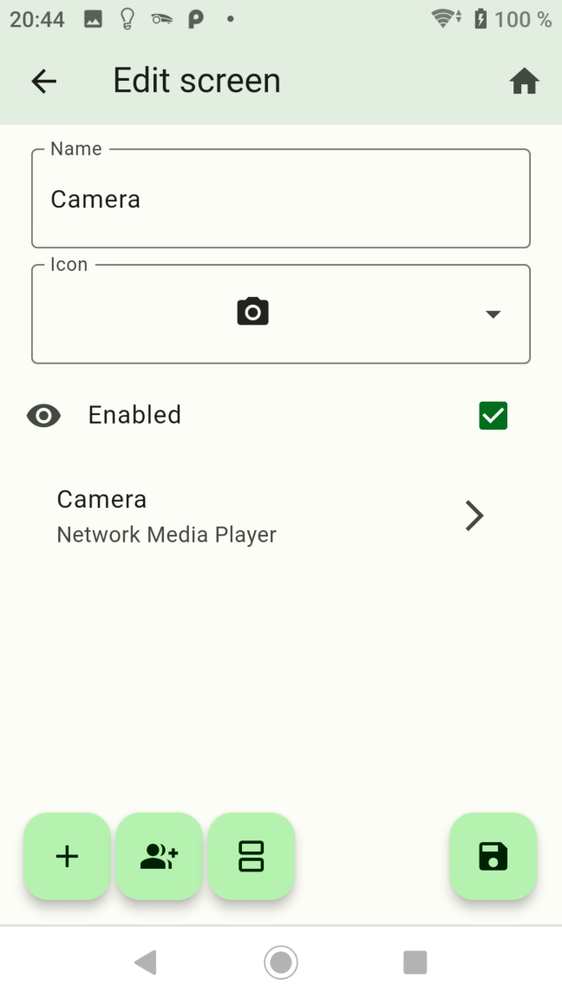
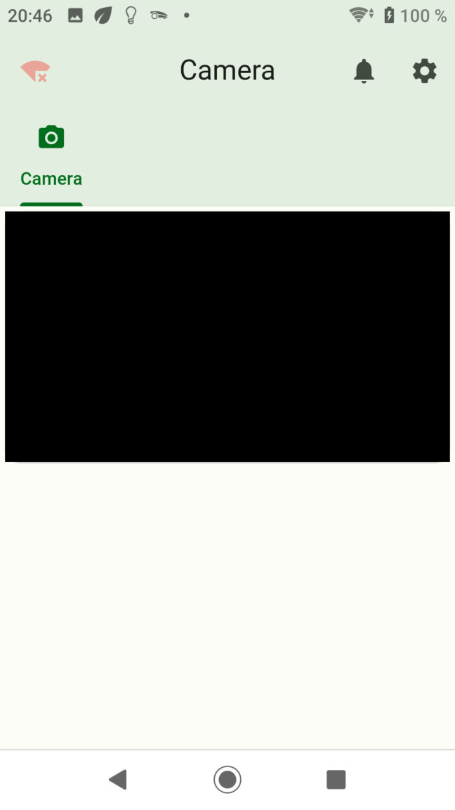

-   [Button erstellen](button.md)
-   [Value erstellen](value.md)
-   [Advanced erstellen](advanced.md)
-   [Switch with Slider erstellen](switch_w_slider.md)
-   [Division Line erstellen](division.md)
-   [Web View erstellen](webview.md)
-   [Table erstellen](table.md)
-   [Graph (only sql Adapter) erstellen](graph.md)
-   [Color Palette erstellen](color.md)

## Network Media Player

### Mit Network Media Player kann ein Kamerastream angezeigt werden

- Nach links wischen um ein Widget zu löschen.
- Rechts unten das Pluszeichen drücken.

- Dropdown: `Network Media Player` auswählen.
- Name: Name vom Widget
- Media URL: URL vom Kamerastream z. Bsp.: rtsp://192.168.2.20:554/path
- Aspect ratio: Seitenverhältnis in der Screenansicht

- Danach speichern drücken.
- Durch langes drücken auf ein Widget wird auf den Kopiermodus gewechselt. Hier können Widgets ausgewählt werden von den eine Kopie erstellt werden soll.

- Screen erstellen

- Das + Zeichen drücken und das Widget hinzuzufügen

- Fertig!

-   [Button erstellen](button.md)
-   [Value erstellen](value.md)
-   [Advanced erstellen](advanced.md)
-   [Switch with Slider erstellen](switch_w_slider.md)
-   [Division Line erstellen](division.md)
-   [Web View erstellen](webview.md)
-   [Table erstellen](table.md)
-   [Graph (only sql Adapter) erstellen](graph.md)
-   [Color Palette erstellen](color.md)