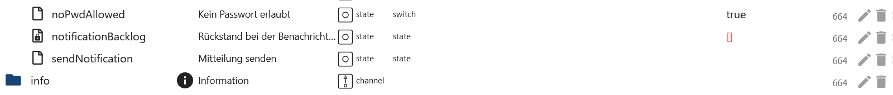
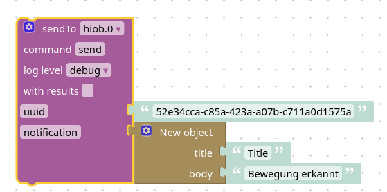
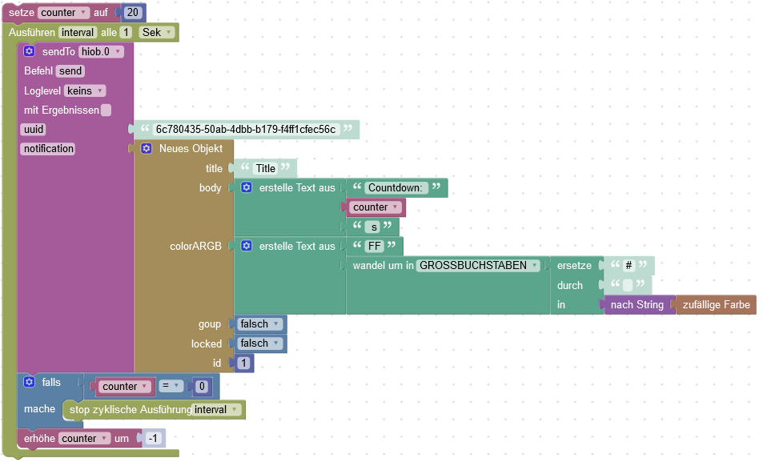
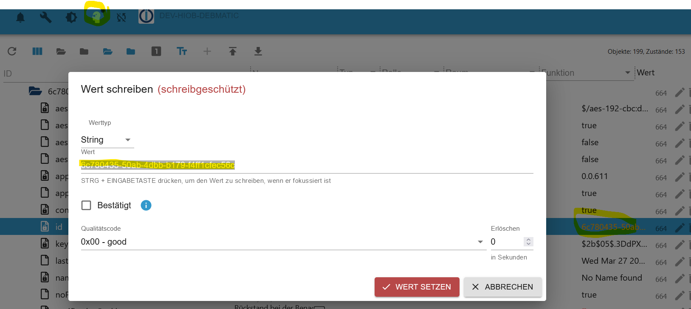
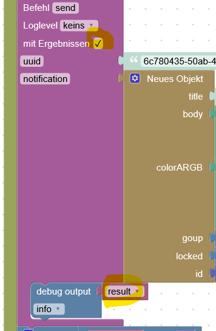
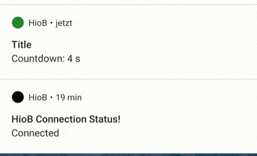

-   [Zurück zur Beschreibung](/docs/de/README.md)

## Notifications

❗**Wichtig** ❗: Dieses Feature ist noch in der beta Phase. Das bedeutet:

- Wenn die App **keine** aktive Verbindung zum ioBroker hat, so werden bis zu **maximal** 250 Nachrichten gespeichert. Und bei neu Verbindung gesendet
- Es gibt **keine** Garantie, dass Benachrichtigungen empfangen werden
- Es kann zu einem **erheblichen** Akku verbrauch kommen
- Die App kann **jederzeit** die Verbindung zum Server **verlieren**, wenn diese im Hintergrund ist

### Erste Schritte

1. Die Batterieoptimierung auf das Gerät für die App ausschalten. (Unter den Geräteeinstellungen)
   - Dies soll verhindern, dass Android die App im Hintergrund aus Energiespargründen stoppt.
2. Benachrichtigungen für die App erlauben
3. In der APP Einstellung **Notification** die Background Notifications aktivieren
4. Die App neu starten

### Benachrichtigungen senden

- `notificationBacklog` Nachrichten die noch nicht versendet werden konnten
- `sendNotification` Für eine Nachricht als Text oder JSON eintragen



### Benutzerdefinierte Benachrichtigungen
#### Schema

```JSON
{
	"$schema": "https://json-schema.org/draft/2019-09/schema",
    "type": "object",
    "properties": {
      "title": {
      	"type": "string",
        "descreption": "The title of your notification",
        "exclusiveMinimum": 0
      },
      "body": {
      	"type": "string",
        "descreption": "The body of your notification",
        "exclusiveMinimum": 0
      },
      "locked": {
      	"type": "boolean",
        "descreption": "Wether it should be dissmisable ",
      },
      "group": {
      	"type": "boolean",
        "descreption": "Goups ",
      },
      "colorARGB": {
      	"type": "string",
        "descreption": "ARGB Color Hex code ",
      },
      "id": {
      	"type": "number",
        "descreption": "Notification ID. If you do not want to send a new notification, give it the same ID and the old one will be overwritten",
      }
    }
}
```

#### Color - color`ARGB`

- `A` ist der Alpha-Wert, wobei 0 transparent und 255 vollständig undurchsichtig ist – Dezimal in Hex umwandeln 255 == FF
- `R` ist rot, from 0 to 255 - Dezimal in Hex umwandeln 255 == FF
- `G` ist grün, from 0 to 255 - Dezimal in Hex umwandeln 255 == FF
- `B` ist blau, from 0 to 255 - Dezimal in Hex umwandeln 255 == FF
- `ARGB` == FFFFFFFF

#### Beispiel
```JSON
{
  "title": "Bewegung",
  "body": "Es wurde eine Bewungung in der Küche erkannt",
  "locked": false,
  "colorARGB": "FFFF0000"
}
```

#### Blockly sendTo Beispiel
Es ist ebenfalls möglich über Blockly mithilfe der sendTo Funktion Benachrichtigungen zu senden:
- Parameter
  - **uuid**: Die id des Gerätes. Zu finden unter hiob.x.devices
  - **notification**: Die Benachrichtigung die gesendet werden soll: Objekt Schema siehe oben
- **Beispiel** <br>

```JS
sendTo('hiob.0', 'send', { 'uuid': '52e34cca-c85a-423a-a07b-c711a0d1575a', 'notification': { 'title': 'Title', 'body': 'Bewegung erkannt' } });
```
#### Beispiel für die Verwendung derselben ID - Javascript Adapter >= 7.9.0
**Blockly** <br>
 <br>
 <br>
**Blockly mit Antwort** <br>
 <br>
**Notification** <br>


-   [Zurück zur Beschreibung](/docs/de/README.md)