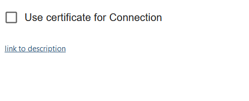
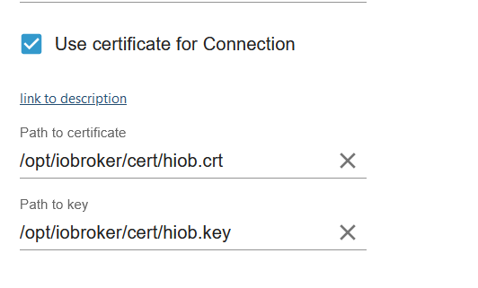
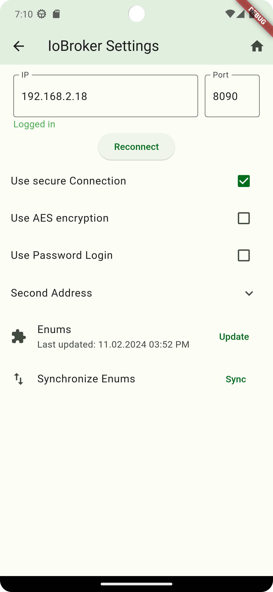

-   [Zurück zur Beschreibung](/docs/de/README.md)

# Sichere Verbindung

Nachrichten zwischen den Adapter und Handy verschlüsseln?

## Hinweis

Adapter version mind. auf 0.0.53-beta

## Ein Zertifikat erstellen

```bash
cd /opt/iobroker
mkdir cert
cd cert
openssl req -newkey rsa:4096 \
            -x509 \
            -sha256 \
            -days 3650 \
            -nodes \
            -out hiob.crt \
            -keyout hiob.key 
```

## Zertifikat

```
pi@iobroker:~ $ cd /opt/iobroker
pi@iobroker:/opt/iobroker $ mkdir cert
pi@iobroker:/opt/iobroker $ cd cert
pi@iobroker:/opt/iobroker/cert $ openssl req -newkey rsa:4096 \
            -x509 \
            -sha256 \
            -days 3650 \
            -nodes \
            -out hiob.crt \
            -keyout hiob.key
..+.....+.........+...............+......+.+......+...+.....+......+++++++++++++                                                                                                             ++++++++++++++++++++++++++++++++++++++++++++++++++++*...........................                                                        
-----
You are about to be asked to enter information that will be incorporated
into your certificate request.
What you are about to enter is what is called a Distinguished Name or a DN.
There are quite a few fields but you can leave some blank
For some fields there will be a default value,
If you enter '.', the field will be left blank.
-----
Country Name (2 letter code) [AU]:Your_2_letter_ISO_country_code Beispiel DE
State or Province Name (full name) [Some-State]:Your_State_Province_or_County Beispiel NRW
Locality Name (eg, city) []:Your_City Beispiel Düsseldorf
Organization Name (eg, company) [Internet Widgits Pty Ltd]:Your_Company Beispiel HIOB
Organizational Unit Name (eg, section) []:Your_Department Beispiel HIOB
Common Name (e.g. server FQDN or YOUR name) []:secure.yourwebsite.com
Email Address []:youremail@yourwebsite.com
pi@iobroker:/opt/iobroker/cert $ sudo chown iobroker hiob.crt
pi@iobroker:/opt/iobroker/cert $ sudo chown iobroker hiob.key
pi@iobroker:/opt/iobroker/cert $
```

## Rechte vergeben

```bash
sudo chown iobroker hiob.crt
sudo chown iobroker hiob.key
```

## Einstellungen

-   Den Haken bei `Use certificate Connection` setzen und die jeweiligen Pfade eintragen





-   In der APP Einstellung nun den Haken bei `Use secure Connection` setzen


