-   [Zurück zur Beschreibung](/docs/de/README.md)
-   [Schritt 1: Installation und APP Einrichtung](app.md)
-   [Schritt 2: ENUMS erstellen](enum.md)
-   [Schritt 3: Widgets erstellen](widgets.md)
-   [Schritt 5: Backups erstellen](backups.md)

## Screens erstellen `Screen Settings`

- Hier können nun Screens für den Header erstellt werden und diesen kann man Widgets hinzufügen. Widgets können in Sceerns nicht doppelt hinzugefügt werden.
- Nach links wischen um ein Screen zu löschen. Wenn der letzte Screen gelöscht wird, erscheint automatisch ein neuer mit dem Namen Template.

- Rechts unten das Pluszeichen drücken um ein neuen Screen zu erstellen oder auf `Template` klicken um den Namen zu ändern.

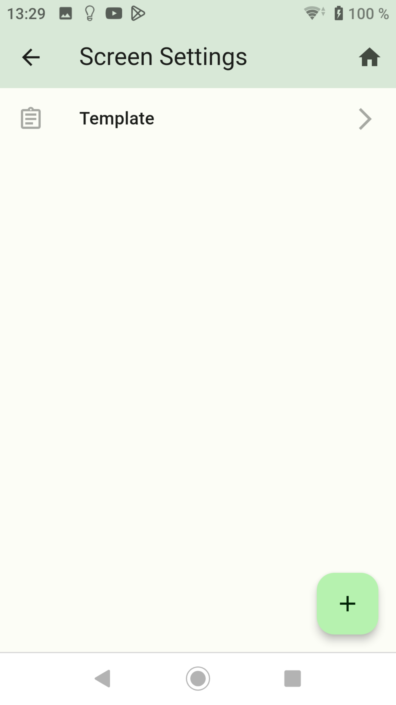

- Einen Namen eintragen der im Header angezeigt werden soll und es kann ein Icon ausgewählt werden. Danach auf speichern drücken.

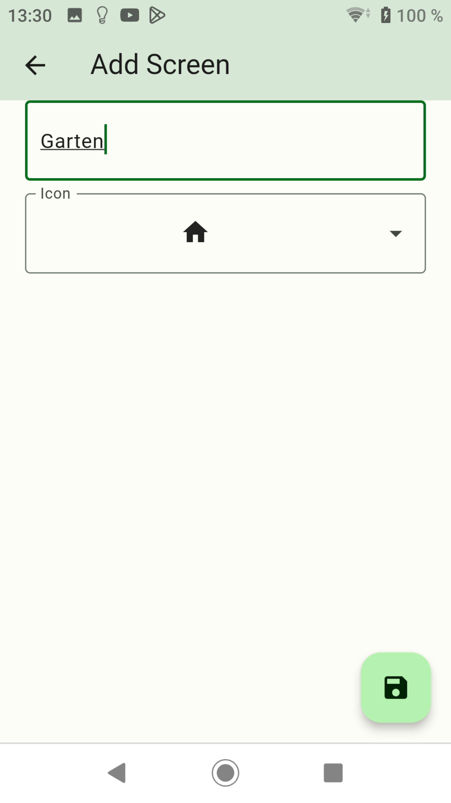
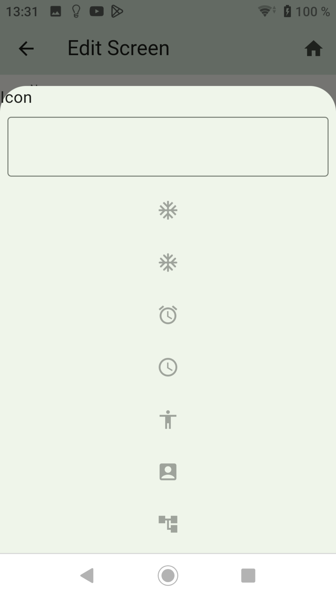

- In diesem Screen kann man Gruppen erstellen, zusätzliche Divisions und Widgets hinzufügen.
- Mit der Checkbox `Enabled` kann der Screen de-/aktiviert werden.
- Mit Klick auf das linke untere Kreuz werden Widgets hinzuzufügt. In diesem Popup kann man die Katergorien aufklappen und mit einem Haken ausgewählt werden.

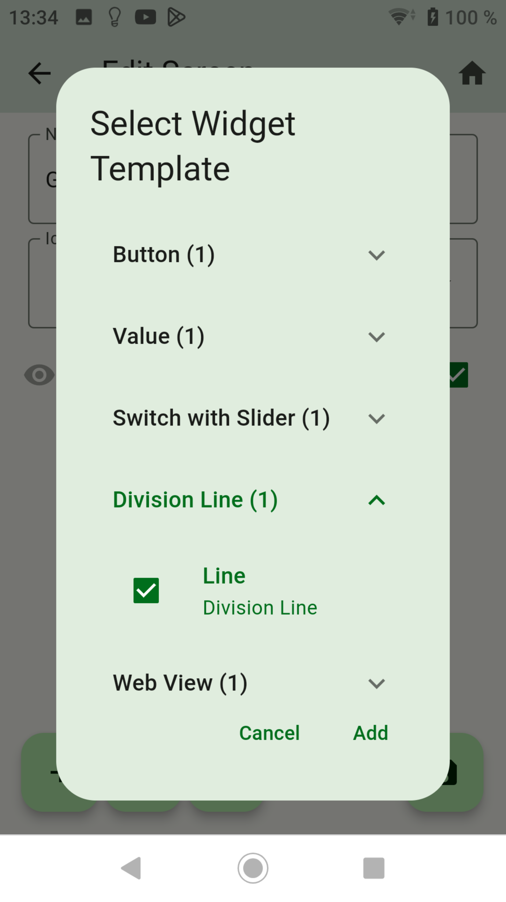
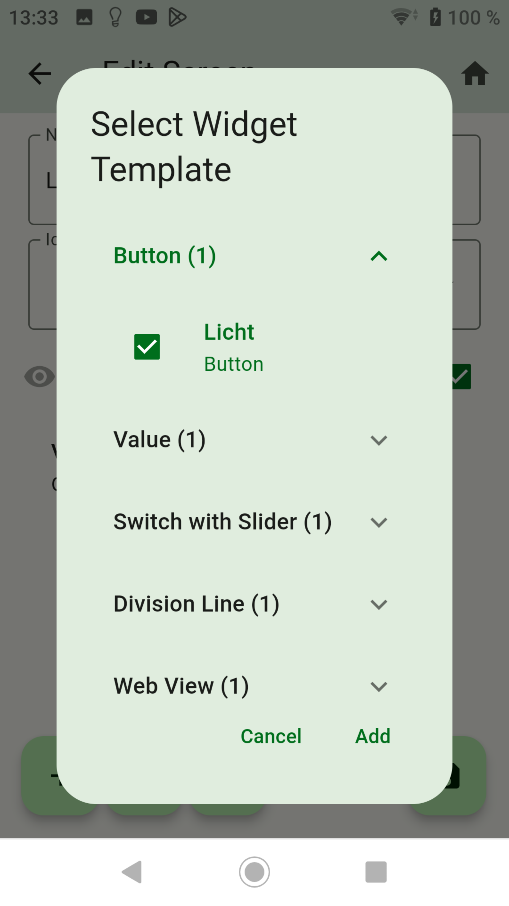

- Mit klick auf den mittleren Button kann eine Gruppe angelegt werden.
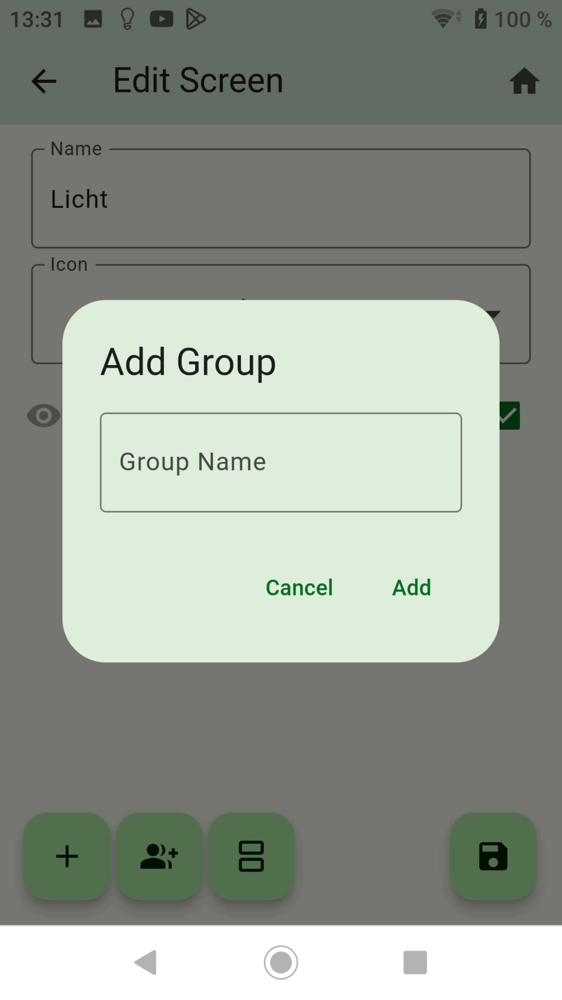
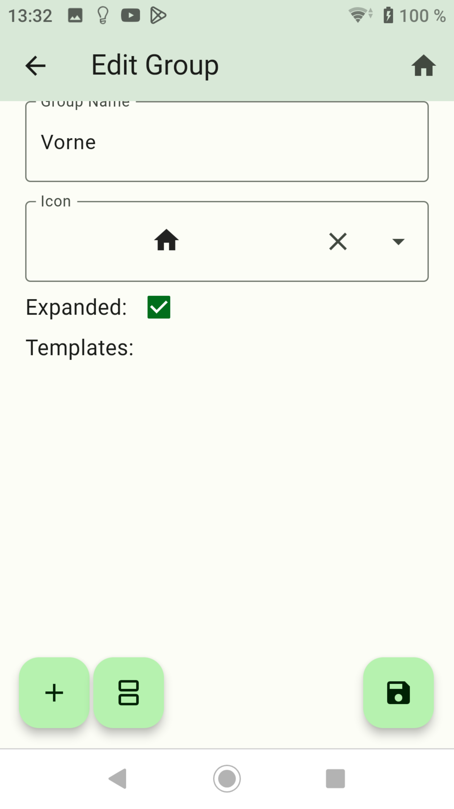

- Dieser Gruppe können nun Widgets und Divisions hinzufügen werden.
- Mit `Expanded` kann man bestimmen, ob die Gruppe geöffnet oder geschlossen angezeigt wird.
- Zusätzlich ist die Auswahl eines ICON möglich.

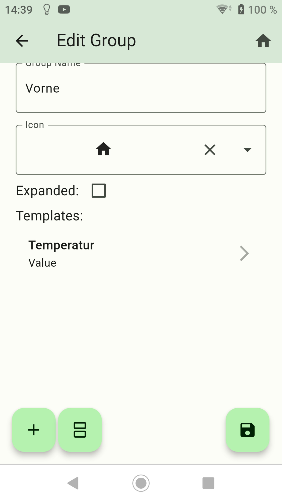

- Mit drücken auf den 3ten Button von links kann man Division anlegen. Natürlich kann ein Division auch über Widget angelegt werden. Die Höhe einstellen und den Button `Add` drücken.

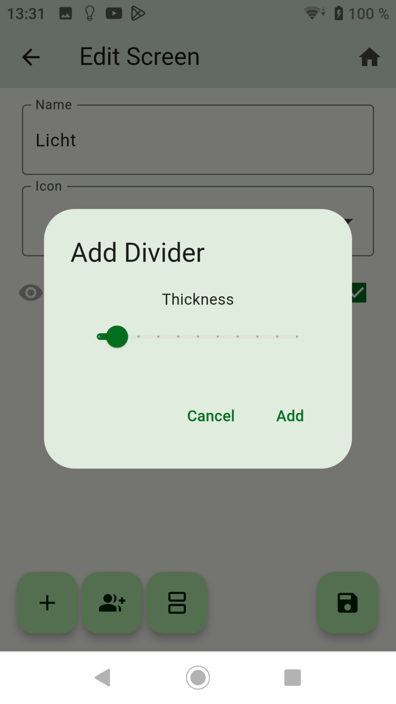

- Durch drücken und halten eines Widgets kann die Position geändert werden.

- Die erstellten Screen sollten nun so aussehen.

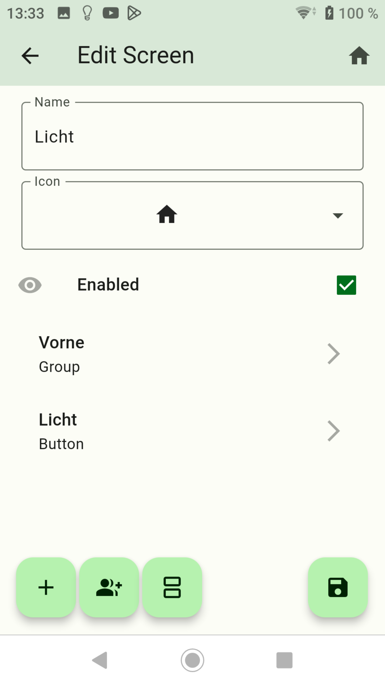
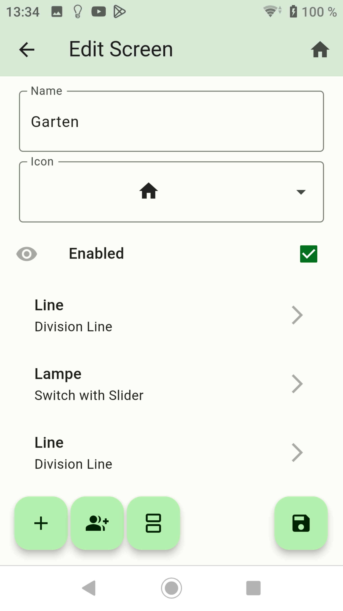

- Nun zur Screen Übersicht wechseln und auf das Haus rechts oben drücken um die Screens anzeigen zu lassen.

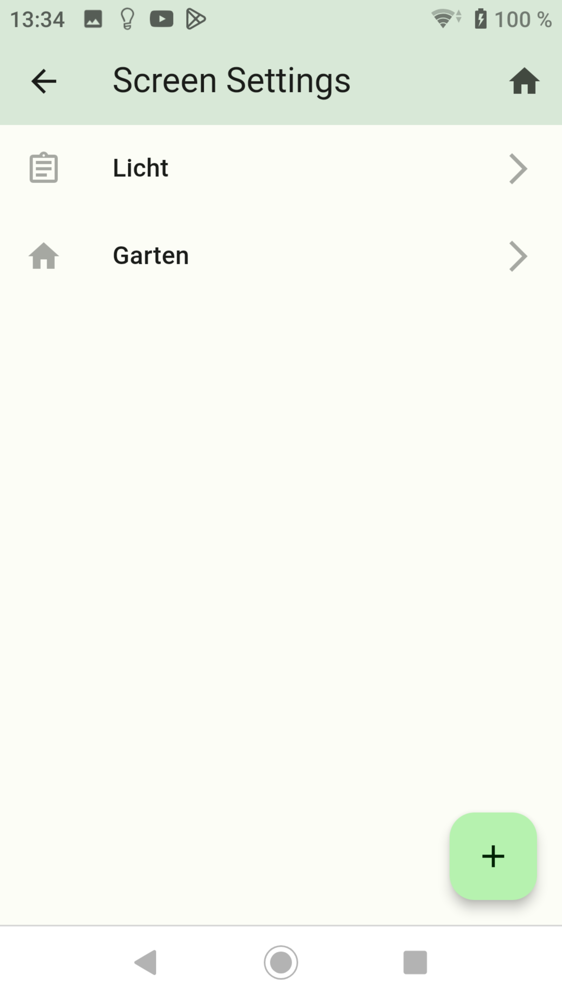
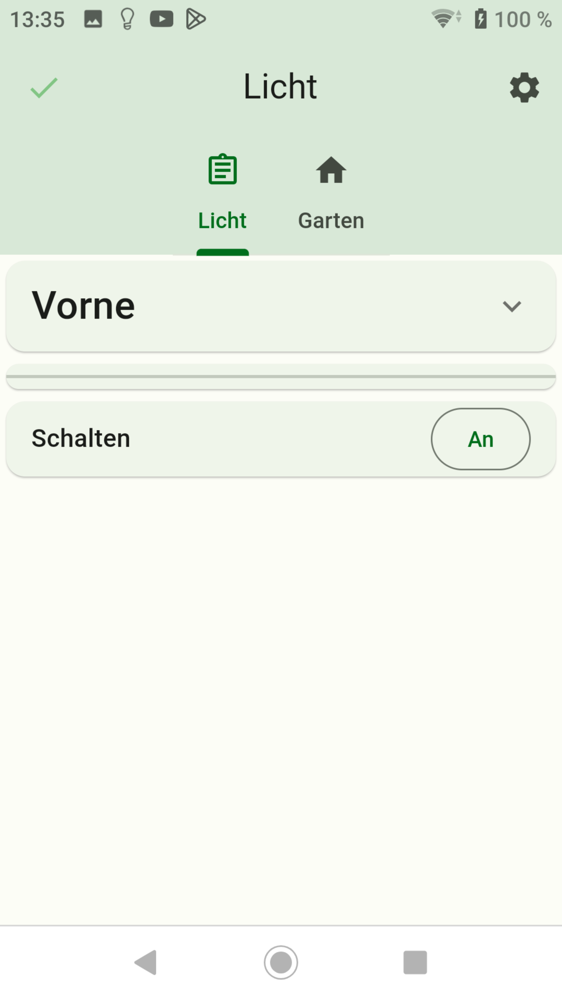
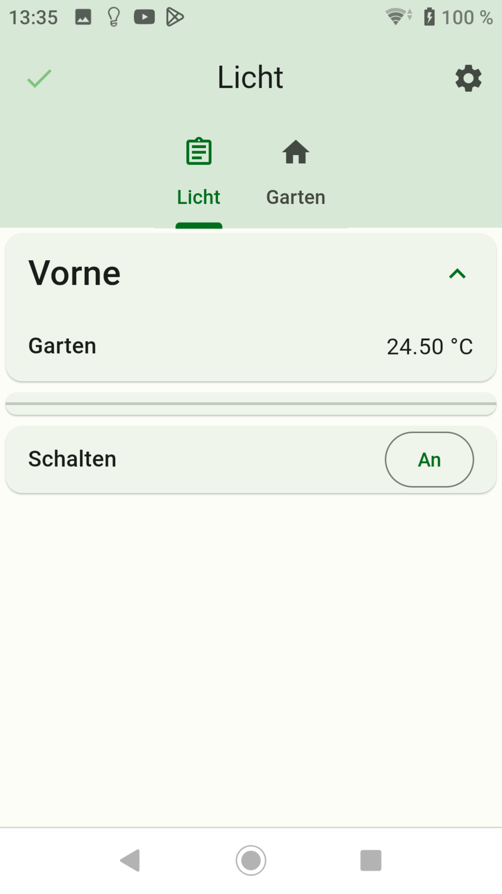
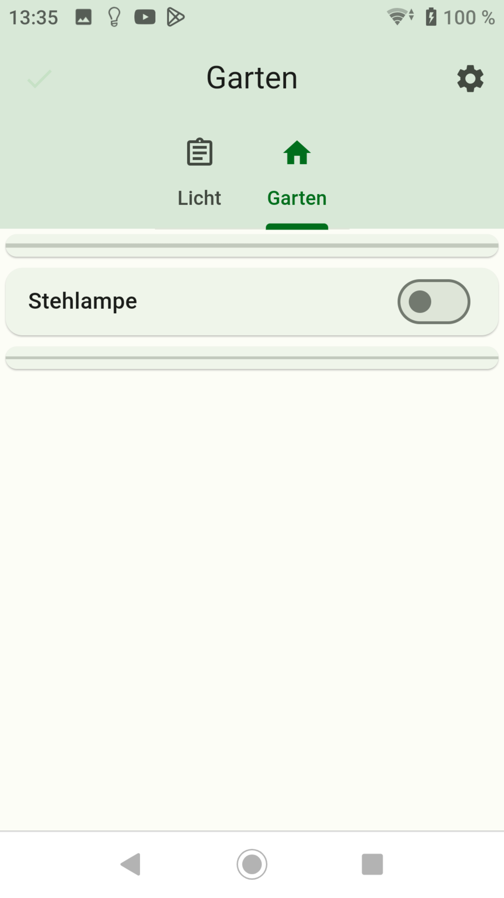

-   [Zurück zur Beschreibung](/docs/de/README.md)
-   [Schritt 1: Installation und APP Einrichtung](app.md)
-   [Schritt 2: ENUMS erstellen](enum.md)
-   [Schritt 3: Widgets erstellen](widgets.md)
-   [Schritt 5: Backups erstellen](backups.md)