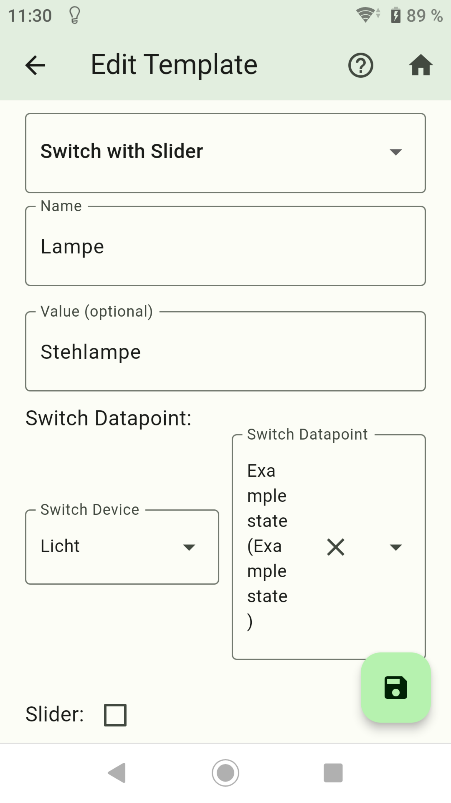
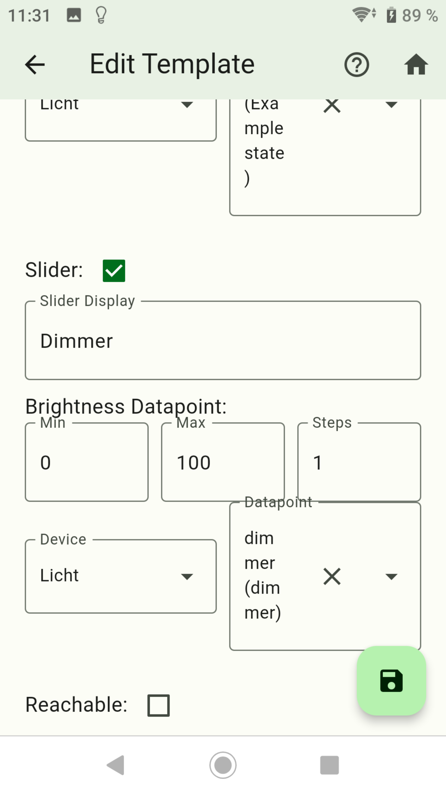
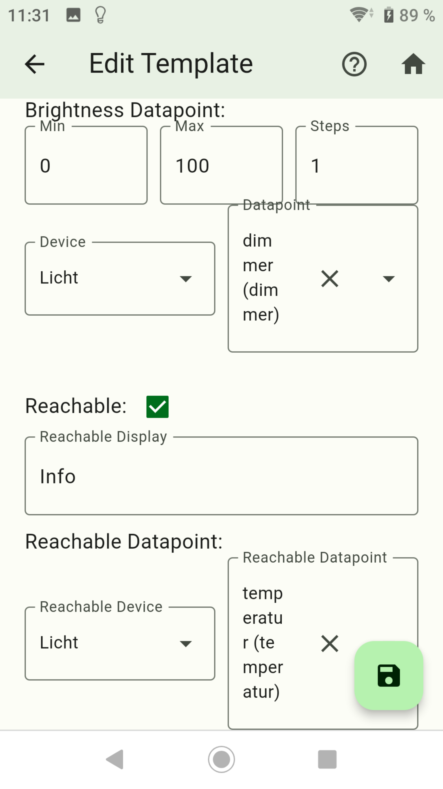
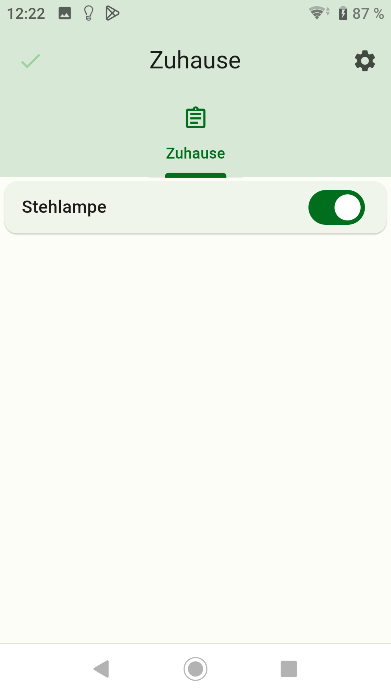
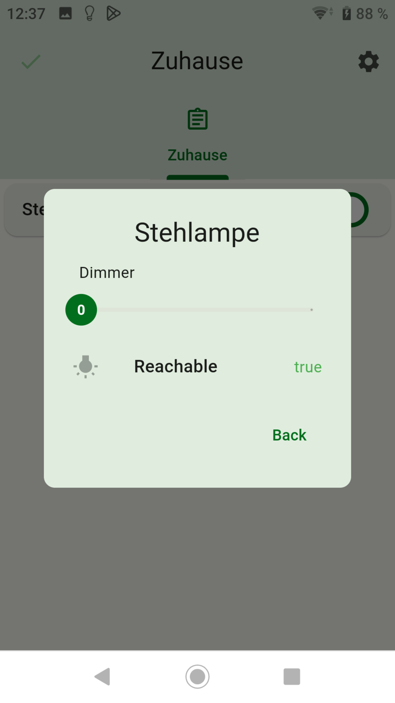

-   [Button erstellen](button.md)
-   [Value erstellen](value.md)
-   [Advanced erstellen](advanced.md)
-   [Division Line erstellen](division.md)
-   [Web View erstellen](webview.md)
-   [Table erstellen](table.md)
-   [Graph (only sql Adapter) erstellen](graph.md)
-   [Color Palette erstellen](color.md)
-   [Network Media Player erstellen](media_player.md)

## Switch with Slider

### Mit Switch with Slider kann man ein Schalter mit Dimmer (optional) erstellen

- Nach links wischen um ein Widget zu löschen.
- Rechts unten das Pluszeichen drücken.

- Dropdown: `Switch with Slider` auswählen.
- Name: Name vom Widget
- Value (optional): Anzeigetext im Widget. Bleibt das Feld leer wird der Name verwendet.
- Round to: Stellen nach dem Komma
- Unit (optional): Einheit vom Value
- Device: Hier die gewünschte Auflistung wählen.
- Datapoint: Auswahl der Datenpunkte aus der gewählten Auflistung - Datenpunkt muss boolean true/false sein!

- Wenn Dimmen gewünscht ist muss bei Slider ein Haken gesetzt werden.
- Slider Display: Namen vom Slider.
- Min: Wert minimal (Standard 0).
- Max: Wert maximal (Standard 100).
- Steps: In welchen Schritten Änderungen durchgeführt werden dürfen (Standard 10).
- Device: Die gewünschte Auflistung wählen.
- Datapoint: Auswahl der Datenpunkte aus der gewählten Auflistung - Datenpunkt muss number sein!

- Mit Reachable kann ein Popup erstellt werden um einen Wert von einem Datenpunkt zu sehen.
- Reachable Display: Name vom Reachable.
- Device: Die gewünschte Auflistung wählen.
- Datapoint: Auswahl der Datenpunkte aus der gewählten Auflistung - Datenpunkt muss boolean true/false sein!

- Danach speichern drücken.
- Durch langes drücken auf ein Widget wird auf den Kopiermodus gewechselt. Hier können Widgets ausgewählt werden von den eine Kopie erstellt werden soll.

- Fügt das Widget einem Screen zu und steuert damit einen Datenpunkt. Auf das Widget lange drücken damit das Popup Fentser sich öffnet. Im Popup kann der aktuellen Schaltzustand eingesehen werden oder ein Level einstellen.

-   [Button erstellen](button.md)
-   [Value erstellen](value.md)
-   [Advanced erstellen](advanced.md)
-   [Division Line erstellen](division.md)
-   [Web View erstellen](webview.md)
-   [Table erstellen](table.md)
-   [Graph (only sql Adapter) erstellen](graph.md)
-   [Color Palette erstellen](color.md)
-   [Network Media Player erstellen](media_player.md)