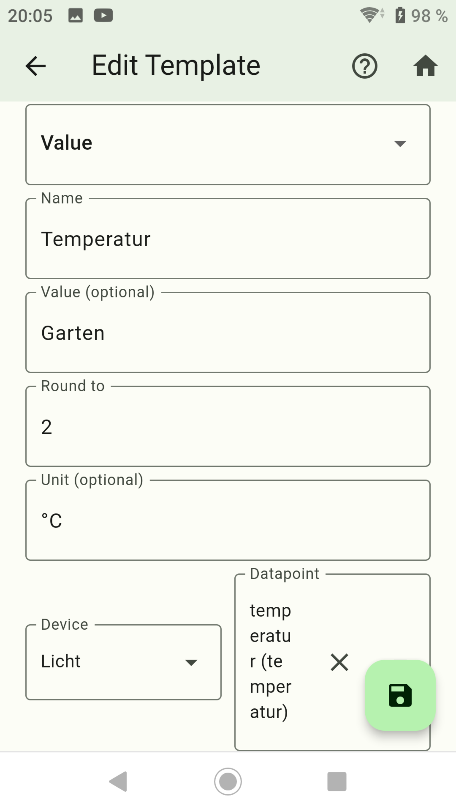
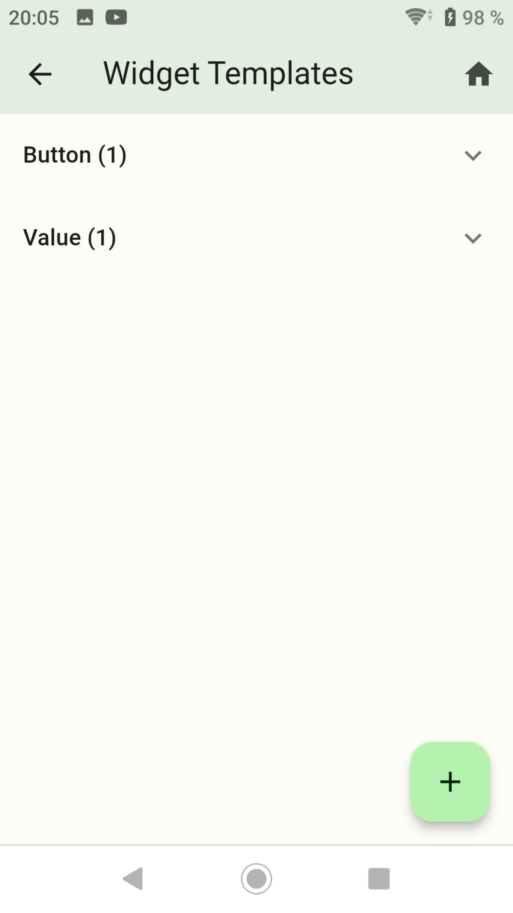

-   [Button erstellen](button.md)
-   [Advanced erstellen](advanced.md)
-   [Switch with Slider erstellen](switch_w_slider.md)
-   [Division Line erstellen](division.md)
-   [Web View erstellen](webview.md)
-   [Table erstellen](table.md)
-   [Graph (only sql Adapter) erstellen](graph.md)
-   [Color Palette erstellen](color.md)
-   [Network Media Player erstellen](media_player.md)

## Value

### Mit Value kann man z. Bsp. eine Zeit setzen

- Nach links wischen um ein Widget zu löschen.
- Rechts unten das Pluszeichen drücken.

- Dropdown: `Value` auswählen.
- Name: Name vom Widget
- Value (optional): Anzeigetext im Widget. Wird nichts angegeben wird der Name verwendet.
- Round to: Wie viele Stellen nach dem Komma aufrunden.
- Unit (optional): Einheit vom Wert.

- Device: Die gewünschte Auflistung wählen.

- Datapoint: Auswahl der Datenpunkte aus der gewählten Auflistung

- Danach speichern drücken.
- Durch langes drücken auf ein Widget wird auf den Kopiermodus gewechselt. Hier können Widgets ausgewählt werden von den eine Kopie erstellt werden soll.

- Das Widget einem Screen zufügen und steuert damit einen Datenpunkt. Auf das Widget lange drücken damit sich das Popup Fenster öffnet in dem der Wert geändert werden kann.

-   [Button erstellen](button.md)
-   [Advanced erstellen](advanced.md)
-   [Switch with Slider erstellen](switch_w_slider.md)
-   [Division Line erstellen](division.md)
-   [Web View erstellen](webview.md)
-   [Table erstellen](table.md)
-   [Graph (only sql Adapter) erstellen](graph.md)
-   [Color Palette erstellen](color.md)
-   [Network Media Player erstellen](media_player.md)