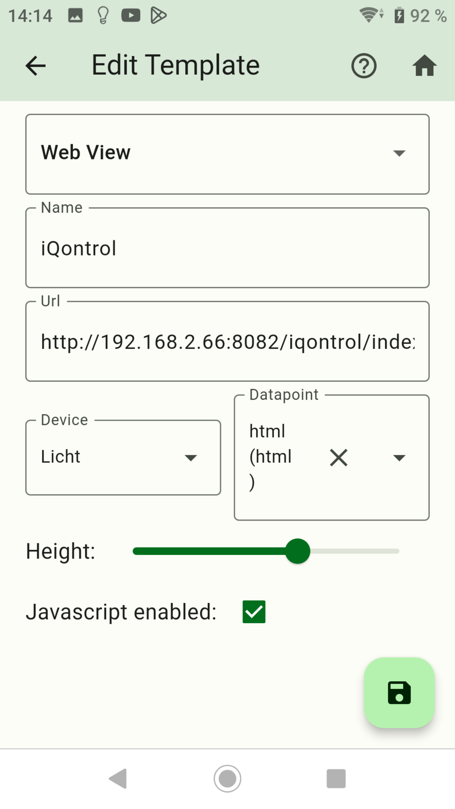
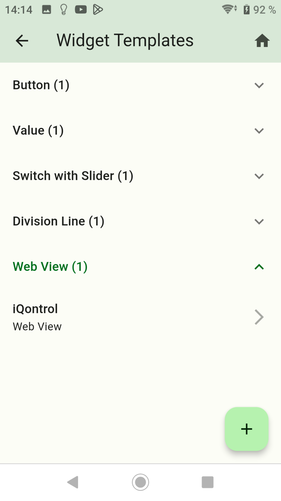
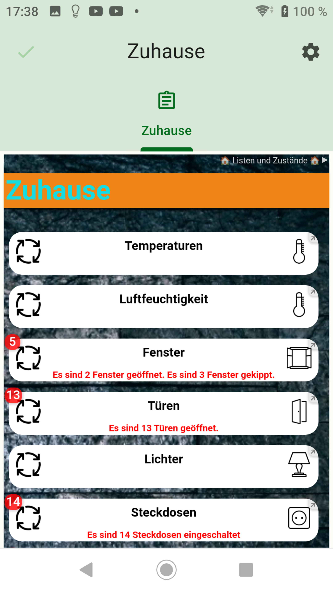

-   [Button erstellen](button.md)
-   [Value erstellen](value.md)
-   [Advanced erstellen](advanced.md)
-   [Switch with Slider erstellen](switch_w_slider.md)
-   [Division Line erstellen](division.md)
-   [Table erstellen](table.md)
-   [Graph (only sql Adapter) erstellen](graph.md)
-   [Color Palette erstellen](color.md)
-   [Network Media Player erstellen](media_player.md)

## Web View

### Mit Web View kann man eine Website anzeigen lassen.

- Nach links wischen um ein Widget zu löschen.
- Rechts unten das Pluszeichen drücken.

- Dropdown: `Web View` auswählen.
- Name: Name vom Widget
- URL (optional): Eine URL wie z. Bsp.: `http://192.168.x.x:8082/iqontrol/index.html?namespace=iqontrol.0`
- Device: Die gewünschte Auflistung wählen.
- Datapoint: Auswahl vom Datenpunkt in dem eine Webadresse hinterlegt ist. Durch Änderung vom Datenpunkt wird aktualisiert bzw. die Adresse aus dem Datenpunkt verwendet.
- Height: Die Höhe vom Widget. Wird zu klein gewählt, kann die Website abgeschnitten sein.
- Javascript enabled: Erlaubt das ausführen von Javascripts

- Danach speichern drücken.
- Durch langes drücken auf ein Widget wird auf den Kopiermodus gewechselt. Hier können Widgets ausgewählt werden von den eine Kopie erstellt werden soll.

- Das Widget einem Screen hinzufügen.

-   [Button erstellen](button.md)
-   [Value erstellen](value.md)
-   [Advanced erstellen](advanced.md)
-   [Switch with Slider erstellen](switch_w_slider.md)
-   [Division Line erstellen](division.md)
-   [Table erstellen](table.md)
-   [Graph (only sql Adapter) erstellen](graph.md)
-   [Color Palette erstellen](color.md)
-   [Network Media Player erstellen](media_player.md)