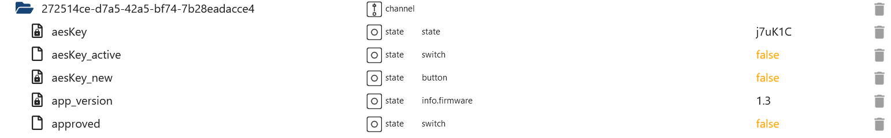
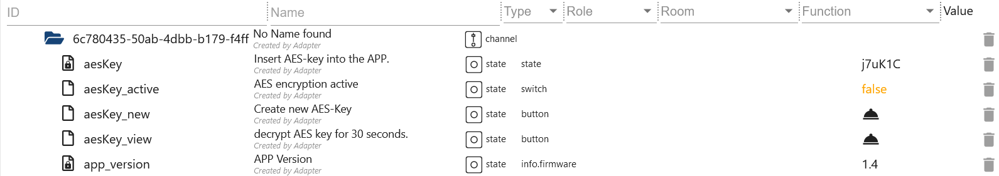
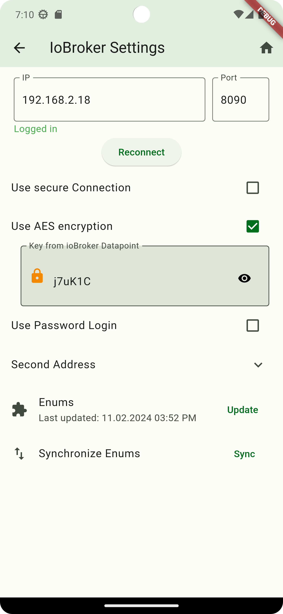

-   [Back to summary](/docs/en/README.md)

# Step 1: AES states

- `hiob.0.devices.xxx.aesKey` Enter this key into the APP
- `hiob.0.devices.xxx.aesKey_active` Set to true for encryption
- `hiob.0.devices.xxx.aesKey_new` Generate a new key and enter the APP
- `hiob.0.devices.xxx.aesKey_view` Make AES key visible for 30 seconds (Image 2)

# Step 2: APP Settings

- Check the box “Use AES encryption”.
- Enter AES key from ioBroker

