-   [Back to Summary](/docs/en/README.md)
-   [Step 1: Installation and APP setup](app.md)
-   [Step 2: Create Enums](enum.md)
-   [Step 3: Create Widgets](widgets.md)
-   [step 4: Create Screens](sreens.md)
-   [Step 5: Create Backups](backups.md)

## Installation and APP setup `ioBroker Settings`

# Step 1: Installation and APP setup

# Step 1: Instance Settings

1. Please enter a free port (default is 8090). If the selected port is occupied, the next free port will be used. This is written to the log and should then be copied into the config instance.
2. For the graphic widget you need either the SQL or Histroy adapter to record changes to states. Please select either a SQL or History instance.
3. Now start the adapter.

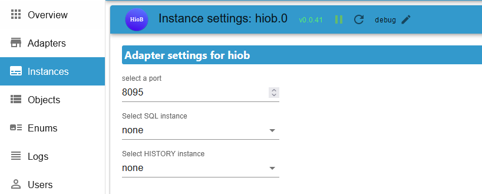

# Step 2: Create User (OPTIONAL)

## A new user must be created for password login

1. Select users on the left and add users on the right.

2. Enter the username and a password here. Then press save.

# Step 3 with password: Login with password (local login)

1. Enter the IP of your ioBroker, port, user and password here and press the “Reconnect” button.

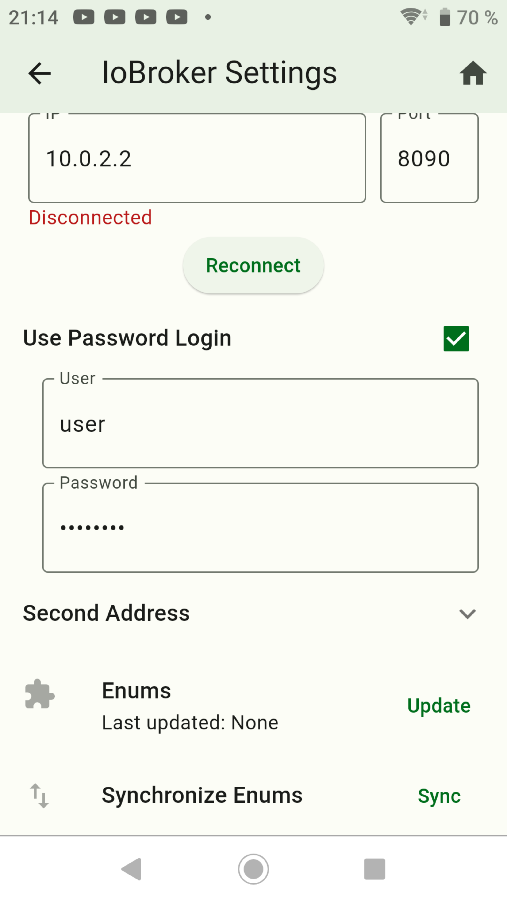

2. Then under Objects, set the state `approved`, from the correct device, to true (without the Confirmed check mark)

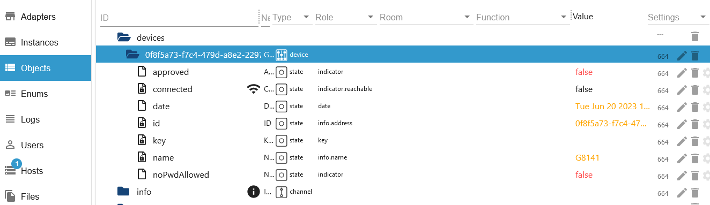

3. Stimmt das Passwort oder der Username nicht wechselt der Datenpunkt wieder auf false und in der APP wird ein roter Text `Login declined` angezeigt. Bitte dann den Username und Passwort überprüfen und den Datenpunkt erneut auf true setzen.

4. If everything has been entered correctly, the green text “Logged in” will now appear.

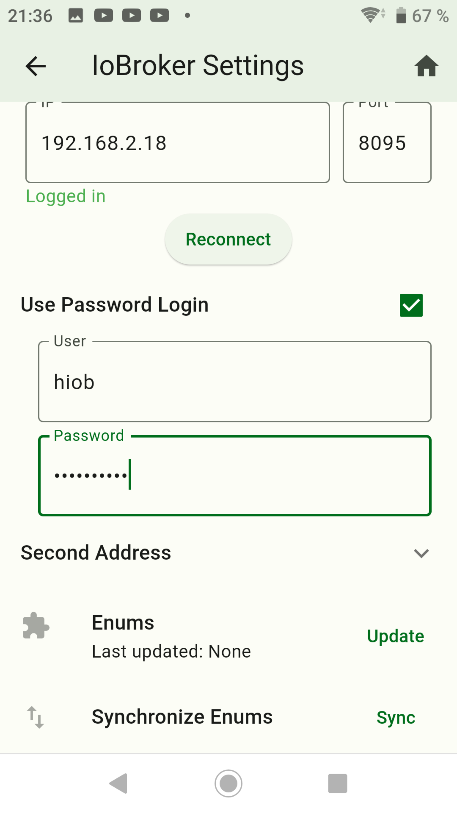
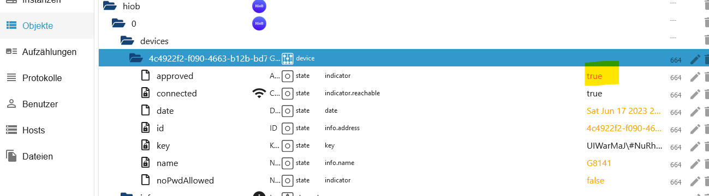

5. (Optional) Now a forwarding can be entered so that you can also switch outside the network. Beforehand, the APP must receive the “Location” access rights. Then enter the WiFi network and the URL. Now set up a forwarding in the Fritzbox. But this is not recommended!! VPN access would be better. E.g. use the APP “VpnCilla” (chargeable).

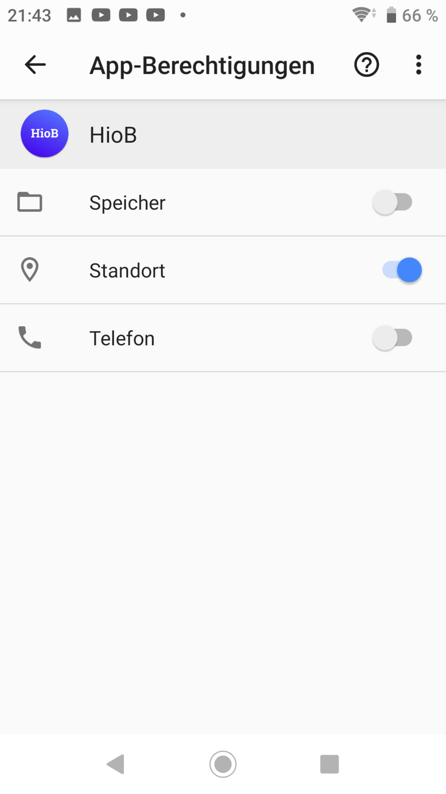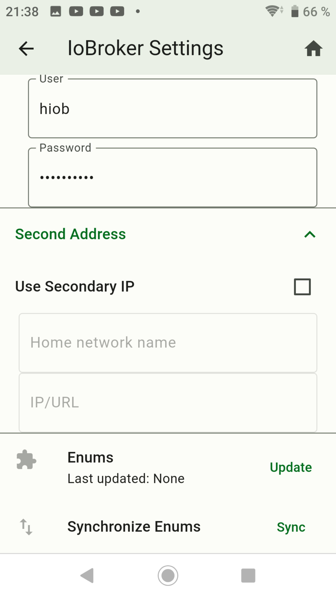

# Step 3 without password: Login with password (local login)

1. Uncheck the box “Use Password Login” and enter your IP + port from ioBroker and press the “Reconnect” button.

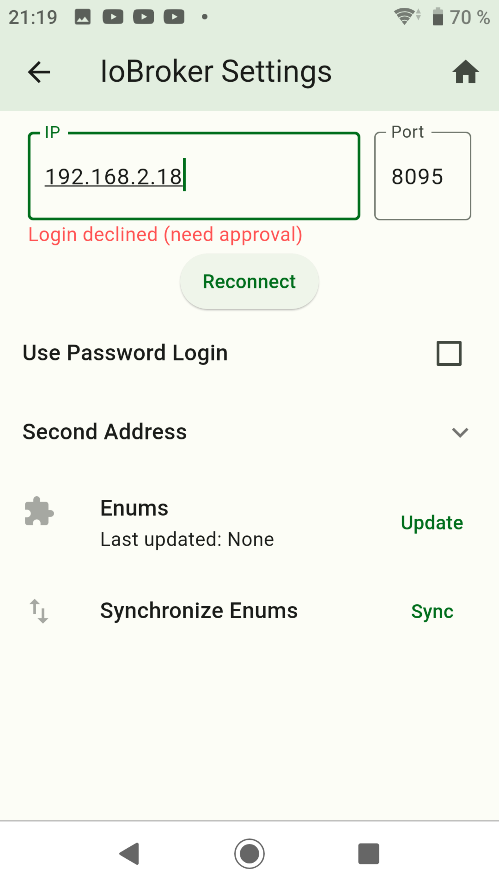

2. Set the state `noPwdAllowed` to true (without the Confirmed checkmark) and then set the `approved` state to true (without the Confirmed checkmark).

3. If everything was implemented correctly then it should look like this.

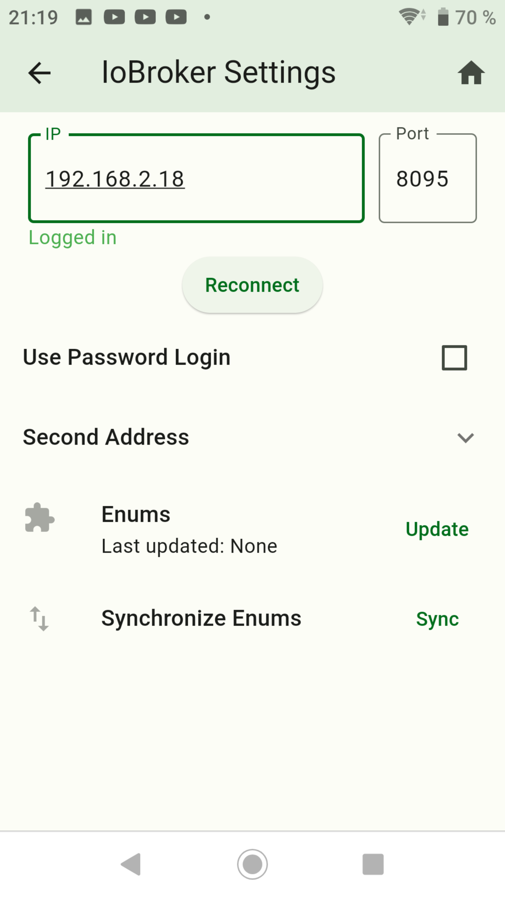

# Important informations

- If you want to block a user, simply set the “approved” state to false.
- A green checkmark now appears at the top left of the view when you are connected.
- If a red WLAN symbol flashes there, then no connection can be established. Either you are not on the same network or the state “approved” is false.

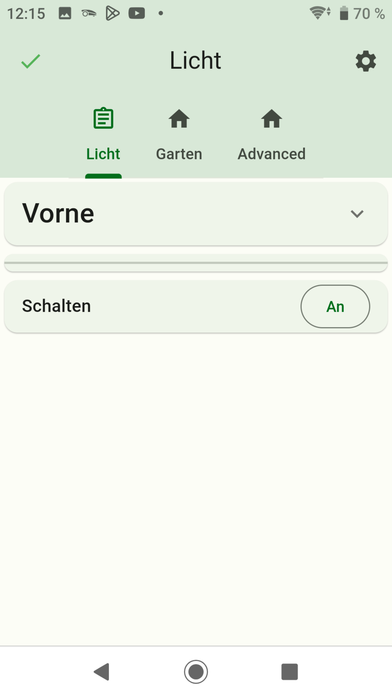
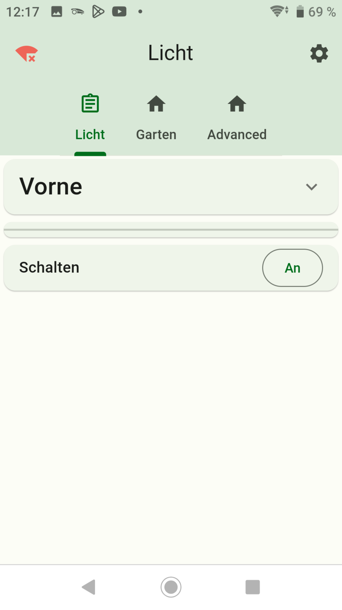

-   [Secure Connection](secureCon.md)
-   [Simple AES encryption](aessecure.md)

-   [Back to Summary](/docs/en/README.md)
-   [Step 1: Installation and APP setup](app.md)
-   [Step 2: Create Enums](enum.md)
-   [Step 3: Create Widgets](widgets.md)
-   [step 4: Create Screens](sreens.md)
-   [Step 5: Create Backups](backups.md)