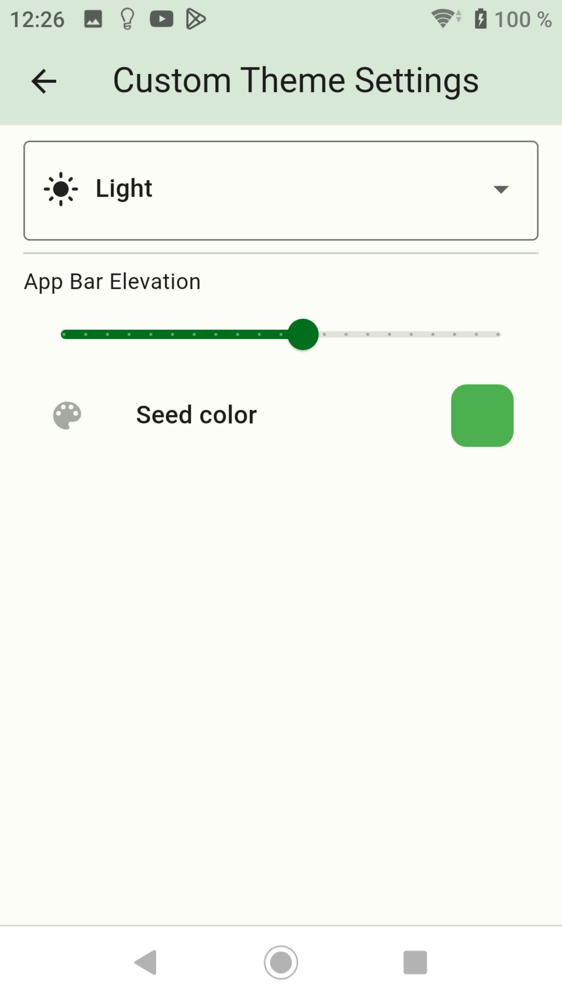
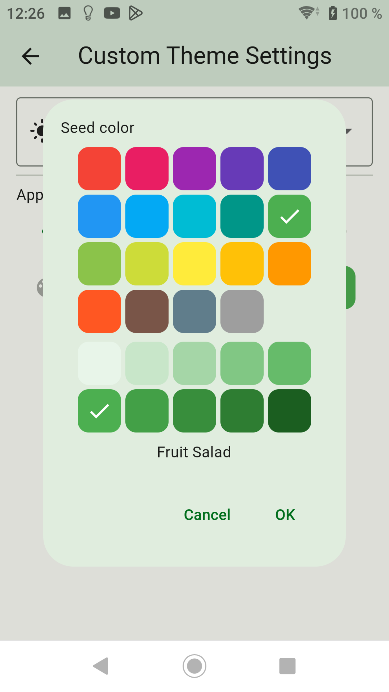

-   [Back to Summary](/docs/en/README.md)
-   [Step 2: Create ENUMS](enum.md)
-   [Step 3: Create Widgets](widgets.md)
-   [Step 4: Create Screens](sreens.md)
-   [Step 5: Create Backups](backups.md)

## Custom settings `Custom Theme Settings`

- Here it is possible to change the color of the header and switch.
- With `App bar Elevation` the height of the header can be determined.
- The font size can be set with `Textscale`.

- Choose your style.

- Seed color: Selects a color.

-   [Back to Summary](/docs/en/README.md)
-   [Step 2: Create ENUMS](enum.md)
-   [Step 3: Create Widgets](widgets.md)
-   [Step 4: Create Screens](sreens.md)
-   [Step 5: Create Backups](backups.md)