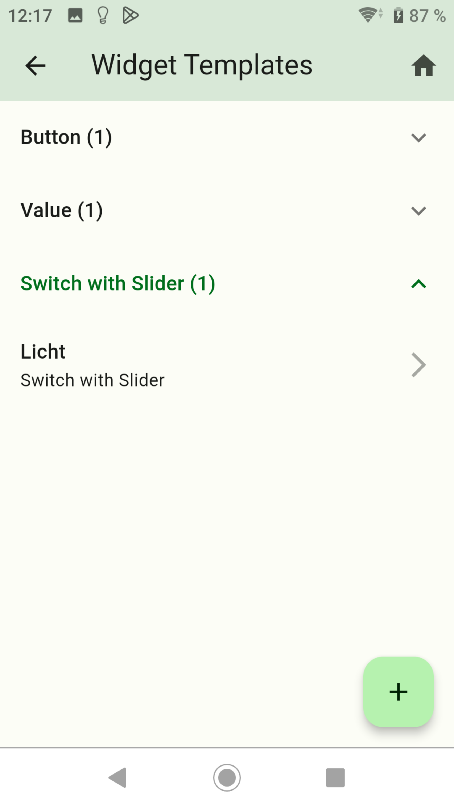
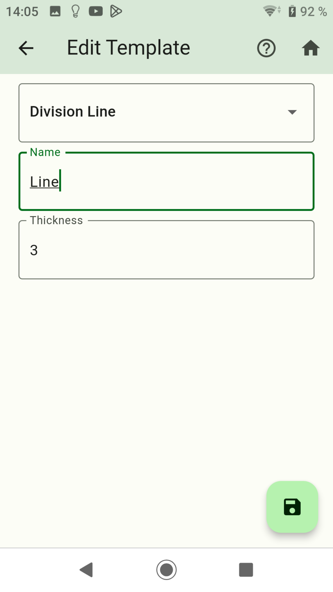
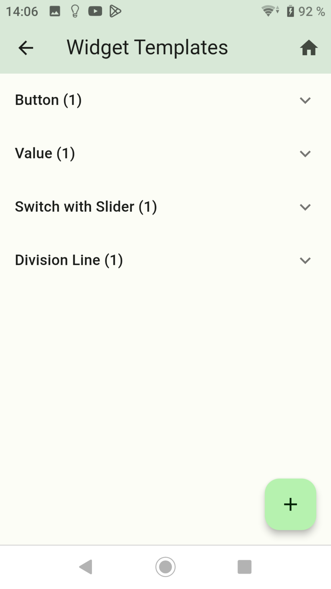
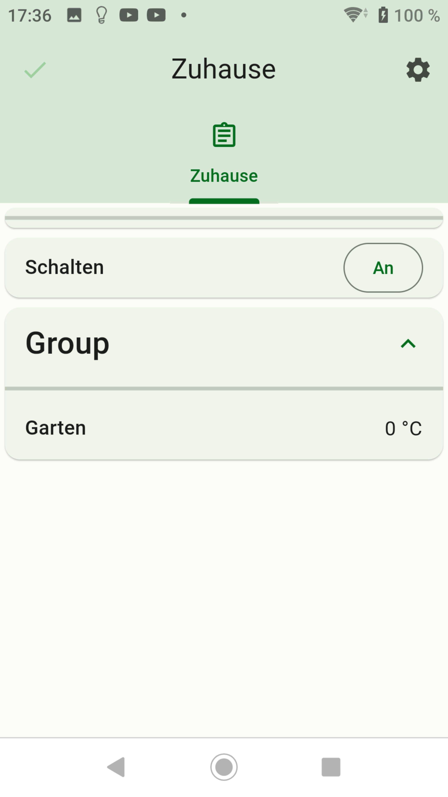

-   [Create Button](button.md)
-   [Create Value](value.md)
-   [Create Advanced](advanced.md)
-   [Create Switch with Slider](switch_w_slider.md)
-   [Create Web View](webview.md)
-   [Create Table](table.md)
-   [Create Graph (only sql Adapter)](graph.md)
-   [Create Color Palette](color.md)
-   [Create Network Media Player](media_player.md)

## Division Line

### Dividers between the widgets

- Swipe left to delete a widget.
- Press the plus sign at the bottom right.

- Dropdown: Select `Division Line`.
- Name: Name of the widget
- Thickness: Specify the thickness.
- The dividing line can only be used once per screen or group.

- Then press save.
- A long press on a widget switches to copy mode. Here you can select widgets from which a copy should be created.

- Now add the widget to a screen.

-   [Create Button](button.md)
-   [Create Value](value.md)
-   [Create Advanced](advanced.md)
-   [Create Switch with Slider](switch_w_slider.md)
-   [Create Web View](webview.md)
-   [Create Table](table.md)
-   [Create Graph (only sql Adapter)](graph.md)
-   [Create Color Palette](color.md)
-   [Create Network Media Player](media_player.md)