-   [Back to Summary](/docs/en/README.md)
-   [Step 1: Installation and APP setup](app.md)
-   [Step 2: Create Enums](enum.md)
-   [Step 3: Create Widgets](widgets.md)
-   [step 4: Create Screens](sreens.md)
-   [Step 5: Create Backups](backups.md)

## Create enums and APP `ioBroker Settings` + `Device Settings`

# Step 1: Create Enums

1. Creates a new enum `job` (all lower case). “Hiob” must be entered under “Name” and “Edit ID”. The other fields are optional.

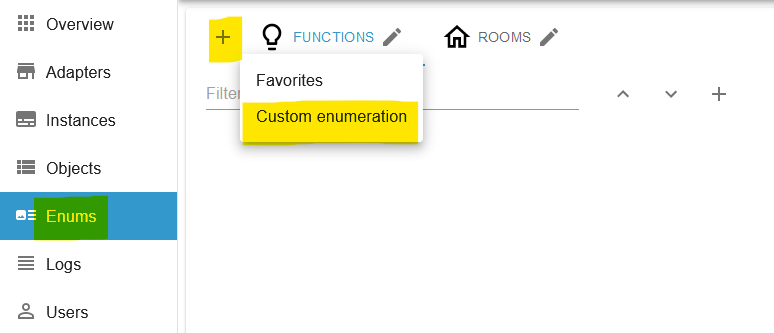
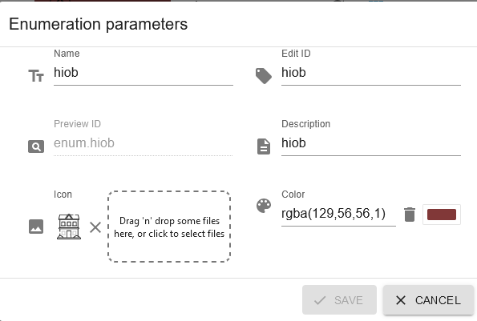

2. Now you can create as many categories as you want under ENMU `hiob`. It would be advantageous to choose categories such as light, sockets or rooms. It is then a little easier to find the desired states in the APP.

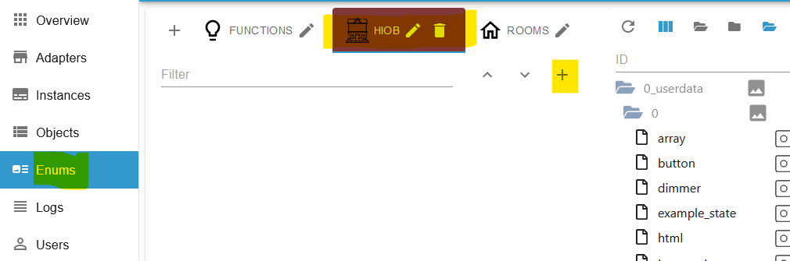

3. It is recommended to create adapter states as `alias`. The adapter `alias-manager` is recommended for this. Then create a new `channel` here and add the states there with the `alias manager`. states under 0_userdata.x or javascript.x do not necessarily have to be created as aliases.

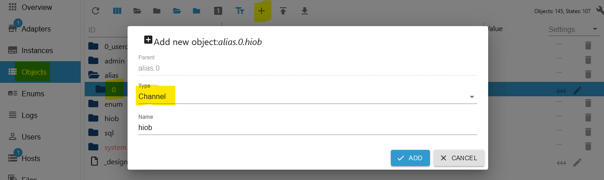

4. Now drag the desired states into the Job lists.

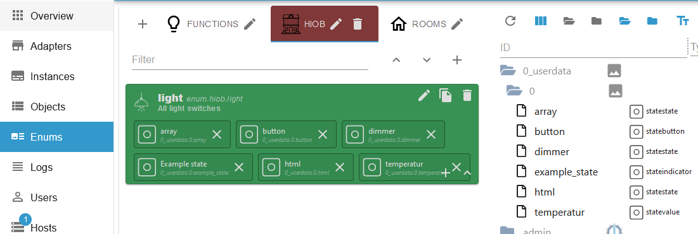

5. Go back to the APP in `ioBroker Settings` and press `Update` and then `Sync`.

6. Now switch to `Device Settings` in the APP. If the categories are displayed in green, then everything worked. If the categories are red, please run `Update` again and then `Sync`.
Categories can be deleted by swiping from right to left. These appear again after `Update` & `Sync`. It is possible to create your own categories and enter new states into them. Of course, these must be available in the ioBroker. However, these will also be deleted after `Update` & `Sync`. Therefore, after the settings/changes, make a backup or create a new backup!!!

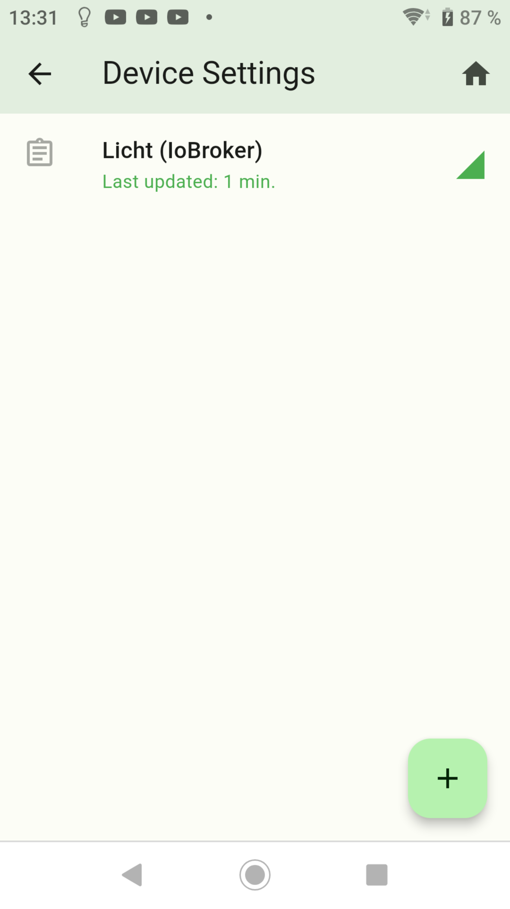
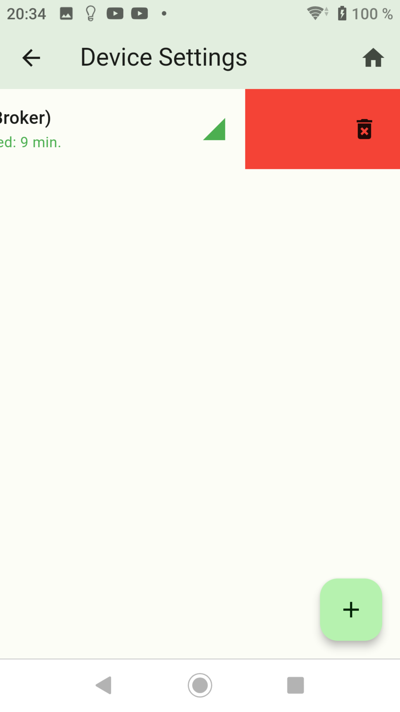

7. You can create a new category by clicking on the + sign. Enter a name here that can be easily assigned.

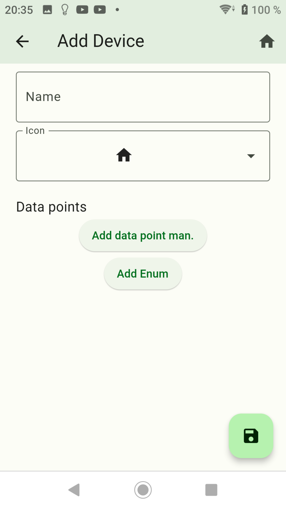

8. New states can be added by pressing `Add data point man.`. The ID must exist in ioBroker. E.g.: Name: Worx Party Mode and ID: worx.0.702470273301009453d9.mower.partyMode. But it would be better to create everything using alias and then assign it to the enums.
Then press save.

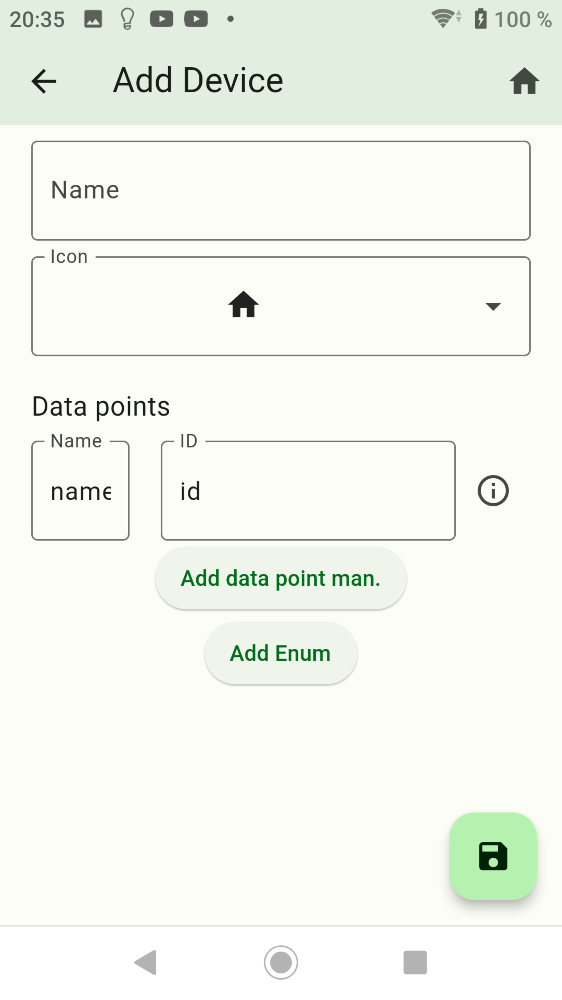

9. Tap on a category to go to the next view. Change the names or IDs here or add new states. States can be deleted by swiping from right to left. `Ignore/Override Devicestatus`: Reachable of the device is ignored

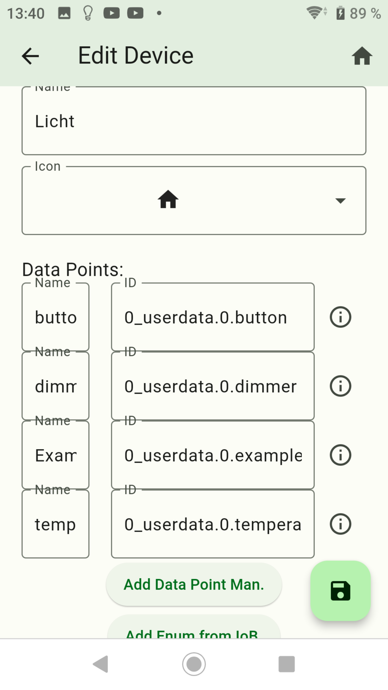
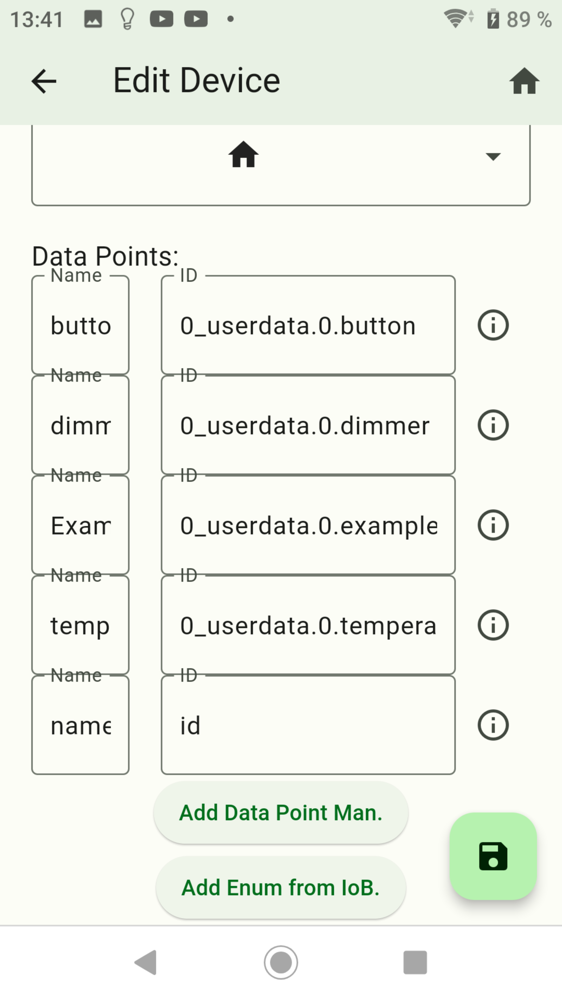
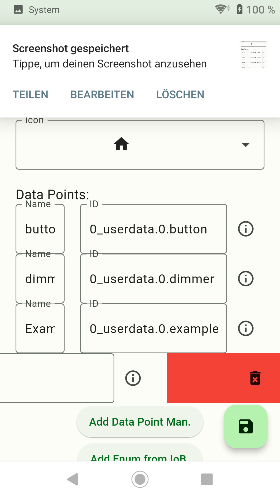

10. By clicking on the 'i', additional information about the data point appears.

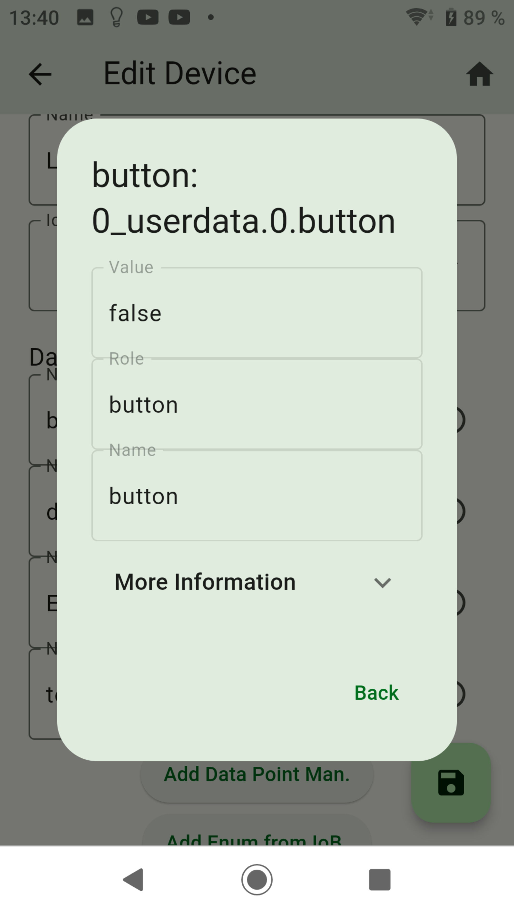

# Add Enum is currently not working!!!

-   [Back to Summary](/docs/en/README.md)
-   [Step 1: Installation and APP setup](app.md)
-   [Step 2: Create Enums](enum.md)
-   [Step 3: Create Widgets](widgets.md)
-   [step 4: Create Screens](sreens.md)
-   [Step 5: Create Backups](backups.md)