-   [Back](/docs/en/example.md)
-   [Import Widgets](#import-widgets-json)
-   [Blockly Script](#blockly-script---javascript-adapter--790)

# ioBroker RAM

### 1.   Import Blockly Script

-   `channelname` Name of the channel under 0_userdata.0
-   `debugging` Enables log output
-   [Blockly Script](#blockly-script---javascript-adapter--790)</br>
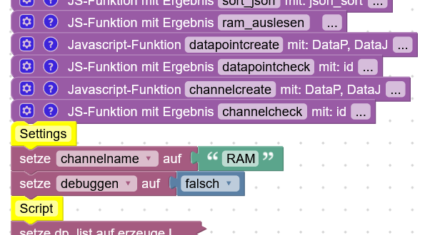

### 2.   Create enum
 -  Create a new enum and add the 6 states</br>
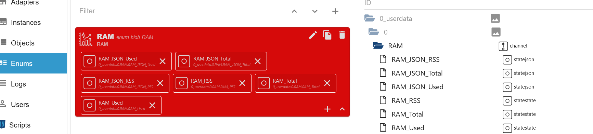

### 3.   Create widgets tables and values

-   **Select Table Widget and state for memRss**

  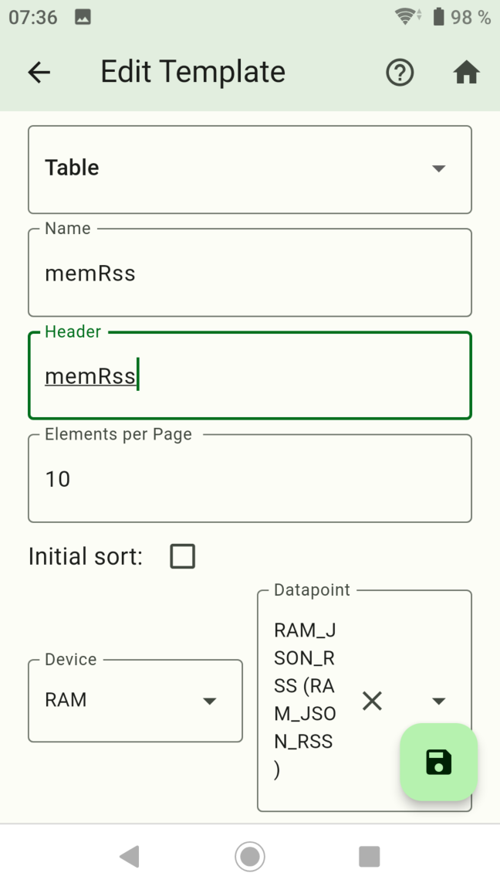

-   **Create columns add**

  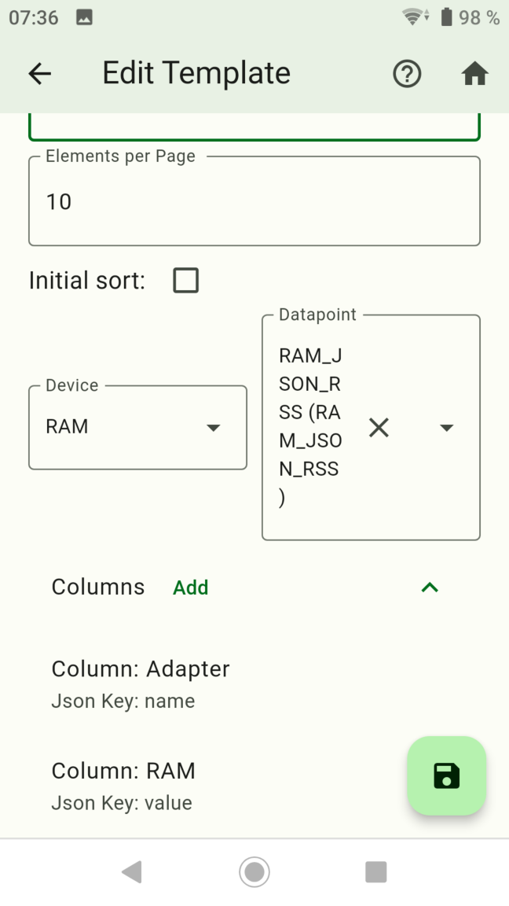

-   **Copy the Table Widget for memTotal and memUsed**

  
  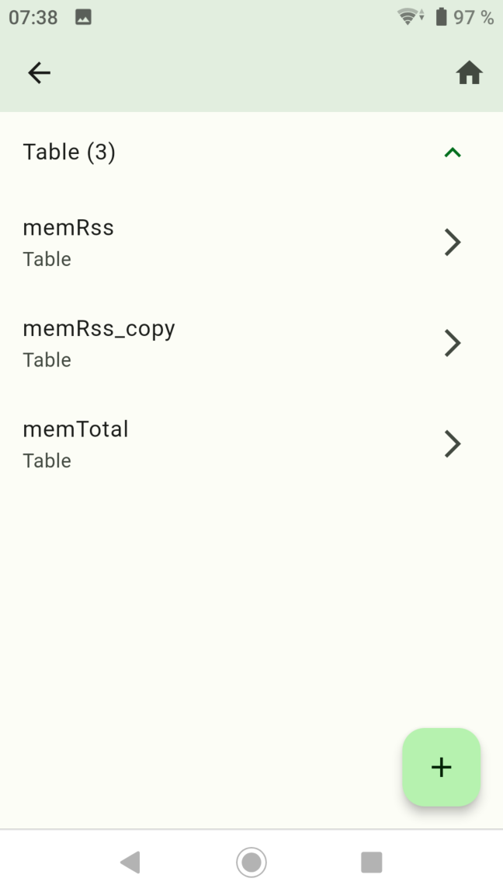

-   **Select Table Widget and state for memTotal**

  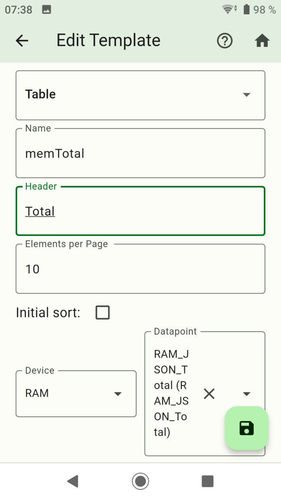

-   **Select Table Widget and state for memUsed**

  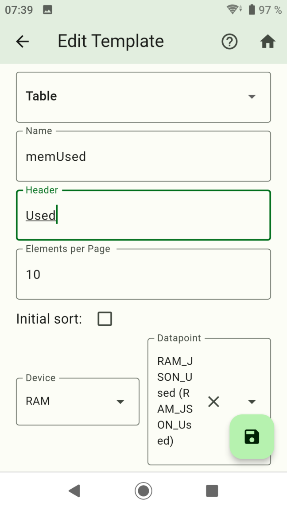

-   **Select Value Widget and state for memRss**

  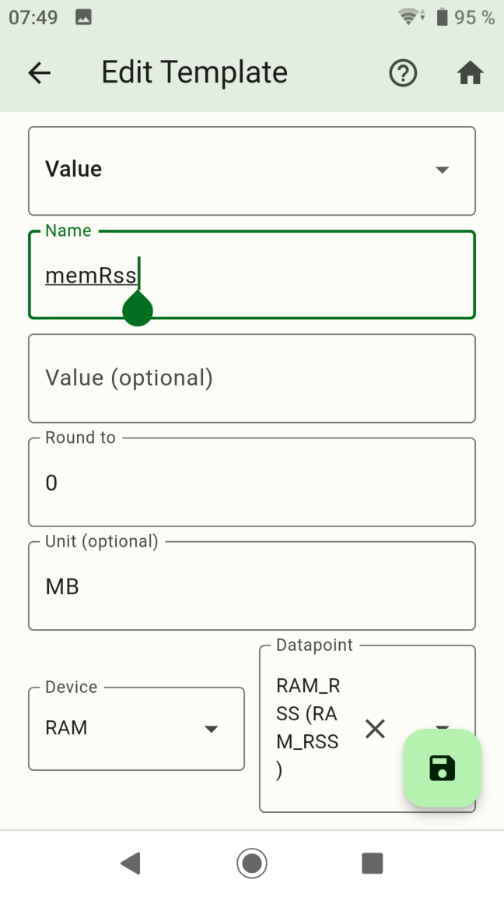

-   **Select Value Widget and state for memTotal**

  

-   **Select Value Widget and state for memUsed**

  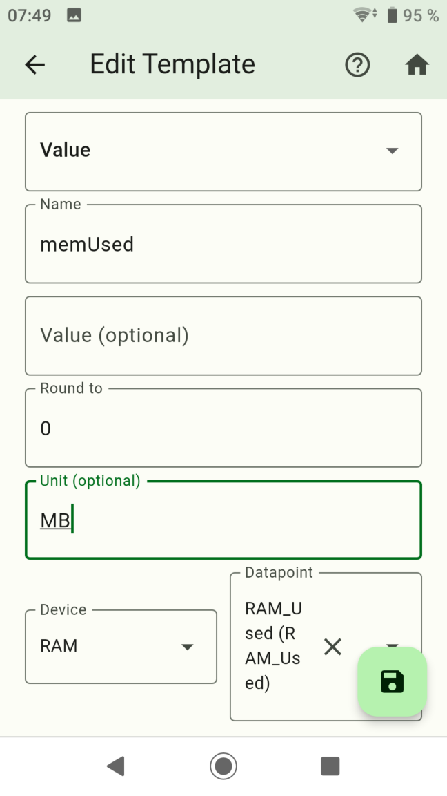

-   **Created widgets**

  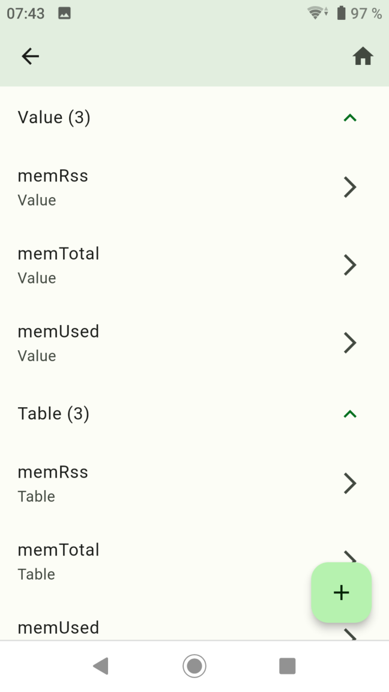

### 4.   Create Screen

-   **Create Screen**

  </br>
  

-   **Add widgets and create 3 groups for memRss, memTotal and memUsed**

  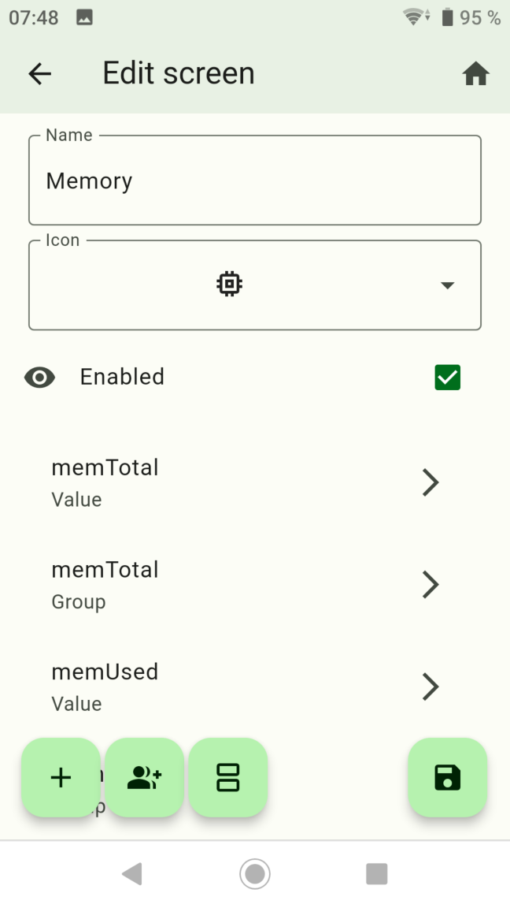

-   **Now add the tables to the respective groups**

  </br>
  </br>
  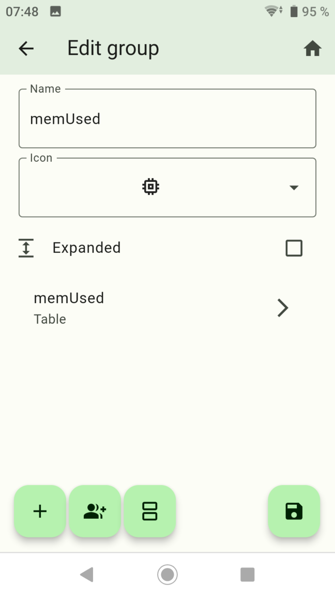

### 5.   Done

  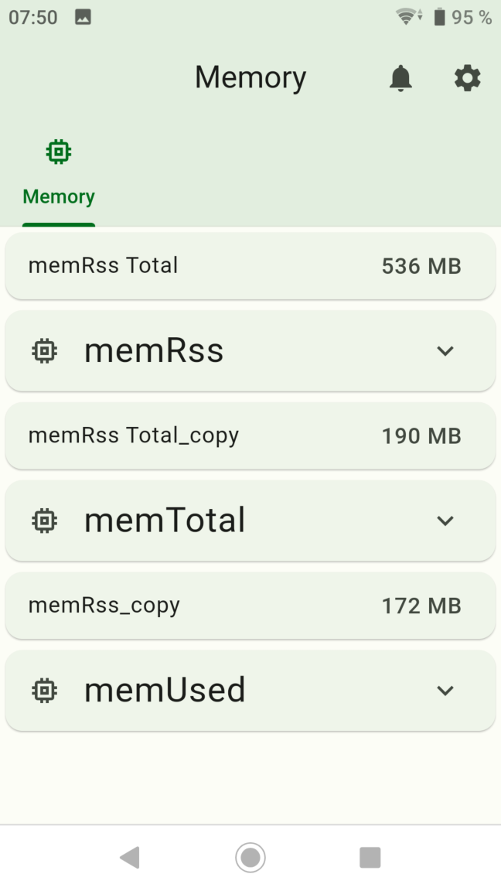</br>
  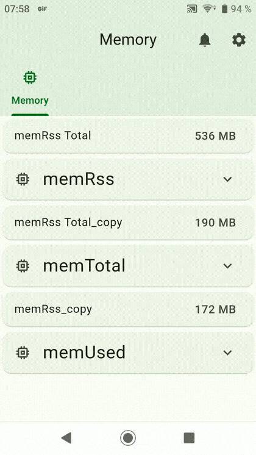

-   [Back](/docs/en/example.md)

# Import Widgets JSON

- `hiob.0.settings.Memory.devices`
```JSON
[
  {
    "id": "GPo2Hksl4kHUAbpO",
    "name": "RAM",
    "iconWrapper": {
      "iconDataType": "flutterIcons",
      "iconDataId": "e318"
    },
    "objectID": "",
    "type": 1,
    "dataPoints": "[{\"id\":\"0_userdata.0.RAM.RAM_JSON_Used\",\"name\":\"RAM_JSON_Used\",\"type\":null,\"role\":\"json\",\"valueType\":null,\"otherDetails\":\"{\\\"name\\\":\\\"RAM_JSON_Used\\\",\\\"id\\\":\\\"0_userdata.0.RAM.RAM_JSON_Used\\\",\\\"role\\\":\\\"json\\\"}\"},{\"id\":\"0_userdata.0.RAM.RAM_JSON_Total\",\"name\":\"RAM_JSON_Total\",\"type\":null,\"role\":\"json\",\"valueType\":null,\"otherDetails\":\"{\\\"name\\\":\\\"RAM_JSON_Total\\\",\\\"id\\\":\\\"0_userdata.0.RAM.RAM_JSON_Total\\\",\\\"role\\\":\\\"json\\\"}\"},{\"id\":\"0_userdata.0.RAM.RAM_JSON_RSS\",\"name\":\"RAM_JSON_RSS\",\"type\":null,\"role\":\"json\",\"valueType\":null,\"otherDetails\":\"{\\\"name\\\":\\\"RAM_JSON_RSS\\\",\\\"id\\\":\\\"0_userdata.0.RAM.RAM_JSON_RSS\\\",\\\"role\\\":\\\"json\\\"}\"},{\"id\":\"0_userdata.0.RAM.RAM_RSS\",\"name\":\"RAM_RSS\",\"type\":null,\"role\":\"state\",\"valueType\":null,\"otherDetails\":\"{\\\"name\\\":\\\"RAM_RSS\\\",\\\"id\\\":\\\"0_userdata.0.RAM.RAM_RSS\\\",\\\"role\\\":\\\"state\\\"}\"},{\"id\":\"0_userdata.0.RAM.RAM_Total\",\"name\":\"RAM_Total\",\"type\":null,\"role\":\"state\",\"valueType\":null,\"otherDetails\":\"{\\\"name\\\":\\\"RAM_Total\\\",\\\"id\\\":\\\"0_userdata.0.RAM.RAM_Total\\\",\\\"role\\\":\\\"state\\\"}\"},{\"id\":\"0_userdata.0.RAM.RAM_Used\",\"name\":\"RAM_Used\",\"type\":null,\"role\":\"state\",\"valueType\":null,\"otherDetails\":\"{\\\"name\\\":\\\"RAM_Used\\\",\\\"id\\\":\\\"0_userdata.0.RAM.RAM_Used\\\",\\\"role\\\":\\\"state\\\"}\"}]"
  }
]
```

- `hiob.0.settings.Log.screens`
```JSON
[
  {
    "id": "l4PZ5y2s9B9mx5DSpsA1",
    "name": "Memory",
    "iconWrapper": {
      "iconDataType": "flutterIcons",
      "iconDataId": "e3db"
    },
    "index": 1,
    "enabled": true,
    "widgetIds": [
      {
        "widget": "memRss",
        "id": "kfRePJiR6xDXdrl5QxRz7POIOp2mwQ=="
      },
      {
        "name": "memRss",
        "isExtended": false,
        "iconWrapper": {
          "iconDataType": "flutterIcons",
          "iconDataId": "e3db"
        },
        "templates": [
          {
            "widget": "memRss",
            "id": "FrdmkW-z2TGx4jy_IJlJn0V3y70DJQ=="
          }
        ]
      },
      {
        "widget": "memTotal",
        "id": "JN7tVeBgb951cyLH"
      },
      {
        "name": "memTotal",
        "isExtended": false,
        "iconWrapper": {
          "iconDataType": "flutterIcons",
          "iconDataId": "e3db"
        },
        "templates": [
          {
            "widget": "memTotal",
            "id": "y0P7fM-Ur445p9yG"
          }
        ]
      },
      {
        "widget": "memUsed",
        "id": "2fkeB4cUPtbtXCK_"
      },
      {
        "name": "memUsed",
        "isExtended": false,
        "iconWrapper": {
          "iconDataType": "flutterIcons",
          "iconDataId": "e3db"
        },
        "templates": [
          {
            "widget": "memUsed",
            "id": "8KVNu6WUWofzFQZG"
          }
        ]
      }
    ]
  }
]
```

- `hiob.0.settings.Log.widgets`
```JSON
[
  {
    "id": "kfRePJiR6xDXdrl5QxRz7POIOp2mwQ==",
    "name": "memRss",
    "widget": {
      "type": "CustomWidgetType.simpleValue",
      "device": "GPo2Hksl4kHUAbpO",
      "dataPoint": "0_userdata.0.RAM.RAM_RSS",
      "round": 0,
      "name": "memRss Total",
      "value": null,
      "unit": "MB"
    }
  },
  {
    "id": "JN7tVeBgb951cyLH",
    "name": "memTotal",
    "widget": {
      "type": "CustomWidgetType.simpleValue",
      "device": "GPo2Hksl4kHUAbpO",
      "dataPoint": "0_userdata.0.RAM.RAM_Total",
      "round": 0,
      "name": "memRss Total_copy",
      "value": null,
      "unit": "MB"
    }
  },
  {
    "id": "2fkeB4cUPtbtXCK_",
    "name": "memUsed",
    "widget": {
      "type": "CustomWidgetType.simpleValue",
      "device": "GPo2Hksl4kHUAbpO",
      "dataPoint": "0_userdata.0.RAM.RAM_Used",
      "round": 0,
      "name": "memRss_copy",
      "value": null,
      "unit": "MB"
    }
  },
  {
    "id": "FrdmkW-z2TGx4jy_IJlJn0V3y70DJQ==",
    "name": "memRss",
    "widget": {
      "type": "CustomWidgetType.table",
      "name": "memRss",
      "header": "memRss",
      "sortAsc": true,
      "initialSortColumn": 1,
      "initialSortEnabled": false,
      "elementsPerPage": 10,
      "dataPoint": "0_userdata.0.RAM.RAM_JSON_RSS",
      "columns": {
        "name": "Adapter",
        "value": "RAM"
      }
    }
  },
  {
    "id": "y0P7fM-Ur445p9yG",
    "name": "memTotal",
    "widget": {
      "type": "CustomWidgetType.table",
      "name": "memRss_copy",
      "header": "Total",
      "sortAsc": true,
      "initialSortColumn": 1,
      "initialSortEnabled": false,
      "elementsPerPage": 10,
      "dataPoint": "0_userdata.0.RAM.RAM_JSON_Total",
      "columns": {
        "name": "Adapter",
        "value": "RAM"
      }
    }
  },
  {
    "id": "8KVNu6WUWofzFQZG",
    "name": "memUsed",
    "widget": {
      "type": "CustomWidgetType.table",
      "name": "memRss_copy",
      "header": "Used",
      "sortAsc": true,
      "initialSortColumn": 1,
      "initialSortEnabled": false,
      "elementsPerPage": 10,
      "dataPoint": "0_userdata.0.RAM.RAM_JSON_Used",
      "columns": {
        "name": "Adapter",
        "value": "RAM"
      }
    }
  }
]
```

-   [Back](/docs/en/example.md)

# Blockly Script - Javascript Adapter >= 7.9.0
```BLOCKLY
<xml xmlns="https://developers.google.com/blockly/xml">
  <variables>
    <variable id="6%7Ql:MTJ|V-u4vlBL{9">json_sort</variable>
    <variable id="K,F@7o]a,1yc{W4Pz2X[">DataP</variable>
    <variable id="JcvirzSt4Zydn]^O4VO#">DataJ</variable>
    <variable id="J9#xnj]T_`pv_T8Z3j4P">id</variable>
    <variable id="^$e!?JpvIt1Qh-]SBl!@">channelname</variable>
    <variable id="N){4B$~4B!QQ.f5r#d9h">debuggen</variable>
    <variable id="af^@dssmAq1jNyizijon">dp_list</variable>
    <variable id="Yj^RJZlb.cQ?v/a[DJ!+">dp_total</variable>
    <variable id="feWY|[]2-+xb@bgF]y;*">ram_liste</variable>
    <variable id="vTnQ:rC$.hKAV3ipMSzt">single_count</variable>
    <variable id="^W]6r43(MZaBmct*Ff1w">j</variable>
    <variable id="?|j2Rh`MMKDYz(naM#1e">ram_gesamt</variable>
    <variable id="2|@n5yDEJpVt~^,IL;n8">isEven</variable>
    <variable id="vu`NhW`#?$9Prcit1i2n">ram_array</variable>
    <variable id="_lH)Cld2.ZoFAvo;ME(R">dp</variable>
    <variable id="Q:!.%Nw?OrB(L/-~xc:`">value_dp</variable>
  </variables>
  <block type="procedures_defcustomreturn" id=".pWuWVjsjLghIQ)@6_*W" x="-262" y="-312">
    <mutation statements="false">
      <arg name="json_sort" varid="6%7Ql:MTJ|V-u4vlBL{9"></arg>
    </mutation>
    <field name="NAME">sort_json</field>
    <field name="SCRIPT">anNvbl9zb3J0LnNvcnQoKGEsIGIpID0+IHsNCiAgICAvL3JldHVybiBhLnNvcnQubG9jYWxlQ29tcGFyZShiLnNvcnQpOw0KICAgIHJldHVybiBiLnNvcnQgLSBhLnNvcnQ7DQp9KTsNCmZvciAoY29uc3QgYSBvZiBqc29uX3NvcnQpIHsNCiAgICBkZWxldGUgYS5zb3J0Ow0KfQ0KcmV0dXJuIEpTT04uc3RyaW5naWZ5KGpzb25fc29ydCk7</field>
    <comment pinned="false" h="80" w="160">Beschreibe diese Funktion …</comment>
  </block>
  <block type="procedures_defcustomreturn" id="RrbU@IRVsJx=$CqT}yF`" x="-262" y="-287">
    <mutation statements="false"></mutation>
    <field name="NAME">ram_auslesen</field>
    <field name="SCRIPT">dmFyIHJzcz1bXTsNCnZhciB1c2VkPVtdOw0KdmFyIHRvdGFsPVtdOw0KJCgic3lzdGVtLioiKS5lYWNoKGZ1bmN0aW9uIChpZCwgaSkgew0KLy9jb25zb2xlLmxvZyhpZCk7DQogICAgY29uc3Qgc2Vjc3BsaXQgID0gaWQuc3BsaXQoIi4iKVsyXTsNCiAgICBjb25zdCBiZWhzcGxpdCAgPSBpZC5zcGxpdCgnLicpW2lkLnNwbGl0KCcuJykubGVuZ3RoLTJdOw0KICAgIGlmIChpZC5pbmNsdWRlcygiLm1lbVJzcyIpKSB7DQogICAgICAgIHJzcy5wdXNoKGlkKTsNCiAgICAgICAgcnNzLnB1c2goYmVoc3BsaXQgKyAnLicgKyBzZWNzcGxpdCk7DQogICAgfQ0KICAgIGlmIChpZC5pbmNsdWRlcygiLm1lbUhlYXBVc2VkIikpIHsNCiAgICAgICAgdXNlZC5wdXNoKGlkKTsNCiAgICAgICAgdXNlZC5wdXNoKGJlaHNwbGl0ICsgJy4nICsgc2Vjc3BsaXQpOw0KICAgIH0NCiAgICBpZiAoaWQuaW5jbHVkZXMoIi5tZW1IZWFwVG90YWwiKSkgew0KICAgICAgICB0b3RhbC5wdXNoKGlkKTsNCiAgICAgICAgdG90YWwucHVzaChiZWhzcGxpdCArICcuJyArIHNlY3NwbGl0KTsNCiAgICB9DQp9KTsNCnJldHVybiBbcnNzLCB1c2VkLCB0b3RhbF07DQoNCg==</field>
    <comment pinned="false" h="80" w="160">Beschreibe diese Funktion …</comment>
  </block>
  <block type="procedures_defcustomnoreturn" id="-Sg^:tBR!;/FL|3na~kR" x="-262" y="-262">
    <mutation statements="false">
      <arg name="DataP" varid="K,F@7o]a,1yc{W4Pz2X["></arg>
      <arg name="DataJ" varid="JcvirzSt4Zydn]^O4VO#"></arg>
    </mutation>
    <field name="NAME">datapointcreate</field>
    <field name="SCRIPT">Y3JlYXRlU3RhdGUoRGF0YVAsIERhdGFKKTs=</field>
    <comment pinned="false" h="80" w="160">Beschreibe diese Funktion …</comment>
  </block>
  <block type="procedures_defcustomreturn" id="$KR-X@{G/.vido.W$31-" x="-262" y="-237">
    <mutation statements="false">
      <arg name="id" varid="J9#xnj]T_`pv_T8Z3j4P"></arg>
    </mutation>
    <field name="NAME">datapointcheck</field>
    <field name="SCRIPT">cmV0dXJuICEhJChpZCkubGVuZ3RoOw==</field>
    <comment pinned="false" h="80" w="160">Beschreibe diese Funktion …</comment>
  </block>
  <block type="procedures_defcustomnoreturn" id="+ue@:52nyF+%!hz+K:]Y" x="-262" y="-212">
    <mutation statements="false">
      <arg name="DataP" varid="K,F@7o]a,1yc{W4Pz2X["></arg>
      <arg name="DataJ" varid="JcvirzSt4Zydn]^O4VO#"></arg>
    </mutation>
    <field name="NAME">channelcreate</field>
    <field name="SCRIPT">c2V0T2JqZWN0KERhdGFQLCBEYXRhSik7IA==</field>
    <comment pinned="false" h="80" w="160">Beschreibe diese Funktion …</comment>
  </block>
  <block type="procedures_defcustomreturn" id="TPDWEp-dsh~Q5^kj{b@(" x="-262" y="-187">
    <mutation statements="false">
      <arg name="id" varid="J9#xnj]T_`pv_T8Z3j4P"></arg>
    </mutation>
    <field name="NAME">channelcheck</field>
    <field name="SCRIPT">Y29uc3Qgb2JqID0gYXdhaXQgZXhpc3RzT2JqZWN0QXN5bmMoaWQpOw0KcmV0dXJuIG9iajs=</field>
    <comment pinned="false" h="80" w="160">Beschreibe diese Funktion …</comment>
  </block>
  <block type="comment" id=",M%Cwz|7-UYN9MoVRte8" x="-262" y="-162">
    <field name="COMMENT">Settings</field>
    <next>
      <block type="variables_set" id="J)V^=yvsk@g@dHWm/^^T">
        <field name="VAR" id="^$e!?JpvIt1Qh-]SBl!@">channelname</field>
        <value name="VALUE">
          <block type="text" id="Wm3O9$yR2JkaGeF})xKr">
            <field name="TEXT">RAM</field>
          </block>
        </value>
        <next>
          <block type="variables_set" id="J!^e|%*c3v8`,gneFsU}">
            <field name="VAR" id="N){4B$~4B!QQ.f5r#d9h">debuggen</field>
            <value name="VALUE">
              <block type="logic_boolean" id="NoB7J3K-HY!3My@$q;k3">
                <field name="BOOL">FALSE</field>
              </block>
            </value>
            <next>
              <block type="comment" id="R!{-t.tBg{T6~B@#Qr9a">
                <field name="COMMENT">Script</field>
                <next>
                  <block type="variables_set" id="AFYiERj70l[${ab[,[vo" collapsed="true">
                    <field name="VAR" id="af^@dssmAq1jNyizijon">dp_list</field>
                    <value name="VALUE">
                      <block type="lists_create_with" id="((?kFl;Q/MpqUK3^T6ps">
                        <mutation items="3"></mutation>
                        <value name="ADD0">
                          <block type="text_join" id="T(#}b/,s.b20SvSnqit@">
                            <mutation items="3"></mutation>
                            <value name="ADD0">
                              <block type="text" id="_lFj;qq!`.s9RKkF[[`;">
                                <field name="TEXT">0_userdata.0.</field>
                              </block>
                            </value>
                            <value name="ADD1">
                              <block type="variables_get" id="=3!p1S{08PLaGUBQx5Zd">
                                <field name="VAR" id="^$e!?JpvIt1Qh-]SBl!@">channelname</field>
                              </block>
                            </value>
                            <value name="ADD2">
                              <block type="text" id=":(EKk^~*,`%)XM0h7aY/">
                                <field name="TEXT">.RAM_JSON_RSS</field>
                              </block>
                            </value>
                          </block>
                        </value>
                        <value name="ADD1">
                          <block type="text_join" id="AMvl,(UU(I34RpQjDikw">
                            <mutation items="3"></mutation>
                            <value name="ADD0">
                              <block type="text" id="0LGuhHU5$]rYyNe:VtT3">
                                <field name="TEXT">0_userdata.0.</field>
                              </block>
                            </value>
                            <value name="ADD1">
                              <block type="variables_get" id="bLeNK#;kv3E)O%z}nz1G">
                                <field name="VAR" id="^$e!?JpvIt1Qh-]SBl!@">channelname</field>
                              </block>
                            </value>
                            <value name="ADD2">
                              <block type="text" id="e3U){EQ~`mTb`,veq1VG">
                                <field name="TEXT">.RAM_JSON_Used</field>
                              </block>
                            </value>
                          </block>
                        </value>
                        <value name="ADD2">
                          <block type="text_join" id=".Cr-aOQgK-;)o@d2@rnE">
                            <mutation items="3"></mutation>
                            <value name="ADD0">
                              <block type="text" id="HFoLOq^)yX7Zbx4cCzXI">
                                <field name="TEXT">0_userdata.0.</field>
                              </block>
                            </value>
                            <value name="ADD1">
                              <block type="variables_get" id="Io9vXEu+9^5K4iX4`:EW">
                                <field name="VAR" id="^$e!?JpvIt1Qh-]SBl!@">channelname</field>
                              </block>
                            </value>
                            <value name="ADD2">
                              <block type="text" id="[h=jZ;NM0Dq/lPdfnR@S">
                                <field name="TEXT">.RAM_JSON_Total</field>
                              </block>
                            </value>
                          </block>
                        </value>
                      </block>
                    </value>
                    <next>
                      <block type="variables_set" id="s01qy)o4*`;GDj/#ZkeI" collapsed="true">
                        <field name="VAR" id="Yj^RJZlb.cQ?v/a[DJ!+">dp_total</field>
                        <value name="VALUE">
                          <block type="lists_create_with" id="U|K!S%@SAcDRv82X{KmM">
                            <mutation items="3"></mutation>
                            <value name="ADD0">
                              <block type="text_join" id=".lDFNh@`Bb?|OKF0q_(1">
                                <mutation items="3"></mutation>
                                <value name="ADD0">
                                  <block type="text" id=":kK_|qOlB8=jt/3V@~5n">
                                    <field name="TEXT">0_userdata.0.</field>
                                  </block>
                                </value>
                                <value name="ADD1">
                                  <block type="variables_get" id="!rz#F2(r|?l2sq#lr@s5">
                                    <field name="VAR" id="^$e!?JpvIt1Qh-]SBl!@">channelname</field>
                                  </block>
                                </value>
                                <value name="ADD2">
                                  <block type="text" id="*4#db9Kl1?QqwJrk6fqd">
                                    <field name="TEXT">.RAM_RSS</field>
                                  </block>
                                </value>
                              </block>
                            </value>
                            <value name="ADD1">
                              <block type="text_join" id="DUr65bNEQof:J+U#k$,p">
                                <mutation items="3"></mutation>
                                <value name="ADD0">
                                  <block type="text" id="PfeZ({T4dNbI1RpE}bwE">
                                    <field name="TEXT">0_userdata.0.</field>
                                  </block>
                                </value>
                                <value name="ADD1">
                                  <block type="variables_get" id="@QR]mo9J0QkBGn[Ht[Vo">
                                    <field name="VAR" id="^$e!?JpvIt1Qh-]SBl!@">channelname</field>
                                  </block>
                                </value>
                                <value name="ADD2">
                                  <block type="text" id="_@5W#;oZ}a]H#TiF0}5C">
                                    <field name="TEXT">.RAM_Used</field>
                                  </block>
                                </value>
                              </block>
                            </value>
                            <value name="ADD2">
                              <block type="text_join" id="r^dN_)6l1{WZ$_dB5A%L">
                                <mutation items="3"></mutation>
                                <value name="ADD0">
                                  <block type="text" id="Q}XNH()81+NN2RFopo%J">
                                    <field name="TEXT">0_userdata.0.</field>
                                  </block>
                                </value>
                                <value name="ADD1">
                                  <block type="variables_get" id="IC5i[e~:k9U,j2}nI*}@">
                                    <field name="VAR" id="^$e!?JpvIt1Qh-]SBl!@">channelname</field>
                                  </block>
                                </value>
                                <value name="ADD2">
                                  <block type="text" id="SUH{y%2x9R?7W@uiHY#d">
                                    <field name="TEXT">.RAM_Total</field>
                                  </block>
                                </value>
                              </block>
                            </value>
                          </block>
                        </value>
                        <next>
                          <block type="controls_if" id="Y`aH;7xr6%Lb=X^X(x}." collapsed="true">
                            <value name="IF0">
                              <block type="logic_negate" id="O3A9n(6zlW53@Stf}mmx">
                                <value name="BOOL">
                                  <block type="procedures_callcustomreturn" id="j9l:xIOu%e.AN{R6_x!H">
                                    <mutation name="channelcheck">
                                      <arg name="id"></arg>
                                    </mutation>
                                    <value name="ARG0">
                                      <block type="text_join" id="dw:Y1uT3k20JYWH/Z%cy">
                                        <mutation items="2"></mutation>
                                        <value name="ADD0">
                                          <block type="text" id="pVh(!7$!i68,1W2uE=GQ">
                                            <field name="TEXT">0_userdata.0.</field>
                                          </block>
                                        </value>
                                        <value name="ADD1">
                                          <block type="variables_get" id="P~2av2k`dIa!QEnrP;p%">
                                            <field name="VAR" id="^$e!?JpvIt1Qh-]SBl!@">channelname</field>
                                          </block>
                                        </value>
                                      </block>
                                    </value>
                                  </block>
                                </value>
                              </block>
                            </value>
                            <statement name="DO0">
                              <block type="controls_if" id="=,lJl=J[.**OOeF4{p,=">
                                <value name="IF0">
                                  <block type="variables_get" id="Pz^R)NB,3G#,!6|S=o;}">
                                    <field name="VAR" id="N){4B$~4B!QQ.f5r#d9h">debuggen</field>
                                  </block>
                                </value>
                                <statement name="DO0">
                                  <block type="debug" id="skaXT$+MMbp4Bdq;zxs.">
                                    <field name="Severity">log</field>
                                    <value name="TEXT">
                                      <shadow type="text" id="iv4_bT9x=W%XrvPzZch)">
                                        <field name="TEXT">text</field>
                                      </shadow>
                                      <block type="text_join" id="G**Okel*K0/hB/7@oYYD">
                                        <mutation items="3"></mutation>
                                        <value name="ADD0">
                                          <block type="text" id="7BI[b0],Wr9pYP:Oyud=">
                                            <field name="TEXT">Channel 0_userdata.0.</field>
                                          </block>
                                        </value>
                                        <value name="ADD1">
                                          <block type="variables_get" id="nClD|*RDt#)%fUe2HG4G">
                                            <field name="VAR" id="^$e!?JpvIt1Qh-]SBl!@">channelname</field>
                                          </block>
                                        </value>
                                        <value name="ADD2">
                                          <block type="text" id="jj$p1}lJ}YQ6ld5K{TH;">
                                            <field name="TEXT"> wird erstellt!</field>
                                          </block>
                                        </value>
                                      </block>
                                    </value>
                                  </block>
                                </statement>
                                <next>
                                  <block type="procedures_callcustomnoreturn" id="A#+-vRDkW]V[}x/Z].@6">
                                    <mutation name="channelcreate">
                                      <arg name="DataP"></arg>
                                      <arg name="DataJ"></arg>
                                    </mutation>
                                    <value name="ARG0">
                                      <block type="text_join" id="koGr!ieTD+4U,)ZUl{Ix">
                                        <mutation items="2"></mutation>
                                        <value name="ADD0">
                                          <block type="text" id="#*N-%YTdYt8@0d#[|a#:">
                                            <field name="TEXT">0_userdata.0.</field>
                                          </block>
                                        </value>
                                        <value name="ADD1">
                                          <block type="variables_get" id="/BZSdZD#TVd7KvWxK1S^">
                                            <field name="VAR" id="^$e!?JpvIt1Qh-]SBl!@">channelname</field>
                                          </block>
                                        </value>
                                      </block>
                                    </value>
                                    <value name="ARG1">
                                      <block type="convert_json2object" id="~X?Wc4)pe2d`UuoO$77-">
                                        <value name="VALUE">
                                          <block type="text" id="mM[5lk.FjT2CUBbO?lq*">
                                            <field name="TEXT">{"type": "channel", "common": {"name": "RAM"}}</field>
                                          </block>
                                        </value>
                                      </block>
                                    </value>
                                  </block>
                                </next>
                              </block>
                            </statement>
                            <next>
                              <block type="controls_if" id="lz,[F33j2|34}U6qGnnk" collapsed="true">
                                <value name="IF0">
                                  <block type="logic_compare" id="m_:K5|nJkBGgmKt9,@-0">
                                    <field name="OP">EQ</field>
                                    <value name="A">
                                      <block type="procedures_callcustomreturn" id="?`Jn^gLrMjoA`J.~?edB">
                                        <mutation name="datapointcheck">
                                          <arg name="id"></arg>
                                        </mutation>
                                        <value name="ARG0">
                                          <block type="text_join" id="6ObTQbFkfapF;=xNP$~N">
                                            <mutation items="3"></mutation>
                                            <value name="ADD0">
                                              <block type="text" id="waGEU;fCM=dsbw$$[|4t">
                                                <field name="TEXT">0_userdata.0.</field>
                                              </block>
                                            </value>
                                            <value name="ADD1">
                                              <block type="variables_get" id="m9LTt?u[Je)w7e0#T3,M">
                                                <field name="VAR" id="^$e!?JpvIt1Qh-]SBl!@">channelname</field>
                                              </block>
                                            </value>
                                            <value name="ADD2">
                                              <block type="text" id="]LQ18M8CF#kaZ#L|P?^v">
                                                <field name="TEXT">.RAM_JSON_RSS</field>
                                              </block>
                                            </value>
                                          </block>
                                        </value>
                                      </block>
                                    </value>
                                    <value name="B">
                                      <block type="logic_boolean" id="!iuU-^+#uw{|L$XC+j.x">
                                        <field name="BOOL">FALSE</field>
                                      </block>
                                    </value>
                                  </block>
                                </value>
                                <statement name="DO0">
                                  <block type="controls_if" id="54/5KfE0UbPOAhF!H2pd">
                                    <value name="IF0">
                                      <block type="variables_get" id="xL51Ln-!o;c/NNncNADL">
                                        <field name="VAR" id="N){4B$~4B!QQ.f5r#d9h">debuggen</field>
                                      </block>
                                    </value>
                                    <statement name="DO0">
                                      <block type="debug" id="O00{mFJlK3Zq[D~$jva*">
                                        <field name="Severity">log</field>
                                        <value name="TEXT">
                                          <shadow type="text" id="iv4_bT9x=W%XrvPzZch)">
                                            <field name="TEXT">text</field>
                                          </shadow>
                                          <block type="text" id=";!u}Pf4i%,)Q2st@6P|$">
                                            <field name="TEXT">State RAM_JSON_RSS wird angelegt!</field>
                                          </block>
                                        </value>
                                      </block>
                                    </statement>
                                    <next>
                                      <block type="procedures_callcustomnoreturn" id="M}9FLsQ{]b11Dn|q~281">
                                        <mutation name="datapointcreate">
                                          <arg name="DataP"></arg>
                                          <arg name="DataJ"></arg>
                                        </mutation>
                                        <value name="ARG0">
                                          <block type="text_join" id="W06UCY@SK_(Gj[m}Wt7w">
                                            <mutation items="3"></mutation>
                                            <value name="ADD0">
                                              <block type="text" id="/6=%^vw#aoaHb#a?av:W">
                                                <field name="TEXT">0_userdata.0.</field>
                                              </block>
                                            </value>
                                            <value name="ADD1">
                                              <block type="variables_get" id="Tpi9ayu6fK,m?q+t@ANd">
                                                <field name="VAR" id="^$e!?JpvIt1Qh-]SBl!@">channelname</field>
                                              </block>
                                            </value>
                                            <value name="ADD2">
                                              <block type="text" id="|+i9*M]]-xITl}Kd1s}d">
                                                <field name="TEXT">.RAM_JSON_RSS</field>
                                              </block>
                                            </value>
                                          </block>
                                        </value>
                                        <value name="ARG1">
                                          <block type="convert_json2object" id="d*tCLf3xQ%PGz1lUD~rm">
                                            <value name="VALUE">
                                              <block type="text" id="A/q3x?)%ygvlv%m%u.=K">
                                                <field name="TEXT">{ "name":"RAM_JSON_RSS", "type":"string", "read":true, "write":true, "role":"json", "def":"[]", "desc": "Mit Blockly erzeugt"}</field>
                                              </block>
                                            </value>
                                          </block>
                                        </value>
                                      </block>
                                    </next>
                                  </block>
                                </statement>
                                <next>
                                  <block type="controls_if" id="zC~5L@U]nRl3.Z[;|,EK" collapsed="true">
                                    <value name="IF0">
                                      <block type="logic_compare" id="$x[mvJr4d}pg#%+[P{Ch">
                                        <field name="OP">EQ</field>
                                        <value name="A">
                                          <block type="procedures_callcustomreturn" id="DC|:k,i~#vGZHalepM`C">
                                            <mutation name="datapointcheck">
                                              <arg name="id"></arg>
                                            </mutation>
                                            <value name="ARG0">
                                              <block type="text_join" id="4-/nW.=2J~z9My9M{3:B">
                                                <mutation items="3"></mutation>
                                                <value name="ADD0">
                                                  <block type="text" id="6Q+=CqFz{f%$V3]}8-D|">
                                                    <field name="TEXT">0_userdata.0.</field>
                                                  </block>
                                                </value>
                                                <value name="ADD1">
                                                  <block type="variables_get" id="Qr_^=-ut9=TIdQ%7dT*b">
                                                    <field name="VAR" id="^$e!?JpvIt1Qh-]SBl!@">channelname</field>
                                                  </block>
                                                </value>
                                                <value name="ADD2">
                                                  <block type="text" id="npLaAfK2:R/[_UM6C%|J">
                                                    <field name="TEXT">.RAM_JSON_Used</field>
                                                  </block>
                                                </value>
                                              </block>
                                            </value>
                                          </block>
                                        </value>
                                        <value name="B">
                                          <block type="logic_boolean" id="]M+J9C6$!3eCMccz^k8q">
                                            <field name="BOOL">FALSE</field>
                                          </block>
                                        </value>
                                      </block>
                                    </value>
                                    <statement name="DO0">
                                      <block type="controls_if" id="rKG!4ez~zCA9Fe8t/pPO">
                                        <value name="IF0">
                                          <block type="variables_get" id="|dE7mE3^rumAe[5`y+ux">
                                            <field name="VAR" id="N){4B$~4B!QQ.f5r#d9h">debuggen</field>
                                          </block>
                                        </value>
                                        <statement name="DO0">
                                          <block type="debug" id="6XLif3C)!2W0:Cv0R/zX">
                                            <field name="Severity">log</field>
                                            <value name="TEXT">
                                              <shadow type="text" id="iv4_bT9x=W%XrvPzZch)">
                                                <field name="TEXT">text</field>
                                              </shadow>
                                              <block type="text" id="f.l9e)73D{8Z,DFH,VAJ">
                                                <field name="TEXT">State RAM_JSON_Used wird angelegt!</field>
                                              </block>
                                            </value>
                                          </block>
                                        </statement>
                                        <next>
                                          <block type="procedures_callcustomnoreturn" id="1WH3n9,%QDLU^kFCf6nZ">
                                            <mutation name="datapointcreate">
                                              <arg name="DataP"></arg>
                                              <arg name="DataJ"></arg>
                                            </mutation>
                                            <value name="ARG0">
                                              <block type="text_join" id="^1sikBa|KW@n7C5[Gkmy">
                                                <mutation items="3"></mutation>
                                                <value name="ADD0">
                                                  <block type="text" id="P(R6au_=xU:N:+xwr6U?">
                                                    <field name="TEXT">0_userdata.0.</field>
                                                  </block>
                                                </value>
                                                <value name="ADD1">
                                                  <block type="variables_get" id="dU4-DrdZVmxCc0.{[~n)">
                                                    <field name="VAR" id="^$e!?JpvIt1Qh-]SBl!@">channelname</field>
                                                  </block>
                                                </value>
                                                <value name="ADD2">
                                                  <block type="text" id="nnLDvcfCw(Pz1(hcQKf,">
                                                    <field name="TEXT">.RAM_JSON_Used</field>
                                                  </block>
                                                </value>
                                              </block>
                                            </value>
                                            <value name="ARG1">
                                              <block type="convert_json2object" id="gj?G~gKri72D,vU[%[z*">
                                                <value name="VALUE">
                                                  <block type="text" id="mMR;Aa*1(uNz,2,93$hx">
                                                    <field name="TEXT">{ "name":"RAM_JSON_Used", "type":"string", "read":true, "write":true, "role":"json", "def":"[]", "desc": "Mit Blockly erzeugt"}</field>
                                                  </block>
                                                </value>
                                              </block>
                                            </value>
                                          </block>
                                        </next>
                                      </block>
                                    </statement>
                                    <next>
                                      <block type="controls_if" id="Q*BX`|96#:7=PM281X?S" collapsed="true">
                                        <value name="IF0">
                                          <block type="logic_compare" id=";xSYViRlf2CNthBbWV+=">
                                            <field name="OP">EQ</field>
                                            <value name="A">
                                              <block type="procedures_callcustomreturn" id="|QI[$PHdWxT@!`F^r#4k">
                                                <mutation name="datapointcheck">
                                                  <arg name="id"></arg>
                                                </mutation>
                                                <value name="ARG0">
                                                  <block type="text_join" id="M+9vxKPuxR;~=b#mM~I*">
                                                    <mutation items="3"></mutation>
                                                    <value name="ADD0">
                                                      <block type="text" id="PL@yrd4O4Q@NUM:r[]Ls">
                                                        <field name="TEXT">0_userdata.0.</field>
                                                      </block>
                                                    </value>
                                                    <value name="ADD1">
                                                      <block type="variables_get" id="bCOXI,Yr_$[LKMzAbW3k">
                                                        <field name="VAR" id="^$e!?JpvIt1Qh-]SBl!@">channelname</field>
                                                      </block>
                                                    </value>
                                                    <value name="ADD2">
                                                      <block type="text" id="yApdX_Th`$t^p)DOzb8$">
                                                        <field name="TEXT">.RAM_JSON_Total</field>
                                                      </block>
                                                    </value>
                                                  </block>
                                                </value>
                                              </block>
                                            </value>
                                            <value name="B">
                                              <block type="logic_boolean" id="o+gpPck;Fmo|l`HcF!NX">
                                                <field name="BOOL">FALSE</field>
                                              </block>
                                            </value>
                                          </block>
                                        </value>
                                        <statement name="DO0">
                                          <block type="controls_if" id="TC|TX`oH`O{YNcq5},+=">
                                            <value name="IF0">
                                              <block type="variables_get" id="aaO3DYic6Jx/g5k6{m08">
                                                <field name="VAR" id="N){4B$~4B!QQ.f5r#d9h">debuggen</field>
                                              </block>
                                            </value>
                                            <statement name="DO0">
                                              <block type="debug" id="tTIKC;B}?BE,=.{@ISQx">
                                                <field name="Severity">log</field>
                                                <value name="TEXT">
                                                  <shadow type="text" id="iv4_bT9x=W%XrvPzZch)">
                                                    <field name="TEXT">text</field>
                                                  </shadow>
                                                  <block type="text" id="LsyUbB:{Bos--DMwjUjh">
                                                    <field name="TEXT">State RAM_JSON_Total wird angelegt!</field>
                                                  </block>
                                                </value>
                                              </block>
                                            </statement>
                                            <next>
                                              <block type="procedures_callcustomnoreturn" id="!gGD(7k8:)1!lM`:31?x">
                                                <mutation name="datapointcreate">
                                                  <arg name="DataP"></arg>
                                                  <arg name="DataJ"></arg>
                                                </mutation>
                                                <value name="ARG0">
                                                  <block type="text_join" id="4VY0a2^-U%S(3}sdb;Cw">
                                                    <mutation items="3"></mutation>
                                                    <value name="ADD0">
                                                      <block type="text" id="LOZ[{B/!!2g.i;gvj*LF">
                                                        <field name="TEXT">0_userdata.0.</field>
                                                      </block>
                                                    </value>
                                                    <value name="ADD1">
                                                      <block type="variables_get" id="W[|=GD$?}50f`rjxVN9%">
                                                        <field name="VAR" id="^$e!?JpvIt1Qh-]SBl!@">channelname</field>
                                                      </block>
                                                    </value>
                                                    <value name="ADD2">
                                                      <block type="text" id="yiEKIb5*:q]mE_][dr0q">
                                                        <field name="TEXT">.RAM_JSON_Total</field>
                                                      </block>
                                                    </value>
                                                  </block>
                                                </value>
                                                <value name="ARG1">
                                                  <block type="convert_json2object" id="Mp_C]QD6m8E_P!#lwLXD">
                                                    <value name="VALUE">
                                                      <block type="text" id="s_55i@nm5LtoTCI]mB:Z">
                                                        <field name="TEXT">{ "name":"RAM_JSON_Total", "type":"string", "read":true, "write":true, "role":"json", "def":"[]", "desc": "Mit Blockly erzeugt"}</field>
                                                      </block>
                                                    </value>
                                                  </block>
                                                </value>
                                              </block>
                                            </next>
                                          </block>
                                        </statement>
                                        <next>
                                          <block type="controls_if" id=")!~sf%g9BC7F}hA^4o_k" collapsed="true">
                                            <value name="IF0">
                                              <block type="logic_compare" id="283gj4immHG;H^DY_.gK">
                                                <field name="OP">EQ</field>
                                                <value name="A">
                                                  <block type="procedures_callcustomreturn" id="oIBg8E8hE%G@8k8p^cg.">
                                                    <mutation name="datapointcheck">
                                                      <arg name="id"></arg>
                                                    </mutation>
                                                    <value name="ARG0">
                                                      <block type="text_join" id="@i`8YL86[(6(k?kh#zVM">
                                                        <mutation items="3"></mutation>
                                                        <value name="ADD0">
                                                          <block type="text" id="l?Wuh:;#R`R@]V6?rp+A">
                                                            <field name="TEXT">0_userdata.0.</field>
                                                          </block>
                                                        </value>
                                                        <value name="ADD1">
                                                          <block type="variables_get" id="xT~|xkDGbsHM]i;i)DuV">
                                                            <field name="VAR" id="^$e!?JpvIt1Qh-]SBl!@">channelname</field>
                                                          </block>
                                                        </value>
                                                        <value name="ADD2">
                                                          <block type="text" id="%3We,L7?r`itsB*m2!V|">
                                                            <field name="TEXT">.RAM_RSS</field>
                                                          </block>
                                                        </value>
                                                      </block>
                                                    </value>
                                                  </block>
                                                </value>
                                                <value name="B">
                                                  <block type="logic_boolean" id="N|YEC)0klP;$x7Vem9,/">
                                                    <field name="BOOL">FALSE</field>
                                                  </block>
                                                </value>
                                              </block>
                                            </value>
                                            <statement name="DO0">
                                              <block type="controls_if" id="4Jox;%zA3*rTVPM:LZAG">
                                                <value name="IF0">
                                                  <block type="variables_get" id="!C.]0??FjqHzkLgVEge]">
                                                    <field name="VAR" id="N){4B$~4B!QQ.f5r#d9h">debuggen</field>
                                                  </block>
                                                </value>
                                                <statement name="DO0">
                                                  <block type="debug" id="hG46lGR:}yEHRdlMrJ)i">
                                                    <field name="Severity">log</field>
                                                    <value name="TEXT">
                                                      <shadow type="text" id="iv4_bT9x=W%XrvPzZch)">
                                                        <field name="TEXT">text</field>
                                                      </shadow>
                                                      <block type="text" id="z.Wp#CdU=Y;[s$c*$@{U">
                                                        <field name="TEXT">State RAM_RSS wird angelegt!</field>
                                                      </block>
                                                    </value>
                                                  </block>
                                                </statement>
                                                <next>
                                                  <block type="procedures_callcustomnoreturn" id="hfSrMDb@[Oq4HuQyF/A+">
                                                    <mutation name="datapointcreate">
                                                      <arg name="DataP"></arg>
                                                      <arg name="DataJ"></arg>
                                                    </mutation>
                                                    <value name="ARG0">
                                                      <block type="text_join" id="i|o0v^q_wN3Wh=fY@0%e">
                                                        <mutation items="3"></mutation>
                                                        <value name="ADD0">
                                                          <block type="text" id="A2X-TvC?0KlU?cu:C,lW">
                                                            <field name="TEXT">0_userdata.0.</field>
                                                          </block>
                                                        </value>
                                                        <value name="ADD1">
                                                          <block type="variables_get" id="S8@/U$|Ob]n#kff;v8s|">
                                                            <field name="VAR" id="^$e!?JpvIt1Qh-]SBl!@">channelname</field>
                                                          </block>
                                                        </value>
                                                        <value name="ADD2">
                                                          <block type="text" id="(^xt.%Ul9U;Xm:]$?c?;">
                                                            <field name="TEXT">.RAM_RSS</field>
                                                          </block>
                                                        </value>
                                                      </block>
                                                    </value>
                                                    <value name="ARG1">
                                                      <block type="convert_json2object" id="[4/pN+Q=)Jiuk%$V?kJO">
                                                        <value name="VALUE">
                                                          <block type="text" id="#mgJybdg9f.j,U|-=92[">
                                                            <field name="TEXT">{ "name":"RAM_RSS", "type":"number", "read":true, "write":true, "role":"state", "def":0, "unit": "MB", "desc": "Mit Blockly erzeugt"}</field>
                                                          </block>
                                                        </value>
                                                      </block>
                                                    </value>
                                                  </block>
                                                </next>
                                              </block>
                                            </statement>
                                            <next>
                                              <block type="controls_if" id="u}%T-=FR4GkLacy_qGm9" collapsed="true">
                                                <value name="IF0">
                                                  <block type="logic_compare" id="le(LZ)zi,S4=cC5{RiGD">
                                                    <field name="OP">EQ</field>
                                                    <value name="A">
                                                      <block type="procedures_callcustomreturn" id="o^I_iuO#EVuM-4xjrJy4">
                                                        <mutation name="datapointcheck">
                                                          <arg name="id"></arg>
                                                        </mutation>
                                                        <value name="ARG0">
                                                          <block type="text_join" id="vJ-Re|O|fOQdaYb5O17t">
                                                            <mutation items="3"></mutation>
                                                            <value name="ADD0">
                                                              <block type="text" id="zVL}qD4ySq)*Qwm85FJ=">
                                                                <field name="TEXT">0_userdata.0.</field>
                                                              </block>
                                                            </value>
                                                            <value name="ADD1">
                                                              <block type="variables_get" id=".{TwpHh9/!:=X_yeI:@3">
                                                                <field name="VAR" id="^$e!?JpvIt1Qh-]SBl!@">channelname</field>
                                                              </block>
                                                            </value>
                                                            <value name="ADD2">
                                                              <block type="text" id="pP,t-s^J~RM:gV17l|wQ">
                                                                <field name="TEXT">.RAM_Used</field>
                                                              </block>
                                                            </value>
                                                          </block>
                                                        </value>
                                                      </block>
                                                    </value>
                                                    <value name="B">
                                                      <block type="logic_boolean" id="6@^k~WDX;O%S{*g[@=n3">
                                                        <field name="BOOL">FALSE</field>
                                                      </block>
                                                    </value>
                                                  </block>
                                                </value>
                                                <statement name="DO0">
                                                  <block type="controls_if" id="gH*.xJF:{-!|Lj1/||7O">
                                                    <value name="IF0">
                                                      <block type="variables_get" id="ZO=j4~1[js8W.zaMsQ0Q">
                                                        <field name="VAR" id="N){4B$~4B!QQ.f5r#d9h">debuggen</field>
                                                      </block>
                                                    </value>
                                                    <statement name="DO0">
                                                      <block type="debug" id="U7TNWsA3/wX6g]x9SE7~">
                                                        <field name="Severity">log</field>
                                                        <value name="TEXT">
                                                          <shadow type="text" id="iv4_bT9x=W%XrvPzZch)">
                                                            <field name="TEXT">text</field>
                                                          </shadow>
                                                          <block type="text" id="|qgN]HOrw#y:PoUWi8DR">
                                                            <field name="TEXT">State RAM_Used wird angelegt!</field>
                                                          </block>
                                                        </value>
                                                      </block>
                                                    </statement>
                                                    <next>
                                                      <block type="procedures_callcustomnoreturn" id="e8c_cLLGWk!q%gugfuqv">
                                                        <mutation name="datapointcreate">
                                                          <arg name="DataP"></arg>
                                                          <arg name="DataJ"></arg>
                                                        </mutation>
                                                        <value name="ARG0">
                                                          <block type="text_join" id="nKo3@w,:=Q*Z|80ljt+P">
                                                            <mutation items="3"></mutation>
                                                            <value name="ADD0">
                                                              <block type="text" id="Qr~d*V9Zo[-R07y$~s}b">
                                                                <field name="TEXT">0_userdata.0.</field>
                                                              </block>
                                                            </value>
                                                            <value name="ADD1">
                                                              <block type="variables_get" id="_ZR9,b5}QuyM7UEksoY$">
                                                                <field name="VAR" id="^$e!?JpvIt1Qh-]SBl!@">channelname</field>
                                                              </block>
                                                            </value>
                                                            <value name="ADD2">
                                                              <block type="text" id="c7@FpKka9~NolR4Y;|5(">
                                                                <field name="TEXT">.RAM_Used</field>
                                                              </block>
                                                            </value>
                                                          </block>
                                                        </value>
                                                        <value name="ARG1">
                                                          <block type="convert_json2object" id="bIC{DJ;ZTkJMXO?P|F8-">
                                                            <value name="VALUE">
                                                              <block type="text" id="h*jgK%,|-T-LakzgZ?Wi">
                                                                <field name="TEXT">{ "name":"RAM_Used", "type":"number", "read":true, "write":true, "role":"state", "def":0, "unit": "MB", "desc": "Mit Blockly erzeugt"}</field>
                                                              </block>
                                                            </value>
                                                          </block>
                                                        </value>
                                                      </block>
                                                    </next>
                                                  </block>
                                                </statement>
                                                <next>
                                                  <block type="controls_if" id="l!RDB{9ER7s3c1AvnpT5" collapsed="true">
                                                    <value name="IF0">
                                                      <block type="logic_compare" id="0;iOQll*8}itTW8%^KZ3">
                                                        <field name="OP">EQ</field>
                                                        <value name="A">
                                                          <block type="procedures_callcustomreturn" id="b6K-=k^Z#$Uw1uCslV98">
                                                            <mutation name="datapointcheck">
                                                              <arg name="id"></arg>
                                                            </mutation>
                                                            <value name="ARG0">
                                                              <block type="text_join" id="~sl{iH0!--.Pp9UZYxGm">
                                                                <mutation items="3"></mutation>
                                                                <value name="ADD0">
                                                                  <block type="text" id="d^wiF1c(T%42_jEl$v{M">
                                                                    <field name="TEXT">0_userdata.0.</field>
                                                                  </block>
                                                                </value>
                                                                <value name="ADD1">
                                                                  <block type="variables_get" id="f/|VpG8KEO`|CA8:Q^I}">
                                                                    <field name="VAR" id="^$e!?JpvIt1Qh-]SBl!@">channelname</field>
                                                                  </block>
                                                                </value>
                                                                <value name="ADD2">
                                                                  <block type="text" id="%-1DrY#jnx6u([we`y[v">
                                                                    <field name="TEXT">.RAM_Total</field>
                                                                  </block>
                                                                </value>
                                                              </block>
                                                            </value>
                                                          </block>
                                                        </value>
                                                        <value name="B">
                                                          <block type="logic_boolean" id="9zwsls|Xvi^WW#g|JW:k">
                                                            <field name="BOOL">FALSE</field>
                                                          </block>
                                                        </value>
                                                      </block>
                                                    </value>
                                                    <statement name="DO0">
                                                      <block type="controls_if" id="HL(Za]XigsO40Il)/tVi">
                                                        <value name="IF0">
                                                          <block type="variables_get" id="f6VmqLKi#}MsJrk(w;MC">
                                                            <field name="VAR" id="N){4B$~4B!QQ.f5r#d9h">debuggen</field>
                                                          </block>
                                                        </value>
                                                        <statement name="DO0">
                                                          <block type="debug" id=",,mAP|wJl[7Nk=EK~-_!">
                                                            <field name="Severity">log</field>
                                                            <value name="TEXT">
                                                              <shadow type="text" id="iv4_bT9x=W%XrvPzZch)">
                                                                <field name="TEXT">text</field>
                                                              </shadow>
                                                              <block type="text" id="A{wNMyp8{|K/*Cr2l%qo">
                                                                <field name="TEXT">State RAM_Total wird angelegt!</field>
                                                              </block>
                                                            </value>
                                                          </block>
                                                        </statement>
                                                        <next>
                                                          <block type="procedures_callcustomnoreturn" id="O%r{pn2UG]eyjXVckA/|">
                                                            <mutation name="datapointcreate">
                                                              <arg name="DataP"></arg>
                                                              <arg name="DataJ"></arg>
                                                            </mutation>
                                                            <value name="ARG0">
                                                              <block type="text_join" id="zWaa`Q;D1,4H`f}o7taA">
                                                                <mutation items="3"></mutation>
                                                                <value name="ADD0">
                                                                  <block type="text" id="{qSSz+iF[xZBL[I)2xtZ">
                                                                    <field name="TEXT">0_userdata.0.</field>
                                                                  </block>
                                                                </value>
                                                                <value name="ADD1">
                                                                  <block type="variables_get" id="g${siHik`D*2Bxh3}tlp">
                                                                    <field name="VAR" id="^$e!?JpvIt1Qh-]SBl!@">channelname</field>
                                                                  </block>
                                                                </value>
                                                                <value name="ADD2">
                                                                  <block type="text" id="./|yyg=5[,0zFJ8#BX%3">
                                                                    <field name="TEXT">.RAM_Total</field>
                                                                  </block>
                                                                </value>
                                                              </block>
                                                            </value>
                                                            <value name="ARG1">
                                                              <block type="convert_json2object" id="shWu#e{Zo=s#5iBB.tU!">
                                                                <value name="VALUE">
                                                                  <block type="text" id="MOISGYzLnkFC7LTYe3TW">
                                                                    <field name="TEXT">{ "name":"RAM_Total", "type":"number", "read":true, "write":true, "role":"state", "def":0, "unit": "MB", "desc": "Mit Blockly erzeugt"}</field>
                                                                  </block>
                                                                </value>
                                                              </block>
                                                            </value>
                                                          </block>
                                                        </next>
                                                      </block>
                                                    </statement>
                                                    <next>
                                                      <block type="on" id="[Kbw2|KUxp^nv$0T7JwM" collapsed="true">
                                                        <field name="OID">system.adapter.admin.0.memRss</field>
                                                        <field name="CONDITION">any</field>
                                                        <field name="ACK_CONDITION"></field>
                                                        <statement name="STATEMENT">
                                                          <block type="variables_set" id="!w6:Mp$CW8cM@hzS5J_p">
                                                            <field name="VAR" id="feWY|[]2-+xb@bgF]y;*">ram_liste</field>
                                                            <value name="VALUE">
                                                              <block type="procedures_callcustomreturn" id="vv!fx?lV|b[D/%$^|kg!">
                                                                <mutation name="ram_auslesen"></mutation>
                                                              </block>
                                                            </value>
                                                            <next>
                                                              <block type="timeouts_wait" id="0BQV:OyyU/TV?3,s^veB">
                                                                <field name="DELAY">2000</field>
                                                                <field name="UNIT">ms</field>
                                                                <next>
                                                                  <block type="variables_set" id="YI[tr6tR+6u!,Q[_55Kw">
                                                                    <field name="VAR" id="vTnQ:rC$.hKAV3ipMSzt">single_count</field>
                                                                    <value name="VALUE">
                                                                      <block type="math_number" id="MHJ%kVG26*y5`/+G6`SH">
                                                                        <field name="NUM">0</field>
                                                                      </block>
                                                                    </value>
                                                                    <next>
                                                                      <block type="controls_if" id="x6uG~B1u6ggLN(LAxT[6">
                                                                        <value name="IF0">
                                                                          <block type="variables_get" id="xvS]6`/%lt6mzo5!nte-">
                                                                            <field name="VAR" id="N){4B$~4B!QQ.f5r#d9h">debuggen</field>
                                                                          </block>
                                                                        </value>
                                                                        <statement name="DO0">
                                                                          <block type="debug" id="Ad4)FcKddD?pjkH..aQK">
                                                                            <field name="Severity">log</field>
                                                                            <value name="TEXT">
                                                                              <shadow type="text" id=";RgF`Kv^*2=3TpF*$#)^">
                                                                                <field name="TEXT">test</field>
                                                                              </shadow>
                                                                              <block type="variables_get" id="?!ZB=h%m|02$do`nNl-)">
                                                                                <field name="VAR" id="feWY|[]2-+xb@bgF]y;*">ram_liste</field>
                                                                              </block>
                                                                            </value>
                                                                          </block>
                                                                        </statement>
                                                                        <next>
                                                                          <block type="controls_forEach" id="!]#U0yXMrse^SL1;wf4N">
                                                                            <field name="VAR" id="^W]6r43(MZaBmct*Ff1w">j</field>
                                                                            <value name="LIST">
                                                                              <block type="variables_get" id="w=F=#WZO8pcR-QVz)-XS">
                                                                                <field name="VAR" id="feWY|[]2-+xb@bgF]y;*">ram_liste</field>
                                                                              </block>
                                                                            </value>
                                                                            <statement name="DO">
                                                                              <block type="variables_set" id="PxqA6F/[BHDX7v%%I..I">
                                                                                <field name="VAR" id="?|j2Rh`MMKDYz(naM#1e">ram_gesamt</field>
                                                                                <value name="VALUE">
                                                                                  <block type="math_number" id="2e5?p5.y8VxCQP|Oa.cG">
                                                                                    <field name="NUM">0</field>
                                                                                  </block>
                                                                                </value>
                                                                                <next>
                                                                                  <block type="variables_set" id="C}T6$tWTNd*n1__05^[(">
                                                                                    <field name="VAR" id="2|@n5yDEJpVt~^,IL;n8">isEven</field>
                                                                                    <value name="VALUE">
                                                                                      <block type="math_number" id="Jw}18ujWb).uyFhAJkJw">
                                                                                        <field name="NUM">1</field>
                                                                                      </block>
                                                                                    </value>
                                                                                    <next>
                                                                                      <block type="math_change" id="QO]_mUSY%};w+2.It-BT">
                                                                                        <field name="VAR" id="vTnQ:rC$.hKAV3ipMSzt">single_count</field>
                                                                                        <value name="DELTA">
                                                                                          <shadow type="math_number" id="6ymq^dUdR+dLs_G~.)*}">
                                                                                            <field name="NUM">1</field>
                                                                                          </shadow>
                                                                                        </value>
                                                                                        <next>
                                                                                          <block type="variables_set" id="S=3LOQ:~s]T0aTiSMnuL">
                                                                                            <field name="VAR" id="vu`NhW`#?$9Prcit1i2n">ram_array</field>
                                                                                            <value name="VALUE">
                                                                                              <block type="lists_create_with" id="s{:N%a5;oRdr`uG*Rwnq">
                                                                                                <mutation items="0"></mutation>
                                                                                              </block>
                                                                                            </value>
                                                                                            <next>
                                                                                              <block type="controls_forEach" id="xVg|C9XHW-DYey?Q`T;.">
                                                                                                <field name="VAR" id="_lH)Cld2.ZoFAvo;ME(R">dp</field>
                                                                                                <value name="LIST">
                                                                                                  <block type="variables_get" id="HmG;emg|2YXbLR4#q5TK">
                                                                                                    <field name="VAR" id="^W]6r43(MZaBmct*Ff1w">j</field>
                                                                                                  </block>
                                                                                                </value>
                                                                                                <statement name="DO">
                                                                                                  <block type="controls_if" id="MfJ}uB2hnD{ExZ||F8{,">
                                                                                                    <mutation else="1"></mutation>
                                                                                                    <value name="IF0">
                                                                                                      <block type="math_number_property" id="{oN4~]_2;Zp)i?oIa!Kz">
                                                                                                        <mutation divisor_input="false"></mutation>
                                                                                                        <field name="PROPERTY">ODD</field>
                                                                                                        <value name="NUMBER_TO_CHECK">
                                                                                                          <shadow type="math_number" id="#BF:f^qxGKsR+lX`*Q{L">
                                                                                                            <field name="NUM">0</field>
                                                                                                          </shadow>
                                                                                                          <block type="variables_get" id="pur-[VqzTgQI$Y9PqIRz">
                                                                                                            <field name="VAR" id="2|@n5yDEJpVt~^,IL;n8">isEven</field>
                                                                                                          </block>
                                                                                                        </value>
                                                                                                      </block>
                                                                                                    </value>
                                                                                                    <statement name="DO0">
                                                                                                      <block type="variables_set" id="0LT/1btCOw0ZtSwp1{z9">
                                                                                                        <field name="VAR" id="Q:!.%Nw?OrB(L/-~xc:`">value_dp</field>
                                                                                                        <value name="VALUE">
                                                                                                          <block type="logic_ternary" id=",(Ne.0H,Y54Pd3*pGTc?">
                                                                                                            <value name="IF">
                                                                                                              <block type="variables_get" id="zzDP880ZXqucp|Iclj#*">
                                                                                                                <field name="VAR" id="_lH)Cld2.ZoFAvo;ME(R">dp</field>
                                                                                                              </block>
                                                                                                            </value>
                                                                                                            <value name="THEN">
                                                                                                              <block type="get_value_var" id="n7a9n#Vcs7=57zr*@-+C">
                                                                                                                <field name="ATTR">val</field>
                                                                                                                <value name="OID">
                                                                                                                  <shadow type="text" id="?8UgOyUfP8kw,[G~}q=9">
                                                                                                                    <field name="TEXT"></field>
                                                                                                                  </shadow>
                                                                                                                  <block type="variables_get" id="H%Wq$Z?U%JwxQK|W2rqo">
                                                                                                                    <field name="VAR" id="_lH)Cld2.ZoFAvo;ME(R">dp</field>
                                                                                                                  </block>
                                                                                                                </value>
                                                                                                              </block>
                                                                                                            </value>
                                                                                                            <value name="ELSE">
                                                                                                              <block type="math_number" id="z[UO%XhUNF[oOIaB358o">
                                                                                                                <field name="NUM">0</field>
                                                                                                              </block>
                                                                                                            </value>
                                                                                                          </block>
                                                                                                        </value>
                                                                                                        <next>
                                                                                                          <block type="math_change" id="+Pw2@Lax$-Zkx83(]QyN">
                                                                                                            <field name="VAR" id="?|j2Rh`MMKDYz(naM#1e">ram_gesamt</field>
                                                                                                            <value name="DELTA">
                                                                                                              <shadow type="math_number" id="rr~Y.z%.|@f{fowAD9RT">
                                                                                                                <field name="NUM">1</field>
                                                                                                              </shadow>
                                                                                                              <block type="variables_get" id="I!d3nb`G]zNdpT^V.}jP">
                                                                                                                <field name="VAR" id="Q:!.%Nw?OrB(L/-~xc:`">value_dp</field>
                                                                                                              </block>
                                                                                                            </value>
                                                                                                            <next>
                                                                                                              <block type="math_change" id="t2LR$.b=VbyvBVX^*r}Z">
                                                                                                                <field name="VAR" id="2|@n5yDEJpVt~^,IL;n8">isEven</field>
                                                                                                                <value name="DELTA">
                                                                                                                  <shadow type="math_number" id="~b_nCE3BUgcX;[gNSQ8|">
                                                                                                                    <field name="NUM">1</field>
                                                                                                                  </shadow>
                                                                                                                </value>
                                                                                                                <next>
                                                                                                                  <block type="lists_setIndex" id="XvV*I(PHMNp{z2c$e9oa">
                                                                                                                    <mutation at="false"></mutation>
                                                                                                                    <field name="MODE">INSERT</field>
                                                                                                                    <field name="WHERE">LAST</field>
                                                                                                                    <value name="LIST">
                                                                                                                      <block type="variables_get" id="PfmD*%j?-_IpydKjBhrV">
                                                                                                                        <field name="VAR" id="vu`NhW`#?$9Prcit1i2n">ram_array</field>
                                                                                                                      </block>
                                                                                                                    </value>
                                                                                                                    <value name="TO">
                                                                                                                      <block type="object_new" id="mE@xW?9,?X]Z7D1SiKm{">
                                                                                                                        <mutation xmlns="http://www.w3.org/1999/xhtml">
                                                                                                                          <attribute id="ATTR_0" name="name"></attribute>
                                                                                                                          <attribute id="ATTR_1" name="value"></attribute>
                                                                                                                          <attribute id="ATTR_2" name="sort"></attribute>
                                                                                                                          <attribute id="ATTR_3" name="time"></attribute>
                                                                                                                        </mutation>
                                                                                                                        <value name="ATTR_0">
                                                                                                                          <shadow type="text" id="vRfv()EtUcI]E_n3~H-f">
                                                                                                                            <field name="TEXT"></field>
                                                                                                                          </shadow>
                                                                                                                          <block type="lists_getIndex" id=",GLR~?Ud~I-5yJg=K3,k">
                                                                                                                            <mutation statement="false" at="true"></mutation>
                                                                                                                            <field name="MODE">GET</field>
                                                                                                                            <field name="WHERE">FROM_START</field>
                                                                                                                            <value name="VALUE">
                                                                                                                              <block type="variables_get" id="wF(,UpD?T`_;bf+HrTMt">
                                                                                                                                <field name="VAR" id="^W]6r43(MZaBmct*Ff1w">j</field>
                                                                                                                              </block>
                                                                                                                            </value>
                                                                                                                            <value name="AT">
                                                                                                                              <block type="variables_get" id="1m)Wv;2nAjvr3Dln_1N_">
                                                                                                                                <field name="VAR" id="2|@n5yDEJpVt~^,IL;n8">isEven</field>
                                                                                                                              </block>
                                                                                                                            </value>
                                                                                                                          </block>
                                                                                                                        </value>
                                                                                                                        <value name="ATTR_1">
                                                                                                                          <shadow type="text" id="+Ey1#UJ[9Lue,s~unByS">
                                                                                                                            <field name="TEXT"></field>
                                                                                                                          </shadow>
                                                                                                                          <block type="text_join" id="[~{po~C`8mA@Frb:%9BI">
                                                                                                                            <mutation items="2"></mutation>
                                                                                                                            <value name="ADD0">
                                                                                                                              <block type="math_round" id="0#`)`Na],BB.y*r%IZ8Q">
                                                                                                                                <field name="OP">ROUND</field>
                                                                                                                                <value name="NUM">
                                                                                                                                  <shadow type="math_number" id="S9Gd=P~XZI_;u$}do@4W">
                                                                                                                                    <field name="NUM">3.1</field>
                                                                                                                                  </shadow>
                                                                                                                                  <block type="variables_get" id="~W-;FGvnp{sc_6Ge/+A)">
                                                                                                                                    <field name="VAR" id="Q:!.%Nw?OrB(L/-~xc:`">value_dp</field>
                                                                                                                                  </block>
                                                                                                                                </value>
                                                                                                                              </block>
                                                                                                                            </value>
                                                                                                                            <value name="ADD1">
                                                                                                                              <block type="text" id="AUePA-8eepdRBxm.`nSQ">
                                                                                                                                <field name="TEXT"> MB</field>
                                                                                                                              </block>
                                                                                                                            </value>
                                                                                                                          </block>
                                                                                                                        </value>
                                                                                                                        <value name="ATTR_2">
                                                                                                                          <shadow type="text" id="475ZbgdPaN12w2pdPe^b">
                                                                                                                            <field name="TEXT"></field>
                                                                                                                          </shadow>
                                                                                                                          <block type="math_round" id="wj~U+CITUYfCm+Bn{fE~">
                                                                                                                            <field name="OP">ROUND</field>
                                                                                                                            <value name="NUM">
                                                                                                                              <shadow type="math_number" id="S9Gd=P~XZI_;u$}do@4W">
                                                                                                                                <field name="NUM">3.1</field>
                                                                                                                              </shadow>
                                                                                                                              <block type="variables_get" id="l6wD6Nkgzp2^}=#PJGFr">
                                                                                                                                <field name="VAR" id="Q:!.%Nw?OrB(L/-~xc:`">value_dp</field>
                                                                                                                              </block>
                                                                                                                            </value>
                                                                                                                          </block>
                                                                                                                        </value>
                                                                                                                        <value name="ATTR_3">
                                                                                                                          <shadow type="text" id="jG{oa5-tfxgs*;p+*sx%">
                                                                                                                            <field name="TEXT"></field>
                                                                                                                          </shadow>
                                                                                                                          <block type="time_get" id="d@.Y`F,}SPRm=#,)O0LB">
                                                                                                                            <mutation xmlns="http://www.w3.org/1999/xhtml" format="true" language="false"></mutation>
                                                                                                                            <field name="OPTION">custom</field>
                                                                                                                            <field name="FORMAT">TT.MM.JJJJ SS:mm:ss</field>
                                                                                                                          </block>
                                                                                                                        </value>
                                                                                                                      </block>
                                                                                                                    </value>
                                                                                                                  </block>
                                                                                                                </next>
                                                                                                              </block>
                                                                                                            </next>
                                                                                                          </block>
                                                                                                        </next>
                                                                                                      </block>
                                                                                                    </statement>
                                                                                                    <statement name="ELSE">
                                                                                                      <block type="math_change" id=";pqTt!3V51uTHE`}e`0,">
                                                                                                        <field name="VAR" id="2|@n5yDEJpVt~^,IL;n8">isEven</field>
                                                                                                        <value name="DELTA">
                                                                                                          <shadow type="math_number" id="%acs1+pxjjrVO};4LIsl">
                                                                                                            <field name="NUM">1</field>
                                                                                                          </shadow>
                                                                                                        </value>
                                                                                                      </block>
                                                                                                    </statement>
                                                                                                  </block>
                                                                                                </statement>
                                                                                                <next>
                                                                                                  <block type="controls_if" id="WzjZKk[)uohm#.LW]dUy">
                                                                                                    <value name="IF0">
                                                                                                      <block type="variables_get" id="(c+P5TYH^v,_P}~?k2{e">
                                                                                                        <field name="VAR" id="N){4B$~4B!QQ.f5r#d9h">debuggen</field>
                                                                                                      </block>
                                                                                                    </value>
                                                                                                    <statement name="DO0">
                                                                                                      <block type="debug" id="EpEWkn$/!Ps-ac~If+PI">
                                                                                                        <field name="Severity">log</field>
                                                                                                        <value name="TEXT">
                                                                                                          <shadow type="text" id="-xn~65+HC,_lRVMWu-N4">
                                                                                                            <field name="TEXT">test</field>
                                                                                                          </shadow>
                                                                                                          <block type="procedures_callcustomreturn" id="t!wk!Q`I7+r:L.SmEm5G">
                                                                                                            <mutation name="sort_json">
                                                                                                              <arg name="json_sort"></arg>
                                                                                                            </mutation>
                                                                                                            <value name="ARG0">
                                                                                                              <block type="variables_get" id="A#Uol9LRSIe^nU~Lu8fr">
                                                                                                                <field name="VAR" id="vu`NhW`#?$9Prcit1i2n">ram_array</field>
                                                                                                              </block>
                                                                                                            </value>
                                                                                                          </block>
                                                                                                        </value>
                                                                                                      </block>
                                                                                                    </statement>
                                                                                                    <next>
                                                                                                      <block type="control_ex" id="`{g9@$3XfIRq8Br06Sa2">
                                                                                                        <field name="TYPE">true</field>
                                                                                                        <field name="CLEAR_RUNNING">FALSE</field>
                                                                                                        <value name="OID">
                                                                                                          <shadow type="field_oid" id="f{68DtI|yIp!eo*B5}i!">
                                                                                                            <field name="oid">Object ID</field>
                                                                                                          </shadow>
                                                                                                          <block type="lists_getIndex" id="(qG48^H0@bPjIrMC`:cw">
                                                                                                            <mutation statement="false" at="true"></mutation>
                                                                                                            <field name="MODE">GET</field>
                                                                                                            <field name="WHERE">FROM_START</field>
                                                                                                            <value name="VALUE">
                                                                                                              <block type="variables_get" id="98p%@dkOo1tUnk;*Z4GO">
                                                                                                                <field name="VAR" id="af^@dssmAq1jNyizijon">dp_list</field>
                                                                                                              </block>
                                                                                                            </value>
                                                                                                            <value name="AT">
                                                                                                              <block type="variables_get" id="VWu;h*dT{N.qY5D8*j)k">
                                                                                                                <field name="VAR" id="vTnQ:rC$.hKAV3ipMSzt">single_count</field>
                                                                                                              </block>
                                                                                                            </value>
                                                                                                          </block>
                                                                                                        </value>
                                                                                                        <value name="VALUE">
                                                                                                          <shadow type="logic_boolean" id="m8,:;FLDjZIB#iUMC+%W">
                                                                                                            <field name="BOOL">TRUE</field>
                                                                                                          </shadow>
                                                                                                          <block type="procedures_callcustomreturn" id="Y-UV.,~kRQ5^bth2Y$!~">
                                                                                                            <mutation name="sort_json">
                                                                                                              <arg name="json_sort"></arg>
                                                                                                            </mutation>
                                                                                                            <value name="ARG0">
                                                                                                              <block type="variables_get" id="/p$qkR[G;`RbI+YI^^SY">
                                                                                                                <field name="VAR" id="vu`NhW`#?$9Prcit1i2n">ram_array</field>
                                                                                                              </block>
                                                                                                            </value>
                                                                                                          </block>
                                                                                                        </value>
                                                                                                        <value name="DELAY_MS">
                                                                                                          <shadow type="math_number" id="Eses=!h]W0D-xBu3J@$)">
                                                                                                            <field name="NUM">0</field>
                                                                                                          </shadow>
                                                                                                        </value>
                                                                                                        <next>
                                                                                                          <block type="control_ex" id="THYk|t3UfyXT=$[x[,m(">
                                                                                                            <field name="TYPE">true</field>
                                                                                                            <field name="CLEAR_RUNNING">FALSE</field>
                                                                                                            <value name="OID">
                                                                                                              <shadow type="field_oid" id="H{Ikf70O?nH_U?;A3lzn">
                                                                                                                <field name="oid">Object ID</field>
                                                                                                              </shadow>
                                                                                                              <block type="lists_getIndex" id="oM%C7ftc266xLp9qnOw)">
                                                                                                                <mutation statement="false" at="true"></mutation>
                                                                                                                <field name="MODE">GET</field>
                                                                                                                <field name="WHERE">FROM_START</field>
                                                                                                                <value name="VALUE">
                                                                                                                  <block type="variables_get" id="cGa8U4P}|ejX6${bdRI}">
                                                                                                                    <field name="VAR" id="Yj^RJZlb.cQ?v/a[DJ!+">dp_total</field>
                                                                                                                  </block>
                                                                                                                </value>
                                                                                                                <value name="AT">
                                                                                                                  <block type="variables_get" id="G@l5]bv_Zi(oqhxPuu+`">
                                                                                                                    <field name="VAR" id="vTnQ:rC$.hKAV3ipMSzt">single_count</field>
                                                                                                                  </block>
                                                                                                                </value>
                                                                                                              </block>
                                                                                                            </value>
                                                                                                            <value name="VALUE">
                                                                                                              <shadow type="logic_boolean" id="D(?5,Jm{i6YFI4(7yC-W">
                                                                                                                <field name="BOOL">TRUE</field>
                                                                                                              </shadow>
                                                                                                              <block type="math_round" id=":@t?P%Y`GL(:K@OK3o7a">
                                                                                                                <field name="OP">ROUND</field>
                                                                                                                <value name="NUM">
                                                                                                                  <shadow type="math_number" id="pR;ab.7.qK+bak@dZFq3">
                                                                                                                    <field name="NUM">3.1</field>
                                                                                                                  </shadow>
                                                                                                                  <block type="variables_get" id="P9bST#aR`CUjWm)mn63f">
                                                                                                                    <field name="VAR" id="?|j2Rh`MMKDYz(naM#1e">ram_gesamt</field>
                                                                                                                  </block>
                                                                                                                </value>
                                                                                                              </block>
                                                                                                            </value>
                                                                                                            <value name="DELAY_MS">
                                                                                                              <shadow type="math_number" id="Sci^D$QqY4[%DdOATH-Z">
                                                                                                                <field name="NUM">0</field>
                                                                                                              </shadow>
                                                                                                            </value>
                                                                                                          </block>
                                                                                                        </next>
                                                                                                      </block>
                                                                                                    </next>
                                                                                                  </block>
                                                                                                </next>
                                                                                              </block>
                                                                                            </next>
                                                                                          </block>
                                                                                        </next>
                                                                                      </block>
                                                                                    </next>
                                                                                  </block>
                                                                                </next>
                                                                              </block>
                                                                            </statement>
                                                                          </block>
                                                                        </next>
                                                                      </block>
                                                                    </next>
                                                                  </block>
                                                                </next>
                                                              </block>
                                                            </next>
                                                          </block>
                                                        </statement>
                                                      </block>
                                                    </next>
                                                  </block>
                                                </next>
                                              </block>
                                            </next>
                                          </block>
                                        </next>
                                      </block>
                                    </next>
                                  </block>
                                </next>
                              </block>
                            </next>
                          </block>
                        </next>
                      </block>
                    </next>
                  </block>
                </next>
              </block>
            </next>
          </block>
        </next>
      </block>
    </next>
  </block>
</xml>
```

-   [Back](/docs/en/example.md)