-   [Back](/docs/en/example.md)
-   [Import Widgets](#import-widgets-json)
-   [Blockly Script](#blockly-script---javascript-adapter--790)

# ioBroker Infos, News and Updates

### 1.   Give Javascript Adapter >= 7.9.0 the necessary rights

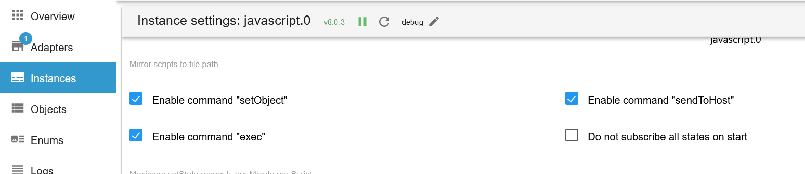

### 2.   Import Blockly Script

-   `host_name` Name of the host (see image below)
-   `lang` Possible languages ​​en, de, ru, pt, nl, fr, it, es, pl, uk and zh-cn
-   `channelname` Name of the channel under 0_userdata.0
-   `load_temp` temperature from Raspberry
-   `debugging` Enables log output

-   [Blockly Script](#blockly-script---javascript-adapter--790)</br>
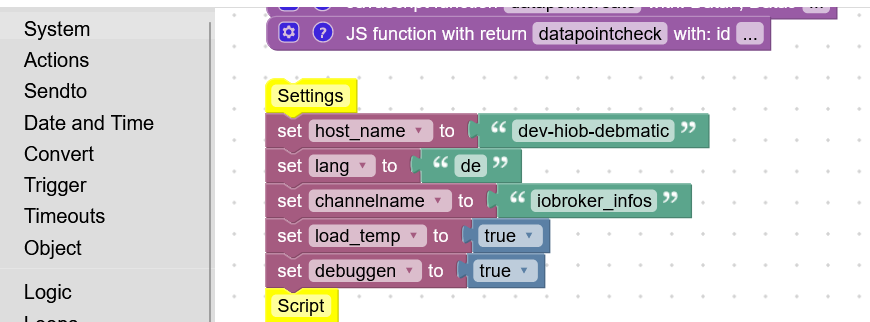</br>
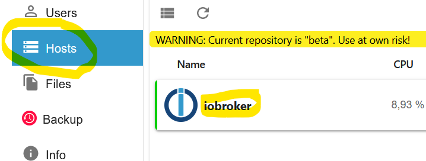

### 3.   Create enum
 -  Create a new enum and add the 3 states</br>
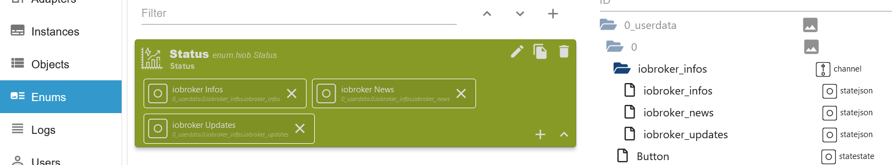

### 4.   Create Table Widget

-   **Select Table and State for Updates Widget**

  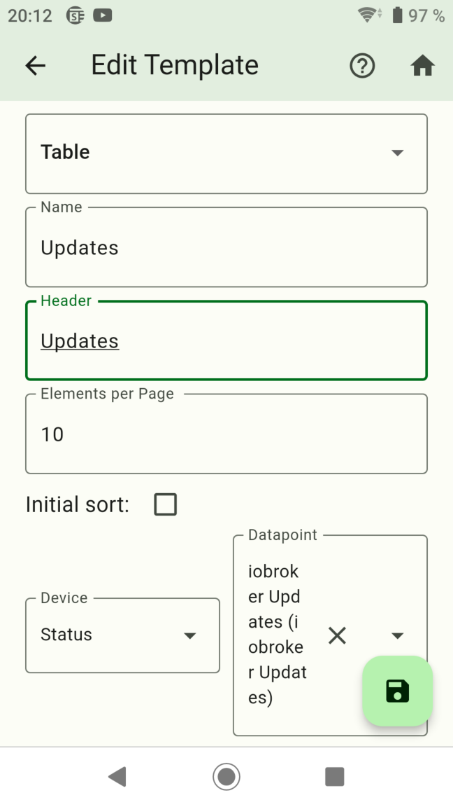

-   **Create Columns add**

  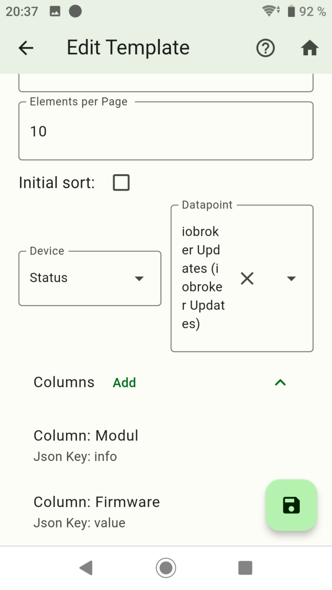

-   **Copy Table for Info and News**

  </br>
  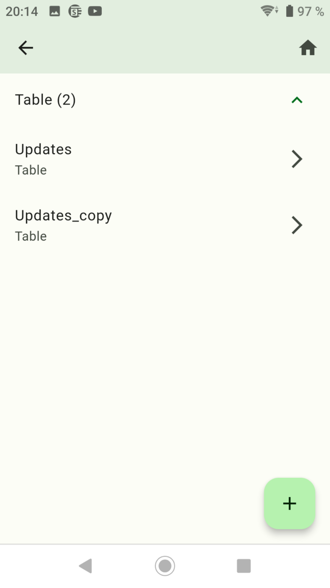

-   **Select Table and State for Info and adjust columns add**

  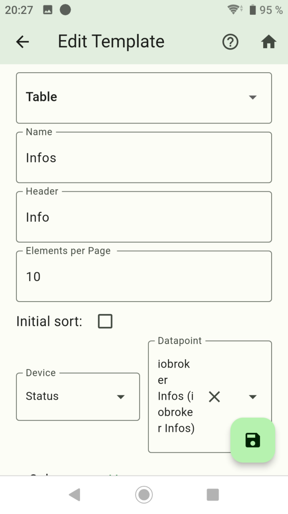</br>
  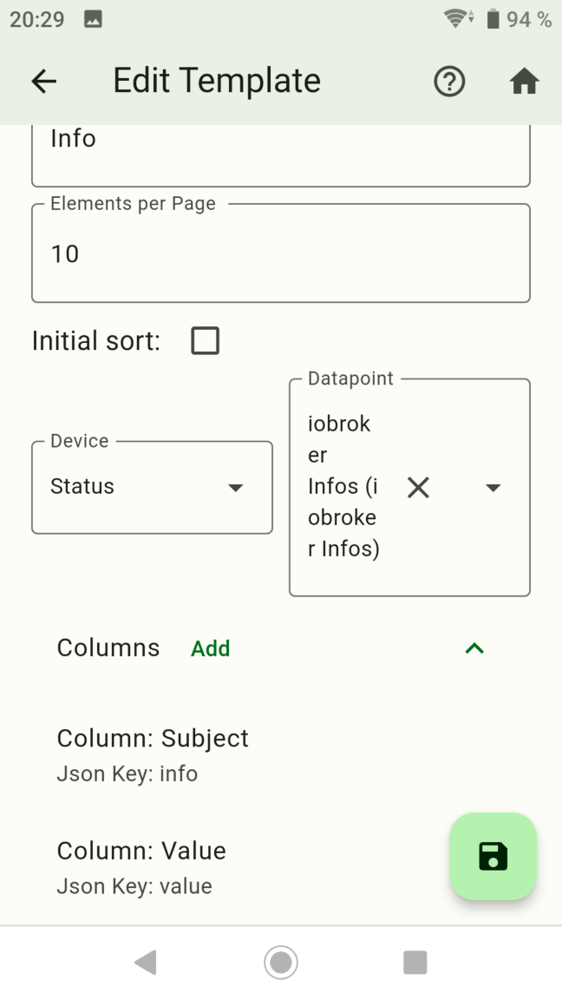

-   **Select Table and State for News and adjust columns add**

  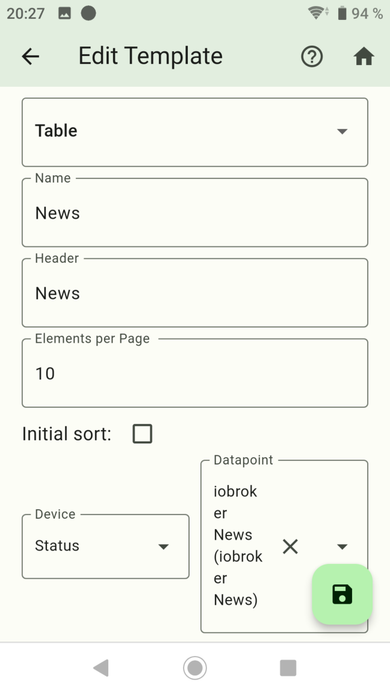</br>
  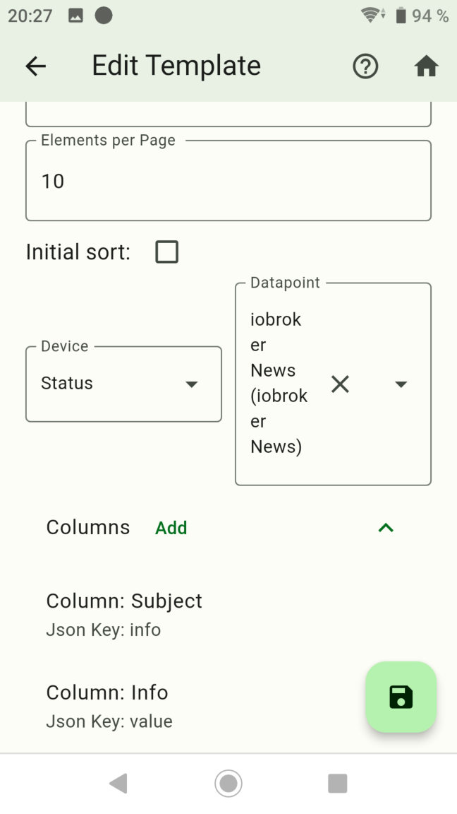

-   **Created Widgets**

  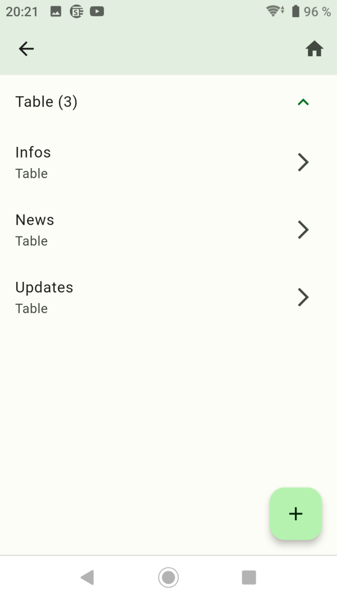

### 5.   Create Screen

-   **Create Screen**

  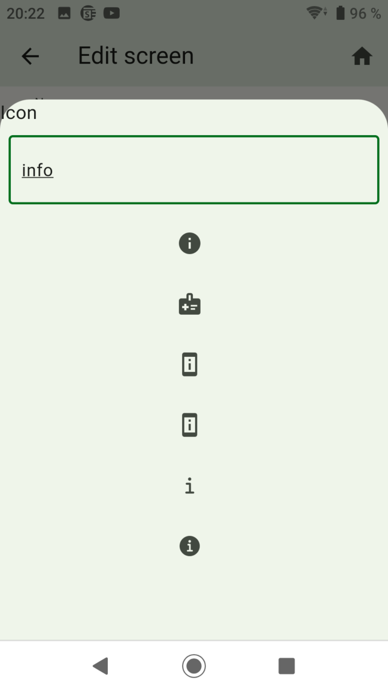

-   **Create 3 groups for info, news and updates**

  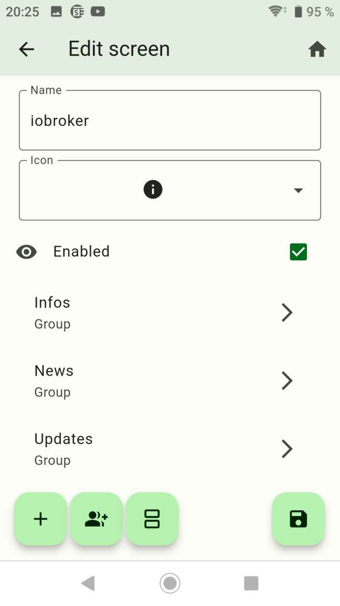

-   **Add the Table Widget to the respective groups**

  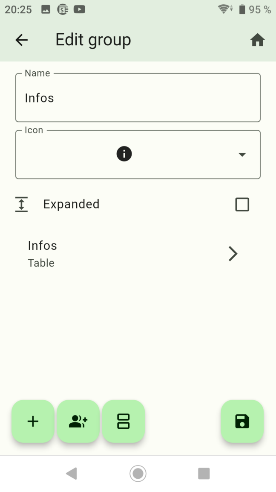</br>
  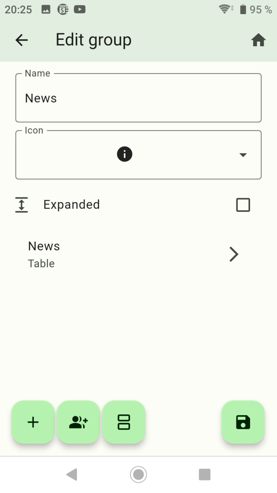</br>
  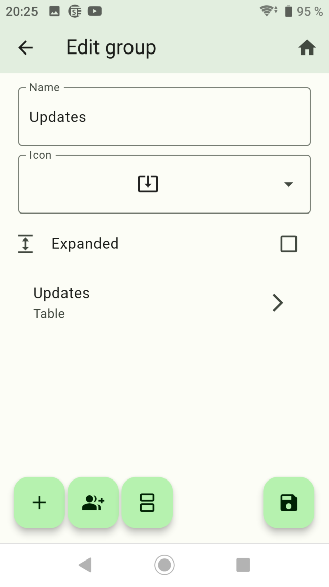

### 6.   Done

  </br>
  

-   [Back](/docs/en/example.md)


# Import Widgets JSON

- `hiob.0.settings.Update.devices`
```JSON
[
  {
    "id": "ASGCUeR7NSYhY6h8",
    "name": "Status",
    "iconWrapper": {
      "iconDataType": "flutterIcons",
      "iconDataId": "e318"
    },
    "objectID": "",
    "type": 1,
    "dataPoints": "[{\"id\":\"0_userdata.0.iobroker_infos.iobroker_infos\",\"name\":\"iobroker Infos\",\"type\":null,\"role\":\"json\",\"valueType\":null,\"otherDetails\":\"{\\\"id\\\":\\\"0_userdata.0.iobroker_infos.iobroker_infos\\\",\\\"name\\\":\\\"iobroker Infos\\\",\\\"type\\\":null,\\\"role\\\":\\\"json\\\",\\\"valueType\\\":null,\\\"otherDetails\\\":\\\"{\\\\\\\"name\\\\\\\":\\\\\\\"iobroker Infos\\\\\\\",\\\\\\\"id\\\\\\\":\\\\\\\"0_userdata.0.iobroker_infos.iobroker_infos\\\\\\\",\\\\\\\"role\\\\\\\":\\\\\\\"json\\\\\\\"}\\\"}\"},{\"id\":\"0_userdata.0.iobroker_infos.iobroker_news\",\"name\":\"iobroker News\",\"type\":null,\"role\":\"json\",\"valueType\":null,\"otherDetails\":\"{\\\"id\\\":\\\"0_userdata.0.iobroker_infos.iobroker_news\\\",\\\"name\\\":\\\"iobroker News\\\",\\\"type\\\":null,\\\"role\\\":\\\"json\\\",\\\"valueType\\\":null,\\\"otherDetails\\\":\\\"{\\\\\\\"name\\\\\\\":\\\\\\\"iobroker News\\\\\\\",\\\\\\\"id\\\\\\\":\\\\\\\"0_userdata.0.iobroker_infos.iobroker_news\\\\\\\",\\\\\\\"role\\\\\\\":\\\\\\\"json\\\\\\\"}\\\"}\"},{\"id\":\"0_userdata.0.iobroker_infos.iobroker_updates\",\"name\":\"iobroker Updates\",\"type\":null,\"role\":\"json\",\"valueType\":null,\"otherDetails\":\"{\\\"id\\\":\\\"0_userdata.0.iobroker_infos.iobroker_updates\\\",\\\"name\\\":\\\"iobroker Updates\\\",\\\"type\\\":null,\\\"role\\\":\\\"json\\\",\\\"valueType\\\":null,\\\"otherDetails\\\":\\\"{\\\\\\\"name\\\\\\\":\\\\\\\"iobroker Updates\\\\\\\",\\\\\\\"id\\\\\\\":\\\\\\\"0_userdata.0.iobroker_infos.iobroker_updates\\\\\\\",\\\\\\\"role\\\\\\\":\\\\\\\"json\\\\\\\"}\\\"}\"}]"
  }
]
```

- `hiob.0.settings.Update.screens`
```JSON
[
  {
    "id": "testID11&",
    "name": "iobroker",
    "iconWrapper": {
      "iconDataType": "flutterIcons",
      "iconDataId": "e33c"
    },
    "index": 1,
    "enabled": true,
    "widgetIds": [
      {
        "name": "Infos",
        "isExtended": false,
        "iconWrapper": {
          "iconDataType": "flutterIcons",
          "iconDataId": "e33c"
        },
        "templates": [
          {
            "widget": "Infos",
            "id": "iGwIfy7WnRPStKFt"
          }
        ]
      },
      {
        "name": "News",
        "isExtended": false,
        "iconWrapper": {
          "iconDataType": "flutterIcons",
          "iconDataId": "e33c"
        },
        "templates": [
          {
            "widget": "News",
            "id": "vl0jV-BrqV9Sq1zK-fxkK9L5h9wo0Q=="
          }
        ]
      },
      {
        "name": "Updates",
        "isExtended": false,
        "iconWrapper": {
          "iconDataType": "flutterIcons",
          "iconDataId": "e637"
        },
        "templates": [
          {
            "widget": "Updates",
            "id": "EWZW3dM5P3OmQQNu"
          }
        ]
      }
    ]
  }
]
```

- `hiob.0.settings.Update.widgets`
```JSON
[
  {
    "id": "iGwIfy7WnRPStKFt",
    "name": "Infos",
    "widget": {
      "type": "CustomWidgetType.table",
      "name": "Infos",
      "header": "Info",
      "sortAsc": true,
      "initialSortColumn": 1,
      "initialSortEnabled": false,
      "elementsPerPage": 10,
      "dataPoint": "0_userdata.0.iobroker_infos.iobroker_infos",
      "columns": {
        "info": "Name",
        "value": "Value"
      }
    }
  },
  {
    "id": "vl0jV-BrqV9Sq1zK-fxkK9L5h9wo0Q==",
    "name": "News",
    "widget": {
      "type": "CustomWidgetType.table",
      "name": "News",
      "header": "News",
      "sortAsc": true,
      "initialSortColumn": 1,
      "initialSortEnabled": false,
      "elementsPerPage": 10,
      "dataPoint": "0_userdata.0.iobroker_infos.iobroker_news",
      "columns": {
        "info": "Subject",
        "value": "Info"
      }
    }
  },
  {
    "id": "EWZW3dM5P3OmQQNu",
    "name": "Updates",
    "widget": {
      "type": "CustomWidgetType.table",
      "name": "Updates",
      "header": "Updates",
      "sortAsc": true,
      "initialSortColumn": 1,
      "initialSortEnabled": false,
      "elementsPerPage": 10,
      "dataPoint": "0_userdata.0.iobroker_infos.iobroker_updates",
      "columns": {
        "info": "Modul",
        "value": "Firmware"
      }
    }
  }
]
```

-   [Back](/docs/en/example.md)

# Blockly Script - Javascript Adapter >= 7.9.0
```BLOCKLY
<xml xmlns="https://developers.google.com/blockly/xml">
  <variables>
    <variable id="*^I{[f/PZGI)OX?g}HQs">json</variable>
    <variable id="#.~`7u?dj=E(3a2.)Uy+">att</variable>
    <variable id="9-y@R14=@kO}@mq%qMg:">host</variable>
    <variable id="J9#xnj]T_`pv_T8Z3j4P">id</variable>
    <variable id="K,F@7o]a,1yc{W4Pz2X[">DataP</variable>
    <variable id="JcvirzSt4Zydn]^O4VO#">DataJ</variable>
    <variable id="Vs/,yT5JA1%d_}t}ki}F">json_news_check</variable>
    <variable id="zG_[(N}!qEq#l%iN{aA{">host_name</variable>
    <variable id="jUr@jfDm@Ad|`8_@9l0R">lang</variable>
    <variable id="^$e!?JpvIt1Qh-]SBl!@">channelname</variable>
    <variable id="`4rdr+ixTz}?g?][J3n=">load_temp</variable>
    <variable id="N){4B$~4B!QQ.f5r#d9h">debuggen</variable>
    <variable id=";?*6DVwTbL$=n,B]]DRc">news_json</variable>
    <variable id="I7SZ=Wg,hHj?|CwAlG.%">host_array</variable>
    <variable id="UmaQIH4lR:Ue]z[@-zw=">news_json_hiob</variable>
    <variable id="H%vnE5E2p+`p;{XhBXsv">hostinfo</variable>
    <variable id="HXZ[;d~F3Sd]1e87h3;K">list_states</variable>
    <variable id="72c}dTRj4JsIZ,}~*CH|">info_array</variable>
    <variable id="lO#_{K}^^2b3IuD.n+#`">dummy_1</variable>
    <variable id="z5^~(xFMp.(PpDR6*QQ_">dummy_2</variable>
    <variable id="QJLQAv,x|w~8as|3(yp9">new_json</variable>
    <variable id="[^~-ib.t(4y@~(G]ltPL">flex_array</variable>
    <variable id="Yzo|dI*O`_csHhIU@rC,">j</variable>
    <variable id="{Scw*9dksXKQb+DUu@D$">value</variable>
  </variables>
  <block type="procedures_defcustomreturn" id="kldc_B*ClSA53dc3}Eqg" x="-812" y="-712">
    <mutation statements="false">
      <arg name="json" varid="*^I{[f/PZGI)OX?g}HQs"></arg>
      <arg name="att" varid="#.~`7u?dj=E(3a2.)Uy+"></arg>
    </mutation>
    <field name="NAME">host_array_info</field>
    <field name="SCRIPT">Y29uc3QgbmV3X2FycmF5ID0gSlNPTi5wYXJzZShKU09OLnN0cmluZ2lmeShqc29uLm5hdGl2ZS5oYXJkd2FyZS5jcHVzKSk7DQppZiAoYXR0ID09PSAxKSB7DQogICAgcmV0dXJuIG5ld19hcnJheVswXS5zcGVlZDsNCn0gZWxzZSBpZiAoYXR0ID09PSAyKSB7DQogICAgcmV0dXJuIG5ld19hcnJheVswXS5tb2RlbDsNCn0gZWxzZSBpZiAoYXR0ID09PSAzKSB7DQogICAgcmV0dXJuIG5ld19hcnJheS5sZW5ndGg7DQp9IGVsc2Ugew0KICAgIHJldHVybiBudWxsOw0KfQ==</field>
    <comment pinned="false" h="80" w="160">Beschreibe diese Funktion …</comment>
  </block>
  <block type="procedures_defcustomreturn" id="/)(ngokF4WIAX;X08S_g" x="-812" y="-687">
    <mutation statements="false">
      <arg name="host" varid="9-y@R14=@kO}@mq%qMg:"></arg>
    </mutation>
    <field name="NAME">hostinfo</field>
    <field name="SCRIPT">cmV0dXJuIGF3YWl0IGdldE9iamVjdEFzeW5jKCJzeXN0ZW0uaG9zdC4iICsgaG9zdCk7</field>
    <comment pinned="false" h="80" w="160">Beschreibe diese Funktion …</comment>
  </block>
  <block type="procedures_defcustomreturn" id="TPDWEp-dsh~Q5^kj{b@(" x="-812" y="-662">
    <mutation statements="false">
      <arg name="id" varid="J9#xnj]T_`pv_T8Z3j4P"></arg>
    </mutation>
    <field name="NAME">channelcheck</field>
    <field name="SCRIPT">Y29uc3Qgb2JqID0gYXdhaXQgZXhpc3RzT2JqZWN0QXN5bmMoaWQpOw0KcmV0dXJuIG9iajs=</field>
    <comment pinned="false" h="80" w="160">Beschreibe diese Funktion …</comment>
  </block>
  <block type="procedures_defcustomnoreturn" id="+ue@:52nyF+%!hz+K:]Y" x="-812" y="-637">
    <mutation statements="false">
      <arg name="DataP" varid="K,F@7o]a,1yc{W4Pz2X["></arg>
      <arg name="DataJ" varid="JcvirzSt4Zydn]^O4VO#"></arg>
    </mutation>
    <field name="NAME">channelcreate</field>
    <field name="SCRIPT">c2V0T2JqZWN0KERhdGFQLCBEYXRhSik7IA==</field>
    <comment pinned="false" h="80" w="160">Beschreibe diese Funktion …</comment>
  </block>
  <block type="procedures_defcustomnoreturn" id="MN-F4r%Bl`b2Dr#j,rUe" x="-812" y="-612">
    <mutation statements="false">
      <arg name="json_news_check" varid="Vs/,yT5JA1%d_}t}ki}F"></arg>
    </mutation>
    <field name="NAME">update_json_news</field>
    <field name="SCRIPT">DQpmb3IgKHZhciBpX2luZGV4IGluIGpzb25fbmV3c19jaGVjaykgew0KICAgIHZhciBuZXdfanNvbiA9IHt9Ow0KICAgIG5ld19qc29uWyJpbmZvIl0gPSBqc29uX25ld3NfY2hlY2tbaV9pbmRleF0uaWQ7DQogICAgbmV3X2pzb25bInZhbHVlIl0gPSBqc29uX25ld3NfY2hlY2tbaV9pbmRleF0udGl0bGVbbGFuZ107DQogICAgbmV3c19qc29uX2hpb2IucHVzaChuZXdfanNvbik7DQp9</field>
    <comment pinned="false" h="80" w="160">Beschreibe diese Funktion …</comment>
  </block>
  <block type="procedures_defcustomnoreturn" id="{J-wk!WYyl,piY;O1w@]" x="-812" y="-587">
    <mutation statements="false">
      <arg name="json" varid="*^I{[f/PZGI)OX?g}HQs"></arg>
    </mutation>
    <field name="NAME">update_json</field>
    <field name="SCRIPT">Zm9yICh2YXIgaV9pbmRleCBpbiBqc29uKSB7DQogICAgdmFyIG5ld19qc29uID0ge307DQogICAgbmV3X2pzb25bImluZm8iXSA9IGlfaW5kZXg7DQogICAgbmV3X2pzb25bInZhbHVlIl0gPSBkdW1teV8xW2lfaW5kZXhdWyJpbnN0YWxsZWRWZXJzaW9uIl0gKyAiIC0+IOKdlyIgKyBkdW1teV8xW2lfaW5kZXhdWyJhdmFpbGFibGVWZXJzaW9uIl07DQogICAgaW5mb19hcnJheS5wdXNoKG5ld19qc29uKTsNCn0=</field>
    <comment pinned="false" h="80" w="160">Beschreibe diese Funktion …</comment>
  </block>
  <block type="procedures_defcustomnoreturn" id="CJ8Zcc-xzs^SogX?vx}r" x="-812" y="-562">
    <mutation statements="false">
      <arg name="DataP" varid="K,F@7o]a,1yc{W4Pz2X["></arg>
      <arg name="DataJ" varid="JcvirzSt4Zydn]^O4VO#"></arg>
    </mutation>
    <field name="NAME">datapointcreate</field>
    <field name="SCRIPT">Y3JlYXRlU3RhdGUoRGF0YVAsIERhdGFKKTs=</field>
    <comment pinned="false" h="80" w="160">Beschreibe diese Funktion …</comment>
  </block>
  <block type="procedures_defcustomreturn" id="$KR-X@{G/.vido.W$31-" x="-812" y="-537">
    <mutation statements="false">
      <arg name="id" varid="J9#xnj]T_`pv_T8Z3j4P"></arg>
    </mutation>
    <field name="NAME">datapointcheck</field>
    <field name="SCRIPT">cmV0dXJuICEhJChpZCkubGVuZ3RoOw==</field>
    <comment pinned="false" h="80" w="160">Beschreibe diese Funktion …</comment>
  </block>
  <block type="comment" id="^8]ThA)*=f3`U^DquFu1" x="-813" y="-487">
    <field name="COMMENT">Settings</field>
    <next>
      <block type="variables_set" id="rK}X:SlePtzug~op9eoF">
        <field name="VAR" id="zG_[(N}!qEq#l%iN{aA{">host_name</field>
        <value name="VALUE">
          <block type="text" id="Aa7+aPEjz^iQD74Vqgz0">
            <field name="TEXT">dev-hiob-debmatic</field>
          </block>
        </value>
        <next>
          <block type="variables_set" id="UtH$;EPqP#QjvNC[+5Tr">
            <field name="VAR" id="jUr@jfDm@Ad|`8_@9l0R">lang</field>
            <value name="VALUE">
              <block type="text" id="$E1Du(3PsZwk}Z#6eJzQ">
                <field name="TEXT">de</field>
              </block>
            </value>
            <next>
              <block type="variables_set" id="J)V^=yvsk@g@dHWm/^^T">
                <field name="VAR" id="^$e!?JpvIt1Qh-]SBl!@">channelname</field>
                <value name="VALUE">
                  <block type="text" id="Wm3O9$yR2JkaGeF})xKr">
                    <field name="TEXT">iobroker_infos</field>
                  </block>
                </value>
                <next>
                  <block type="variables_set" id="(}4N2^lkfn,{+oveIcfc">
                    <field name="VAR" id="`4rdr+ixTz}?g?][J3n=">load_temp</field>
                    <value name="VALUE">
                      <block type="logic_boolean" id="PGH8upyZ2#7eXGoT(Cor">
                        <field name="BOOL">TRUE</field>
                      </block>
                    </value>
                    <next>
                      <block type="variables_set" id="{-ym:+S(FhLFgS,R#}9/">
                        <field name="VAR" id="N){4B$~4B!QQ.f5r#d9h">debuggen</field>
                        <value name="VALUE">
                          <block type="logic_boolean" id="}q.(w[U8?`qKC]rr~?{8">
                            <field name="BOOL">TRUE</field>
                          </block>
                        </value>
                        <next>
                          <block type="comment" id="?84%ril.-sNibFmHHi40">
                            <field name="COMMENT">Script</field>
                            <next>
                              <block type="controls_if" id="Y`aH;7xr6%Lb=X^X(x}." collapsed="true">
                                <value name="IF0">
                                  <block type="logic_negate" id="O3A9n(6zlW53@Stf}mmx">
                                    <value name="BOOL">
                                      <block type="procedures_callcustomreturn" id="j9l:xIOu%e.AN{R6_x!H">
                                        <mutation name="channelcheck">
                                          <arg name="id"></arg>
                                        </mutation>
                                        <value name="ARG0">
                                          <block type="text_join" id="dw:Y1uT3k20JYWH/Z%cy">
                                            <mutation items="2"></mutation>
                                            <value name="ADD0">
                                              <block type="text" id="pVh(!7$!i68,1W2uE=GQ">
                                                <field name="TEXT">0_userdata.0.</field>
                                              </block>
                                            </value>
                                            <value name="ADD1">
                                              <block type="variables_get" id="P~2av2k`dIa!QEnrP;p%">
                                                <field name="VAR" id="^$e!?JpvIt1Qh-]SBl!@">channelname</field>
                                              </block>
                                            </value>
                                          </block>
                                        </value>
                                      </block>
                                    </value>
                                  </block>
                                </value>
                                <statement name="DO0">
                                  <block type="controls_if" id="=,lJl=J[.**OOeF4{p,=">
                                    <value name="IF0">
                                      <block type="variables_get" id="Pz^R)NB,3G#,!6|S=o;}">
                                        <field name="VAR" id="N){4B$~4B!QQ.f5r#d9h">debuggen</field>
                                      </block>
                                    </value>
                                    <statement name="DO0">
                                      <block type="debug" id="skaXT$+MMbp4Bdq;zxs.">
                                        <field name="Severity">log</field>
                                        <value name="TEXT">
                                          <shadow type="text" id="iv4_bT9x=W%XrvPzZch)">
                                            <field name="TEXT">text</field>
                                          </shadow>
                                          <block type="text_join" id="G**Okel*K0/hB/7@oYYD">
                                            <mutation items="3"></mutation>
                                            <value name="ADD0">
                                              <block type="text" id="7BI[b0],Wr9pYP:Oyud=">
                                                <field name="TEXT">Channel 0_userdata.0.</field>
                                              </block>
                                            </value>
                                            <value name="ADD1">
                                              <block type="variables_get" id="nClD|*RDt#)%fUe2HG4G">
                                                <field name="VAR" id="^$e!?JpvIt1Qh-]SBl!@">channelname</field>
                                              </block>
                                            </value>
                                            <value name="ADD2">
                                              <block type="text" id="jj$p1}lJ}YQ6ld5K{TH;">
                                                <field name="TEXT"> wird erstellt!</field>
                                              </block>
                                            </value>
                                          </block>
                                        </value>
                                      </block>
                                    </statement>
                                    <next>
                                      <block type="procedures_callcustomnoreturn" id="A#+-vRDkW]V[}x/Z].@6">
                                        <mutation name="channelcreate">
                                          <arg name="DataP"></arg>
                                          <arg name="DataJ"></arg>
                                        </mutation>
                                        <value name="ARG0">
                                          <block type="text_join" id="koGr!ieTD+4U,)ZUl{Ix">
                                            <mutation items="2"></mutation>
                                            <value name="ADD0">
                                              <block type="text" id="#*N-%YTdYt8@0d#[|a#:">
                                                <field name="TEXT">0_userdata.0.</field>
                                              </block>
                                            </value>
                                            <value name="ADD1">
                                              <block type="variables_get" id="/BZSdZD#TVd7KvWxK1S^">
                                                <field name="VAR" id="^$e!?JpvIt1Qh-]SBl!@">channelname</field>
                                              </block>
                                            </value>
                                          </block>
                                        </value>
                                        <value name="ARG1">
                                          <block type="convert_json2object" id="~X?Wc4)pe2d`UuoO$77-">
                                            <value name="VALUE">
                                              <block type="text" id="mM[5lk.FjT2CUBbO?lq*">
                                                <field name="TEXT">{"type": "channel", "common": {"name": "RAM"}}</field>
                                              </block>
                                            </value>
                                          </block>
                                        </value>
                                      </block>
                                    </next>
                                  </block>
                                </statement>
                                <next>
                                  <block type="controls_if" id="WOsNuV1`Xc9Eum]Ya88m" collapsed="true">
                                    <mutation else="1"></mutation>
                                    <value name="IF0">
                                      <block type="logic_negate" id="J:uFpSAxpU;=E@^bSPoW">
                                        <value name="BOOL">
                                          <block type="procedures_callcustomreturn" id="sa;1VDmOW}@3sgz}BF#D">
                                            <mutation name="datapointcheck">
                                              <arg name="id"></arg>
                                            </mutation>
                                            <value name="ARG0">
                                              <block type="text_join" id="o[D[rd1@DLQ~Hp}ratv2">
                                                <mutation items="3"></mutation>
                                                <value name="ADD0">
                                                  <block type="text" id="qIlehRK$Rqso(~6,Vp}c">
                                                    <field name="TEXT">0_userdata.0.</field>
                                                  </block>
                                                </value>
                                                <value name="ADD1">
                                                  <block type="variables_get" id="[?7=^AHkvCO%ir@.MGZv">
                                                    <field name="VAR" id="^$e!?JpvIt1Qh-]SBl!@">channelname</field>
                                                  </block>
                                                </value>
                                                <value name="ADD2">
                                                  <block type="text" id="xoyi]`B[-:vEPF#%m3.5">
                                                    <field name="TEXT">.iobroker_infos</field>
                                                  </block>
                                                </value>
                                              </block>
                                            </value>
                                          </block>
                                        </value>
                                      </block>
                                    </value>
                                    <statement name="DO0">
                                      <block type="controls_if" id="za+:Kn/+MxKFlzZb7YLk">
                                        <value name="IF0">
                                          <block type="variables_get" id="L67^GVN-zsxr.8G%824L">
                                            <field name="VAR" id="N){4B$~4B!QQ.f5r#d9h">debuggen</field>
                                          </block>
                                        </value>
                                        <statement name="DO0">
                                          <block type="debug" id="7)5Kif3J974nYOt#c(S,">
                                            <field name="Severity">log</field>
                                            <value name="TEXT">
                                              <shadow type="text" id="bVeo-u@eMdgz9S`wT_f$">
                                                <field name="TEXT">text</field>
                                              </shadow>
                                              <block type="text_join" id="TTa6W/yA/{I|k4K#.WhC">
                                                <mutation items="2"></mutation>
                                                <value name="ADD0">
                                                  <block type="text" id="T!%N0(iQt^:@`NUja.(m">
                                                    <field name="TEXT">Datenpunkt wird erstellt: </field>
                                                  </block>
                                                </value>
                                                <value name="ADD1">
                                                  <block type="text_join" id="6{L/@AW:}tqU(OZj]gbV">
                                                    <mutation items="3"></mutation>
                                                    <value name="ADD0">
                                                      <block type="text" id="n8R+HvkWv8wWLGW|F0K3">
                                                        <field name="TEXT">0_userdata.0.</field>
                                                      </block>
                                                    </value>
                                                    <value name="ADD1">
                                                      <block type="variables_get" id="9(VB@dF.W8(mtdKDF#Qt">
                                                        <field name="VAR" id="^$e!?JpvIt1Qh-]SBl!@">channelname</field>
                                                      </block>
                                                    </value>
                                                    <value name="ADD2">
                                                      <block type="text" id="e#qjVy_4bMR#4s3!{aCr">
                                                        <field name="TEXT">.iobroker_infos</field>
                                                      </block>
                                                    </value>
                                                  </block>
                                                </value>
                                              </block>
                                            </value>
                                          </block>
                                        </statement>
                                        <next>
                                          <block type="procedures_callcustomnoreturn" id="1=WVx,e[e#RIn%5M~(OP">
                                            <mutation name="datapointcreate">
                                              <arg name="DataP"></arg>
                                              <arg name="DataJ"></arg>
                                            </mutation>
                                            <value name="ARG0">
                                              <block type="text_join" id="|5?=9%da3jmpYP;`rz0*">
                                                <mutation items="3"></mutation>
                                                <value name="ADD0">
                                                  <block type="text" id="M`sSP0[Dd9x@i~jM+D9O">
                                                    <field name="TEXT">0_userdata.0.</field>
                                                  </block>
                                                </value>
                                                <value name="ADD1">
                                                  <block type="variables_get" id="`WmXes(w}lL9)?@jt%`L">
                                                    <field name="VAR" id="^$e!?JpvIt1Qh-]SBl!@">channelname</field>
                                                  </block>
                                                </value>
                                                <value name="ADD2">
                                                  <block type="text" id="`CohH.yEVfA;MWweCzEm">
                                                    <field name="TEXT">.iobroker_infos</field>
                                                  </block>
                                                </value>
                                              </block>
                                            </value>
                                            <value name="ARG1">
                                              <block type="convert_json2object" id="52|Qgyk+k1S@B_WzytEH">
                                                <value name="VALUE">
                                                  <block type="text" id="{4Jv7nc1N2n10uiR*VAH">
                                                    <field name="TEXT">{"name": "iobroker Infos", "role": "json", "type": "string", "write": true, "read": true, "def": ""}</field>
                                                  </block>
                                                </value>
                                              </block>
                                            </value>
                                          </block>
                                        </next>
                                      </block>
                                    </statement>
                                    <statement name="ELSE">
                                      <block type="controls_if" id="31yl^QUB[fe0@XZ[2KQc">
                                        <value name="IF0">
                                          <block type="variables_get" id="5~NH4@xTVc*~~1PwKu_f">
                                            <field name="VAR" id="N){4B$~4B!QQ.f5r#d9h">debuggen</field>
                                          </block>
                                        </value>
                                        <statement name="DO0">
                                          <block type="debug" id="*{X?rJjd:,q:`wfl9j]E">
                                            <field name="Severity">log</field>
                                            <value name="TEXT">
                                              <shadow type="text" id="bVeo-u@eMdgz9S`wT_f$">
                                                <field name="TEXT">text</field>
                                              </shadow>
                                              <block type="text_join" id="(ylwqZX}VQ,Nnwt{d.o$">
                                                <mutation items="2"></mutation>
                                                <value name="ADD0">
                                                  <block type="text" id="?8kS!KGI=AmK|YJ::7Xb">
                                                    <field name="TEXT">Datenpunkt ist bereits erstellt: </field>
                                                  </block>
                                                </value>
                                                <value name="ADD1">
                                                  <block type="text_join" id="kf+Xr,XUcB|`%IS9Q*P^">
                                                    <mutation items="3"></mutation>
                                                    <value name="ADD0">
                                                      <block type="text" id="*Z:JF]QOK2kNa4Bckkn*">
                                                        <field name="TEXT">0_userdata.0.</field>
                                                      </block>
                                                    </value>
                                                    <value name="ADD1">
                                                      <block type="variables_get" id="XFr.;QMB^uP$N$3{iL[S">
                                                        <field name="VAR" id="^$e!?JpvIt1Qh-]SBl!@">channelname</field>
                                                      </block>
                                                    </value>
                                                    <value name="ADD2">
                                                      <block type="text" id="7MH=++X=a)k{q[v[oL:J">
                                                        <field name="TEXT">.iobroker_infos</field>
                                                      </block>
                                                    </value>
                                                  </block>
                                                </value>
                                              </block>
                                            </value>
                                          </block>
                                        </statement>
                                      </block>
                                    </statement>
                                    <next>
                                      <block type="controls_if" id="h!w9!}$TAtFKr0L1wfDx" collapsed="true">
                                        <mutation else="1"></mutation>
                                        <value name="IF0">
                                          <block type="logic_negate" id="y59Hu+4n@hMB-S_PTJT]">
                                            <value name="BOOL">
                                              <block type="procedures_callcustomreturn" id="@-,nE@aLeOE:=cn-spjS">
                                                <mutation name="datapointcheck">
                                                  <arg name="id"></arg>
                                                </mutation>
                                                <value name="ARG0">
                                                  <block type="text_join" id="rZO~HYw$g.!B%tzUCmWY">
                                                    <mutation items="3"></mutation>
                                                    <value name="ADD0">
                                                      <block type="text" id="a]IM)1+KdD47tv*(:-vF">
                                                        <field name="TEXT">0_userdata.0.</field>
                                                      </block>
                                                    </value>
                                                    <value name="ADD1">
                                                      <block type="variables_get" id="n,o!2jt,GIOu6=q[$Dcp">
                                                        <field name="VAR" id="^$e!?JpvIt1Qh-]SBl!@">channelname</field>
                                                      </block>
                                                    </value>
                                                    <value name="ADD2">
                                                      <block type="text" id="/DyMEdztaml#4(a8wDh}">
                                                        <field name="TEXT">.iobroker_news</field>
                                                      </block>
                                                    </value>
                                                  </block>
                                                </value>
                                              </block>
                                            </value>
                                          </block>
                                        </value>
                                        <statement name="DO0">
                                          <block type="controls_if" id="XWaZ[~s@!kv}J#Riy=Ld">
                                            <value name="IF0">
                                              <block type="variables_get" id="gNxa,v0Tt8bOk@[.^9C1">
                                                <field name="VAR" id="N){4B$~4B!QQ.f5r#d9h">debuggen</field>
                                              </block>
                                            </value>
                                            <statement name="DO0">
                                              <block type="debug" id=";@0_B@{5rpdqZD)HizXy">
                                                <field name="Severity">log</field>
                                                <value name="TEXT">
                                                  <shadow type="text" id="bVeo-u@eMdgz9S`wT_f$">
                                                    <field name="TEXT">text</field>
                                                  </shadow>
                                                  <block type="text_join" id="Xm;;GnJ~0at%|0L]szL9">
                                                    <mutation items="2"></mutation>
                                                    <value name="ADD0">
                                                      <block type="text" id="Wly?{juFExvCv)dU:L%6">
                                                        <field name="TEXT">Datenpunkt wird erstellt: </field>
                                                      </block>
                                                    </value>
                                                    <value name="ADD1">
                                                      <block type="text_join" id="~y3Y*Ug73a0-D-oZiO-#">
                                                        <mutation items="3"></mutation>
                                                        <value name="ADD0">
                                                          <block type="text" id="#zw-T@Xe:v#e}.;D6I4P">
                                                            <field name="TEXT">0_userdata.0.</field>
                                                          </block>
                                                        </value>
                                                        <value name="ADD1">
                                                          <block type="variables_get" id="C#M@9O]HsPtH:=m7;u#p">
                                                            <field name="VAR" id="^$e!?JpvIt1Qh-]SBl!@">channelname</field>
                                                          </block>
                                                        </value>
                                                        <value name="ADD2">
                                                          <block type="text" id="(5ZuXV+81)r/RWy730q[">
                                                            <field name="TEXT">.iobroker_news</field>
                                                          </block>
                                                        </value>
                                                      </block>
                                                    </value>
                                                  </block>
                                                </value>
                                              </block>
                                            </statement>
                                            <next>
                                              <block type="procedures_callcustomnoreturn" id="N=0CzGIlX?R(ctq5Qq1C">
                                                <mutation name="datapointcreate">
                                                  <arg name="DataP"></arg>
                                                  <arg name="DataJ"></arg>
                                                </mutation>
                                                <value name="ARG0">
                                                  <block type="text_join" id="Nrwf8gaOUstmQo412;RA">
                                                    <mutation items="3"></mutation>
                                                    <value name="ADD0">
                                                      <block type="text" id="Z@#EH}v9)c,0hzV*+s_(">
                                                        <field name="TEXT">0_userdata.0.</field>
                                                      </block>
                                                    </value>
                                                    <value name="ADD1">
                                                      <block type="variables_get" id="8Z;x++:iWbBRg|jN}I`2">
                                                        <field name="VAR" id="^$e!?JpvIt1Qh-]SBl!@">channelname</field>
                                                      </block>
                                                    </value>
                                                    <value name="ADD2">
                                                      <block type="text" id="!#1`k0k:,lHA1:Z4~S-p">
                                                        <field name="TEXT">.iobroker_news</field>
                                                      </block>
                                                    </value>
                                                  </block>
                                                </value>
                                                <value name="ARG1">
                                                  <block type="convert_json2object" id="c:]H!$#,xa))2B6C(AqB">
                                                    <value name="VALUE">
                                                      <block type="text" id="q=+cRMOP)c=Aj!yQ!%fA">
                                                        <field name="TEXT">{"name": "iobroker News", "role": "json", "type": "string", "write": true, "read": true, "def": ""}</field>
                                                      </block>
                                                    </value>
                                                  </block>
                                                </value>
                                              </block>
                                            </next>
                                          </block>
                                        </statement>
                                        <statement name="ELSE">
                                          <block type="controls_if" id="y?93S,^!qRsyIMr{;XqB">
                                            <value name="IF0">
                                              <block type="variables_get" id="|n-PFF.)2.p;c:$O~OyM">
                                                <field name="VAR" id="N){4B$~4B!QQ.f5r#d9h">debuggen</field>
                                              </block>
                                            </value>
                                            <statement name="DO0">
                                              <block type="debug" id="YpYgr%JHW69kd_23kDu=">
                                                <field name="Severity">log</field>
                                                <value name="TEXT">
                                                  <shadow type="text" id="bVeo-u@eMdgz9S`wT_f$">
                                                    <field name="TEXT">text</field>
                                                  </shadow>
                                                  <block type="text_join" id="!.XiOtS8g#.ovpP}U/f6">
                                                    <mutation items="2"></mutation>
                                                    <value name="ADD0">
                                                      <block type="text" id="R/W/f{KZ.ZIw$#|%.8|_">
                                                        <field name="TEXT">Datenpunkt ist bereits erstellt: </field>
                                                      </block>
                                                    </value>
                                                    <value name="ADD1">
                                                      <block type="text_join" id="lh*#mOD2WNWo$^|.YhSS">
                                                        <mutation items="3"></mutation>
                                                        <value name="ADD0">
                                                          <block type="text" id="NLvjxWgn*z#lr6kX#]b=">
                                                            <field name="TEXT">0_userdata.0.</field>
                                                          </block>
                                                        </value>
                                                        <value name="ADD1">
                                                          <block type="variables_get" id="ld*rNZXB,VLZa%$2VUPj">
                                                            <field name="VAR" id="^$e!?JpvIt1Qh-]SBl!@">channelname</field>
                                                          </block>
                                                        </value>
                                                        <value name="ADD2">
                                                          <block type="text" id="a6V1B1iJNb=ujh(Ur;{}">
                                                            <field name="TEXT">.iobroker_news</field>
                                                          </block>
                                                        </value>
                                                      </block>
                                                    </value>
                                                  </block>
                                                </value>
                                              </block>
                                            </statement>
                                          </block>
                                        </statement>
                                        <next>
                                          <block type="controls_if" id="UyGp}:ZCJpf*,Z$A]{IK" collapsed="true">
                                            <mutation else="1"></mutation>
                                            <value name="IF0">
                                              <block type="logic_negate" id="n1R*t6=;;]Tz-)5P!h`!">
                                                <value name="BOOL">
                                                  <block type="procedures_callcustomreturn" id="7i]gD5^#]2`|HO-UPh@O">
                                                    <mutation name="datapointcheck">
                                                      <arg name="id"></arg>
                                                    </mutation>
                                                    <value name="ARG0">
                                                      <block type="text_join" id="R|4zbz1z*~blSRwF::,a">
                                                        <mutation items="3"></mutation>
                                                        <value name="ADD0">
                                                          <block type="text" id="-jpVXMn3C.z!9I/%?C,e">
                                                            <field name="TEXT">0_userdata.0.</field>
                                                          </block>
                                                        </value>
                                                        <value name="ADD1">
                                                          <block type="variables_get" id="@b9b2j(0ZUPo|ak;480A">
                                                            <field name="VAR" id="^$e!?JpvIt1Qh-]SBl!@">channelname</field>
                                                          </block>
                                                        </value>
                                                        <value name="ADD2">
                                                          <block type="text" id="otA}mTkZ7]fTd?ba73~p">
                                                            <field name="TEXT">.iobroker_updates</field>
                                                          </block>
                                                        </value>
                                                      </block>
                                                    </value>
                                                  </block>
                                                </value>
                                              </block>
                                            </value>
                                            <statement name="DO0">
                                              <block type="controls_if" id="@ep6/|Sb~Es$M4(r:ww?">
                                                <value name="IF0">
                                                  <block type="variables_get" id="@=n^Z|=S{S.cd]~$Wr^!">
                                                    <field name="VAR" id="N){4B$~4B!QQ.f5r#d9h">debuggen</field>
                                                  </block>
                                                </value>
                                                <statement name="DO0">
                                                  <block type="debug" id="rp{1$LESI%e)IlgYevud">
                                                    <field name="Severity">log</field>
                                                    <value name="TEXT">
                                                      <shadow type="text" id="bVeo-u@eMdgz9S`wT_f$">
                                                        <field name="TEXT">text</field>
                                                      </shadow>
                                                      <block type="text_join" id="X4@U9M.kVTG-s:_`W13h">
                                                        <mutation items="2"></mutation>
                                                        <value name="ADD0">
                                                          <block type="text" id="X_-L7c:J@er=K2VOKW78">
                                                            <field name="TEXT">Datenpunkt wird erstellt: </field>
                                                          </block>
                                                        </value>
                                                        <value name="ADD1">
                                                          <block type="text_join" id="*30Ul_qP)v;%:!frST(9">
                                                            <mutation items="3"></mutation>
                                                            <value name="ADD0">
                                                              <block type="text" id="mOh?gL5@n/h4=+xajHx|">
                                                                <field name="TEXT">0_userdata.0.</field>
                                                              </block>
                                                            </value>
                                                            <value name="ADD1">
                                                              <block type="variables_get" id="+a3h`:Z?uD_zhnywcDxM">
                                                                <field name="VAR" id="^$e!?JpvIt1Qh-]SBl!@">channelname</field>
                                                              </block>
                                                            </value>
                                                            <value name="ADD2">
                                                              <block type="text" id="1a@2y9o9abxmwUUP%wt/">
                                                                <field name="TEXT">.iobroker_updates</field>
                                                              </block>
                                                            </value>
                                                          </block>
                                                        </value>
                                                      </block>
                                                    </value>
                                                  </block>
                                                </statement>
                                                <next>
                                                  <block type="procedures_callcustomnoreturn" id="@.T,4b^js.#aCQs,x=[:">
                                                    <mutation name="datapointcreate">
                                                      <arg name="DataP"></arg>
                                                      <arg name="DataJ"></arg>
                                                    </mutation>
                                                    <value name="ARG0">
                                                      <block type="text_join" id="|YbG7$Y;1cB#Ob#~6W[/">
                                                        <mutation items="3"></mutation>
                                                        <value name="ADD0">
                                                          <block type="text" id="E?GlIQEerYh`DiAY3|Cp">
                                                            <field name="TEXT">0_userdata.0.</field>
                                                          </block>
                                                        </value>
                                                        <value name="ADD1">
                                                          <block type="variables_get" id="}Z?Acq~YSt|Onv2sq^vQ">
                                                            <field name="VAR" id="^$e!?JpvIt1Qh-]SBl!@">channelname</field>
                                                          </block>
                                                        </value>
                                                        <value name="ADD2">
                                                          <block type="text" id="z]H@^_~4/SK)1ugp^3(:">
                                                            <field name="TEXT">.iobroker_updates</field>
                                                          </block>
                                                        </value>
                                                      </block>
                                                    </value>
                                                    <value name="ARG1">
                                                      <block type="convert_json2object" id="K$!Vv(x1Z-WcN1hRVk-E">
                                                        <value name="VALUE">
                                                          <block type="text" id="D!U(WI/]|U$|U/1l8MZd">
                                                            <field name="TEXT">{"name": "iobroker Updates", "role": "json", "type": "string", "write": true, "read": true, "def": ""}</field>
                                                          </block>
                                                        </value>
                                                      </block>
                                                    </value>
                                                  </block>
                                                </next>
                                              </block>
                                            </statement>
                                            <statement name="ELSE">
                                              <block type="controls_if" id="3vhb[H156$gTSC7A0B6`">
                                                <value name="IF0">
                                                  <block type="variables_get" id="Tc8(8;-=FxF17Q|6)BKs">
                                                    <field name="VAR" id="N){4B$~4B!QQ.f5r#d9h">debuggen</field>
                                                  </block>
                                                </value>
                                                <statement name="DO0">
                                                  <block type="debug" id=".`tpm=h-3O2EfUM-^#XO">
                                                    <field name="Severity">log</field>
                                                    <value name="TEXT">
                                                      <shadow type="text" id="bVeo-u@eMdgz9S`wT_f$">
                                                        <field name="TEXT">text</field>
                                                      </shadow>
                                                      <block type="text_join" id="F-W?G,+LmZPkj!=tDs;W">
                                                        <mutation items="2"></mutation>
                                                        <value name="ADD0">
                                                          <block type="text" id="n^I]$M~VtIakfV;Hiz4U">
                                                            <field name="TEXT">Datenpunkt ist bereits erstellt: </field>
                                                          </block>
                                                        </value>
                                                        <value name="ADD1">
                                                          <block type="text_join" id="(1v^1q:S)fs44/%,P5hV">
                                                            <mutation items="3"></mutation>
                                                            <value name="ADD0">
                                                              <block type="text" id="P.[~tks+*wNn!QXhGmi[">
                                                                <field name="TEXT">0_userdata.0.</field>
                                                              </block>
                                                            </value>
                                                            <value name="ADD1">
                                                              <block type="variables_get" id="m~_cW:azcmxSQx3CX}vM">
                                                                <field name="VAR" id="^$e!?JpvIt1Qh-]SBl!@">channelname</field>
                                                              </block>
                                                            </value>
                                                            <value name="ADD2">
                                                              <block type="text" id=",W[mhx=VA.,~)lJw+vG4">
                                                                <field name="TEXT">.iobroker_updates</field>
                                                              </block>
                                                            </value>
                                                          </block>
                                                        </value>
                                                      </block>
                                                    </value>
                                                  </block>
                                                </statement>
                                              </block>
                                            </statement>
                                            <next>
                                              <block type="on_ext" id="r)U,T.3-vL;!N`JJCblN" collapsed="true">
                                                <mutation xmlns="http://www.w3.org/1999/xhtml" items="1"></mutation>
                                                <field name="CONDITION">ne</field>
                                                <field name="ACK_CONDITION"></field>
                                                <value name="OID0">
                                                  <shadow type="field_oid" id="fcrk)5m_}n%~:~~n?bUO">
                                                    <field name="oid">admin.0.info.newsFeed</field>
                                                  </shadow>
                                                </value>
                                                <statement name="STATEMENT">
                                                  <block type="variables_set" id="6~,_!M7@zd4aI$mN^gl~">
                                                    <field name="VAR" id=";?*6DVwTbL$=n,B]]DRc">news_json</field>
                                                    <value name="VALUE">
                                                      <block type="convert_json2object" id="=`fkrAYHMn~_Q1j5Hd!D">
                                                        <value name="VALUE">
                                                          <block type="on_source" id="CL7Zm@!$E+eZX=igt4`s">
                                                            <field name="ATTR">state.val</field>
                                                          </block>
                                                        </value>
                                                      </block>
                                                    </value>
                                                    <next>
                                                      <block type="variables_set" id="elHeWNrfY|(q#DN^n85j">
                                                        <field name="VAR" id="UmaQIH4lR:Ue]z[@-zw=">news_json_hiob</field>
                                                        <value name="VALUE">
                                                          <block type="lists_create_with" id="b3}8D[`|FWl%S}:U|ZeP">
                                                            <mutation items="0"></mutation>
                                                          </block>
                                                        </value>
                                                        <next>
                                                          <block type="procedures_callcustomnoreturn" id="lu%i,qY8^mmV.EEy;owj">
                                                            <mutation name="update_json_news">
                                                              <arg name="json_news_check"></arg>
                                                            </mutation>
                                                            <value name="ARG0">
                                                              <block type="variables_get" id="1Yq$dXs85OUM~:+PR2#/">
                                                                <field name="VAR" id=";?*6DVwTbL$=n,B]]DRc">news_json</field>
                                                              </block>
                                                            </value>
                                                            <next>
                                                              <block type="control_ex" id="m)4NA,1nS_5TFK!JVQc_">
                                                                <field name="TYPE">true</field>
                                                                <field name="CLEAR_RUNNING">FALSE</field>
                                                                <value name="OID">
                                                                  <shadow type="field_oid" id="9YpDbTG1AL9}lpssc~q@">
                                                                    <field name="oid">Object ID</field>
                                                                  </shadow>
                                                                  <block type="text_join" id="=X*MIw`R1v4wH*v]v3%W">
                                                                    <mutation items="3"></mutation>
                                                                    <value name="ADD0">
                                                                      <block type="text" id="b2%P;.^7^Gei1*Y5_Mj]">
                                                                        <field name="TEXT">0_userdata.0.</field>
                                                                      </block>
                                                                    </value>
                                                                    <value name="ADD1">
                                                                      <block type="variables_get" id="NkB4-tx?4cZpI[M;aCg4">
                                                                        <field name="VAR" id="^$e!?JpvIt1Qh-]SBl!@">channelname</field>
                                                                      </block>
                                                                    </value>
                                                                    <value name="ADD2">
                                                                      <block type="text" id="rJ}.sE/e%J~Gn;D2|#SW">
                                                                        <field name="TEXT">.iobroker_news</field>
                                                                      </block>
                                                                    </value>
                                                                  </block>
                                                                </value>
                                                                <value name="VALUE">
                                                                  <shadow type="logic_boolean" id="L(e!:dFIN*`6G*-uKCPm">
                                                                    <field name="BOOL">TRUE</field>
                                                                  </shadow>
                                                                  <block type="convert_object2json" id="#WUF)eIz;P!T*4kmdw:A">
                                                                    <field name="PRETTIFY">FALSE</field>
                                                                    <value name="VALUE">
                                                                      <block type="variables_get" id="1$ulFA`0nkhVrF$=d?im">
                                                                        <field name="VAR" id="UmaQIH4lR:Ue]z[@-zw=">news_json_hiob</field>
                                                                      </block>
                                                                    </value>
                                                                  </block>
                                                                </value>
                                                                <value name="DELAY_MS">
                                                                  <shadow type="math_number" id="KR{fq8R{iYD,Aa}Q:x_k">
                                                                    <field name="NUM">0</field>
                                                                  </shadow>
                                                                </value>
                                                              </block>
                                                            </next>
                                                          </block>
                                                        </next>
                                                      </block>
                                                    </next>
                                                  </block>
                                                </statement>
                                                <next>
                                                  <block type="variables_set" id="=t$uboBCb(85p+Fmn+ky" collapsed="true">
                                                    <field name="VAR" id="I7SZ=Wg,hHj?|CwAlG.%">host_array</field>
                                                    <value name="VALUE">
                                                      <block type="lists_create_with" id="UJX+ml(!du4.R]i_;m4L">
                                                        <mutation items="0"></mutation>
                                                      </block>
                                                    </value>
                                                    <next>
                                                      <block type="variables_set" id="s:ckqK=8kDKAr;7aRu@O" collapsed="true">
                                                        <field name="VAR" id="H%vnE5E2p+`p;{XhBXsv">hostinfo</field>
                                                        <value name="VALUE">
                                                          <block type="procedures_callcustomreturn" id="$tK{(V|SM#ez)*Vd/R0-">
                                                            <mutation name="hostinfo">
                                                              <arg name="host"></arg>
                                                            </mutation>
                                                            <value name="ARG0">
                                                              <block type="variables_get" id="(QL_+6$=CW3^0@n9?n:?">
                                                                <field name="VAR" id="zG_[(N}!qEq#l%iN{aA{">host_name</field>
                                                              </block>
                                                            </value>
                                                          </block>
                                                        </value>
                                                        <next>
                                                          <block type="lists_setIndex" id="u_q[`w/y:msIGzJd.]h8" collapsed="true">
                                                            <mutation at="false"></mutation>
                                                            <field name="MODE">INSERT</field>
                                                            <field name="WHERE">LAST</field>
                                                            <value name="LIST">
                                                              <block type="variables_get" id="6Qp1X];FBlY2m]f!qH@d">
                                                                <field name="VAR" id="I7SZ=Wg,hHj?|CwAlG.%">host_array</field>
                                                              </block>
                                                            </value>
                                                            <value name="TO">
                                                              <block type="object_new" id="O40.Wgct`[*3|jnKbPS0">
                                                                <mutation xmlns="http://www.w3.org/1999/xhtml">
                                                                  <attribute id="ATTR_0" name="info"></attribute>
                                                                  <attribute id="ATTR_1" name="value"></attribute>
                                                                </mutation>
                                                                <value name="ATTR_0">
                                                                  <shadow type="text" id="y_puBb.D9^9?ffrT`DF|">
                                                                    <field name="TEXT">Plattform</field>
                                                                  </shadow>
                                                                </value>
                                                                <value name="ATTR_1">
                                                                  <shadow type="text" id="]kH6FEdi_rxlFn!71,kP">
                                                                    <field name="TEXT"></field>
                                                                  </shadow>
                                                                  <block type="get_attr" id="#zbAXEVlPEB|scV-*xBf">
                                                                    <value name="PATH">
                                                                      <shadow type="text" id=",D$tL@!Wp1V-FZF2{kMt">
                                                                        <field name="TEXT">native.os.platform</field>
                                                                      </shadow>
                                                                    </value>
                                                                    <value name="OBJECT">
                                                                      <shadow type="get_object" id="%,-H?.PW{Y!@cCQY(6@b">
                                                                        <field name="OID">Object ID</field>
                                                                      </shadow>
                                                                      <block type="variables_get" id="4Ih/W0j0FDGwOes3h8l(">
                                                                        <field name="VAR" id="H%vnE5E2p+`p;{XhBXsv">hostinfo</field>
                                                                      </block>
                                                                    </value>
                                                                  </block>
                                                                </value>
                                                              </block>
                                                            </value>
                                                            <next>
                                                              <block type="lists_setIndex" id=")YkAp_Gk#@cGhfbE+{2*" collapsed="true">
                                                                <mutation at="false"></mutation>
                                                                <field name="MODE">INSERT</field>
                                                                <field name="WHERE">LAST</field>
                                                                <value name="LIST">
                                                                  <block type="variables_get" id="wkB`dy1(uZl1LvgwI-c6">
                                                                    <field name="VAR" id="I7SZ=Wg,hHj?|CwAlG.%">host_array</field>
                                                                  </block>
                                                                </value>
                                                                <value name="TO">
                                                                  <block type="object_new" id="?XH5AO(RnJg^i{4-p{%n">
                                                                    <mutation xmlns="http://www.w3.org/1999/xhtml">
                                                                      <attribute id="ATTR_0" name="info"></attribute>
                                                                      <attribute id="ATTR_1" name="value"></attribute>
                                                                    </mutation>
                                                                    <value name="ATTR_0">
                                                                      <shadow type="text" id="$5@Z()sD$]5iK#y:I#hb">
                                                                        <field name="TEXT">Betriebssystem</field>
                                                                      </shadow>
                                                                    </value>
                                                                    <value name="ATTR_1">
                                                                      <shadow type="text" id="]kH6FEdi_rxlFn!71,kP">
                                                                        <field name="TEXT"></field>
                                                                      </shadow>
                                                                      <block type="get_attr" id="4}SP#vw9EP}m_@{sl{80">
                                                                        <value name="PATH">
                                                                          <shadow type="text" id="5wZIsyh8stl0$j#NKWfR">
                                                                            <field name="TEXT">native.os.type</field>
                                                                          </shadow>
                                                                        </value>
                                                                        <value name="OBJECT">
                                                                          <shadow type="get_object" id="%,-H?.PW{Y!@cCQY(6@b">
                                                                            <field name="OID">Object ID</field>
                                                                          </shadow>
                                                                          <block type="variables_get" id="?~qtH@QM}WtkuK}GmC_i">
                                                                            <field name="VAR" id="H%vnE5E2p+`p;{XhBXsv">hostinfo</field>
                                                                          </block>
                                                                        </value>
                                                                      </block>
                                                                    </value>
                                                                  </block>
                                                                </value>
                                                                <next>
                                                                  <block type="lists_setIndex" id="cZ0@xc)pC1+0+TzHD@aT" collapsed="true">
                                                                    <mutation at="false"></mutation>
                                                                    <field name="MODE">INSERT</field>
                                                                    <field name="WHERE">LAST</field>
                                                                    <value name="LIST">
                                                                      <block type="variables_get" id=".1]!ah_kVv#~OQxJ_z=n">
                                                                        <field name="VAR" id="I7SZ=Wg,hHj?|CwAlG.%">host_array</field>
                                                                      </block>
                                                                    </value>
                                                                    <value name="TO">
                                                                      <block type="object_new" id="7842=|RruM+j8~{,Vv/R">
                                                                        <mutation xmlns="http://www.w3.org/1999/xhtml">
                                                                          <attribute id="ATTR_0" name="info"></attribute>
                                                                          <attribute id="ATTR_1" name="value"></attribute>
                                                                        </mutation>
                                                                        <value name="ATTR_0">
                                                                          <shadow type="text" id="?e@q{;lf-3z$rNP4XsE~">
                                                                            <field name="TEXT">Architektur</field>
                                                                          </shadow>
                                                                        </value>
                                                                        <value name="ATTR_1">
                                                                          <shadow type="text" id="]kH6FEdi_rxlFn!71,kP">
                                                                            <field name="TEXT"></field>
                                                                          </shadow>
                                                                          <block type="get_attr" id="v@OXc!jOU17A0)wt;N_Q">
                                                                            <value name="PATH">
                                                                              <shadow type="text" id="(63?vKan7z}OKISAYK90">
                                                                                <field name="TEXT">native.os.arch</field>
                                                                              </shadow>
                                                                            </value>
                                                                            <value name="OBJECT">
                                                                              <shadow type="get_object" id="%,-H?.PW{Y!@cCQY(6@b">
                                                                                <field name="OID">Object ID</field>
                                                                              </shadow>
                                                                              <block type="variables_get" id="6Mm1|^=,0%TqZZ@#KB+w">
                                                                                <field name="VAR" id="H%vnE5E2p+`p;{XhBXsv">hostinfo</field>
                                                                              </block>
                                                                            </value>
                                                                          </block>
                                                                        </value>
                                                                      </block>
                                                                    </value>
                                                                    <next>
                                                                      <block type="lists_setIndex" id="*rT?*V^eO8tg|BwYsT]q" collapsed="true">
                                                                        <mutation at="false"></mutation>
                                                                        <field name="MODE">INSERT</field>
                                                                        <field name="WHERE">LAST</field>
                                                                        <value name="LIST">
                                                                          <block type="variables_get" id="a[EAeoN|2f[=+cl.^X1A">
                                                                            <field name="VAR" id="I7SZ=Wg,hHj?|CwAlG.%">host_array</field>
                                                                          </block>
                                                                        </value>
                                                                        <value name="TO">
                                                                          <block type="object_new" id="ysH+*-Z~N%2@Hc,yeG6$">
                                                                            <mutation xmlns="http://www.w3.org/1999/xhtml">
                                                                              <attribute id="ATTR_0" name="info"></attribute>
                                                                              <attribute id="ATTR_1" name="value"></attribute>
                                                                            </mutation>
                                                                            <value name="ATTR_0">
                                                                              <shadow type="text" id="8?T%=mtG2r,SueB+tRkT">
                                                                                <field name="TEXT">CPUs</field>
                                                                              </shadow>
                                                                            </value>
                                                                            <value name="ATTR_1">
                                                                              <shadow type="text" id="]kH6FEdi_rxlFn!71,kP">
                                                                                <field name="TEXT"></field>
                                                                              </shadow>
                                                                              <block type="procedures_callcustomreturn" id="kJwz6E1gTanE(#]1CIqL">
                                                                                <mutation name="host_array_info">
                                                                                  <arg name="json"></arg>
                                                                                  <arg name="att"></arg>
                                                                                </mutation>
                                                                                <value name="ARG0">
                                                                                  <block type="variables_get" id=";t;Da4[u(YSkgUUt/+zy">
                                                                                    <field name="VAR" id="H%vnE5E2p+`p;{XhBXsv">hostinfo</field>
                                                                                  </block>
                                                                                </value>
                                                                                <value name="ARG1">
                                                                                  <block type="math_number" id="@*3@YbH7orUqCz/!xrsG">
                                                                                    <field name="NUM">3</field>
                                                                                  </block>
                                                                                </value>
                                                                              </block>
                                                                            </value>
                                                                          </block>
                                                                        </value>
                                                                        <next>
                                                                          <block type="lists_setIndex" id="GF+.PZ`T`UI{Xjwcgx2^" collapsed="true">
                                                                            <mutation at="false"></mutation>
                                                                            <field name="MODE">INSERT</field>
                                                                            <field name="WHERE">LAST</field>
                                                                            <value name="LIST">
                                                                              <block type="variables_get" id=".^fGb+^R%4q)N*QE@f5Y">
                                                                                <field name="VAR" id="I7SZ=Wg,hHj?|CwAlG.%">host_array</field>
                                                                              </block>
                                                                            </value>
                                                                            <value name="TO">
                                                                              <block type="object_new" id="CE)s*4,0_x:zB]lGjRI8">
                                                                                <mutation xmlns="http://www.w3.org/1999/xhtml">
                                                                                  <attribute id="ATTR_0" name="info"></attribute>
                                                                                  <attribute id="ATTR_1" name="value"></attribute>
                                                                                </mutation>
                                                                                <value name="ATTR_0">
                                                                                  <shadow type="text" id="9aXBxz^l#H=[tD])#*PY">
                                                                                    <field name="TEXT">Geschwindigkeit</field>
                                                                                  </shadow>
                                                                                </value>
                                                                                <value name="ATTR_1">
                                                                                  <shadow type="text" id="]kH6FEdi_rxlFn!71,kP">
                                                                                    <field name="TEXT"></field>
                                                                                  </shadow>
                                                                                  <block type="text_join" id="Ezz]dS0(9%-5]+dUh;;x">
                                                                                    <mutation items="2"></mutation>
                                                                                    <value name="ADD0">
                                                                                      <block type="procedures_callcustomreturn" id="[JfyOBcvq}trXEV5CVfZ">
                                                                                        <mutation name="host_array_info">
                                                                                          <arg name="json"></arg>
                                                                                          <arg name="att"></arg>
                                                                                        </mutation>
                                                                                        <value name="ARG0">
                                                                                          <block type="variables_get" id="T$KE}NQAgS9#U1w7#6ZX">
                                                                                            <field name="VAR" id="H%vnE5E2p+`p;{XhBXsv">hostinfo</field>
                                                                                          </block>
                                                                                        </value>
                                                                                        <value name="ARG1">
                                                                                          <block type="math_number" id="mc1;C[pjCt[nyBDrM[b%">
                                                                                            <field name="NUM">1</field>
                                                                                          </block>
                                                                                        </value>
                                                                                      </block>
                                                                                    </value>
                                                                                    <value name="ADD1">
                                                                                      <block type="text" id="bH4-`x~kph7c#n3w0_b7">
                                                                                        <field name="TEXT"> MHz</field>
                                                                                      </block>
                                                                                    </value>
                                                                                  </block>
                                                                                </value>
                                                                              </block>
                                                                            </value>
                                                                            <next>
                                                                              <block type="lists_setIndex" id="k!uRi$vc5R`8ps$,GJhp" collapsed="true">
                                                                                <mutation at="false"></mutation>
                                                                                <field name="MODE">INSERT</field>
                                                                                <field name="WHERE">LAST</field>
                                                                                <value name="LIST">
                                                                                  <block type="variables_get" id="{r9(vI!]p)c]Hqy0?*Am">
                                                                                    <field name="VAR" id="I7SZ=Wg,hHj?|CwAlG.%">host_array</field>
                                                                                  </block>
                                                                                </value>
                                                                                <value name="TO">
                                                                                  <block type="object_new" id="PJaN_hXJV|hVg*pUErmE">
                                                                                    <mutation xmlns="http://www.w3.org/1999/xhtml">
                                                                                      <attribute id="ATTR_0" name="info"></attribute>
                                                                                      <attribute id="ATTR_1" name="value"></attribute>
                                                                                    </mutation>
                                                                                    <value name="ATTR_0">
                                                                                      <shadow type="text" id="ut()A_9T#|qwh7J+sfKY">
                                                                                        <field name="TEXT">Modell</field>
                                                                                      </shadow>
                                                                                    </value>
                                                                                    <value name="ATTR_1">
                                                                                      <shadow type="text" id="]kH6FEdi_rxlFn!71,kP">
                                                                                        <field name="TEXT"></field>
                                                                                      </shadow>
                                                                                      <block type="procedures_callcustomreturn" id="u`]bS32!S]YH-R~akVI^">
                                                                                        <mutation name="host_array_info">
                                                                                          <arg name="json"></arg>
                                                                                          <arg name="att"></arg>
                                                                                        </mutation>
                                                                                        <value name="ARG0">
                                                                                          <block type="variables_get" id="R@l(K4^u,dMvPM5x6edJ">
                                                                                            <field name="VAR" id="H%vnE5E2p+`p;{XhBXsv">hostinfo</field>
                                                                                          </block>
                                                                                        </value>
                                                                                        <value name="ARG1">
                                                                                          <block type="math_number" id="-O~$:q$lH(wz,Qpuf2#m">
                                                                                            <field name="NUM">2</field>
                                                                                          </block>
                                                                                        </value>
                                                                                      </block>
                                                                                    </value>
                                                                                  </block>
                                                                                </value>
                                                                                <next>
                                                                                  <block type="lists_setIndex" id="pQi||1[~=Y:XxRy;.w^y">
                                                                                    <mutation at="false"></mutation>
                                                                                    <field name="MODE">INSERT</field>
                                                                                    <field name="WHERE">LAST</field>
                                                                                    <value name="LIST">
                                                                                      <block type="variables_get" id="TN(V{:0(s/|o1#}G(A;?">
                                                                                        <field name="VAR" id="I7SZ=Wg,hHj?|CwAlG.%">host_array</field>
                                                                                      </block>
                                                                                    </value>
                                                                                    <value name="TO">
                                                                                      <block type="object_new" id="e@OAl_S:/:]zY`E#74lP">
                                                                                        <mutation xmlns="http://www.w3.org/1999/xhtml">
                                                                                          <attribute id="ATTR_0" name="info"></attribute>
                                                                                          <attribute id="ATTR_1" name="value"></attribute>
                                                                                        </mutation>
                                                                                        <value name="ATTR_0">
                                                                                          <shadow type="text" id="{{vIIp@V?b6uQ@BV7,^3">
                                                                                            <field name="TEXT">RAM gesamt</field>
                                                                                          </shadow>
                                                                                        </value>
                                                                                        <value name="ATTR_1">
                                                                                          <shadow type="text" id="]kH6FEdi_rxlFn!71,kP">
                                                                                            <field name="TEXT"></field>
                                                                                          </shadow>
                                                                                          <block type="text_join" id="7@Ou!7a4[aI(wN?i8E_?">
                                                                                            <mutation items="2"></mutation>
                                                                                            <value name="ADD0">
                                                                                              <block type="math_rndfixed" id="bx-r!rf%r#743nd#2OoA">
                                                                                                <field name="n">2</field>
                                                                                                <value name="x">
                                                                                                  <shadow type="math_number" id="Ki*b?cM(]1pc`0%6Y(Z=">
                                                                                                    <field name="NUM">3.1234</field>
                                                                                                  </shadow>
                                                                                                  <block type="math_arithmetic" id="`vb~T%`*.^hqa38aTk4b">
                                                                                                    <field name="OP">DIVIDE</field>
                                                                                                    <value name="A">
                                                                                                      <shadow type="math_number" id="?G^P|)^NsYDt:,fc!IO!">
                                                                                                        <field name="NUM">1</field>
                                                                                                      </shadow>
                                                                                                      <block type="math_arithmetic" id="^g-owkh@uF6il^x|tdiM">
                                                                                                        <field name="OP">DIVIDE</field>
                                                                                                        <value name="A">
                                                                                                          <shadow type="math_number" id="VV*ffO{v}((ID94Euj|T">
                                                                                                            <field name="NUM">1</field>
                                                                                                          </shadow>
                                                                                                          <block type="math_arithmetic" id="K=PS45+3~.:L;T]L+HQ$">
                                                                                                            <field name="OP">DIVIDE</field>
                                                                                                            <value name="A">
                                                                                                              <shadow type="math_number" id="Qras})-{Mq4H-C5bs0|6">
                                                                                                                <field name="NUM">1</field>
                                                                                                              </shadow>
                                                                                                              <block type="get_attr" id="=JMWrbDTJotq$G:?Ykqh">
                                                                                                                <value name="PATH">
                                                                                                                  <shadow type="text" id="T~#(.aZ/U_+XMtI0,mhH">
                                                                                                                    <field name="TEXT">native.hardware.totalmem</field>
                                                                                                                  </shadow>
                                                                                                                </value>
                                                                                                                <value name="OBJECT">
                                                                                                                  <shadow type="get_object" id="%,-H?.PW{Y!@cCQY(6@b">
                                                                                                                    <field name="OID">Object ID</field>
                                                                                                                  </shadow>
                                                                                                                  <block type="variables_get" id="|A*ygZ|@-EPK6u}O417^">
                                                                                                                    <field name="VAR" id="H%vnE5E2p+`p;{XhBXsv">hostinfo</field>
                                                                                                                  </block>
                                                                                                                </value>
                                                                                                              </block>
                                                                                                            </value>
                                                                                                            <value name="B">
                                                                                                              <shadow type="math_number" id="O$YqM^`W;`I%Hgrwnlu.">
                                                                                                                <field name="NUM">1024</field>
                                                                                                              </shadow>
                                                                                                            </value>
                                                                                                          </block>
                                                                                                        </value>
                                                                                                        <value name="B">
                                                                                                          <shadow type="math_number" id="x6,2elld+aO)U+jFr(EF">
                                                                                                            <field name="NUM">1024</field>
                                                                                                          </shadow>
                                                                                                        </value>
                                                                                                      </block>
                                                                                                    </value>
                                                                                                    <value name="B">
                                                                                                      <shadow type="math_number" id="Q[8fL]R.03v9[MpDT|3P">
                                                                                                        <field name="NUM">1024</field>
                                                                                                      </shadow>
                                                                                                    </value>
                                                                                                  </block>
                                                                                                </value>
                                                                                              </block>
                                                                                            </value>
                                                                                            <value name="ADD1">
                                                                                              <block type="text" id="v/I@Wo=T,l6G},(eUK5e">
                                                                                                <field name="TEXT"> GB</field>
                                                                                              </block>
                                                                                            </value>
                                                                                          </block>
                                                                                        </value>
                                                                                      </block>
                                                                                    </value>
                                                                                    <next>
                                                                                      <block type="variables_set" id="=65/`,H?bVlVg`=tqj9~" collapsed="true">
                                                                                        <field name="VAR" id="HXZ[;d~F3Sd]1e87h3;K">list_states</field>
                                                                                        <value name="VALUE">
                                                                                          <block type="lists_create_with" id="`4~G5!15rDfu]g7eSm1c">
                                                                                            <mutation items="6"></mutation>
                                                                                            <value name="ADD0">
                                                                                              <block type="object_new" id="7n7iaL7r)w.EnT:U#pXG">
                                                                                                <mutation xmlns="http://www.w3.org/1999/xhtml">
                                                                                                  <attribute id="ATTR_0" name="dp"></attribute>
                                                                                                  <attribute id="ATTR_1" name="name"></attribute>
                                                                                                </mutation>
                                                                                                <value name="ATTR_0">
                                                                                                  <shadow type="text" id="|Yqri*O[7^]wnnm2]k?m">
                                                                                                    <field name="TEXT"></field>
                                                                                                  </shadow>
                                                                                                  <block type="text" id="y@fOlU3!9EI[@|#d)`uF">
                                                                                                    <field name="TEXT">system.host.dev-hiob-debmatic.cpu</field>
                                                                                                  </block>
                                                                                                </value>
                                                                                                <value name="ATTR_1">
                                                                                                  <shadow type="text" id="b]:saNa*Fz{:~_KS4uYf">
                                                                                                    <field name="TEXT">CPU</field>
                                                                                                  </shadow>
                                                                                                </value>
                                                                                              </block>
                                                                                            </value>
                                                                                            <value name="ADD1">
                                                                                              <block type="object_new" id="P,-F(lPRAxfs(@%urw.g">
                                                                                                <mutation xmlns="http://www.w3.org/1999/xhtml">
                                                                                                  <attribute id="ATTR_0" name="dp"></attribute>
                                                                                                  <attribute id="ATTR_1" name="name"></attribute>
                                                                                                </mutation>
                                                                                                <value name="ATTR_0">
                                                                                                  <shadow type="text" id="|Yqri*O[7^]wnnm2]k?m">
                                                                                                    <field name="TEXT"></field>
                                                                                                  </shadow>
                                                                                                  <block type="text" id="O~)fhZ]:sLVU!,TgDW?e">
                                                                                                    <field name="TEXT">system.host.dev-hiob-debmatic.diskFree</field>
                                                                                                  </block>
                                                                                                </value>
                                                                                                <value name="ATTR_1">
                                                                                                  <shadow type="text" id="]vKJV|c6KGUZnbI-*YI`">
                                                                                                    <field name="TEXT">Festplatte frei</field>
                                                                                                  </shadow>
                                                                                                </value>
                                                                                              </block>
                                                                                            </value>
                                                                                            <value name="ADD2">
                                                                                              <block type="object_new" id=";.geb-IS5)setNDK^D+U">
                                                                                                <mutation xmlns="http://www.w3.org/1999/xhtml">
                                                                                                  <attribute id="ATTR_0" name="dp"></attribute>
                                                                                                  <attribute id="ATTR_1" name="name"></attribute>
                                                                                                </mutation>
                                                                                                <value name="ATTR_0">
                                                                                                  <shadow type="text" id="|Yqri*O[7^]wnnm2]k?m">
                                                                                                    <field name="TEXT"></field>
                                                                                                  </shadow>
                                                                                                  <block type="text" id="~(8wC1w2T+c..#Zad30b">
                                                                                                    <field name="TEXT">system.host.dev-hiob-debmatic.diskSize</field>
                                                                                                  </block>
                                                                                                </value>
                                                                                                <value name="ATTR_1">
                                                                                                  <shadow type="text" id="Q$rELdXbmZo|_g.OWoiz">
                                                                                                    <field name="TEXT">Festplatte gesamt</field>
                                                                                                  </shadow>
                                                                                                </value>
                                                                                              </block>
                                                                                            </value>
                                                                                            <value name="ADD3">
                                                                                              <block type="object_new" id="$1KM_9%QMQ6nGkaQZ1/H">
                                                                                                <mutation xmlns="http://www.w3.org/1999/xhtml">
                                                                                                  <attribute id="ATTR_0" name="dp"></attribute>
                                                                                                  <attribute id="ATTR_1" name="name"></attribute>
                                                                                                </mutation>
                                                                                                <value name="ATTR_0">
                                                                                                  <shadow type="text" id="|Yqri*O[7^]wnnm2]k?m">
                                                                                                    <field name="TEXT"></field>
                                                                                                  </shadow>
                                                                                                  <block type="text" id="}Pnf[wM4YX%N15k}v=FV">
                                                                                                    <field name="TEXT">system.host.dev-hiob-debmatic.instancesAsProcess</field>
                                                                                                  </block>
                                                                                                </value>
                                                                                                <value name="ATTR_1">
                                                                                                  <shadow type="text" id="j?Ak)VFi+un.BbW)M3]u">
                                                                                                    <field name="TEXT">Aktive Instanzen</field>
                                                                                                  </shadow>
                                                                                                </value>
                                                                                              </block>
                                                                                            </value>
                                                                                            <value name="ADD4">
                                                                                              <block type="object_new" id="Js!$aGw^_9|k[D]:|/F;">
                                                                                                <mutation xmlns="http://www.w3.org/1999/xhtml">
                                                                                                  <attribute id="ATTR_0" name="dp"></attribute>
                                                                                                  <attribute id="ATTR_1" name="name"></attribute>
                                                                                                </mutation>
                                                                                                <value name="ATTR_0">
                                                                                                  <shadow type="text" id="|Yqri*O[7^]wnnm2]k?m">
                                                                                                    <field name="TEXT"></field>
                                                                                                  </shadow>
                                                                                                  <block type="text" id="|}W1u:4g3T:Z+e95z6p_">
                                                                                                    <field name="TEXT">system.host.dev-hiob-debmatic.load</field>
                                                                                                  </block>
                                                                                                </value>
                                                                                                <value name="ATTR_1">
                                                                                                  <shadow type="text" id="31`27oInR-1XDY?Eg_5D">
                                                                                                    <field name="TEXT">Load</field>
                                                                                                  </shadow>
                                                                                                </value>
                                                                                              </block>
                                                                                            </value>
                                                                                            <value name="ADD5">
                                                                                              <block type="object_new" id="Kw[)(`h=3#7CKu0xoJb}">
                                                                                                <mutation xmlns="http://www.w3.org/1999/xhtml">
                                                                                                  <attribute id="ATTR_0" name="dp"></attribute>
                                                                                                  <attribute id="ATTR_1" name="name"></attribute>
                                                                                                </mutation>
                                                                                                <value name="ATTR_0">
                                                                                                  <shadow type="text" id="|Yqri*O[7^]wnnm2]k?m">
                                                                                                    <field name="TEXT"></field>
                                                                                                  </shadow>
                                                                                                  <block type="text" id="VrAyQwKyA;a8;@2{7zJr">
                                                                                                    <field name="TEXT">system.host.dev-hiob-debmatic.freemem</field>
                                                                                                  </block>
                                                                                                </value>
                                                                                                <value name="ATTR_1">
                                                                                                  <shadow type="text" id="c}A?/19)I..$`y8M(H)4">
                                                                                                    <field name="TEXT">Speicher verfügbar</field>
                                                                                                  </shadow>
                                                                                                </value>
                                                                                              </block>
                                                                                            </value>
                                                                                          </block>
                                                                                        </value>
                                                                                        <next>
                                                                                          <block type="on_ext" id="wUwO(y7~zC`@t5^%YWKy" collapsed="true">
                                                                                            <mutation xmlns="http://www.w3.org/1999/xhtml" items="1"></mutation>
                                                                                            <field name="CONDITION">ne</field>
                                                                                            <field name="ACK_CONDITION"></field>
                                                                                            <value name="OID0">
                                                                                              <shadow type="field_oid" id="StU!];XZrM@idEzzN2A+">
                                                                                                <field name="oid">ID auswählen</field>
                                                                                              </shadow>
                                                                                              <block type="text_join" id="Li=I4W(fS!:Uc4%GK6Wh">
                                                                                                <mutation items="3"></mutation>
                                                                                                <value name="ADD0">
                                                                                                  <block type="text" id="3/rYBADcWBc:)asz4Uor">
                                                                                                    <field name="TEXT">system.host.</field>
                                                                                                  </block>
                                                                                                </value>
                                                                                                <value name="ADD1">
                                                                                                  <block type="variables_get" id="_!tvOH3ZQshV|9hMzeuJ">
                                                                                                    <field name="VAR" id="zG_[(N}!qEq#l%iN{aA{">host_name</field>
                                                                                                  </block>
                                                                                                </value>
                                                                                                <value name="ADD2">
                                                                                                  <block type="text" id="~{`ZH09PP?/ffy/3M-3)">
                                                                                                    <field name="TEXT">.cpu</field>
                                                                                                  </block>
                                                                                                </value>
                                                                                              </block>
                                                                                            </value>
                                                                                            <statement name="STATEMENT">
                                                                                              <block type="variables_set" id="sfj{H;(:@qNEZY(+/@;,">
                                                                                                <field name="VAR" id="72c}dTRj4JsIZ,}~*CH|">info_array</field>
                                                                                                <value name="VALUE">
                                                                                                  <block type="lists_create_with" id="%hDL)0bZy(8v;Hm1iRt1">
                                                                                                    <mutation items="0"></mutation>
                                                                                                  </block>
                                                                                                </value>
                                                                                                <next>
                                                                                                  <block type="comment" id="^TyGf0G1}75A[7GBKdl0">
                                                                                                    <field name="COMMENT">Node</field>
                                                                                                    <next>
                                                                                                      <block type="variables_set" id="GK~MMlQZ4`A;/}b}M%c.">
                                                                                                        <field name="VAR" id="lO#_{K}^^2b3IuD.n+#`">dummy_1</field>
                                                                                                        <value name="VALUE">
                                                                                                          <block type="get_value_var" id="-GD.7l%llF]:r_Ps8N8#">
                                                                                                            <field name="ATTR">val</field>
                                                                                                            <value name="OID">
                                                                                                              <shadow type="field_oid" id="z2VzPVS}eT^3?BNt+,A4">
                                                                                                                <field name="oid">Object ID</field>
                                                                                                              </shadow>
                                                                                                              <block type="text_join" id="bCcCw/MY)4;aopo6[+Ib">
                                                                                                                <mutation items="3"></mutation>
                                                                                                                <value name="ADD0">
                                                                                                                  <block type="text" id="E613TR`FDUlCXlCYV2hN">
                                                                                                                    <field name="TEXT">system.host.</field>
                                                                                                                  </block>
                                                                                                                </value>
                                                                                                                <value name="ADD1">
                                                                                                                  <block type="variables_get" id="rR*IFzAX%i0xw~4-vbT(">
                                                                                                                    <field name="VAR" id="zG_[(N}!qEq#l%iN{aA{">host_name</field>
                                                                                                                  </block>
                                                                                                                </value>
                                                                                                                <value name="ADD2">
                                                                                                                  <block type="text" id="FT[py]c=haG/$uMx6b:}">
                                                                                                                    <field name="TEXT">.versions.nodeCurrent</field>
                                                                                                                  </block>
                                                                                                                </value>
                                                                                                              </block>
                                                                                                            </value>
                                                                                                          </block>
                                                                                                        </value>
                                                                                                        <next>
                                                                                                          <block type="variables_set" id="2_V_/+-13`(KP2+GkXe1">
                                                                                                            <field name="VAR" id="z5^~(xFMp.(PpDR6*QQ_">dummy_2</field>
                                                                                                            <value name="VALUE">
                                                                                                              <block type="get_value_var" id="FIqXhg5aG1Ntagh`f4Pt">
                                                                                                                <field name="ATTR">val</field>
                                                                                                                <value name="OID">
                                                                                                                  <shadow type="field_oid" id="z2VzPVS}eT^3?BNt+,A4">
                                                                                                                    <field name="oid">Object ID</field>
                                                                                                                  </shadow>
                                                                                                                  <block type="text_join" id="|txnmAS|5hAtBIy_oD:8">
                                                                                                                    <mutation items="3"></mutation>
                                                                                                                    <value name="ADD0">
                                                                                                                      <block type="text" id="o(N+D_f+qT%*2^dc]0zO">
                                                                                                                        <field name="TEXT">system.host.</field>
                                                                                                                      </block>
                                                                                                                    </value>
                                                                                                                    <value name="ADD1">
                                                                                                                      <block type="variables_get" id="f3qLBEWRd]3!+9V+J-]m">
                                                                                                                        <field name="VAR" id="zG_[(N}!qEq#l%iN{aA{">host_name</field>
                                                                                                                      </block>
                                                                                                                    </value>
                                                                                                                    <value name="ADD2">
                                                                                                                      <block type="text" id="H!mz)pL;{{GcVEh4@B9A">
                                                                                                                        <field name="TEXT">.versions.nodeNewest</field>
                                                                                                                      </block>
                                                                                                                    </value>
                                                                                                                  </block>
                                                                                                                </value>
                                                                                                              </block>
                                                                                                            </value>
                                                                                                            <next>
                                                                                                              <block type="variables_set" id=";`6v|q#Xm6h|${j!=)s{" collapsed="true">
                                                                                                                <field name="VAR" id="QJLQAv,x|w~8as|3(yp9">new_json</field>
                                                                                                                <value name="VALUE">
                                                                                                                  <block type="text_join" id="78i;LoWQr6aCo@,,yj+W">
                                                                                                                    <mutation items="3"></mutation>
                                                                                                                    <value name="ADD0">
                                                                                                                      <block type="text" id="0jcS[T1l3Dp=47MnSJVv">
                                                                                                                        <field name="TEXT">{"info": "Node verfügbar", "value": "</field>
                                                                                                                      </block>
                                                                                                                    </value>
                                                                                                                    <value name="ADD1">
                                                                                                                      <block type="logic_ternary" id=":?6+~acyc+Ev`KBwuygc">
                                                                                                                        <value name="IF">
                                                                                                                          <block type="logic_compare" id="[!10f:;W+ZU`txl2/(,x">
                                                                                                                            <field name="OP">GT</field>
                                                                                                                            <value name="A">
                                                                                                                              <block type="variables_get" id="cUl)_qhHdM5D8)R;PHI*">
                                                                                                                                <field name="VAR" id="z5^~(xFMp.(PpDR6*QQ_">dummy_2</field>
                                                                                                                              </block>
                                                                                                                            </value>
                                                                                                                            <value name="B">
                                                                                                                              <block type="variables_get" id="wiHrchZU:fOth.i4n3w}">
                                                                                                                                <field name="VAR" id="lO#_{K}^^2b3IuD.n+#`">dummy_1</field>
                                                                                                                              </block>
                                                                                                                            </value>
                                                                                                                          </block>
                                                                                                                        </value>
                                                                                                                        <value name="THEN">
                                                                                                                          <block type="text_join" id="l.Tj,.(J`Aj+%;#EdwVz">
                                                                                                                            <mutation items="4"></mutation>
                                                                                                                            <value name="ADD0">
                                                                                                                              <block type="variables_get" id="24Q,bhA9NRN]_xG%US[v">
                                                                                                                                <field name="VAR" id="lO#_{K}^^2b3IuD.n+#`">dummy_1</field>
                                                                                                                              </block>
                                                                                                                            </value>
                                                                                                                            <value name="ADD1">
                                                                                                                              <block type="text" id="HKQQF)NU/8^VJH?Y0KzD">
                                                                                                                                <field name="TEXT"> -&gt; </field>
                                                                                                                              </block>
                                                                                                                            </value>
                                                                                                                            <value name="ADD2">
                                                                                                                              <block type="text" id="fe%le]:i?,%L-g7{Zr]d">
                                                                                                                                <field name="TEXT">❗</field>
                                                                                                                              </block>
                                                                                                                            </value>
                                                                                                                            <value name="ADD3">
                                                                                                                              <block type="variables_get" id="3)r]J)7^ZsVTz}mxT}La">
                                                                                                                                <field name="VAR" id="z5^~(xFMp.(PpDR6*QQ_">dummy_2</field>
                                                                                                                              </block>
                                                                                                                            </value>
                                                                                                                          </block>
                                                                                                                        </value>
                                                                                                                        <value name="ELSE">
                                                                                                                          <block type="text_join" id="[hv3([e`Yq|-:_$XS5}}">
                                                                                                                            <mutation items="4"></mutation>
                                                                                                                            <value name="ADD0">
                                                                                                                              <block type="variables_get" id="[64NHp0]+X2HUo*VufzL">
                                                                                                                                <field name="VAR" id="lO#_{K}^^2b3IuD.n+#`">dummy_1</field>
                                                                                                                              </block>
                                                                                                                            </value>
                                                                                                                            <value name="ADD1">
                                                                                                                              <block type="text" id="_#lev|sB=6QsFT$~(E9l">
                                                                                                                                <field name="TEXT"> -&gt; </field>
                                                                                                                              </block>
                                                                                                                            </value>
                                                                                                                            <value name="ADD2">
                                                                                                                              <block type="text" id="TEtp.+9dzI,!7s]#ic8-">
                                                                                                                                <field name="TEXT">✅</field>
                                                                                                                              </block>
                                                                                                                            </value>
                                                                                                                            <value name="ADD3">
                                                                                                                              <block type="variables_get" id="U8FWbfdRUMRM)@VrI.I(">
                                                                                                                                <field name="VAR" id="z5^~(xFMp.(PpDR6*QQ_">dummy_2</field>
                                                                                                                              </block>
                                                                                                                            </value>
                                                                                                                          </block>
                                                                                                                        </value>
                                                                                                                      </block>
                                                                                                                    </value>
                                                                                                                    <value name="ADD2">
                                                                                                                      <block type="text" id="fAQ:B(k+[hZ3iid|D+Sb">
                                                                                                                        <field name="TEXT">"}</field>
                                                                                                                      </block>
                                                                                                                    </value>
                                                                                                                  </block>
                                                                                                                </value>
                                                                                                                <next>
                                                                                                                  <block type="lists_setIndex" id="9vWxfiXS={YH%$Lh[z2U">
                                                                                                                    <mutation at="false"></mutation>
                                                                                                                    <field name="MODE">INSERT</field>
                                                                                                                    <field name="WHERE">LAST</field>
                                                                                                                    <value name="LIST">
                                                                                                                      <block type="variables_get" id="#gR5;KnV:4^cEmVpAt01">
                                                                                                                        <field name="VAR" id="72c}dTRj4JsIZ,}~*CH|">info_array</field>
                                                                                                                      </block>
                                                                                                                    </value>
                                                                                                                    <value name="TO">
                                                                                                                      <block type="convert_json2object" id="9S9+FJ:)W}I!o-^@,V)9">
                                                                                                                        <value name="VALUE">
                                                                                                                          <block type="variables_get" id=";niW0K-XbU3*^m-m*9{e">
                                                                                                                            <field name="VAR" id="QJLQAv,x|w~8as|3(yp9">new_json</field>
                                                                                                                          </block>
                                                                                                                        </value>
                                                                                                                      </block>
                                                                                                                    </value>
                                                                                                                    <next>
                                                                                                                      <block type="comment" id="#39o.x^U`_%SmIv,RaGC">
                                                                                                                        <field name="COMMENT">NPM</field>
                                                                                                                        <next>
                                                                                                                          <block type="variables_set" id="7/ws.|AXX:DBP?Ay%8XD">
                                                                                                                            <field name="VAR" id="lO#_{K}^^2b3IuD.n+#`">dummy_1</field>
                                                                                                                            <value name="VALUE">
                                                                                                                              <block type="get_value_var" id="nVrJzcx-w5i/]L@~5_p|">
                                                                                                                                <field name="ATTR">val</field>
                                                                                                                                <value name="OID">
                                                                                                                                  <shadow type="field_oid" id="z2VzPVS}eT^3?BNt+,A4">
                                                                                                                                    <field name="oid">Object ID</field>
                                                                                                                                  </shadow>
                                                                                                                                  <block type="text_join" id="+W(dk-9jW1:=PU)ty`yY">
                                                                                                                                    <mutation items="3"></mutation>
                                                                                                                                    <value name="ADD0">
                                                                                                                                      <block type="text" id=")wXc9=`d50K4%)bWh-q~">
                                                                                                                                        <field name="TEXT">system.host.</field>
                                                                                                                                      </block>
                                                                                                                                    </value>
                                                                                                                                    <value name="ADD1">
                                                                                                                                      <block type="variables_get" id="]tWr[2-~]cN}.a)S.PKi">
                                                                                                                                        <field name="VAR" id="zG_[(N}!qEq#l%iN{aA{">host_name</field>
                                                                                                                                      </block>
                                                                                                                                    </value>
                                                                                                                                    <value name="ADD2">
                                                                                                                                      <block type="text" id="sT{6Q)IdKU$:WZ0Wpv(l">
                                                                                                                                        <field name="TEXT">.versions.npmCurrent</field>
                                                                                                                                      </block>
                                                                                                                                    </value>
                                                                                                                                  </block>
                                                                                                                                </value>
                                                                                                                              </block>
                                                                                                                            </value>
                                                                                                                            <next>
                                                                                                                              <block type="variables_set" id="aHeD,mt7gqR5IFDmspg;">
                                                                                                                                <field name="VAR" id="z5^~(xFMp.(PpDR6*QQ_">dummy_2</field>
                                                                                                                                <value name="VALUE">
                                                                                                                                  <block type="get_value_var" id="|k[(.+}%~3#1Zr=BNdF8">
                                                                                                                                    <field name="ATTR">val</field>
                                                                                                                                    <value name="OID">
                                                                                                                                      <shadow type="field_oid" id="z2VzPVS}eT^3?BNt+,A4">
                                                                                                                                        <field name="oid">Object ID</field>
                                                                                                                                      </shadow>
                                                                                                                                      <block type="text_join" id="xdTm|tqvKF[XrRjO~N`B">
                                                                                                                                        <mutation items="3"></mutation>
                                                                                                                                        <value name="ADD0">
                                                                                                                                          <block type="text" id="jC![9][Z0bKm[KQixuF|">
                                                                                                                                            <field name="TEXT">system.host.</field>
                                                                                                                                          </block>
                                                                                                                                        </value>
                                                                                                                                        <value name="ADD1">
                                                                                                                                          <block type="variables_get" id=":jNP):x5:`EZ_5A,UbCF">
                                                                                                                                            <field name="VAR" id="zG_[(N}!qEq#l%iN{aA{">host_name</field>
                                                                                                                                          </block>
                                                                                                                                        </value>
                                                                                                                                        <value name="ADD2">
                                                                                                                                          <block type="text" id="4=!ggJtx-cGhZ=4!/9?]">
                                                                                                                                            <field name="TEXT">.versions.npmNewest</field>
                                                                                                                                          </block>
                                                                                                                                        </value>
                                                                                                                                      </block>
                                                                                                                                    </value>
                                                                                                                                  </block>
                                                                                                                                </value>
                                                                                                                                <next>
                                                                                                                                  <block type="variables_set" id="rvU(Rxb|6*F)lk0cnOoo" collapsed="true">
                                                                                                                                    <field name="VAR" id="QJLQAv,x|w~8as|3(yp9">new_json</field>
                                                                                                                                    <value name="VALUE">
                                                                                                                                      <block type="text_join" id="Nr]tQsUryC92GKN0=#Y:">
                                                                                                                                        <mutation items="3"></mutation>
                                                                                                                                        <value name="ADD0">
                                                                                                                                          <block type="text" id="ReekUnBNOaEq(JLV[!RI">
                                                                                                                                            <field name="TEXT">{"info": "NPM verfügbar", "value": "</field>
                                                                                                                                          </block>
                                                                                                                                        </value>
                                                                                                                                        <value name="ADD1">
                                                                                                                                          <block type="logic_ternary" id="7b1UG7.qMjMQ:X5}B^wc">
                                                                                                                                            <value name="IF">
                                                                                                                                              <block type="logic_compare" id=",%5k+QO1%$TR*`n8_]*U">
                                                                                                                                                <field name="OP">GT</field>
                                                                                                                                                <value name="A">
                                                                                                                                                  <block type="variables_get" id="%qyPst:y,NrLs4|t:D,*">
                                                                                                                                                    <field name="VAR" id="z5^~(xFMp.(PpDR6*QQ_">dummy_2</field>
                                                                                                                                                  </block>
                                                                                                                                                </value>
                                                                                                                                                <value name="B">
                                                                                                                                                  <block type="variables_get" id="T@^N9|m#xUIq805tTnp1">
                                                                                                                                                    <field name="VAR" id="lO#_{K}^^2b3IuD.n+#`">dummy_1</field>
                                                                                                                                                  </block>
                                                                                                                                                </value>
                                                                                                                                              </block>
                                                                                                                                            </value>
                                                                                                                                            <value name="THEN">
                                                                                                                                              <block type="text_join" id="n7,=WKO?fIBYaJqK_i,a">
                                                                                                                                                <mutation items="4"></mutation>
                                                                                                                                                <value name="ADD0">
                                                                                                                                                  <block type="variables_get" id="G?l?24HdU?IfsrD+^y3w">
                                                                                                                                                    <field name="VAR" id="lO#_{K}^^2b3IuD.n+#`">dummy_1</field>
                                                                                                                                                  </block>
                                                                                                                                                </value>
                                                                                                                                                <value name="ADD1">
                                                                                                                                                  <block type="text" id="9P6|RWf1+8^IZEVp~FRm">
                                                                                                                                                    <field name="TEXT"> -&gt; </field>
                                                                                                                                                  </block>
                                                                                                                                                </value>
                                                                                                                                                <value name="ADD2">
                                                                                                                                                  <block type="text" id="S*f-lP.ORrqa2Ot~{Ze=">
                                                                                                                                                    <field name="TEXT">❗</field>
                                                                                                                                                  </block>
                                                                                                                                                </value>
                                                                                                                                                <value name="ADD3">
                                                                                                                                                  <block type="variables_get" id="da_J[C@3x(yG37aSHa}Z">
                                                                                                                                                    <field name="VAR" id="z5^~(xFMp.(PpDR6*QQ_">dummy_2</field>
                                                                                                                                                  </block>
                                                                                                                                                </value>
                                                                                                                                              </block>
                                                                                                                                            </value>
                                                                                                                                            <value name="ELSE">
                                                                                                                                              <block type="text_join" id="*EHhMqcp;H#Dzc}YuKJd">
                                                                                                                                                <mutation items="4"></mutation>
                                                                                                                                                <value name="ADD0">
                                                                                                                                                  <block type="variables_get" id="^L{q-+;viA%ylhwyQmao">
                                                                                                                                                    <field name="VAR" id="lO#_{K}^^2b3IuD.n+#`">dummy_1</field>
                                                                                                                                                  </block>
                                                                                                                                                </value>
                                                                                                                                                <value name="ADD1">
                                                                                                                                                  <block type="text" id="Gv$,.ehW?b9XW5^~d@6Y">
                                                                                                                                                    <field name="TEXT"> -&gt; </field>
                                                                                                                                                  </block>
                                                                                                                                                </value>
                                                                                                                                                <value name="ADD2">
                                                                                                                                                  <block type="text" id="{]kVM,?hJmXS0Wq}sar6">
                                                                                                                                                    <field name="TEXT">✅</field>
                                                                                                                                                  </block>
                                                                                                                                                </value>
                                                                                                                                                <value name="ADD3">
                                                                                                                                                  <block type="variables_get" id="t)TLAdPK57rL_4IeE,9s">
                                                                                                                                                    <field name="VAR" id="z5^~(xFMp.(PpDR6*QQ_">dummy_2</field>
                                                                                                                                                  </block>
                                                                                                                                                </value>
                                                                                                                                              </block>
                                                                                                                                            </value>
                                                                                                                                          </block>
                                                                                                                                        </value>
                                                                                                                                        <value name="ADD2">
                                                                                                                                          <block type="text" id="s`sRk?Pdn;f::~oPyuf!">
                                                                                                                                            <field name="TEXT">"}</field>
                                                                                                                                          </block>
                                                                                                                                        </value>
                                                                                                                                      </block>
                                                                                                                                    </value>
                                                                                                                                    <next>
                                                                                                                                      <block type="lists_setIndex" id="%s.voR;NhtYpZns[+5lP">
                                                                                                                                        <mutation at="false"></mutation>
                                                                                                                                        <field name="MODE">INSERT</field>
                                                                                                                                        <field name="WHERE">LAST</field>
                                                                                                                                        <value name="LIST">
                                                                                                                                          <block type="variables_get" id="J[.yoN73!pC~nT3iPwh*">
                                                                                                                                            <field name="VAR" id="72c}dTRj4JsIZ,}~*CH|">info_array</field>
                                                                                                                                          </block>
                                                                                                                                        </value>
                                                                                                                                        <value name="TO">
                                                                                                                                          <block type="convert_json2object" id="Z@gTDU7`oOZt*koi0ge_">
                                                                                                                                            <value name="VALUE">
                                                                                                                                              <block type="variables_get" id="e6X6%ggb+xb($!4/mS{0">
                                                                                                                                                <field name="VAR" id="QJLQAv,x|w~8as|3(yp9">new_json</field>
                                                                                                                                              </block>
                                                                                                                                            </value>
                                                                                                                                          </block>
                                                                                                                                        </value>
                                                                                                                                        <next>
                                                                                                                                          <block type="comment" id="!mj5]1mm5bApJgq3?H/j">
                                                                                                                                            <field name="COMMENT">Updates</field>
                                                                                                                                            <next>
                                                                                                                                              <block type="variables_set" id="!)$Pi{Sp%!um~AyJdd93">
                                                                                                                                                <field name="VAR" id="lO#_{K}^^2b3IuD.n+#`">dummy_1</field>
                                                                                                                                                <value name="VALUE">
                                                                                                                                                  <block type="convert_json2object" id="x/JhsC+)JZTtqkVuyGO+">
                                                                                                                                                    <value name="VALUE">
                                                                                                                                                      <block type="get_value" id="Cd,e-]q:iNbS3J?M3Vz6">
                                                                                                                                                        <field name="ATTR">val</field>
                                                                                                                                                        <field name="OID">admin.0.info.updatesJson</field>
                                                                                                                                                      </block>
                                                                                                                                                    </value>
                                                                                                                                                  </block>
                                                                                                                                                </value>
                                                                                                                                                <next>
                                                                                                                                                  <block type="procedures_callcustomnoreturn" id="TrDY[%p6}3{oCfMVmE;V">
                                                                                                                                                    <mutation name="update_json">
                                                                                                                                                      <arg name="json"></arg>
                                                                                                                                                    </mutation>
                                                                                                                                                    <value name="ARG0">
                                                                                                                                                      <block type="variables_get" id="v+Vp-?7!_:99$5IuyQU/">
                                                                                                                                                        <field name="VAR" id="lO#_{K}^^2b3IuD.n+#`">dummy_1</field>
                                                                                                                                                      </block>
                                                                                                                                                    </value>
                                                                                                                                                    <next>
                                                                                                                                                      <block type="control_ex" id="3x4K?lpkPS)IttsF?NV6">
                                                                                                                                                        <field name="TYPE">true</field>
                                                                                                                                                        <field name="CLEAR_RUNNING">FALSE</field>
                                                                                                                                                        <value name="OID">
                                                                                                                                                          <shadow type="field_oid" id="xolA]6@R@yW5WeCz|H8=">
                                                                                                                                                            <field name="oid">Object ID</field>
                                                                                                                                                          </shadow>
                                                                                                                                                          <block type="text_join" id="SW78_VlCG3,d.W^:YL_J">
                                                                                                                                                            <mutation items="3"></mutation>
                                                                                                                                                            <value name="ADD0">
                                                                                                                                                              <block type="text" id="*[~TLbyi`@$j$|G}Z?C2">
                                                                                                                                                                <field name="TEXT">0_userdata.0.</field>
                                                                                                                                                              </block>
                                                                                                                                                            </value>
                                                                                                                                                            <value name="ADD1">
                                                                                                                                                              <block type="variables_get" id="3P6(dzcH;yi~grXpl,z;">
                                                                                                                                                                <field name="VAR" id="^$e!?JpvIt1Qh-]SBl!@">channelname</field>
                                                                                                                                                              </block>
                                                                                                                                                            </value>
                                                                                                                                                            <value name="ADD2">
                                                                                                                                                              <block type="text" id="7zL9P%PRz1fl~rfxlU,.">
                                                                                                                                                                <field name="TEXT">.iobroker_updates</field>
                                                                                                                                                              </block>
                                                                                                                                                            </value>
                                                                                                                                                          </block>
                                                                                                                                                        </value>
                                                                                                                                                        <value name="VALUE">
                                                                                                                                                          <shadow type="logic_boolean" id="j!FlEIjI]*z@*Q}tt|/#">
                                                                                                                                                            <field name="BOOL">TRUE</field>
                                                                                                                                                          </shadow>
                                                                                                                                                          <block type="convert_object2json" id="7f%ieF5hZZ3||Y!9;V5~">
                                                                                                                                                            <field name="PRETTIFY">FALSE</field>
                                                                                                                                                            <value name="VALUE">
                                                                                                                                                              <block type="variables_get" id="hIoc3T^Ea,y6e)`]Vc[t">
                                                                                                                                                                <field name="VAR" id="72c}dTRj4JsIZ,}~*CH|">info_array</field>
                                                                                                                                                              </block>
                                                                                                                                                            </value>
                                                                                                                                                          </block>
                                                                                                                                                        </value>
                                                                                                                                                        <value name="DELAY_MS">
                                                                                                                                                          <shadow type="math_number" id="X!Q90;Vj6ToeL2Pp(UG^">
                                                                                                                                                            <field name="NUM">0</field>
                                                                                                                                                          </shadow>
                                                                                                                                                        </value>
                                                                                                                                                        <next>
                                                                                                                                                          <block type="controls_if" id="P%iE6Rs5_uu?uZjeG0T`">
                                                                                                                                                            <value name="IF0">
                                                                                                                                                              <block type="variables_get" id="2UzNl.d5_4y;|dHpz?RX">
                                                                                                                                                                <field name="VAR" id="N){4B$~4B!QQ.f5r#d9h">debuggen</field>
                                                                                                                                                              </block>
                                                                                                                                                            </value>
                                                                                                                                                            <statement name="DO0">
                                                                                                                                                              <block type="debug" id="@VYO^},FfRky(8:=)_Xy">
                                                                                                                                                                <field name="Severity">log</field>
                                                                                                                                                                <value name="TEXT">
                                                                                                                                                                  <shadow type="text" id="TXAT=D}tln:d+RJH#nQ5">
                                                                                                                                                                    <field name="TEXT">Start System aktualisieren</field>
                                                                                                                                                                  </shadow>
                                                                                                                                                                </value>
                                                                                                                                                              </block>
                                                                                                                                                            </statement>
                                                                                                                                                            <next>
                                                                                                                                                              <block type="variables_set" id="@K#:QZEw2nVM_!q46UF/">
                                                                                                                                                                <field name="VAR" id="[^~-ib.t(4y@~(G]ltPL">flex_array</field>
                                                                                                                                                                <value name="VALUE">
                                                                                                                                                                  <block type="convert_json2object" id="jj$gBj5#yoPbzUESHjc_">
                                                                                                                                                                    <value name="VALUE">
                                                                                                                                                                      <block type="convert_object2json" id="|5;@cH`bg#A@U9Z:MP0A">
                                                                                                                                                                        <field name="PRETTIFY">FALSE</field>
                                                                                                                                                                        <value name="VALUE">
                                                                                                                                                                          <block type="variables_get" id="S5OD1)4u,LJ[ru5p-M?u">
                                                                                                                                                                            <field name="VAR" id="I7SZ=Wg,hHj?|CwAlG.%">host_array</field>
                                                                                                                                                                          </block>
                                                                                                                                                                        </value>
                                                                                                                                                                      </block>
                                                                                                                                                                    </value>
                                                                                                                                                                  </block>
                                                                                                                                                                </value>
                                                                                                                                                                <next>
                                                                                                                                                                  <block type="exec" id="/nml[IKmS_qU~T(Q1KYx">
                                                                                                                                                                    <mutation xmlns="http://www.w3.org/1999/xhtml" with_statement="true"></mutation>
                                                                                                                                                                    <field name="WITH_STATEMENT">TRUE</field>
                                                                                                                                                                    <field name="LOG"></field>
                                                                                                                                                                    <value name="COMMAND">
                                                                                                                                                                      <shadow type="text" id="}P/Tpw43$?17ECrrib($">
                                                                                                                                                                        <field name="TEXT">cat /sys/class/thermal/thermal_zone0/temp</field>
                                                                                                                                                                      </shadow>
                                                                                                                                                                    </value>
                                                                                                                                                                    <statement name="STATEMENT">
                                                                                                                                                                      <block type="lists_setIndex" id=".#d!B:^LU*bz?19a$nvs">
                                                                                                                                                                        <mutation at="false"></mutation>
                                                                                                                                                                        <field name="MODE">INSERT</field>
                                                                                                                                                                        <field name="WHERE">LAST</field>
                                                                                                                                                                        <value name="LIST">
                                                                                                                                                                          <block type="variables_get" id="R$?rHt[3PEL;i*8Xe5TI">
                                                                                                                                                                            <field name="VAR" id="[^~-ib.t(4y@~(G]ltPL">flex_array</field>
                                                                                                                                                                          </block>
                                                                                                                                                                        </value>
                                                                                                                                                                        <value name="TO">
                                                                                                                                                                          <block type="object_new" id="r]~[]pz4%iEB}8-J8`!-">
                                                                                                                                                                            <mutation xmlns="http://www.w3.org/1999/xhtml">
                                                                                                                                                                              <attribute id="ATTR_0" name="info"></attribute>
                                                                                                                                                                              <attribute id="ATTR_1" name="value"></attribute>
                                                                                                                                                                            </mutation>
                                                                                                                                                                            <value name="ATTR_0">
                                                                                                                                                                              <shadow type="text" id="SqnII8,wMP@QBu[uOzAo">
                                                                                                                                                                                <field name="TEXT">Temperatur</field>
                                                                                                                                                                              </shadow>
                                                                                                                                                                            </value>
                                                                                                                                                                            <value name="ATTR_1">
                                                                                                                                                                              <shadow type="text" id="]kH6FEdi_rxlFn!71,kP">
                                                                                                                                                                                <field name="TEXT"></field>
                                                                                                                                                                              </shadow>
                                                                                                                                                                              <block type="text_join" id="+NrXHN{.5I~i.N_Di!w5">
                                                                                                                                                                                <mutation items="2"></mutation>
                                                                                                                                                                                <value name="ADD0">
                                                                                                                                                                                  <block type="math_rndfixed" id="gs~jr]15=nhw(}6Tz^Bo">
                                                                                                                                                                                    <field name="n">2</field>
                                                                                                                                                                                    <value name="x">
                                                                                                                                                                                      <shadow type="math_number" id="],%K09$(Cm|m(0ZO-9-A">
                                                                                                                                                                                        <field name="NUM">3.1234</field>
                                                                                                                                                                                      </shadow>
                                                                                                                                                                                      <block type="math_arithmetic" id="uExJ/5sWP%_H.L/R5nC?">
                                                                                                                                                                                        <field name="OP">DIVIDE</field>
                                                                                                                                                                                        <value name="A">
                                                                                                                                                                                          <shadow type="math_number" id="!Uc{*/Yjx(1dD_!.?VP]">
                                                                                                                                                                                            <field name="NUM">1</field>
                                                                                                                                                                                          </shadow>
                                                                                                                                                                                          <block type="exec_result" id="lk9qvf96Gll-}#fwN*67">
                                                                                                                                                                                            <field name="ATTR">result</field>
                                                                                                                                                                                          </block>
                                                                                                                                                                                        </value>
                                                                                                                                                                                        <value name="B">
                                                                                                                                                                                          <shadow type="math_number" id="$}Z!V4)%C~0S(Cl6Q?u)">
                                                                                                                                                                                            <field name="NUM">1000</field>
                                                                                                                                                                                          </shadow>
                                                                                                                                                                                        </value>
                                                                                                                                                                                      </block>
                                                                                                                                                                                    </value>
                                                                                                                                                                                  </block>
                                                                                                                                                                                </value>
                                                                                                                                                                                <value name="ADD1">
                                                                                                                                                                                  <block type="text" id="hAVBMIt--jE|0DUzT[:=">
                                                                                                                                                                                    <field name="TEXT"> °C</field>
                                                                                                                                                                                  </block>
                                                                                                                                                                                </value>
                                                                                                                                                                              </block>
                                                                                                                                                                            </value>
                                                                                                                                                                          </block>
                                                                                                                                                                        </value>
                                                                                                                                                                      </block>
                                                                                                                                                                    </statement>
                                                                                                                                                                    <next>
                                                                                                                                                                      <block type="controls_forEach" id="Fl^aMvh)T4j%4Hli-%*U">
                                                                                                                                                                        <field name="VAR" id="Yzo|dI*O`_csHhIU@rC,">j</field>
                                                                                                                                                                        <value name="LIST">
                                                                                                                                                                          <block type="variables_get" id="k;XdW(5-mzuQOZY|*U@W">
                                                                                                                                                                            <field name="VAR" id="HXZ[;d~F3Sd]1e87h3;K">list_states</field>
                                                                                                                                                                          </block>
                                                                                                                                                                        </value>
                                                                                                                                                                        <statement name="DO">
                                                                                                                                                                          <block type="controls_if" id="uC~-c1`SR9b}-|Y}+tt:">
                                                                                                                                                                            <mutation elseif="2" else="1"></mutation>
                                                                                                                                                                            <value name="IF0">
                                                                                                                                                                              <block type="logic_operation" id="dr*#j^GLx`xcs5GQb3y." inline="false">
                                                                                                                                                                                <field name="OP">OR</field>
                                                                                                                                                                                <value name="A">
                                                                                                                                                                                  <block type="logic_compare" id="}d!/jSO0_93G%4*+td)8" inline="false">
                                                                                                                                                                                    <field name="OP">EQ</field>
                                                                                                                                                                                    <value name="A">
                                                                                                                                                                                      <block type="text" id=")ZBx)1XtMT07z{}3X4,m">
                                                                                                                                                                                        <field name="TEXT">system.host.dev-hiob-debmatic.diskFree</field>
                                                                                                                                                                                      </block>
                                                                                                                                                                                    </value>
                                                                                                                                                                                    <value name="B">
                                                                                                                                                                                      <block type="get_attr" id=")i}bpSl/~OqpEz[N?NVX">
                                                                                                                                                                                        <value name="PATH">
                                                                                                                                                                                          <shadow type="text" id="qUmUKV|d[(2$f%Pa}f;X">
                                                                                                                                                                                            <field name="TEXT">dp</field>
                                                                                                                                                                                          </shadow>
                                                                                                                                                                                        </value>
                                                                                                                                                                                        <value name="OBJECT">
                                                                                                                                                                                          <shadow type="get_object" id="N`PsVTRzYIs)l+2*p^Pf">
                                                                                                                                                                                            <field name="OID">Object ID</field>
                                                                                                                                                                                          </shadow>
                                                                                                                                                                                          <block type="variables_get" id="H*u0Qa8#@=qc]^C3Ax=#">
                                                                                                                                                                                            <field name="VAR" id="Yzo|dI*O`_csHhIU@rC,">j</field>
                                                                                                                                                                                          </block>
                                                                                                                                                                                        </value>
                                                                                                                                                                                      </block>
                                                                                                                                                                                    </value>
                                                                                                                                                                                  </block>
                                                                                                                                                                                </value>
                                                                                                                                                                                <value name="B">
                                                                                                                                                                                  <block type="logic_compare" id="XeTj4*Lmnabs;o?bphDS" inline="false">
                                                                                                                                                                                    <field name="OP">EQ</field>
                                                                                                                                                                                    <value name="A">
                                                                                                                                                                                      <block type="text" id="WJTv$tv=Y2}n79e}bb)W">
                                                                                                                                                                                        <field name="TEXT">system.host.dev-hiob-debmatic.diskSize</field>
                                                                                                                                                                                      </block>
                                                                                                                                                                                    </value>
                                                                                                                                                                                    <value name="B">
                                                                                                                                                                                      <block type="get_attr" id="#hT?5~hCL^aW%[A+O?4%">
                                                                                                                                                                                        <value name="PATH">
                                                                                                                                                                                          <shadow type="text" id="!V1l2$E:K+aEP`C+@QPf">
                                                                                                                                                                                            <field name="TEXT">dp</field>
                                                                                                                                                                                          </shadow>
                                                                                                                                                                                        </value>
                                                                                                                                                                                        <value name="OBJECT">
                                                                                                                                                                                          <shadow type="get_object" id="N`PsVTRzYIs)l+2*p^Pf">
                                                                                                                                                                                            <field name="OID">Object ID</field>
                                                                                                                                                                                          </shadow>
                                                                                                                                                                                          <block type="variables_get" id="w-^b#nV9$H!-5Qgt,yW)">
                                                                                                                                                                                            <field name="VAR" id="Yzo|dI*O`_csHhIU@rC,">j</field>
                                                                                                                                                                                          </block>
                                                                                                                                                                                        </value>
                                                                                                                                                                                      </block>
                                                                                                                                                                                    </value>
                                                                                                                                                                                  </block>
                                                                                                                                                                                </value>
                                                                                                                                                                              </block>
                                                                                                                                                                            </value>
                                                                                                                                                                            <statement name="DO0">
                                                                                                                                                                              <block type="variables_set" id="s`LT;{KU(;0{+Z60oi7d">
                                                                                                                                                                                <field name="VAR" id="{Scw*9dksXKQb+DUu@D$">value</field>
                                                                                                                                                                                <value name="VALUE">
                                                                                                                                                                                  <block type="text_join" id="[t.bcLEdnrJ(h]tt8:|e">
                                                                                                                                                                                    <mutation items="2"></mutation>
                                                                                                                                                                                    <value name="ADD0">
                                                                                                                                                                                      <block type="math_rndfixed" id="eaW[*{Wpgbmu^5JKns/^">
                                                                                                                                                                                        <field name="n">2</field>
                                                                                                                                                                                        <value name="x">
                                                                                                                                                                                          <shadow type="math_number" id="K%]#AD;FF1zjl3:o!fHF">
                                                                                                                                                                                            <field name="NUM">3.1234</field>
                                                                                                                                                                                          </shadow>
                                                                                                                                                                                          <block type="math_arithmetic" id="fUu|p_N:X]Uw3oQI})2-">
                                                                                                                                                                                            <field name="OP">DIVIDE</field>
                                                                                                                                                                                            <value name="A">
                                                                                                                                                                                              <shadow type="math_number" id="/oM;+CH!5vZ?q/BWbN9C">
                                                                                                                                                                                                <field name="NUM">1</field>
                                                                                                                                                                                              </shadow>
                                                                                                                                                                                              <block type="get_value_var" id=",26)1j*1M9nTtO@-%gjM">
                                                                                                                                                                                                <field name="ATTR">val</field>
                                                                                                                                                                                                <value name="OID">
                                                                                                                                                                                                  <shadow type="field_oid" id="aZB1be!s;=A8%MT4{V=)">
                                                                                                                                                                                                    <field name="oid">Object ID</field>
                                                                                                                                                                                                  </shadow>
                                                                                                                                                                                                  <block type="get_attr" id="IClYS1@fBr1PG0Y(CrO%">
                                                                                                                                                                                                    <value name="PATH">
                                                                                                                                                                                                      <shadow type="text" id="#_B|EBKfE7.qjo|fYg0i">
                                                                                                                                                                                                        <field name="TEXT">dp</field>
                                                                                                                                                                                                      </shadow>
                                                                                                                                                                                                    </value>
                                                                                                                                                                                                    <value name="OBJECT">
                                                                                                                                                                                                      <shadow type="get_object" id="N`PsVTRzYIs)l+2*p^Pf">
                                                                                                                                                                                                        <field name="OID">Object ID</field>
                                                                                                                                                                                                      </shadow>
                                                                                                                                                                                                      <block type="variables_get" id="*GoE`tKX7{+|24$l,yrt">
                                                                                                                                                                                                        <field name="VAR" id="Yzo|dI*O`_csHhIU@rC,">j</field>
                                                                                                                                                                                                      </block>
                                                                                                                                                                                                    </value>
                                                                                                                                                                                                  </block>
                                                                                                                                                                                                </value>
                                                                                                                                                                                              </block>
                                                                                                                                                                                            </value>
                                                                                                                                                                                            <value name="B">
                                                                                                                                                                                              <shadow type="math_number" id=",qb5`{.6_RxwfJkLSY5A">
                                                                                                                                                                                                <field name="NUM">1000</field>
                                                                                                                                                                                              </shadow>
                                                                                                                                                                                            </value>
                                                                                                                                                                                          </block>
                                                                                                                                                                                        </value>
                                                                                                                                                                                      </block>
                                                                                                                                                                                    </value>
                                                                                                                                                                                    <value name="ADD1">
                                                                                                                                                                                      <block type="text" id="E%D-Cmw.H0!12^2p*qcn">
                                                                                                                                                                                        <field name="TEXT"> GB</field>
                                                                                                                                                                                      </block>
                                                                                                                                                                                    </value>
                                                                                                                                                                                  </block>
                                                                                                                                                                                </value>
                                                                                                                                                                              </block>
                                                                                                                                                                            </statement>
                                                                                                                                                                            <value name="IF1">
                                                                                                                                                                              <block type="logic_compare" id="{Dvw.W-_~|kBnH[y95B]" inline="false">
                                                                                                                                                                                <field name="OP">EQ</field>
                                                                                                                                                                                <value name="A">
                                                                                                                                                                                  <block type="text" id="xSL[pXgUXbFzpii0C2bO">
                                                                                                                                                                                    <field name="TEXT">system.host.dev-hiob-debmatic.cpu</field>
                                                                                                                                                                                  </block>
                                                                                                                                                                                </value>
                                                                                                                                                                                <value name="B">
                                                                                                                                                                                  <block type="get_attr" id="|hk8m]Nak:AZSU,Iu?!/">
                                                                                                                                                                                    <value name="PATH">
                                                                                                                                                                                      <shadow type="text" id=";KeiUNg_RTuH0be#qhj7">
                                                                                                                                                                                        <field name="TEXT">dp</field>
                                                                                                                                                                                      </shadow>
                                                                                                                                                                                    </value>
                                                                                                                                                                                    <value name="OBJECT">
                                                                                                                                                                                      <shadow type="get_object" id="N`PsVTRzYIs)l+2*p^Pf">
                                                                                                                                                                                        <field name="OID">Object ID</field>
                                                                                                                                                                                      </shadow>
                                                                                                                                                                                      <block type="variables_get" id="E(c#?_#;_*/OVzO/a@Bq">
                                                                                                                                                                                        <field name="VAR" id="Yzo|dI*O`_csHhIU@rC,">j</field>
                                                                                                                                                                                      </block>
                                                                                                                                                                                    </value>
                                                                                                                                                                                  </block>
                                                                                                                                                                                </value>
                                                                                                                                                                              </block>
                                                                                                                                                                            </value>
                                                                                                                                                                            <statement name="DO1">
                                                                                                                                                                              <block type="variables_set" id="DRlD/PKpgzJS[Ty5KHBZ">
                                                                                                                                                                                <field name="VAR" id="{Scw*9dksXKQb+DUu@D$">value</field>
                                                                                                                                                                                <value name="VALUE">
                                                                                                                                                                                  <block type="text_join" id="`#G7s7fCvQIO4x}PywsD">
                                                                                                                                                                                    <mutation items="2"></mutation>
                                                                                                                                                                                    <value name="ADD0">
                                                                                                                                                                                      <block type="get_value_var" id="O!F?AaN7mbSPTD|3ywol">
                                                                                                                                                                                        <field name="ATTR">val</field>
                                                                                                                                                                                        <value name="OID">
                                                                                                                                                                                          <shadow type="field_oid" id="aZB1be!s;=A8%MT4{V=)">
                                                                                                                                                                                            <field name="oid">Object ID</field>
                                                                                                                                                                                          </shadow>
                                                                                                                                                                                          <block type="get_attr" id="O(H5k;vMr,p,D27/%PR1">
                                                                                                                                                                                            <value name="PATH">
                                                                                                                                                                                              <shadow type="text" id="AqZU#eu8mrF2U,:qjEgZ">
                                                                                                                                                                                                <field name="TEXT">dp</field>
                                                                                                                                                                                              </shadow>
                                                                                                                                                                                            </value>
                                                                                                                                                                                            <value name="OBJECT">
                                                                                                                                                                                              <shadow type="get_object" id="N`PsVTRzYIs)l+2*p^Pf">
                                                                                                                                                                                                <field name="OID">Object ID</field>
                                                                                                                                                                                              </shadow>
                                                                                                                                                                                              <block type="variables_get" id="Iidp/z294Lo[J8AcSG{#">
                                                                                                                                                                                                <field name="VAR" id="Yzo|dI*O`_csHhIU@rC,">j</field>
                                                                                                                                                                                              </block>
                                                                                                                                                                                            </value>
                                                                                                                                                                                          </block>
                                                                                                                                                                                        </value>
                                                                                                                                                                                      </block>
                                                                                                                                                                                    </value>
                                                                                                                                                                                    <value name="ADD1">
                                                                                                                                                                                      <block type="text" id="GT;R[0e@mcEwQ;=ot`%~">
                                                                                                                                                                                        <field name="TEXT"> %</field>
                                                                                                                                                                                      </block>
                                                                                                                                                                                    </value>
                                                                                                                                                                                  </block>
                                                                                                                                                                                </value>
                                                                                                                                                                              </block>
                                                                                                                                                                            </statement>
                                                                                                                                                                            <value name="IF2">
                                                                                                                                                                              <block type="logic_compare" id="g-_,`W$-!1;MzU_LgrDX" inline="false">
                                                                                                                                                                                <field name="OP">EQ</field>
                                                                                                                                                                                <value name="A">
                                                                                                                                                                                  <block type="text" id="8o9AE[f(qI|qsBUb]T$O">
                                                                                                                                                                                    <field name="TEXT">system.host.dev-hiob-debmatic.freemem</field>
                                                                                                                                                                                  </block>
                                                                                                                                                                                </value>
                                                                                                                                                                                <value name="B">
                                                                                                                                                                                  <block type="get_attr" id="J,WSR@4v8(u52=7NKIzA">
                                                                                                                                                                                    <value name="PATH">
                                                                                                                                                                                      <shadow type="text" id="]UfWR+:q=L)5d3:C];;L">
                                                                                                                                                                                        <field name="TEXT">dp</field>
                                                                                                                                                                                      </shadow>
                                                                                                                                                                                    </value>
                                                                                                                                                                                    <value name="OBJECT">
                                                                                                                                                                                      <shadow type="get_object" id="N`PsVTRzYIs)l+2*p^Pf">
                                                                                                                                                                                        <field name="OID">Object ID</field>
                                                                                                                                                                                      </shadow>
                                                                                                                                                                                      <block type="variables_get" id="YC7h^8U9L4#%m5BNi/op">
                                                                                                                                                                                        <field name="VAR" id="Yzo|dI*O`_csHhIU@rC,">j</field>
                                                                                                                                                                                      </block>
                                                                                                                                                                                    </value>
                                                                                                                                                                                  </block>
                                                                                                                                                                                </value>
                                                                                                                                                                              </block>
                                                                                                                                                                            </value>
                                                                                                                                                                            <statement name="DO2">
                                                                                                                                                                              <block type="variables_set" id="z$hDB/%%!5n)_7qCmsPB">
                                                                                                                                                                                <field name="VAR" id="{Scw*9dksXKQb+DUu@D$">value</field>
                                                                                                                                                                                <value name="VALUE">
                                                                                                                                                                                  <block type="text_join" id="z%d|R_i{]qU1d,B)W[4(">
                                                                                                                                                                                    <mutation items="2"></mutation>
                                                                                                                                                                                    <value name="ADD0">
                                                                                                                                                                                      <block type="get_value_var" id="wbSk)iD)580)ay)5/][,">
                                                                                                                                                                                        <field name="ATTR">val</field>
                                                                                                                                                                                        <value name="OID">
                                                                                                                                                                                          <shadow type="field_oid" id="aZB1be!s;=A8%MT4{V=)">
                                                                                                                                                                                            <field name="oid">Object ID</field>
                                                                                                                                                                                          </shadow>
                                                                                                                                                                                          <block type="get_attr" id="Af:kH-:sdv@S;gy`VCf$">
                                                                                                                                                                                            <value name="PATH">
                                                                                                                                                                                              <shadow type="text" id="5M;BXOpU*yvm]S;J](5X">
                                                                                                                                                                                                <field name="TEXT">dp</field>
                                                                                                                                                                                              </shadow>
                                                                                                                                                                                            </value>
                                                                                                                                                                                            <value name="OBJECT">
                                                                                                                                                                                              <shadow type="get_object" id="N`PsVTRzYIs)l+2*p^Pf">
                                                                                                                                                                                                <field name="OID">Object ID</field>
                                                                                                                                                                                              </shadow>
                                                                                                                                                                                              <block type="variables_get" id="?!yMT`DOubs3JFyS2giq">
                                                                                                                                                                                                <field name="VAR" id="Yzo|dI*O`_csHhIU@rC,">j</field>
                                                                                                                                                                                              </block>
                                                                                                                                                                                            </value>
                                                                                                                                                                                          </block>
                                                                                                                                                                                        </value>
                                                                                                                                                                                      </block>
                                                                                                                                                                                    </value>
                                                                                                                                                                                    <value name="ADD1">
                                                                                                                                                                                      <block type="text" id="5f,j.U~%ZE1Yv;Ld0,s^">
                                                                                                                                                                                        <field name="TEXT"> MB</field>
                                                                                                                                                                                      </block>
                                                                                                                                                                                    </value>
                                                                                                                                                                                  </block>
                                                                                                                                                                                </value>
                                                                                                                                                                              </block>
                                                                                                                                                                            </statement>
                                                                                                                                                                            <statement name="ELSE">
                                                                                                                                                                              <block type="variables_set" id="LCVsrkCp$_G^j-i),I:E">
                                                                                                                                                                                <field name="VAR" id="{Scw*9dksXKQb+DUu@D$">value</field>
                                                                                                                                                                                <value name="VALUE">
                                                                                                                                                                                  <block type="get_value_var" id="sx;tH!(67EXAX%I:W1N7">
                                                                                                                                                                                    <field name="ATTR">val</field>
                                                                                                                                                                                    <value name="OID">
                                                                                                                                                                                      <shadow type="field_oid" id="aZB1be!s;=A8%MT4{V=)">
                                                                                                                                                                                        <field name="oid">Object ID</field>
                                                                                                                                                                                      </shadow>
                                                                                                                                                                                      <block type="get_attr" id="AP8Ysk[`VBD9B$ExST{V">
                                                                                                                                                                                        <value name="PATH">
                                                                                                                                                                                          <shadow type="text" id="FFXv+rnM5aNMiU,B3+uA">
                                                                                                                                                                                            <field name="TEXT">dp</field>
                                                                                                                                                                                          </shadow>
                                                                                                                                                                                        </value>
                                                                                                                                                                                        <value name="OBJECT">
                                                                                                                                                                                          <shadow type="get_object" id="N`PsVTRzYIs)l+2*p^Pf">
                                                                                                                                                                                            <field name="OID">Object ID</field>
                                                                                                                                                                                          </shadow>
                                                                                                                                                                                          <block type="variables_get" id="^n7?`/A^#DlMILV?U|I$">
                                                                                                                                                                                            <field name="VAR" id="Yzo|dI*O`_csHhIU@rC,">j</field>
                                                                                                                                                                                          </block>
                                                                                                                                                                                        </value>
                                                                                                                                                                                      </block>
                                                                                                                                                                                    </value>
                                                                                                                                                                                  </block>
                                                                                                                                                                                </value>
                                                                                                                                                                              </block>
                                                                                                                                                                            </statement>
                                                                                                                                                                            <next>
                                                                                                                                                                              <block type="lists_setIndex" id="ES`_wiqX6[Q~5_`y|qfe" collapsed="true">
                                                                                                                                                                                <mutation at="false"></mutation>
                                                                                                                                                                                <field name="MODE">INSERT</field>
                                                                                                                                                                                <field name="WHERE">LAST</field>
                                                                                                                                                                                <value name="LIST">
                                                                                                                                                                                  <block type="variables_get" id=";XLL/g}KVLt*bMa^[NoS">
                                                                                                                                                                                    <field name="VAR" id="[^~-ib.t(4y@~(G]ltPL">flex_array</field>
                                                                                                                                                                                  </block>
                                                                                                                                                                                </value>
                                                                                                                                                                                <value name="TO">
                                                                                                                                                                                  <block type="object_new" id="g92S,$rRRuF[$]R3B1~8">
                                                                                                                                                                                    <mutation xmlns="http://www.w3.org/1999/xhtml">
                                                                                                                                                                                      <attribute id="ATTR_0" name="info"></attribute>
                                                                                                                                                                                      <attribute id="ATTR_1" name="value"></attribute>
                                                                                                                                                                                    </mutation>
                                                                                                                                                                                    <value name="ATTR_0">
                                                                                                                                                                                      <shadow type="text" id="~U6X`t73D6xwXQQQp?X3">
                                                                                                                                                                                        <field name="TEXT"></field>
                                                                                                                                                                                      </shadow>
                                                                                                                                                                                      <block type="get_attr" id="5!p,qAnS[WfY)b1LeJsB">
                                                                                                                                                                                        <value name="PATH">
                                                                                                                                                                                          <shadow type="text" id=".G};@|5{qVZc[E.d=J;z">
                                                                                                                                                                                            <field name="TEXT">name</field>
                                                                                                                                                                                          </shadow>
                                                                                                                                                                                        </value>
                                                                                                                                                                                        <value name="OBJECT">
                                                                                                                                                                                          <shadow type="get_object" id="N`PsVTRzYIs)l+2*p^Pf">
                                                                                                                                                                                            <field name="OID">Object ID</field>
                                                                                                                                                                                          </shadow>
                                                                                                                                                                                          <block type="variables_get" id="I!H6V5X@z3O+]?Hkh2,a">
                                                                                                                                                                                            <field name="VAR" id="Yzo|dI*O`_csHhIU@rC,">j</field>
                                                                                                                                                                                          </block>
                                                                                                                                                                                        </value>
                                                                                                                                                                                      </block>
                                                                                                                                                                                    </value>
                                                                                                                                                                                    <value name="ATTR_1">
                                                                                                                                                                                      <shadow type="text" id="]kH6FEdi_rxlFn!71,kP">
                                                                                                                                                                                        <field name="TEXT"></field>
                                                                                                                                                                                      </shadow>
                                                                                                                                                                                      <block type="variables_get" id="i0BSmQl9*qAj6V^_6v_s">
                                                                                                                                                                                        <field name="VAR" id="{Scw*9dksXKQb+DUu@D$">value</field>
                                                                                                                                                                                      </block>
                                                                                                                                                                                    </value>
                                                                                                                                                                                  </block>
                                                                                                                                                                                </value>
                                                                                                                                                                              </block>
                                                                                                                                                                            </next>
                                                                                                                                                                          </block>
                                                                                                                                                                        </statement>
                                                                                                                                                                        <next>
                                                                                                                                                                          <block type="controls_if" id="kr6Cil6-*jdIi`WVDX}?">
                                                                                                                                                                            <value name="IF0">
                                                                                                                                                                              <block type="variables_get" id="DVi6f8C^}_x;kWK?1A+6">
                                                                                                                                                                                <field name="VAR" id="N){4B$~4B!QQ.f5r#d9h">debuggen</field>
                                                                                                                                                                              </block>
                                                                                                                                                                            </value>
                                                                                                                                                                            <statement name="DO0">
                                                                                                                                                                              <block type="debug" id="q:+:T=jw.k8{.gdcPS;n">
                                                                                                                                                                                <field name="Severity">log</field>
                                                                                                                                                                                <value name="TEXT">
                                                                                                                                                                                  <shadow type="text" id="5Wq9op0A4,RXb=.b3!Cj">
                                                                                                                                                                                    <field name="TEXT">test</field>
                                                                                                                                                                                  </shadow>
                                                                                                                                                                                  <block type="variables_get" id="b)Yp)=hl;WC1Ngk,`cYc">
                                                                                                                                                                                    <field name="VAR" id="[^~-ib.t(4y@~(G]ltPL">flex_array</field>
                                                                                                                                                                                  </block>
                                                                                                                                                                                </value>
                                                                                                                                                                              </block>
                                                                                                                                                                            </statement>
                                                                                                                                                                            <next>
                                                                                                                                                                              <block type="control_ex" id="|+%4A[p.*}:1f^S_os)E">
                                                                                                                                                                                <field name="TYPE">true</field>
                                                                                                                                                                                <field name="CLEAR_RUNNING">FALSE</field>
                                                                                                                                                                                <value name="OID">
                                                                                                                                                                                  <shadow type="field_oid" id="T}}a4}d,h$D/38vY]S[W">
                                                                                                                                                                                    <field name="oid">Object ID</field>
                                                                                                                                                                                  </shadow>
                                                                                                                                                                                  <block type="text_join" id="?I}*l4x=F/n$Mk%d=Mj/">
                                                                                                                                                                                    <mutation items="3"></mutation>
                                                                                                                                                                                    <value name="ADD0">
                                                                                                                                                                                      <block type="text" id=")dAm0JRPzULvVs)Lt,DH">
                                                                                                                                                                                        <field name="TEXT">0_userdata.0.</field>
                                                                                                                                                                                      </block>
                                                                                                                                                                                    </value>
                                                                                                                                                                                    <value name="ADD1">
                                                                                                                                                                                      <block type="variables_get" id="eDQ7L3y+h|X(e5To[iJO">
                                                                                                                                                                                        <field name="VAR" id="^$e!?JpvIt1Qh-]SBl!@">channelname</field>
                                                                                                                                                                                      </block>
                                                                                                                                                                                    </value>
                                                                                                                                                                                    <value name="ADD2">
                                                                                                                                                                                      <block type="text" id="t?07OZ6h+Pk@n;apjY+#">
                                                                                                                                                                                        <field name="TEXT">.iobroker_infos</field>
                                                                                                                                                                                      </block>
                                                                                                                                                                                    </value>
                                                                                                                                                                                  </block>
                                                                                                                                                                                </value>
                                                                                                                                                                                <value name="VALUE">
                                                                                                                                                                                  <shadow type="logic_boolean" id="h/bd@e.RasIGYWcDrQ_x">
                                                                                                                                                                                    <field name="BOOL">TRUE</field>
                                                                                                                                                                                  </shadow>
                                                                                                                                                                                  <block type="convert_object2json" id="Q`rLC$n0ZOQ2$R]r-0(Y">
                                                                                                                                                                                    <field name="PRETTIFY">FALSE</field>
                                                                                                                                                                                    <value name="VALUE">
                                                                                                                                                                                      <block type="variables_get" id="#,y2F#~G6Y,Piio/SMiF">
                                                                                                                                                                                        <field name="VAR" id="[^~-ib.t(4y@~(G]ltPL">flex_array</field>
                                                                                                                                                                                      </block>
                                                                                                                                                                                    </value>
                                                                                                                                                                                  </block>
                                                                                                                                                                                </value>
                                                                                                                                                                                <value name="DELAY_MS">
                                                                                                                                                                                  <shadow type="math_number" id="U^m~|fyX%vz+*8/|h0i4">
                                                                                                                                                                                    <field name="NUM">0</field>
                                                                                                                                                                                  </shadow>
                                                                                                                                                                                </value>
                                                                                                                                                                              </block>
                                                                                                                                                                            </next>
                                                                                                                                                                          </block>
                                                                                                                                                                        </next>
                                                                                                                                                                      </block>
                                                                                                                                                                    </next>
                                                                                                                                                                  </block>
                                                                                                                                                                </next>
                                                                                                                                                              </block>
                                                                                                                                                            </next>
                                                                                                                                                          </block>
                                                                                                                                                        </next>
                                                                                                                                                      </block>
                                                                                                                                                    </next>
                                                                                                                                                  </block>
                                                                                                                                                </next>
                                                                                                                                              </block>
                                                                                                                                            </next>
                                                                                                                                          </block>
                                                                                                                                        </next>
                                                                                                                                      </block>
                                                                                                                                    </next>
                                                                                                                                  </block>
                                                                                                                                </next>
                                                                                                                              </block>
                                                                                                                            </next>
                                                                                                                          </block>
                                                                                                                        </next>
                                                                                                                      </block>
                                                                                                                    </next>
                                                                                                                  </block>
                                                                                                                </next>
                                                                                                              </block>
                                                                                                            </next>
                                                                                                          </block>
                                                                                                        </next>
                                                                                                      </block>
                                                                                                    </next>
                                                                                                  </block>
                                                                                                </next>
                                                                                              </block>
                                                                                            </statement>
                                                                                          </block>
                                                                                        </next>
                                                                                      </block>
                                                                                    </next>
                                                                                  </block>
                                                                                </next>
                                                                              </block>
                                                                            </next>
                                                                          </block>
                                                                        </next>
                                                                      </block>
                                                                    </next>
                                                                  </block>
                                                                </next>
                                                              </block>
                                                            </next>
                                                          </block>
                                                        </next>
                                                      </block>
                                                    </next>
                                                  </block>
                                                </next>
                                              </block>
                                            </next>
                                          </block>
                                        </next>
                                      </block>
                                    </next>
                                  </block>
                                </next>
                              </block>
                            </next>
                          </block>
                        </next>
                      </block>
                    </next>
                  </block>
                </next>
              </block>
            </next>
          </block>
        </next>
      </block>
    </next>
  </block>
</xml>
```

-   [Back](/docs/en/example.md)
