-   [Back](/docs/en/example.md)
-   [Import Widgets](#import-widgets-json)
-   [Blockly Script](#blockly-script---javascript-adapter--790)

# ioBroker Status Windows

### 1.   Import Blockly Script but DO NOT start it

-   [Blockly Script](#blockly-script---javascript-adapter--790)

### 2.   Blockly settings

-   `window_states` The states that should be monitored must now be added and named here. These objects are then created under alias.0.<alias_object_name>. If objects need to be changed or deleted, please make this change in Blockly. Objects that are not inserted here are automatically checked at 2 p.m. and can be deleted. This review can be set up below.
-   `function_name` The name of the object state which is created under `enum.function`.
-   `userdata_object_name` The name of the object (channel) that is created under `0_userdata.0`. This is where the Table_Json for VIS or the APP is stored and updated.
-   `alias_object_name` The name of the object that is created under `alias.0` (channel). Here the states from the <door_states> are then recreated and monitored.
-   `check_alias_object` If true, the states under <alias_object_name> are checked against <door_states> every day at 2 p.m. If there are states there that are not entered in <door_states>, this appears as a warning in the log. These can be deleted automatically with the setting <auto_delete_object>.
-   `auto_delete_object` Allow automatic deletion with true.
-   `debuggen` Outputs logs from the script
- “emoji_opened” is output when a window is open.
-   `emoji_closed` Emitted when a window is closed.
-   `emoji_tilted` Emitted when a window is tilted.
-   `value_for_closed_1` Value from the state for closed (2 options due to different manufacturers) - Possible boolean, number or string
-   `value_for_closed_2` Value from the state for closed (2 options due to different manufacturers) - Possible boolean, number or string
-   `value_for_opened_1` Value from the state for opened (2 options due to different manufacturers) - Possible boolean, number or string
-   `value_for_opened_2` Value from the state for opened (2 options due to different manufacturers) - Possible boolean, number or string
-   `value_for_tilted_1` Value from the state for tilted (2 options due to different manufacturers) - Possible boolean, number or string
-   `value_for_tilted_2` Value from the state for tilted (2 options due to different manufacturers) - Possible boolean, number or string

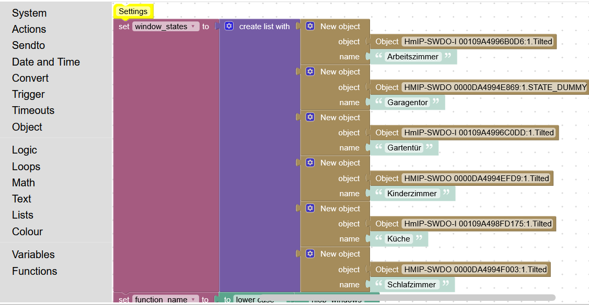</br>
</br>
</br>
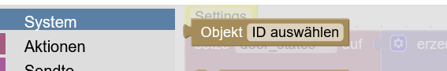</br>
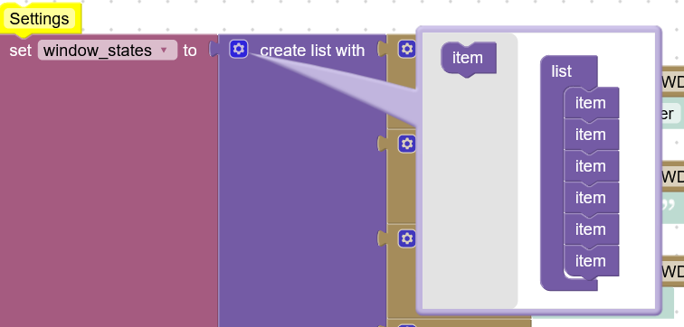

### 4.   Start Blockly now

### 5.   Create Enums

-   Add State `0_userdata.0.<userdata_object_name>.`

  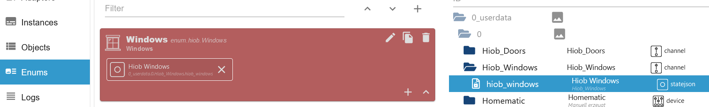

### 6.   Create Table Widget

-   **Create Table and select State**

  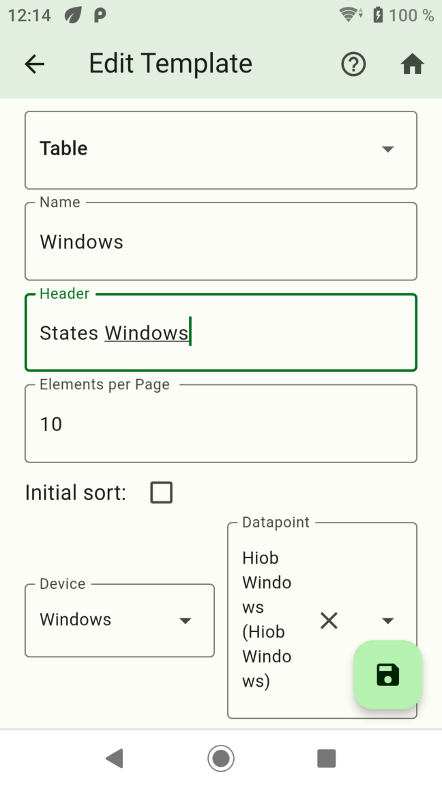

-   **Create Columns add**

  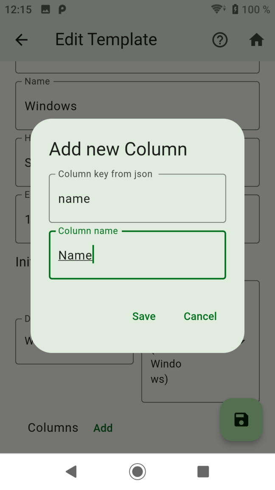</br>
  </br>
  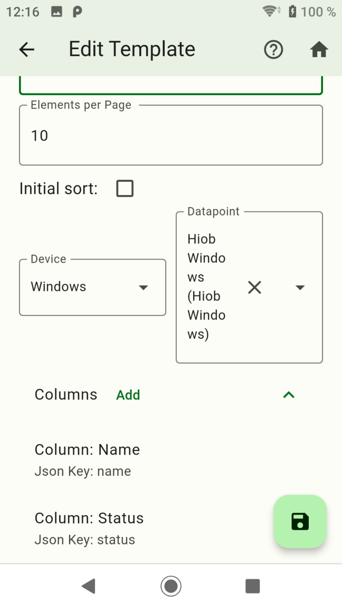

-   **Created Widget**

  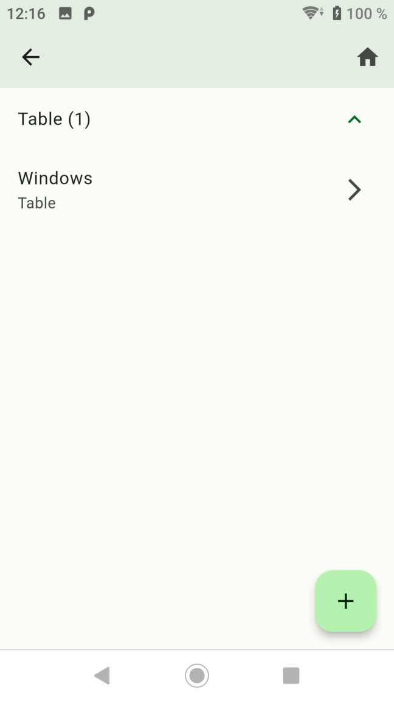

-   **Create Screen**

  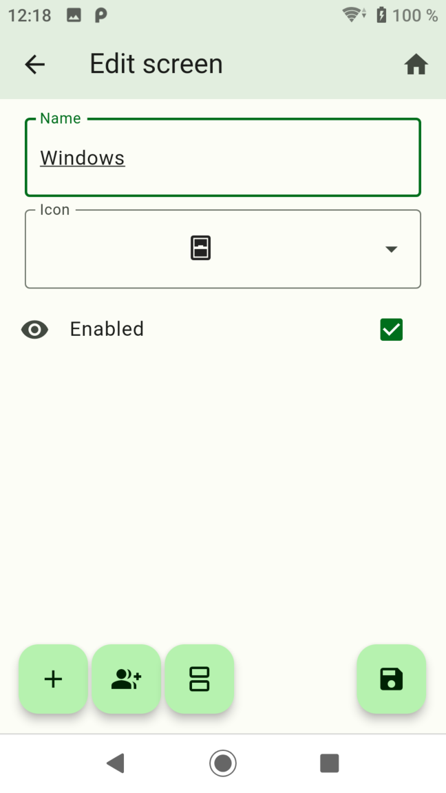</br>
  

-   **Add Widget**

  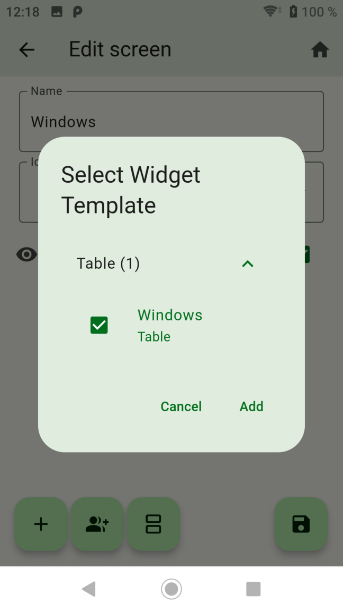


### 7.   Done

  </br>
  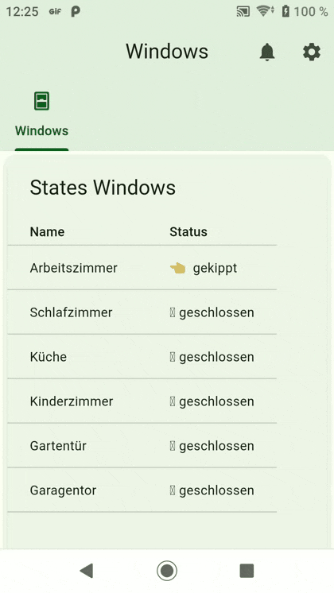

-   [Back](/docs/en/example.md)

# Import Widgets JSON

- `hiob.0.settings.Window.devices`
```JSON
[
  {
    "id": "6r-AMFoVGGLlqd9Z",
    "name": "Windows",
    "iconWrapper": {
      "iconDataType": "flutterIcons",
      "iconDataId": "e318"
    },
    "objectID": "",
    "type": 1,
    "dataPoints": [
      {
        "id": "0_userdata.0.Hiob_Windows.hiob_windows",
        "name": "Hiob Windows",
        "type": null,
        "role": "json",
        "valueType": null,
        "otherDetails": "{\"id\":\"0_userdata.0.Hiob_Windows.hiob_windows\",\"name\":\"Hiob Windows\",\"type\":null,\"role\":\"json\",\"valueType\":null,\"otherDetails\":\"{\\\"name\\\":\\\"Hiob Windows\\\",\\\"id\\\":\\\"0_userdata.0.Hiob_Windows.hiob_windows\\\",\\\"role\\\":\\\"json\\\"}\"}"
      }
    ]
  }
]
```

- `hiob.0.settings.Window.screens`
```JSON
[
  {
    "id": "testID11&",
    "name": "Windows",
    "iconWrapper": {
      "iconDataType": "flutterIcons",
      "iconDataId": "e575"
    },
    "index": 1,
    "enabled": true,
    "widgetIds": [
      {
        "widget": "Windows",
        "id": "J8-lSCg6eZXf7UoH9Da_Myzs1NeWrw=="
      }
    ]
  }
]
```

- `hiob.0.settings.Window.widgets`
```JSON
[
  {
    "id": "J8-lSCg6eZXf7UoH9Da_Myzs1NeWrw==",
    "name": "Windows",
    "widget": {
      "type": "CustomWidgetType.table",
      "name": "Windows",
      "header": "States Windows",
      "sortAsc": true,
      "initialSortColumn": 1,
      "initialSortEnabled": false,
      "elementsPerPage": 10,
      "dataPoint": "0_userdata.0.Hiob_Windows.hiob_windows",
      "columns": {
        "name": "Name",
        "status": "Status"
      }
    }
  }
]
```

-   [Back](/docs/en/example.md)

# Blockly Script - Javascript Adapter >= 7.9.0
```BLOCKLY
 <xml xmlns="https://developers.google.com/blockly/xml">
  <variables>
    <variable id="J9#xnj]T_`pv_T8Z3j4P">id</variable>
    <variable id="=s;^L;Yot`G@xI1MlCFD">folder</variable>
    <variable id="*!Af9%w:N?LO05`%n`)^">json</variable>
    <variable id="6%7Ql:MTJ|V-u4vlBL{9">json_sort</variable>
    <variable id="[QyYjC1e0scEM1?m=Qbq">new_value</variable>
    <variable id="USrf;@_^}F7F@sx(uoDY">new_state</variable>
    <variable id="5tj6;_t$!KL,@]^xY[$M">new_time</variable>
    <variable id="ZEqZvV_q(7*0AwaqO{oc">new_sort</variable>
    <variable id=";Gt$O:U5kNsg^aN(d1d=">ob_id</variable>
    <variable id="}94)ZnR6j2QS110R6SNk">objectid</variable>
    <variable id="[_*q;9;V8_BBQ8q;RE$N">new_member</variable>
    <variable id="!5%+ba[wlBCSj;`HG}0e">alias</variable>
    <variable id="K,F@7o]a,1yc{W4Pz2X[">DataP</variable>
    <variable id="JcvirzSt4Zydn]^O4VO#">DataJ</variable>
    <variable id="o`y@e!5qWiv3ejBM,*%b">objectname</variable>
    <variable id="0oAA83j|Vuq~zQ-0=j^t">window_states</variable>
    <variable id="M%4H`6{:0xG1-ByR*boL">function_name</variable>
    <variable id="|S;nuJQpV?2zc%@fAH!^">userdata_object_name</variable>
    <variable id="WSlNn@qEFx0FyWNt5DXq">alias_object_name</variable>
    <variable id="r!T%5/lLr?Zn9QugIN^X">check_alias_object</variable>
    <variable id="/;Ct0T/yZ_B{K-ozIQ!y">auto_delete_object</variable>
    <variable id="C4BSl$/$$dVO7.9n96p}">debuggen</variable>
    <variable id="~]s@j~YC$t]1N^O7/S6%">emoji_opened</variable>
    <variable id="q+^@bqF15.i@-(%7}SyQ">emoji_closed</variable>
    <variable id="$h1h~#o-kNrKdzEtEwP[">emoji_tilted</variable>
    <variable id="qq%YvI%mS=%DzLey.;x/">value_for_closed_1</variable>
    <variable id="$O]~]711Kxz0wG9[M_`[">value_for_closed_2</variable>
    <variable id="X.obfIZ*nbq7Oo7*JP1H">value_for_opened_1</variable>
    <variable id="):k8=IFXr,pz##ABE/N+">value_for_opened_2</variable>
    <variable id="O:VwcZdGzff:RP1bT8.w">value_for_tilted_1</variable>
    <variable id="[Y^,c{:5aX]?[,}o2Xtq">value_for_tilted_2</variable>
    <variable id="`yr88l{oh09yMP8,%r4|">window_array</variable>
    <variable id="{HO*ejwC|V!p5QQkFp[%">member_array</variable>
    <variable id="b]bEh3Z9=I8DyfQ$jy?x">count_object</variable>
    <variable id=";_|Dzt@aFKOl9yu~fBjG">i</variable>
    <variable id="o={_(6J}(knCi~)Nz-o3">id_object</variable>
    <variable id="gz^gOjY:Pl88w;HGnT+e">id_alias_object</variable>
    <variable id="(Y8q^y]GAa/hi/jKbwjb">emoji_state</variable>
    <variable id="1#2z((9AxytRCCK,4%,h">state_sort</variable>
    <variable id="qIaB0#988#CV4fB_etNn">j</variable>
    <variable id="+r3dpiPN^gCr*`LFd.y]">k</variable>
    <variable id="4_Q{v}xt/x(N4w)Oz=k$">actual_state</variable>
  </variables>
  <block type="procedures_defcustomnoreturn" id="]J|BpoSWXM#^PQnZ0ok3" x="-487" y="-537">
    <mutation statements="false">
      <arg name="id" varid="J9#xnj]T_`pv_T8Z3j4P"></arg>
    </mutation>
    <field name="NAME">delete_object</field>
    <field name="SCRIPT">YXdhaXQgZGVsZXRlT2JqZWN0QXN5bmMoaWQpOw==</field>
    <comment pinned="false" h="80" w="160">Beschreibe diese Funktion …</comment>
  </block>
  <block type="procedures_defcustomreturn" id="Cfzjqpyx0Zjnq(eMFjp." x="-487" y="-512">
    <mutation statements="false">
      <arg name="folder" varid="=s;^L;Yot`G@xI1MlCFD"></arg>
    </mutation>
    <field name="NAME">selector_alias_folder</field>
    <field name="SCRIPT">cmV0dXJuIEFycmF5LnByb3RvdHlwZS5zbGljZS5hcHBseSgkKCdjaGFubmVsW3N0YXRlLmlkPWFsaWFzLjAuJyArIGZvbGRlciArICcuKl0nKSk7</field>
    <comment pinned="false" h="80" w="160">Beschreibe diese Funktion …</comment>
  </block>
  <block type="procedures_defcustomreturn" id="Ga}1~S{x(CL5d35B`^Mj" x="-487" y="-487">
    <mutation statements="false">
      <arg name="id" varid="J9#xnj]T_`pv_T8Z3j4P"></arg>
      <arg name="json" varid="*!Af9%w:N?LO05`%n`)^"></arg>
    </mutation>
    <field name="NAME">schedule_check</field>
    <field name="SCRIPT">Y29uc3Qgb2JqID0ganNvbi5maW5kKG9iaiA9PiBvYmouaWQgPT0gaWQpOw0KaWYgKG9iaikgew0KICAgIHJldHVybiB0cnVlOw0KfSBlbHNlIHsNCiAgICByZXR1cm4gZmFsc2U7DQp9</field>
    <comment pinned="false" h="80" w="160">Beschreibe diese Funktion …</comment>
  </block>
  <block type="procedures_defcustomreturn" id=".pWuWVjsjLghIQ)@6_*W" x="-487" y="-462">
    <mutation statements="false">
      <arg name="json_sort" varid="6%7Ql:MTJ|V-u4vlBL{9"></arg>
    </mutation>
    <field name="NAME">sort_json</field>
    <field name="SCRIPT">Ly92YXIgbmV3X2pzb24gPSBKU09OLnBhcnNlKGpzb25fc29ydCk7DQovL25ld19qc29uLnNvcnQoZnVuY3Rpb24oYSwgYil7DQovLyAgICByZXR1cm4gYS52YWx1ZSAtIGIudmFsdWU7DQovL30pOw0KcmV0dXJuIGpzb25fc29ydC5zb3J0KChhLCBiKSA9PiB7DQogICAgYS5uYW1lLmxvY2FsZUNvbXBhcmUoYi5uYW1lKTsNCiAgICByZXR1cm4gYS5zb3J0IC0gYi5zb3J0Ow0KfSk7</field>
    <comment pinned="false" h="80" w="160">Beschreibe diese Funktion …</comment>
  </block>
  <block type="procedures_defcustomnoreturn" id="fY2L.FIp7(@B8HQK:F0@" x="-487" y="-437">
    <mutation statements="false">
      <arg name="json" varid="*!Af9%w:N?LO05`%n`)^"></arg>
      <arg name="id" varid="J9#xnj]T_`pv_T8Z3j4P"></arg>
      <arg name="new_value" varid="[QyYjC1e0scEM1?m=Qbq"></arg>
      <arg name="new_state" varid="USrf;@_^}F7F@sx(uoDY"></arg>
      <arg name="new_time" varid="5tj6;_t$!KL,@]^xY[$M"></arg>
      <arg name="new_sort" varid="ZEqZvV_q(7*0AwaqO{oc"></arg>
    </mutation>
    <field name="NAME">find_object</field>
    <field name="SCRIPT">Y29uc3Qgb2JqID0ganNvbi5maW5kKG9iaiA9PiBvYmouaWQgPT0gaWQpOw0KaWYgKG9iaikgew0KICAgIG9iai52YWx1ZSA9IG5ld192YWx1ZTsNCiAgICBvYmouc3RhdHVzID0gbmV3X3N0YXRlOw0KICAgIG9iai50aW1lID0gbmV3X3RpbWU7DQogICAgb2JqLnNvcnQgPSBuZXdfc29ydDsNCn0gZWxzZSB7DQogICAgY29uc29sZS5sb2coIkNhbm5vdCBmaW5kIFN0YXRlIC0gIiArIGlkKTsNCn0=</field>
    <comment pinned="false" h="80" w="160">Beschreibe diese Funktion …</comment>
  </block>
  <block type="procedures_defcustomreturn" id="hh)OHe58`_Ukv@H8gn4W" x="-487" y="-412">
    <mutation statements="false">
      <arg name="id" varid="J9#xnj]T_`pv_T8Z3j4P"></arg>
      <arg name="json" varid="*!Af9%w:N?LO05`%n`)^"></arg>
      <arg name="ob_id" varid=";Gt$O:U5kNsg^aN(d1d="></arg>
    </mutation>
    <field name="NAME">create_alias</field>
    <field name="SCRIPT">dHJ5IHsNCiAgICBqc29uWyJjb21tb24iXVsiYWxpYXMiXSA9IHsNCiAgICAgICAgaWQ6IG9iX2lkLA0KICAgIH0NCn0gY2F0Y2ggKGUpIHsNCiAgICBjb25zb2xlLmxvZygiSlNPTjogIiArIGUpOw0KICAgIHJldHVybiBmYWxzZTsNCn0NCnRyeSB7DQogICAgYXdhaXQgY3JlYXRlQWxpYXNBc3luYyhpZCwgb2JfaWQsIGZhbHNlLCBqc29uWyJjb21tb24iXSk7DQogICAgcmV0dXJuIHRydWU7DQp9IGNhdGNoIChlKSB7DQogICAgY29uc29sZS5sb2coIkNyZWF0ZTogIiArIGUpOw0KICAgIHJldHVybiBmYWxzZTsNCn0=</field>
    <comment pinned="false" h="80" w="160">Beschreibe diese Funktion …</comment>
  </block>
  <block type="procedures_defcustomnoreturn" id="GU5fSBN`C+DY4-$ia!{?" x="-487" y="-387">
    <mutation statements="false">
      <arg name="objectid" varid="}94)ZnR6j2QS110R6SNk"></arg>
      <arg name="new_member" varid="[_*q;9;V8_BBQ8q;RE$N"></arg>
    </mutation>
    <field name="NAME">set_members</field>
    <field name="SCRIPT">YXdhaXQgZXh0ZW5kT2JqZWN0QXN5bmMob2JqZWN0aWQsIHtjb21tb246IHttZW1iZXJzOiBuZXdfbWVtYmVyfX0pOw==</field>
    <comment pinned="false" h="80" w="160">Describe this function...</comment>
  </block>
  <block type="procedures_defcustomreturn" id="orR$%7biw]gTpSN]SfK`" x="-487" y="-362">
    <mutation statements="false">
      <arg name="alias" varid="!5%+ba[wlBCSj;`HG}0e"></arg>
    </mutation>
    <field name="NAME">selector</field>
    <field name="SCRIPT">cmV0dXJuIEFycmF5LnByb3RvdHlwZS5zbGljZS5hcHBseSgkKCdzdGF0ZVtpZD0qXShmdW5jdGlvbnM9JyArIGFsaWFzICsgJyknKSk7Ow==</field>
    <comment pinned="false" h="80" w="160">Describe this function...</comment>
  </block>
  <block type="procedures_defcustomnoreturn" id="CJ8Zcc-xzs^SogX?vx}r" x="-487" y="-337">
    <mutation statements="false">
      <arg name="DataP" varid="K,F@7o]a,1yc{W4Pz2X["></arg>
      <arg name="DataJ" varid="JcvirzSt4Zydn]^O4VO#"></arg>
    </mutation>
    <field name="NAME">datapointcreate</field>
    <field name="SCRIPT">Y3JlYXRlU3RhdGUoRGF0YVAsIERhdGFKKTs=</field>
    <comment pinned="false" h="80" w="160">Beschreibe diese Funktion …</comment>
  </block>
  <block type="procedures_defcustomreturn" id="$KR-X@{G/.vido.W$31-" x="-487" y="-312">
    <mutation statements="false">
      <arg name="id" varid="J9#xnj]T_`pv_T8Z3j4P"></arg>
    </mutation>
    <field name="NAME">datapointcheck</field>
    <field name="SCRIPT">cmV0dXJuICEhJChpZCkubGVuZ3RoOw==</field>
    <comment pinned="false" h="80" w="160">Beschreibe diese Funktion …</comment>
  </block>
  <block type="procedures_defcustomnoreturn" id="-Sg^:tBR!;/FL|3na~kR" x="-487" y="-287">
    <mutation statements="false">
      <arg name="DataP" varid="K,F@7o]a,1yc{W4Pz2X["></arg>
      <arg name="DataJ" varid="JcvirzSt4Zydn]^O4VO#"></arg>
    </mutation>
    <field name="NAME">channelcreate</field>
    <field name="SCRIPT">c2V0T2JqZWN0KERhdGFQLCBEYXRhSik7IA==</field>
    <comment pinned="false" h="80" w="160">Beschreibe diese Funktion …</comment>
  </block>
  <block type="procedures_defcustomreturn" id="TPDWEp-dsh~Q5^kj{b@(" x="-487" y="-262">
    <mutation statements="false">
      <arg name="id" varid="J9#xnj]T_`pv_T8Z3j4P"></arg>
    </mutation>
    <field name="NAME">channelcheck</field>
    <field name="SCRIPT">Y29uc3Qgb2JqID0gYXdhaXQgZXhpc3RzT2JqZWN0QXN5bmMoaWQpOw0KcmV0dXJuIG9iajs=</field>
    <comment pinned="false" h="80" w="160">Beschreibe diese Funktion …</comment>
  </block>
  <block type="procedures_defcustomreturn" id="g0RCA8X}Y6o}1X]8SubM" x="-487" y="-237">
    <mutation statements="false">
      <arg name="objectname" varid="o`y@e!5qWiv3ejBM,*%b"></arg>
    </mutation>
    <field name="NAME">getDatapoint</field>
    <field name="SCRIPT">cmV0dXJuIGF3YWl0IGdldFN0YXRlQXN5bmMob2JqZWN0bmFtZSk7DQo=</field>
    <comment pinned="false" h="80" w="160">Beschreibe diese Funktion …</comment>
  </block>
  <block type="comment" id="d8F$eZ57{Vum;L+6a{gq" x="-487" y="-187">
    <field name="COMMENT">Settings</field>
    <next>
      <block type="variables_set" id="xa,3z3q%soe6GR{-y{pJ">
        <field name="VAR" id="0oAA83j|Vuq~zQ-0=j^t">window_states</field>
        <value name="VALUE">
          <block type="lists_create_with" id="9,|7?,+h9~{vCPP0uk!o">
            <mutation items="1"></mutation>
            <value name="ADD0">
              <block type="object_new" id="05Wa1Ca)RTEX7{2#QiTm">
                <mutation xmlns="http://www.w3.org/1999/xhtml">
                  <attribute id="ATTR_0" name="object"></attribute>
                  <attribute id="ATTR_1" name="name"></attribute>
                </mutation>
                <value name="ATTR_0">
                  <shadow type="text" id="smAx|hRmkSD2bbhY?Y:+">
                    <field name="TEXT"></field>
                  </shadow>
                  <block type="get_object" id="9t]KVhQ4yk:~d]~n{RRo">
                    <field name="OID">select ID</field>
                  </block>
                </value>
                <value name="ATTR_1">
                  <shadow type="text" id="}oof|trF(0+yN~JWZBwr">
                    <field name="TEXT">Name</field>
                  </shadow>
                </value>
              </block>
            </value>
          </block>
        </value>
        <next>
          <block type="variables_set" id="%dPU+j3%g,Kq,5XuArRU">
            <field name="VAR" id="M%4H`6{:0xG1-ByR*boL">function_name</field>
            <value name="VALUE">
              <block type="text_changeCase" id="hZ-`3{!]aQdvg}**Fe||">
                <field name="CASE">LOWERCASE</field>
                <value name="TEXT">
                  <shadow type="text" id="L)|oS|DM(ZT)c[(tuG3m">
                    <field name="TEXT">abc</field>
                  </shadow>
                  <block type="text" id="Mt@g`7/XkWaQO#A=kLV5">
                    <field name="TEXT">hiob_windows</field>
                  </block>
                </value>
              </block>
            </value>
            <next>
              <block type="variables_set" id="6;}Twawj}eV(B*30KY@p">
                <field name="VAR" id="|S;nuJQpV?2zc%@fAH!^">userdata_object_name</field>
                <value name="VALUE">
                  <block type="text" id="[`/HpA@Ma,f?IZCNjJ,+">
                    <field name="TEXT">Hiob_Windows</field>
                  </block>
                </value>
                <next>
                  <block type="variables_set" id="Gq=|KIuBU7wdS5j8`;]^">
                    <field name="VAR" id="WSlNn@qEFx0FyWNt5DXq">alias_object_name</field>
                    <value name="VALUE">
                      <block type="text" id="L!9[x8n8g`FF5~KZnXW)">
                        <field name="TEXT">Hiob_Windows</field>
                      </block>
                    </value>
                    <next>
                      <block type="variables_set" id="04/!(9,]fj#8i_twBe_K">
                        <field name="VAR" id="r!T%5/lLr?Zn9QugIN^X">check_alias_object</field>
                        <value name="VALUE">
                          <block type="logic_boolean" id="a=m?{^ieWk}_L7=uG|:T">
                            <field name="BOOL">TRUE</field>
                          </block>
                        </value>
                        <next>
                          <block type="variables_set" id="7Pkk-YwpA9atjv|.X=33">
                            <field name="VAR" id="/;Ct0T/yZ_B{K-ozIQ!y">auto_delete_object</field>
                            <value name="VALUE">
                              <block type="logic_boolean" id="#kJj@;Sc@zUxJ5MmBb$%">
                                <field name="BOOL">TRUE</field>
                              </block>
                            </value>
                            <next>
                              <block type="variables_set" id="2}wAuQ+v?UnJ9lP[zvw}">
                                <field name="VAR" id="C4BSl$/$$dVO7.9n96p}">debuggen</field>
                                <value name="VALUE">
                                  <block type="logic_boolean" id="(n60/?ir-HT;;XaG=#(P">
                                    <field name="BOOL">FALSE</field>
                                  </block>
                                </value>
                                <next>
                                  <block type="variables_set" id="WIlKgr|S!@xi$cB1`nOm">
                                    <field name="VAR" id="~]s@j~YC$t]1N^O7/S6%">emoji_opened</field>
                                    <value name="VALUE">
                                      <block type="text" id="fjBB=J]7yiqe%Z;_vsFT">
                                        <field name="TEXT">☝️ geöffnet</field>
                                      </block>
                                    </value>
                                    <next>
                                      <block type="variables_set" id="yWox,0QU0%QdgW]3L=Z:">
                                        <field name="VAR" id="q+^@bqF15.i@-(%7}SyQ">emoji_closed</field>
                                        <value name="VALUE">
                                          <block type="text" id="yHO#h,Kt~A9vLL/Pw2Uh">
                                            <field name="TEXT">🪟 geschlossen</field>
                                          </block>
                                        </value>
                                        <next>
                                          <block type="variables_set" id="x]p85XC~cp.c[vL1i4,q">
                                            <field name="VAR" id="$h1h~#o-kNrKdzEtEwP[">emoji_tilted</field>
                                            <value name="VALUE">
                                              <block type="text" id="vB[bnPuZxlv+VD0pk;x)">
                                                <field name="TEXT">👈  gekippt</field>
                                              </block>
                                            </value>
                                            <next>
                                              <block type="variables_set" id="afnO1pY(gEimLshYX:gZ">
                                                <field name="VAR" id="qq%YvI%mS=%DzLey.;x/">value_for_closed_1</field>
                                                <value name="VALUE">
                                                  <block type="math_number" id="zi,59sJkUPF+9Tb!-{BB">
                                                    <field name="NUM">0</field>
                                                  </block>
                                                </value>
                                                <next>
                                                  <block type="variables_set" id="-xv4}(v]:UXEs9DD|GQ:">
                                                    <field name="VAR" id="$O]~]711Kxz0wG9[M_`[">value_for_closed_2</field>
                                                    <value name="VALUE">
                                                      <block type="text" id="(Vk.VCr$3]EKErrrv@0q">
                                                        <field name="TEXT">Closed</field>
                                                      </block>
                                                    </value>
                                                    <next>
                                                      <block type="variables_set" id="tx{nbWJ%+$Z0Rlg}#]7$">
                                                        <field name="VAR" id="X.obfIZ*nbq7Oo7*JP1H">value_for_opened_1</field>
                                                        <value name="VALUE">
                                                          <block type="math_number" id=";v)/x/-Z?CZ(mZs:yDt!">
                                                            <field name="NUM">1</field>
                                                          </block>
                                                        </value>
                                                        <next>
                                                          <block type="variables_set" id="B?K$cL3+Yw;!8T/S-~!|">
                                                            <field name="VAR" id="):k8=IFXr,pz##ABE/N+">value_for_opened_2</field>
                                                            <value name="VALUE">
                                                              <block type="text" id="sxevoa,LnfJuwF_{_6U#">
                                                                <field name="TEXT">Open</field>
                                                              </block>
                                                            </value>
                                                            <next>
                                                              <block type="variables_set" id="(^3V{`#4(;0XLANnf3{h">
                                                                <field name="VAR" id="O:VwcZdGzff:RP1bT8.w">value_for_tilted_1</field>
                                                                <value name="VALUE">
                                                                  <block type="math_number" id="]_WKVQ=QB:JRY]SLyO=U">
                                                                    <field name="NUM">2</field>
                                                                  </block>
                                                                </value>
                                                                <next>
                                                                  <block type="variables_set" id="$8qt39C5@)@mt)Zn}:@+">
                                                                    <field name="VAR" id="[Y^,c{:5aX]?[,}o2Xtq">value_for_tilted_2</field>
                                                                    <value name="VALUE">
                                                                      <block type="text" id="X-aMd)Pq^V-AO3xtq~zS">
                                                                        <field name="TEXT">Tilted</field>
                                                                      </block>
                                                                    </value>
                                                                    <next>
                                                                      <block type="comment" id="Ka0240Pi5aiP{,oIN.di">
                                                                        <field name="COMMENT">Script</field>
                                                                        <next>
                                                                          <block type="controls_if" id="Y`aH;7xr6%Lb=X^X(x}." collapsed="true">
                                                                            <value name="IF0">
                                                                              <block type="logic_negate" id="O3A9n(6zlW53@Stf}mmx">
                                                                                <value name="BOOL">
                                                                                  <block type="procedures_callcustomreturn" id="j9l:xIOu%e.AN{R6_x!H">
                                                                                    <mutation name="channelcheck">
                                                                                      <arg name="id"></arg>
                                                                                    </mutation>
                                                                                    <value name="ARG0">
                                                                                      <block type="text_join" id="dw:Y1uT3k20JYWH/Z%cy">
                                                                                        <mutation items="2"></mutation>
                                                                                        <value name="ADD0">
                                                                                          <block type="text" id="pVh(!7$!i68,1W2uE=GQ">
                                                                                            <field name="TEXT">0_userdata.0.</field>
                                                                                          </block>
                                                                                        </value>
                                                                                        <value name="ADD1">
                                                                                          <block type="variables_get" id="P~2av2k`dIa!QEnrP;p%">
                                                                                            <field name="VAR" id="|S;nuJQpV?2zc%@fAH!^">userdata_object_name</field>
                                                                                          </block>
                                                                                        </value>
                                                                                      </block>
                                                                                    </value>
                                                                                  </block>
                                                                                </value>
                                                                              </block>
                                                                            </value>
                                                                            <statement name="DO0">
                                                                              <block type="controls_if" id="=,lJl=J[.**OOeF4{p,=">
                                                                                <value name="IF0">
                                                                                  <block type="variables_get" id="Pz^R)NB,3G#,!6|S=o;}">
                                                                                    <field name="VAR" id="C4BSl$/$$dVO7.9n96p}">debuggen</field>
                                                                                  </block>
                                                                                </value>
                                                                                <statement name="DO0">
                                                                                  <block type="debug" id="skaXT$+MMbp4Bdq;zxs.">
                                                                                    <field name="Severity">log</field>
                                                                                    <value name="TEXT">
                                                                                      <shadow type="text" id="iv4_bT9x=W%XrvPzZch)">
                                                                                        <field name="TEXT">text</field>
                                                                                      </shadow>
                                                                                      <block type="text_join" id="G**Okel*K0/hB/7@oYYD">
                                                                                        <mutation items="3"></mutation>
                                                                                        <value name="ADD0">
                                                                                          <block type="text" id="7BI[b0],Wr9pYP:Oyud=">
                                                                                            <field name="TEXT">Channel 0_userdata.0.</field>
                                                                                          </block>
                                                                                        </value>
                                                                                        <value name="ADD1">
                                                                                          <block type="variables_get" id="nClD|*RDt#)%fUe2HG4G">
                                                                                            <field name="VAR" id="|S;nuJQpV?2zc%@fAH!^">userdata_object_name</field>
                                                                                          </block>
                                                                                        </value>
                                                                                        <value name="ADD2">
                                                                                          <block type="text" id="jj$p1}lJ}YQ6ld5K{TH;">
                                                                                            <field name="TEXT"> wird erstellt!</field>
                                                                                          </block>
                                                                                        </value>
                                                                                      </block>
                                                                                    </value>
                                                                                  </block>
                                                                                </statement>
                                                                                <next>
                                                                                  <block type="procedures_callcustomnoreturn" id="A#+-vRDkW]V[}x/Z].@6">
                                                                                    <mutation name="channelcreate">
                                                                                      <arg name="DataP"></arg>
                                                                                      <arg name="DataJ"></arg>
                                                                                    </mutation>
                                                                                    <value name="ARG0">
                                                                                      <block type="text_join" id="koGr!ieTD+4U,)ZUl{Ix">
                                                                                        <mutation items="2"></mutation>
                                                                                        <value name="ADD0">
                                                                                          <block type="text" id="#*N-%YTdYt8@0d#[|a#:">
                                                                                            <field name="TEXT">0_userdata.0.</field>
                                                                                          </block>
                                                                                        </value>
                                                                                        <value name="ADD1">
                                                                                          <block type="variables_get" id="/BZSdZD#TVd7KvWxK1S^">
                                                                                            <field name="VAR" id="|S;nuJQpV?2zc%@fAH!^">userdata_object_name</field>
                                                                                          </block>
                                                                                        </value>
                                                                                      </block>
                                                                                    </value>
                                                                                    <value name="ARG1">
                                                                                      <block type="object_new" id="7Uy|WuBz3NOWe=n04Ap|">
                                                                                        <mutation xmlns="http://www.w3.org/1999/xhtml">
                                                                                          <attribute id="ATTR_0" name="type"></attribute>
                                                                                          <attribute id="ATTR_1" name="common"></attribute>
                                                                                        </mutation>
                                                                                        <value name="ATTR_0">
                                                                                          <shadow type="text" id="-I:`dWtO^^Isk3VSCVo%">
                                                                                            <field name="TEXT"></field>
                                                                                          </shadow>
                                                                                          <block type="text" id="?HbIo?fr]{O6-AaFw:zA">
                                                                                            <field name="TEXT">channel</field>
                                                                                          </block>
                                                                                        </value>
                                                                                        <value name="ATTR_1">
                                                                                          <shadow type="text" id="hCN(ZQII,wc20AB1ccMn">
                                                                                            <field name="TEXT"></field>
                                                                                          </shadow>
                                                                                          <block type="object_new" id="3BD5.|t@SrObR};Tb[IO">
                                                                                            <mutation xmlns="http://www.w3.org/1999/xhtml">
                                                                                              <attribute id="ATTR_0" name="name"></attribute>
                                                                                            </mutation>
                                                                                            <value name="ATTR_0">
                                                                                              <shadow type="text" id="jqJHx91e5oN)i0;?b-{n">
                                                                                                <field name="TEXT"></field>
                                                                                              </shadow>
                                                                                              <block type="variables_get" id="s26om{@k{f+{#xB7HYXa">
                                                                                                <field name="VAR" id="|S;nuJQpV?2zc%@fAH!^">userdata_object_name</field>
                                                                                              </block>
                                                                                            </value>
                                                                                          </block>
                                                                                        </value>
                                                                                      </block>
                                                                                    </value>
                                                                                  </block>
                                                                                </next>
                                                                              </block>
                                                                            </statement>
                                                                            <next>
                                                                              <block type="controls_if" id="O#(+;Quaby:nd/^[E?n!" collapsed="true">
                                                                                <value name="IF0">
                                                                                  <block type="logic_negate" id="zm[K.x:v4Zl8{Anbs!L(">
                                                                                    <value name="BOOL">
                                                                                      <block type="procedures_callcustomreturn" id="$_5YLFF,}J?lcWCYZffW">
                                                                                        <mutation name="channelcheck">
                                                                                          <arg name="id"></arg>
                                                                                        </mutation>
                                                                                        <value name="ARG0">
                                                                                          <block type="text_join" id="h!iI8D(0uc-Ot?N8cD0s">
                                                                                            <mutation items="2"></mutation>
                                                                                            <value name="ADD0">
                                                                                              <block type="text" id="r(f%:v./UVy.bhmGg:pp">
                                                                                                <field name="TEXT">alias.0.</field>
                                                                                              </block>
                                                                                            </value>
                                                                                            <value name="ADD1">
                                                                                              <block type="variables_get" id="Y#A2.)t4][q[E8EJqtFn">
                                                                                                <field name="VAR" id="WSlNn@qEFx0FyWNt5DXq">alias_object_name</field>
                                                                                              </block>
                                                                                            </value>
                                                                                          </block>
                                                                                        </value>
                                                                                      </block>
                                                                                    </value>
                                                                                  </block>
                                                                                </value>
                                                                                <statement name="DO0">
                                                                                  <block type="controls_if" id="3kznXvEWB[j5]6vhQbW0">
                                                                                    <value name="IF0">
                                                                                      <block type="variables_get" id="(x8mg{izxHaQLE,6V(C6">
                                                                                        <field name="VAR" id="C4BSl$/$$dVO7.9n96p}">debuggen</field>
                                                                                      </block>
                                                                                    </value>
                                                                                    <statement name="DO0">
                                                                                      <block type="debug" id="b3|i+JG/z$aJ(A~B$JeI">
                                                                                        <field name="Severity">log</field>
                                                                                        <value name="TEXT">
                                                                                          <shadow type="text" id="iv4_bT9x=W%XrvPzZch)">
                                                                                            <field name="TEXT">text</field>
                                                                                          </shadow>
                                                                                          <block type="text_join" id="TPKCLjf0[*q,)kEQ?~-}">
                                                                                            <mutation items="3"></mutation>
                                                                                            <value name="ADD0">
                                                                                              <block type="text" id="j$xy(;^RP06mwyVQ3N@j">
                                                                                                <field name="TEXT">Channel alias.0.</field>
                                                                                              </block>
                                                                                            </value>
                                                                                            <value name="ADD1">
                                                                                              <block type="variables_get" id="0fFpmlJmN4ZuQ|czpl$Z">
                                                                                                <field name="VAR" id="WSlNn@qEFx0FyWNt5DXq">alias_object_name</field>
                                                                                              </block>
                                                                                            </value>
                                                                                            <value name="ADD2">
                                                                                              <block type="text" id="j{0UnBBLTarAwWAnQ@x}">
                                                                                                <field name="TEXT"> wird erstellt!</field>
                                                                                              </block>
                                                                                            </value>
                                                                                          </block>
                                                                                        </value>
                                                                                      </block>
                                                                                    </statement>
                                                                                    <next>
                                                                                      <block type="procedures_callcustomnoreturn" id="sRXb4ENza|5_La=`O(f^">
                                                                                        <mutation name="channelcreate">
                                                                                          <arg name="DataP"></arg>
                                                                                          <arg name="DataJ"></arg>
                                                                                        </mutation>
                                                                                        <value name="ARG0">
                                                                                          <block type="text_join" id="v9cX+5R5BgrF@h13d(R8">
                                                                                            <mutation items="2"></mutation>
                                                                                            <value name="ADD0">
                                                                                              <block type="text" id="b.[:S:LEIYCS:l.DJG|6">
                                                                                                <field name="TEXT">alias.0.</field>
                                                                                              </block>
                                                                                            </value>
                                                                                            <value name="ADD1">
                                                                                              <block type="variables_get" id="Ctz.8WSHEz{VHv},T%{d">
                                                                                                <field name="VAR" id="WSlNn@qEFx0FyWNt5DXq">alias_object_name</field>
                                                                                              </block>
                                                                                            </value>
                                                                                          </block>
                                                                                        </value>
                                                                                        <value name="ARG1">
                                                                                          <block type="object_new" id="P7mB%knM7|Z{C*WqO=!0">
                                                                                            <mutation xmlns="http://www.w3.org/1999/xhtml">
                                                                                              <attribute id="ATTR_0" name="type"></attribute>
                                                                                              <attribute id="ATTR_1" name="common"></attribute>
                                                                                            </mutation>
                                                                                            <value name="ATTR_0">
                                                                                              <shadow type="text" id="-I:`dWtO^^Isk3VSCVo%">
                                                                                                <field name="TEXT"></field>
                                                                                              </shadow>
                                                                                              <block type="text" id=")Y;4(NKe-lZ`smjD)Yxe">
                                                                                                <field name="TEXT">channel</field>
                                                                                              </block>
                                                                                            </value>
                                                                                            <value name="ATTR_1">
                                                                                              <shadow type="text" id="hCN(ZQII,wc20AB1ccMn">
                                                                                                <field name="TEXT"></field>
                                                                                              </shadow>
                                                                                              <block type="object_new" id="jLiJ~)?L[gXqKgs]z`j%">
                                                                                                <mutation xmlns="http://www.w3.org/1999/xhtml">
                                                                                                  <attribute id="ATTR_0" name="name"></attribute>
                                                                                                </mutation>
                                                                                                <value name="ATTR_0">
                                                                                                  <shadow type="text" id="jqJHx91e5oN)i0;?b-{n">
                                                                                                    <field name="TEXT"></field>
                                                                                                  </shadow>
                                                                                                  <block type="variables_get" id="?Nv.;JZ,9}nj@#wD$fp)">
                                                                                                    <field name="VAR" id="WSlNn@qEFx0FyWNt5DXq">alias_object_name</field>
                                                                                                  </block>
                                                                                                </value>
                                                                                              </block>
                                                                                            </value>
                                                                                          </block>
                                                                                        </value>
                                                                                      </block>
                                                                                    </next>
                                                                                  </block>
                                                                                </statement>
                                                                                <next>
                                                                                  <block type="controls_if" id="WOsNuV1`Xc9Eum]Ya88m" collapsed="true">
                                                                                    <mutation else="1"></mutation>
                                                                                    <value name="IF0">
                                                                                      <block type="logic_negate" id="J:uFpSAxpU;=E@^bSPoW">
                                                                                        <value name="BOOL">
                                                                                          <block type="procedures_callcustomreturn" id="sa;1VDmOW}@3sgz}BF#D">
                                                                                            <mutation name="datapointcheck">
                                                                                              <arg name="id"></arg>
                                                                                            </mutation>
                                                                                            <value name="ARG0">
                                                                                              <block type="text_join" id="H3U5!$MCb@j0dQTjBDFY">
                                                                                                <mutation items="3"></mutation>
                                                                                                <value name="ADD0">
                                                                                                  <block type="text" id="qIlehRK$Rqso(~6,Vp}c">
                                                                                                    <field name="TEXT">0_userdata.0.</field>
                                                                                                  </block>
                                                                                                </value>
                                                                                                <value name="ADD1">
                                                                                                  <block type="variables_get" id="Hd*f@F]~VUfFqm/29]A.">
                                                                                                    <field name="VAR" id="|S;nuJQpV?2zc%@fAH!^">userdata_object_name</field>
                                                                                                  </block>
                                                                                                </value>
                                                                                                <value name="ADD2">
                                                                                                  <block type="text" id="Cu-66u%b.%U$`KVBx4[v">
                                                                                                    <field name="TEXT">.hiob_windows</field>
                                                                                                  </block>
                                                                                                </value>
                                                                                              </block>
                                                                                            </value>
                                                                                          </block>
                                                                                        </value>
                                                                                      </block>
                                                                                    </value>
                                                                                    <statement name="DO0">
                                                                                      <block type="controls_if" id="za+:Kn/+MxKFlzZb7YLk">
                                                                                        <value name="IF0">
                                                                                          <block type="variables_get" id="L67^GVN-zsxr.8G%824L">
                                                                                            <field name="VAR" id="C4BSl$/$$dVO7.9n96p}">debuggen</field>
                                                                                          </block>
                                                                                        </value>
                                                                                        <statement name="DO0">
                                                                                          <block type="debug" id="7)5Kif3J974nYOt#c(S,">
                                                                                            <field name="Severity">log</field>
                                                                                            <value name="TEXT">
                                                                                              <shadow type="text" id="bVeo-u@eMdgz9S`wT_f$">
                                                                                                <field name="TEXT">text</field>
                                                                                              </shadow>
                                                                                              <block type="text_join" id="6l1?R#*KPr=*M_y*YHtM">
                                                                                                <mutation items="3"></mutation>
                                                                                                <value name="ADD0">
                                                                                                  <block type="text" id="OggzQ4P]^GP09Ow{7=KB">
                                                                                                    <field name="TEXT">Create 0_userdata.0.</field>
                                                                                                  </block>
                                                                                                </value>
                                                                                                <value name="ADD1">
                                                                                                  <block type="variables_get" id="5nrpR7V-h|O~v?c2zQ=W">
                                                                                                    <field name="VAR" id="|S;nuJQpV?2zc%@fAH!^">userdata_object_name</field>
                                                                                                  </block>
                                                                                                </value>
                                                                                                <value name="ADD2">
                                                                                                  <block type="text" id="K{[0NJ:wt_G@~mV{@}!7">
                                                                                                    <field name="TEXT">.hiob_windows</field>
                                                                                                  </block>
                                                                                                </value>
                                                                                              </block>
                                                                                            </value>
                                                                                          </block>
                                                                                        </statement>
                                                                                        <next>
                                                                                          <block type="procedures_callcustomnoreturn" id="1=WVx,e[e#RIn%5M~(OP">
                                                                                            <mutation name="datapointcreate">
                                                                                              <arg name="DataP"></arg>
                                                                                              <arg name="DataJ"></arg>
                                                                                            </mutation>
                                                                                            <value name="ARG0">
                                                                                              <block type="text_join" id="RjZY{8U0-}XwuH*09`wV">
                                                                                                <mutation items="3"></mutation>
                                                                                                <value name="ADD0">
                                                                                                  <block type="text" id="8,`b[HAO;`c9Q*JMJ*ak">
                                                                                                    <field name="TEXT">0_userdata.0.</field>
                                                                                                  </block>
                                                                                                </value>
                                                                                                <value name="ADD1">
                                                                                                  <block type="variables_get" id="0oPu~|WBX8Pi9Vs9o4%e">
                                                                                                    <field name="VAR" id="|S;nuJQpV?2zc%@fAH!^">userdata_object_name</field>
                                                                                                  </block>
                                                                                                </value>
                                                                                                <value name="ADD2">
                                                                                                  <block type="text" id="=#f)XkYy5$4{ppF7MxJW">
                                                                                                    <field name="TEXT">.hiob_windows</field>
                                                                                                  </block>
                                                                                                </value>
                                                                                              </block>
                                                                                            </value>
                                                                                            <value name="ARG1">
                                                                                              <block type="object_new" id="fbU5vLbW2n,.)D-pHfV0">
                                                                                                <mutation xmlns="http://www.w3.org/1999/xhtml">
                                                                                                  <attribute id="ATTR_0" name="name"></attribute>
                                                                                                  <attribute id="ATTR_1" name="role"></attribute>
                                                                                                  <attribute id="ATTR_2" name="type"></attribute>
                                                                                                  <attribute id="ATTR_3" name="write"></attribute>
                                                                                                  <attribute id="ATTR_4" name="read"></attribute>
                                                                                                  <attribute id="ATTR_5" name="desc"></attribute>
                                                                                                  <attribute id="ATTR_6" name="def"></attribute>
                                                                                                </mutation>
                                                                                                <value name="ATTR_0">
                                                                                                  <shadow type="text" id="jqJHx91e5oN)i0;?b-{n">
                                                                                                    <field name="TEXT"></field>
                                                                                                  </shadow>
                                                                                                  <block type="text" id="=xa{dY_[jUgp6Fj#,J%,">
                                                                                                    <field name="TEXT">Hiob Windows</field>
                                                                                                  </block>
                                                                                                </value>
                                                                                                <value name="ATTR_1">
                                                                                                  <shadow type="text" id="W3uQA$NM)}|Cv|(tP+kC">
                                                                                                    <field name="TEXT">json</field>
                                                                                                  </shadow>
                                                                                                </value>
                                                                                                <value name="ATTR_2">
                                                                                                  <shadow type="text" id="Ygkhu.{w|p@Ol#|Ga)BP">
                                                                                                    <field name="TEXT">string</field>
                                                                                                  </shadow>
                                                                                                </value>
                                                                                                <value name="ATTR_3">
                                                                                                  <shadow type="text" id=":+It8]ll.z0V;Dr=Ucf;">
                                                                                                    <field name="TEXT"></field>
                                                                                                  </shadow>
                                                                                                  <block type="logic_boolean" id="uw9L$|(s1_J4Gb?P(d2$">
                                                                                                    <field name="BOOL">FALSE</field>
                                                                                                  </block>
                                                                                                </value>
                                                                                                <value name="ATTR_4">
                                                                                                  <shadow type="text" id="zb3:_etOxi7XlV3Oh56@">
                                                                                                    <field name="TEXT"></field>
                                                                                                  </shadow>
                                                                                                  <block type="logic_boolean" id="oHb=^+N?$1@~tUUTYGUl">
                                                                                                    <field name="BOOL">TRUE</field>
                                                                                                  </block>
                                                                                                </value>
                                                                                                <value name="ATTR_5">
                                                                                                  <shadow type="text" id=":DFhmX4R7*qRXu%$qwx*">
                                                                                                    <field name="TEXT"></field>
                                                                                                  </shadow>
                                                                                                  <block type="variables_get" id="gEG53bub8SZvoHmtPrrS">
                                                                                                    <field name="VAR" id="|S;nuJQpV?2zc%@fAH!^">userdata_object_name</field>
                                                                                                  </block>
                                                                                                </value>
                                                                                                <value name="ATTR_6">
                                                                                                  <shadow type="text" id="#F+l-+CZpWaS+g7MRVa,">
                                                                                                    <field name="TEXT"></field>
                                                                                                  </shadow>
                                                                                                  <block type="text" id="0ZR=s%W-@[;2Xg%336IA">
                                                                                                    <field name="TEXT">[]</field>
                                                                                                  </block>
                                                                                                </value>
                                                                                              </block>
                                                                                            </value>
                                                                                          </block>
                                                                                        </next>
                                                                                      </block>
                                                                                    </statement>
                                                                                    <statement name="ELSE">
                                                                                      <block type="controls_if" id="31yl^QUB[fe0@XZ[2KQc">
                                                                                        <value name="IF0">
                                                                                          <block type="variables_get" id="5~NH4@xTVc*~~1PwKu_f">
                                                                                            <field name="VAR" id="C4BSl$/$$dVO7.9n96p}">debuggen</field>
                                                                                          </block>
                                                                                        </value>
                                                                                        <statement name="DO0">
                                                                                          <block type="debug" id="sWt@sFtJ/Y`T(I5grxJM">
                                                                                            <field name="Severity">log</field>
                                                                                            <value name="TEXT">
                                                                                              <shadow type="text" id="D(34`pZ.W[!`Ccs+OkRm">
                                                                                                <field name="TEXT">text</field>
                                                                                              </shadow>
                                                                                              <block type="text_join" id="K4xUVS*C~[.3TD#@Q;-(">
                                                                                                <mutation items="4"></mutation>
                                                                                                <value name="ADD0">
                                                                                                  <block type="text" id="D-c5En^I](Y.^{KRJJcK">
                                                                                                    <field name="TEXT">0_userdata.0.</field>
                                                                                                  </block>
                                                                                                </value>
                                                                                                <value name="ADD1">
                                                                                                  <block type="variables_get" id="9qlp2T1wp$6H+gl@Up7k">
                                                                                                    <field name="VAR" id="|S;nuJQpV?2zc%@fAH!^">userdata_object_name</field>
                                                                                                  </block>
                                                                                                </value>
                                                                                                <value name="ADD2">
                                                                                                  <block type="text" id="g:[}bECRfaYZqv4=`kc#">
                                                                                                    <field name="TEXT">.hiob_windows</field>
                                                                                                  </block>
                                                                                                </value>
                                                                                                <value name="ADD3">
                                                                                                  <block type="text" id="27-sC!JHYv#niUxAz.4y">
                                                                                                    <field name="TEXT"> is available</field>
                                                                                                  </block>
                                                                                                </value>
                                                                                              </block>
                                                                                            </value>
                                                                                          </block>
                                                                                        </statement>
                                                                                      </block>
                                                                                    </statement>
                                                                                    <next>
                                                                                      <block type="controls_if" id="rqV2Vvat~asp5aG5;v@P" collapsed="true">
                                                                                        <mutation else="1"></mutation>
                                                                                        <value name="IF0">
                                                                                          <block type="logic_negate" id=".wYeHexu^rUW@O~r6K=p">
                                                                                            <value name="BOOL">
                                                                                              <block type="procedures_callcustomreturn" id="Z;y@xNwPC%VIH|A|_+p4">
                                                                                                <mutation name="datapointcheck">
                                                                                                  <arg name="id"></arg>
                                                                                                </mutation>
                                                                                                <value name="ARG0">
                                                                                                  <block type="text_join" id="jzFBvkTc(4z@;GlSH8bw">
                                                                                                    <mutation items="2"></mutation>
                                                                                                    <value name="ADD0">
                                                                                                      <block type="text" id="4ohb.{#@DfU])#k3Fk)k">
                                                                                                        <field name="TEXT">enum.functions.</field>
                                                                                                      </block>
                                                                                                    </value>
                                                                                                    <value name="ADD1">
                                                                                                      <block type="variables_get" id="9v{s[bPbnZe{2W4[?Ke9">
                                                                                                        <field name="VAR" id="M%4H`6{:0xG1-ByR*boL">function_name</field>
                                                                                                      </block>
                                                                                                    </value>
                                                                                                  </block>
                                                                                                </value>
                                                                                              </block>
                                                                                            </value>
                                                                                          </block>
                                                                                        </value>
                                                                                        <statement name="DO0">
                                                                                          <block type="controls_if" id="@}XMCK4-qwwM2PN;n8Us">
                                                                                            <value name="IF0">
                                                                                              <block type="variables_get" id="zC/)k@#QF~;FS^u#]5dg">
                                                                                                <field name="VAR" id="C4BSl$/$$dVO7.9n96p}">debuggen</field>
                                                                                              </block>
                                                                                            </value>
                                                                                            <statement name="DO0">
                                                                                              <block type="debug" id="{4!k,+d(_)C28kN=es{v">
                                                                                                <field name="Severity">log</field>
                                                                                                <value name="TEXT">
                                                                                                  <shadow type="text" id="bVeo-u@eMdgz9S`wT_f$">
                                                                                                    <field name="TEXT">text</field>
                                                                                                  </shadow>
                                                                                                  <block type="text_join" id="w(wOw^sxHfSYd3#29)=p">
                                                                                                    <mutation items="2"></mutation>
                                                                                                    <value name="ADD0">
                                                                                                      <block type="text" id="mD:q%!J_-euu)ClF~}]3">
                                                                                                        <field name="TEXT">Create enum.functions.</field>
                                                                                                      </block>
                                                                                                    </value>
                                                                                                    <value name="ADD1">
                                                                                                      <block type="variables_get" id="#G^)^lv))@pc+H*Sm$W-">
                                                                                                        <field name="VAR" id="M%4H`6{:0xG1-ByR*boL">function_name</field>
                                                                                                      </block>
                                                                                                    </value>
                                                                                                  </block>
                                                                                                </value>
                                                                                              </block>
                                                                                            </statement>
                                                                                            <next>
                                                                                              <block type="procedures_callcustomnoreturn" id="e2gXc=iH*9Sm69pl#VM#">
                                                                                                <mutation name="channelcreate">
                                                                                                  <arg name="DataP"></arg>
                                                                                                  <arg name="DataJ"></arg>
                                                                                                </mutation>
                                                                                                <value name="ARG0">
                                                                                                  <block type="text_join" id="jTB2Rj,/UTQhCCk@vS3t">
                                                                                                    <mutation items="2"></mutation>
                                                                                                    <value name="ADD0">
                                                                                                      <block type="text" id="JXiidOL$.F/97%j2%G7H">
                                                                                                        <field name="TEXT">enum.functions.</field>
                                                                                                      </block>
                                                                                                    </value>
                                                                                                    <value name="ADD1">
                                                                                                      <block type="variables_get" id="ZBhEv*Yu?S_$GG8!nO4o">
                                                                                                        <field name="VAR" id="M%4H`6{:0xG1-ByR*boL">function_name</field>
                                                                                                      </block>
                                                                                                    </value>
                                                                                                  </block>
                                                                                                </value>
                                                                                                <value name="ARG1">
                                                                                                  <block type="object_new" id="ndruvI=`)%,/|-CX7!rl">
                                                                                                    <mutation xmlns="http://www.w3.org/1999/xhtml">
                                                                                                      <attribute id="ATTR_0" name="type"></attribute>
                                                                                                      <attribute id="ATTR_1" name="common"></attribute>
                                                                                                    </mutation>
                                                                                                    <value name="ATTR_0">
                                                                                                      <shadow type="text" id="dQy;0gx(,U*je@yh!Q{w">
                                                                                                        <field name="TEXT">enum</field>
                                                                                                      </shadow>
                                                                                                    </value>
                                                                                                    <value name="ATTR_1">
                                                                                                      <shadow type="text" id="4WF^U|vHZx;pcT1#h@0y">
                                                                                                        <field name="TEXT"></field>
                                                                                                      </shadow>
                                                                                                      <block type="object_new" id="(:4JM{HH/%igZ65h@H)1">
                                                                                                        <mutation xmlns="http://www.w3.org/1999/xhtml">
                                                                                                          <attribute id="ATTR_0" name="name"></attribute>
                                                                                                          <attribute id="ATTR_1" name="color"></attribute>
                                                                                                          <attribute id="ATTR_2" name="desc"></attribute>
                                                                                                          <attribute id="ATTR_3" name="members"></attribute>
                                                                                                          <attribute id="ATTR_4" name="icon"></attribute>
                                                                                                        </mutation>
                                                                                                        <value name="ATTR_0">
                                                                                                          <shadow type="text" id="jqJHx91e5oN)i0;?b-{n">
                                                                                                            <field name="TEXT"></field>
                                                                                                          </shadow>
                                                                                                          <block type="text" id="BPR^G?jgCEY7p5kyBvQi">
                                                                                                            <field name="TEXT">Hiob Windows</field>
                                                                                                          </block>
                                                                                                        </value>
                                                                                                        <value name="ATTR_1">
                                                                                                          <shadow type="text" id="keBH^p0IvD`}3X{qiAJ]">
                                                                                                            <field name="TEXT">rgba(35,216,23,1)</field>
                                                                                                          </shadow>
                                                                                                        </value>
                                                                                                        <value name="ATTR_2">
                                                                                                          <shadow type="text" id="/.e`*#jtIVjStyl;iv3S">
                                                                                                            <field name="TEXT"></field>
                                                                                                          </shadow>
                                                                                                          <block type="variables_get" id="5MckhV4/tCgskV/wVj)V">
                                                                                                            <field name="VAR" id="M%4H`6{:0xG1-ByR*boL">function_name</field>
                                                                                                          </block>
                                                                                                        </value>
                                                                                                        <value name="ATTR_3">
                                                                                                          <shadow type="text" id=":+It8]ll.z0V;Dr=Ucf;">
                                                                                                            <field name="TEXT"></field>
                                                                                                          </shadow>
                                                                                                          <block type="lists_create_with" id="=~cB(g|4mIh2K-%LTP:I">
                                                                                                            <mutation items="0"></mutation>
                                                                                                          </block>
                                                                                                        </value>
                                                                                                        <value name="ATTR_4">
                                                                                                          <shadow type="text" id="zb3:_etOxi7XlV3Oh56@">
                                                                                                            <field name="TEXT">data:image/svg+xml;base64,PHN2ZyBoZWlnaHQ9IjUxMiIgdmlld0JveD0iMCAwIDY0IDY0IiB3aWR0aD0iNTEyIiB4bWxucz0iaHR0cDovL3d3dy53My5vcmcvMjAwMC9zdmciPgogICAgPGcgZmlsbD0iY3VycmVudENvbG9yIj4KICAgICAgICA8cGF0aCBkPSJtNjEgNTVoLTV2LTQ0YTMuMDA5IDMuMDA5IDAgMCAwIDMtM3YtNWExIDEgMCAwIDAgLTEtMWgtNTJhMSAxIDAgMCAwIC0xIDF2NWEzLjAwOSAzLjAwOSAwIDAgMCAzIDN2NDRoLTVhMSAxIDAgMCAwIC0xIDF2NWExIDEgMCAwIDAgMSAxaDU4YTEgMSAwIDAgMCAxLTF2LTVhMSAxIDAgMCAwIC0xLTF6bS01NC00N3YtNGg1MHY0YTEgMSAwIDAgMSAtMSAxaC00OGExIDEgMCAwIDEgLTEtMXptNDcgM3Y0NGgtNDR2LTQ0em02IDQ5aC01NnYtM2g1NnoiLz4KICAgICAgICA8cGF0aCBkPSJtNTIgMTJoLTQwYTEgMSAwIDAgMCAtMSAxdjQwYTEgMSAwIDAgMCAxIDFoNDBhMSAxIDAgMCAwIDEtMXYtNDBhMSAxIDAgMCAwIC0xLTF6bS0yMSA0MGgtMTh2LTE5aDE4em0wLTIxaC0xOHYtMTdoMTh6bTIwIDIxaC0xOHYtMTloMTh6bTAtMjFoLTE4di0xN2gxOHoiLz4KICAgICAgICA8cGF0aCBkPSJtMTUuMTcyIDE4aDUuNjU3djJoLTUuNjU3eiIgdHJhbnNmb3JtPSJtYXRyaXgoLjcwNyAtLjcwNyAuNzA3IC43MDcgLTguMTYzIDE4LjI5MykiLz4KICAgICAgICA8cGF0aCBkPSJtMTQuMTM2IDIwLjVoMTIuNzI4djJoLTEyLjcyOHoiIHRyYW5zZm9ybT0ibWF0cml4KC43MDcgLS43MDcgLjcwNyAuNzA3IC05LjE5OCAyMC43OTMpIi8+CiAgICA8L2c+Cjwvc3ZnPg==</field>
                                                                                                          </shadow>
                                                                                                        </value>
                                                                                                      </block>
                                                                                                    </value>
                                                                                                  </block>
                                                                                                </value>
                                                                                              </block>
                                                                                            </next>
                                                                                          </block>
                                                                                        </statement>
                                                                                        <statement name="ELSE">
                                                                                          <block type="controls_if" id="+=l$E6!S_((]Pl8mqMxC">
                                                                                            <value name="IF0">
                                                                                              <block type="variables_get" id="hh)B^xEr0dgv/hnkZQn-">
                                                                                                <field name="VAR" id="C4BSl$/$$dVO7.9n96p}">debuggen</field>
                                                                                              </block>
                                                                                            </value>
                                                                                            <statement name="DO0">
                                                                                              <block type="debug" id="RKLzC{TVyGlx6B?yeGKo">
                                                                                                <field name="Severity">log</field>
                                                                                                <value name="TEXT">
                                                                                                  <shadow type="text" id="D(34`pZ.W[!`Ccs+OkRm">
                                                                                                    <field name="TEXT">text</field>
                                                                                                  </shadow>
                                                                                                  <block type="text_join" id="PMyt:CR,bsE=K1)/_4z*">
                                                                                                    <mutation items="3"></mutation>
                                                                                                    <value name="ADD0">
                                                                                                      <block type="text" id="`;+.DV?#J3dtszBanNtz">
                                                                                                        <field name="TEXT">enum.functions.</field>
                                                                                                      </block>
                                                                                                    </value>
                                                                                                    <value name="ADD1">
                                                                                                      <block type="variables_get" id="_m?5u_C!r+t]pk1cF.3G">
                                                                                                        <field name="VAR" id="M%4H`6{:0xG1-ByR*boL">function_name</field>
                                                                                                      </block>
                                                                                                    </value>
                                                                                                    <value name="ADD2">
                                                                                                      <block type="text" id="5L|N8,E^k{o4dbTKyV}:">
                                                                                                        <field name="TEXT"> is available</field>
                                                                                                      </block>
                                                                                                    </value>
                                                                                                  </block>
                                                                                                </value>
                                                                                              </block>
                                                                                            </statement>
                                                                                          </block>
                                                                                        </statement>
                                                                                        <next>
                                                                                          <block type="variables_set" id="WKQ4Pr2!amDYdpA%~Nj-" collapsed="true">
                                                                                            <field name="VAR" id="`yr88l{oh09yMP8,%r4|">window_array</field>
                                                                                            <value name="VALUE">
                                                                                              <block type="lists_create_with" id="R9uaFV/:cZ|U=!cotDYk">
                                                                                                <mutation items="0"></mutation>
                                                                                              </block>
                                                                                            </value>
                                                                                            <next>
                                                                                              <block type="variables_set" id=";c2`_A8Ffcs|e+4`#)Fv" collapsed="true">
                                                                                                <field name="VAR" id="{HO*ejwC|V!p5QQkFp[%">member_array</field>
                                                                                                <value name="VALUE">
                                                                                                  <block type="lists_create_with" id="}sx.9~FDDQ+@4)@cxlbv">
                                                                                                    <mutation items="0"></mutation>
                                                                                                  </block>
                                                                                                </value>
                                                                                                <next>
                                                                                                  <block type="variables_set" id=";U$}HkzW]a7B5D3qJf`X" collapsed="true">
                                                                                                    <field name="VAR" id="b]bEh3Z9=I8DyfQ$jy?x">count_object</field>
                                                                                                    <value name="VALUE">
                                                                                                      <block type="math_number" id="[1o{.$/oP7Id,XU|6;0:">
                                                                                                        <field name="NUM">0</field>
                                                                                                      </block>
                                                                                                    </value>
                                                                                                    <next>
                                                                                                      <block type="controls_forEach" id="},kQ@A^r;m3*3uRmgWVB" collapsed="true">
                                                                                                        <field name="VAR" id=";_|Dzt@aFKOl9yu~fBjG">i</field>
                                                                                                        <value name="LIST">
                                                                                                          <block type="variables_get" id="*VxePupND~C1kL{AYg8-">
                                                                                                            <field name="VAR" id="0oAA83j|Vuq~zQ-0=j^t">window_states</field>
                                                                                                          </block>
                                                                                                        </value>
                                                                                                        <statement name="DO">
                                                                                                          <block type="math_change" id="p2/LW@Cv,Y,R|48e`uxx">
                                                                                                            <field name="VAR" id="b]bEh3Z9=I8DyfQ$jy?x">count_object</field>
                                                                                                            <value name="DELTA">
                                                                                                              <shadow type="math_number" id="OhNcg)bhG~c1y~XJ%8]%">
                                                                                                                <field name="NUM">1</field>
                                                                                                              </shadow>
                                                                                                            </value>
                                                                                                            <next>
                                                                                                              <block type="controls_if" id="GIJ4?S=^3soO:RHDi?|:">
                                                                                                                <mutation else="1"></mutation>
                                                                                                                <value name="IF0">
                                                                                                                  <block type="logic_compare" id="a79MDW))ep(FC]Fa!`z%">
                                                                                                                    <field name="OP">NEQ</field>
                                                                                                                    <value name="A">
                                                                                                                      <block type="variables_get" id="bk9_g}8y?6*T;/R6y5.W">
                                                                                                                        <field name="VAR" id=";_|Dzt@aFKOl9yu~fBjG">i</field>
                                                                                                                      </block>
                                                                                                                    </value>
                                                                                                                    <value name="B">
                                                                                                                      <block type="logic_null" id="A99V7z?YH?8#o5KK6Sl5"></block>
                                                                                                                    </value>
                                                                                                                  </block>
                                                                                                                </value>
                                                                                                                <statement name="DO0">
                                                                                                                  <block type="variables_set" id="/`J{qfz@GP$7=D+q~oRh">
                                                                                                                    <field name="VAR" id="o={_(6J}(knCi~)Nz-o3">id_object</field>
                                                                                                                    <value name="VALUE">
                                                                                                                      <block type="get_attr" id="uGhlv]/N/DVT0O6Lga]#">
                                                                                                                        <value name="PATH">
                                                                                                                          <shadow type="text" id="^X@r1%-n?tv~jRSXMBy/">
                                                                                                                            <field name="TEXT">_id</field>
                                                                                                                          </shadow>
                                                                                                                        </value>
                                                                                                                        <value name="OBJECT">
                                                                                                                          <shadow type="get_object" id="fBSmuzI3Oe.rp~@O!B_j">
                                                                                                                            <field name="OID">Object ID</field>
                                                                                                                          </shadow>
                                                                                                                          <block type="get_attr" id=";Uv0se85Q!i]GT]`mePF">
                                                                                                                            <value name="PATH">
                                                                                                                              <shadow type="text" id="1|Ra?_jfs#w2DiLvRX/R">
                                                                                                                                <field name="TEXT">object</field>
                                                                                                                              </shadow>
                                                                                                                            </value>
                                                                                                                            <value name="OBJECT">
                                                                                                                              <shadow type="get_object" id="I_ck;9IXfnRqna8MZLZS">
                                                                                                                                <field name="OID">Object ID</field>
                                                                                                                              </shadow>
                                                                                                                              <block type="variables_get" id=".K/_+iVb!]0-dN*7+Z-j">
                                                                                                                                <field name="VAR" id=";_|Dzt@aFKOl9yu~fBjG">i</field>
                                                                                                                              </block>
                                                                                                                            </value>
                                                                                                                          </block>
                                                                                                                        </value>
                                                                                                                      </block>
                                                                                                                    </value>
                                                                                                                    <next>
                                                                                                                      <block type="variables_set" id="K*:#OD|yN=Hy7fE`T5QM">
                                                                                                                        <field name="VAR" id="gz^gOjY:Pl88w;HGnT+e">id_alias_object</field>
                                                                                                                        <value name="VALUE">
                                                                                                                          <block type="text_join" id="sAl@fPZ^l:3/,#5M/CEo">
                                                                                                                            <mutation items="4"></mutation>
                                                                                                                            <value name="ADD0">
                                                                                                                              <block type="text" id="tSx1x9!$jy-ebV;l;n~f">
                                                                                                                                <field name="TEXT">alias.0.</field>
                                                                                                                              </block>
                                                                                                                            </value>
                                                                                                                            <value name="ADD1">
                                                                                                                              <block type="variables_get" id="^Lq]nkZJ*/NN|$?%x=d1">
                                                                                                                                <field name="VAR" id="WSlNn@qEFx0FyWNt5DXq">alias_object_name</field>
                                                                                                                              </block>
                                                                                                                            </value>
                                                                                                                            <value name="ADD2">
                                                                                                                              <block type="text" id="zgvoiFo5e$g`g;t@A,22">
                                                                                                                                <field name="TEXT">.</field>
                                                                                                                              </block>
                                                                                                                            </value>
                                                                                                                            <value name="ADD3">
                                                                                                                              <block type="text_replace" id="7Q}%:sZROz,0GdmjKO{C">
                                                                                                                                <value name="FROM">
                                                                                                                                  <shadow type="text" id="05aPQ=LqO6:PLz]vX/0X">
                                                                                                                                    <field name="TEXT">.</field>
                                                                                                                                  </shadow>
                                                                                                                                </value>
                                                                                                                                <value name="TO">
                                                                                                                                  <shadow type="text" id="r.m(M.W8dFFh]59?`:yc">
                                                                                                                                    <field name="TEXT">_</field>
                                                                                                                                  </shadow>
                                                                                                                                </value>
                                                                                                                                <value name="TEXT">
                                                                                                                                  <shadow type="text" id="?oADahPeDO}s(({BxeP;">
                                                                                                                                    <field name="TEXT">text</field>
                                                                                                                                  </shadow>
                                                                                                                                  <block type="variables_get" id="#_Fx/`o[dB7M@9a7tdoD">
                                                                                                                                    <field name="VAR" id="o={_(6J}(knCi~)Nz-o3">id_object</field>
                                                                                                                                  </block>
                                                                                                                                </value>
                                                                                                                              </block>
                                                                                                                            </value>
                                                                                                                          </block>
                                                                                                                        </value>
                                                                                                                        <next>
                                                                                                                          <block type="controls_if" id="u|mKx-`/RO{UU%xx-sVB">
                                                                                                                            <value name="IF0">
                                                                                                                              <block type="variables_get" id=",qF8VCN0}}vGP|`*R,%$">
                                                                                                                                <field name="VAR" id="C4BSl$/$$dVO7.9n96p}">debuggen</field>
                                                                                                                              </block>
                                                                                                                            </value>
                                                                                                                            <statement name="DO0">
                                                                                                                              <block type="debug" id="AzJwS#XAZ=P+tEfU%J{H">
                                                                                                                                <field name="Severity">log</field>
                                                                                                                                <value name="TEXT">
                                                                                                                                  <shadow type="text" id="b?5z1D5A(R%eciAq/Ekz">
                                                                                                                                    <field name="TEXT">test</field>
                                                                                                                                  </shadow>
                                                                                                                                  <block type="variables_get" id="ugmATkPs;LE~P#%;?7q:">
                                                                                                                                    <field name="VAR" id="o={_(6J}(knCi~)Nz-o3">id_object</field>
                                                                                                                                  </block>
                                                                                                                                </value>
                                                                                                                              </block>
                                                                                                                            </statement>
                                                                                                                            <next>
                                                                                                                              <block type="controls_if" id="~J{iQ^O1K}Si/A~df56,">
                                                                                                                                <mutation else="1"></mutation>
                                                                                                                                <value name="IF0">
                                                                                                                                  <block type="procedures_callcustomreturn" id="Y(d4DS*UTiV!)|Beus|i">
                                                                                                                                    <mutation name="getDatapoint">
                                                                                                                                      <arg name="objectname"></arg>
                                                                                                                                    </mutation>
                                                                                                                                    <value name="ARG0">
                                                                                                                                      <block type="variables_get" id="~KhGpoL,vK7XPG#gEqKI">
                                                                                                                                        <field name="VAR" id="o={_(6J}(knCi~)Nz-o3">id_object</field>
                                                                                                                                      </block>
                                                                                                                                    </value>
                                                                                                                                  </block>
                                                                                                                                </value>
                                                                                                                                <statement name="DO0">
                                                                                                                                  <block type="lists_setIndex" id="-cqWZKjxzD}}2Y3MG)/Z">
                                                                                                                                    <mutation at="false"></mutation>
                                                                                                                                    <field name="MODE">INSERT</field>
                                                                                                                                    <field name="WHERE">LAST</field>
                                                                                                                                    <value name="LIST">
                                                                                                                                      <block type="variables_get" id="+[sZ;~=CF:=_(@=3~^2,">
                                                                                                                                        <field name="VAR" id="{HO*ejwC|V!p5QQkFp[%">member_array</field>
                                                                                                                                      </block>
                                                                                                                                    </value>
                                                                                                                                    <value name="TO">
                                                                                                                                      <block type="variables_get" id="$r5nFJY+nwaVf,]aw=u!">
                                                                                                                                        <field name="VAR" id="gz^gOjY:Pl88w;HGnT+e">id_alias_object</field>
                                                                                                                                      </block>
                                                                                                                                    </value>
                                                                                                                                    <next>
                                                                                                                                      <block type="controls_if" id="q:)UlebUOD~xBJZ!hf!s">
                                                                                                                                        <mutation else="1"></mutation>
                                                                                                                                        <value name="IF0">
                                                                                                                                          <block type="logic_negate" id="cj:lJ3wQJ+pesd$iii%C">
                                                                                                                                            <value name="BOOL">
                                                                                                                                              <block type="procedures_callcustomreturn" id=",UMCEnDqEKlJy!=S~/4(">
                                                                                                                                                <mutation name="channelcheck">
                                                                                                                                                  <arg name="id"></arg>
                                                                                                                                                </mutation>
                                                                                                                                                <value name="ARG0">
                                                                                                                                                  <block type="variables_get" id="7[E+qUNMv6a.{2V7cbKq">
                                                                                                                                                    <field name="VAR" id="gz^gOjY:Pl88w;HGnT+e">id_alias_object</field>
                                                                                                                                                  </block>
                                                                                                                                                </value>
                                                                                                                                              </block>
                                                                                                                                            </value>
                                                                                                                                          </block>
                                                                                                                                        </value>
                                                                                                                                        <statement name="DO0">
                                                                                                                                          <block type="controls_if" id=".g%cz~3KG|3gf1W!cy:}">
                                                                                                                                            <mutation else="1"></mutation>
                                                                                                                                            <value name="IF0">
                                                                                                                                              <block type="procedures_callcustomreturn" id="iASU.[xX!O5~5c|V27;O">
                                                                                                                                                <mutation name="create_alias">
                                                                                                                                                  <arg name="id"></arg>
                                                                                                                                                  <arg name="json"></arg>
                                                                                                                                                  <arg name="ob_id"></arg>
                                                                                                                                                </mutation>
                                                                                                                                                <value name="ARG0">
                                                                                                                                                  <block type="variables_get" id="x_NCM%zVa`n~{),{kMqj">
                                                                                                                                                    <field name="VAR" id="gz^gOjY:Pl88w;HGnT+e">id_alias_object</field>
                                                                                                                                                  </block>
                                                                                                                                                </value>
                                                                                                                                                <value name="ARG1">
                                                                                                                                                  <block type="get_attr" id="r[yU%ihSyh%HfWXJg+DW">
                                                                                                                                                    <value name="PATH">
                                                                                                                                                      <shadow type="text" id="5Vwe4JcnMOCGPzS[RP7!">
                                                                                                                                                        <field name="TEXT">object</field>
                                                                                                                                                      </shadow>
                                                                                                                                                    </value>
                                                                                                                                                    <value name="OBJECT">
                                                                                                                                                      <shadow type="get_object" id="I_ck;9IXfnRqna8MZLZS">
                                                                                                                                                        <field name="OID">Object ID</field>
                                                                                                                                                      </shadow>
                                                                                                                                                      <block type="variables_get" id="$2j]e/aS|Qv=Y$q*Hg$f">
                                                                                                                                                        <field name="VAR" id=";_|Dzt@aFKOl9yu~fBjG">i</field>
                                                                                                                                                      </block>
                                                                                                                                                    </value>
                                                                                                                                                  </block>
                                                                                                                                                </value>
                                                                                                                                                <value name="ARG2">
                                                                                                                                                  <block type="variables_get" id="7LBGVMATqU1eQLp:s|mc">
                                                                                                                                                    <field name="VAR" id="o={_(6J}(knCi~)Nz-o3">id_object</field>
                                                                                                                                                  </block>
                                                                                                                                                </value>
                                                                                                                                              </block>
                                                                                                                                            </value>
                                                                                                                                            <statement name="DO0">
                                                                                                                                              <block type="controls_if" id="d,y$ijtFeQmc@1:C3*C0">
                                                                                                                                                <value name="IF0">
                                                                                                                                                  <block type="variables_get" id="K.Z8.Y5siopne0Sv4;Ok">
                                                                                                                                                    <field name="VAR" id="C4BSl$/$$dVO7.9n96p}">debuggen</field>
                                                                                                                                                  </block>
                                                                                                                                                </value>
                                                                                                                                                <statement name="DO0">
                                                                                                                                                  <block type="debug" id="Es]zIKxdIFUvAX{l_kMZ">
                                                                                                                                                    <field name="Severity">log</field>
                                                                                                                                                    <value name="TEXT">
                                                                                                                                                      <shadow type="text" id="^+;/-Z9xL:viB[D*%x8q">
                                                                                                                                                        <field name="TEXT">test</field>
                                                                                                                                                      </shadow>
                                                                                                                                                      <block type="text_join" id="hmAFkOk9,%K^z()#wE_H">
                                                                                                                                                        <mutation items="2"></mutation>
                                                                                                                                                        <value name="ADD0">
                                                                                                                                                          <block type="text" id="`$m5{/!9(tk4UXvxAX`5">
                                                                                                                                                            <field name="TEXT">Create State </field>
                                                                                                                                                          </block>
                                                                                                                                                        </value>
                                                                                                                                                        <value name="ADD1">
                                                                                                                                                          <block type="variables_get" id="8U?r;r@:!Qa7dRnX@fP5">
                                                                                                                                                            <field name="VAR" id="gz^gOjY:Pl88w;HGnT+e">id_alias_object</field>
                                                                                                                                                          </block>
                                                                                                                                                        </value>
                                                                                                                                                      </block>
                                                                                                                                                    </value>
                                                                                                                                                  </block>
                                                                                                                                                </statement>
                                                                                                                                              </block>
                                                                                                                                            </statement>
                                                                                                                                            <statement name="ELSE">
                                                                                                                                              <block type="debug" id="GvEt_@x+MqZ910hh8T^]">
                                                                                                                                                <field name="Severity">warn</field>
                                                                                                                                                <value name="TEXT">
                                                                                                                                                  <shadow type="text" id="^+;/-Z9xL:viB[D*%x8q">
                                                                                                                                                    <field name="TEXT">test</field>
                                                                                                                                                  </shadow>
                                                                                                                                                  <block type="text_join" id="nDK@VN7EAEjKb]XL}VM+">
                                                                                                                                                    <mutation items="2"></mutation>
                                                                                                                                                    <value name="ADD0">
                                                                                                                                                      <block type="text" id="az:rZU3f@[fj~n#[t5BF">
                                                                                                                                                        <field name="TEXT">Cannot create State </field>
                                                                                                                                                      </block>
                                                                                                                                                    </value>
                                                                                                                                                    <value name="ADD1">
                                                                                                                                                      <block type="variables_get" id="%beI(*`^DWssGWf{@ByP">
                                                                                                                                                        <field name="VAR" id="gz^gOjY:Pl88w;HGnT+e">id_alias_object</field>
                                                                                                                                                      </block>
                                                                                                                                                    </value>
                                                                                                                                                  </block>
                                                                                                                                                </value>
                                                                                                                                              </block>
                                                                                                                                            </statement>
                                                                                                                                          </block>
                                                                                                                                        </statement>
                                                                                                                                        <statement name="ELSE">
                                                                                                                                          <block type="controls_if" id="l$Tc[TBH-C.]i!eoRf;}">
                                                                                                                                            <value name="IF0">
                                                                                                                                              <block type="variables_get" id=":ff-4oZrLp?`b3rLH#w3">
                                                                                                                                                <field name="VAR" id="C4BSl$/$$dVO7.9n96p}">debuggen</field>
                                                                                                                                              </block>
                                                                                                                                            </value>
                                                                                                                                            <statement name="DO0">
                                                                                                                                              <block type="debug" id="=u#3J*^l`;@{SSWF~*eY">
                                                                                                                                                <field name="Severity">log</field>
                                                                                                                                                <value name="TEXT">
                                                                                                                                                  <shadow type="text" id="^+;/-Z9xL:viB[D*%x8q">
                                                                                                                                                    <field name="TEXT">test</field>
                                                                                                                                                  </shadow>
                                                                                                                                                  <block type="text_join" id="5[B:AKAK4ANi@c#hxh{p">
                                                                                                                                                    <mutation items="3"></mutation>
                                                                                                                                                    <value name="ADD0">
                                                                                                                                                      <block type="text" id="LDG*=%!lzA0{^vfd3c5p">
                                                                                                                                                        <field name="TEXT">State </field>
                                                                                                                                                      </block>
                                                                                                                                                    </value>
                                                                                                                                                    <value name="ADD1">
                                                                                                                                                      <block type="variables_get" id="uM.[**$vbF/fuADg79nT">
                                                                                                                                                        <field name="VAR" id="gz^gOjY:Pl88w;HGnT+e">id_alias_object</field>
                                                                                                                                                      </block>
                                                                                                                                                    </value>
                                                                                                                                                    <value name="ADD2">
                                                                                                                                                      <block type="text" id="`2yaMc*Wk.pr+GW*8*hv">
                                                                                                                                                        <field name="TEXT"> is available</field>
                                                                                                                                                      </block>
                                                                                                                                                    </value>
                                                                                                                                                  </block>
                                                                                                                                                </value>
                                                                                                                                              </block>
                                                                                                                                            </statement>
                                                                                                                                          </block>
                                                                                                                                        </statement>
                                                                                                                                        <next>
                                                                                                                                          <block type="variables_set" id="H5Bf.;?2+u#V$I=,LSs;">
                                                                                                                                            <field name="VAR" id="4_Q{v}xt/x(N4w)Oz=k$">actual_state</field>
                                                                                                                                            <value name="VALUE">
                                                                                                                                              <block type="get_value_var" id="s:qdkOUpztl`oa8Don*L">
                                                                                                                                                <field name="ATTR">val</field>
                                                                                                                                                <value name="OID">
                                                                                                                                                  <shadow type="field_oid" id="D}8/Bbb},F!wLQcg#5u4">
                                                                                                                                                    <field name="oid">Object ID</field>
                                                                                                                                                  </shadow>
                                                                                                                                                  <block type="variables_get" id="q^|{CfyV}@G4z%957RdU">
                                                                                                                                                    <field name="VAR" id="gz^gOjY:Pl88w;HGnT+e">id_alias_object</field>
                                                                                                                                                  </block>
                                                                                                                                                </value>
                                                                                                                                              </block>
                                                                                                                                            </value>
                                                                                                                                            <next>
                                                                                                                                              <block type="variables_set" id=";{u~U=Da-,-@rQoBY:2w">
                                                                                                                                                <field name="VAR" id="(Y8q^y]GAa/hi/jKbwjb">emoji_state</field>
                                                                                                                                                <value name="VALUE">
                                                                                                                                                  <block type="text" id="0.eJv%OEB[7kQ}kIzQLS">
                                                                                                                                                    <field name="TEXT">Unknown</field>
                                                                                                                                                  </block>
                                                                                                                                                </value>
                                                                                                                                                <next>
                                                                                                                                                  <block type="variables_set" id="Zes~3e!$hQ5|R,V:sl-w">
                                                                                                                                                    <field name="VAR" id="1#2z((9AxytRCCK,4%,h">state_sort</field>
                                                                                                                                                    <value name="VALUE">
                                                                                                                                                      <block type="math_number" id="|ksv|b%oQ(8Q$.tt6wA+">
                                                                                                                                                        <field name="NUM">4</field>
                                                                                                                                                      </block>
                                                                                                                                                    </value>
                                                                                                                                                    <next>
                                                                                                                                                      <block type="controls_if" id="u7EvU,6f,@1rnQq]lv/^">
                                                                                                                                                        <mutation elseif="2"></mutation>
                                                                                                                                                        <value name="IF0">
                                                                                                                                                          <block type="logic_operation" id="|,Dxs,5w7cVR/OrjC+98" inline="false">
                                                                                                                                                            <field name="OP">OR</field>
                                                                                                                                                            <value name="A">
                                                                                                                                                              <block type="logic_compare" id="o`y+FgIv#pxmZ#q*/8;h">
                                                                                                                                                                <field name="OP">EQ</field>
                                                                                                                                                                <value name="A">
                                                                                                                                                                  <block type="variables_get" id="uZW=M3xvqa0tm0Fw(5*}">
                                                                                                                                                                    <field name="VAR" id="qq%YvI%mS=%DzLey.;x/">value_for_closed_1</field>
                                                                                                                                                                  </block>
                                                                                                                                                                </value>
                                                                                                                                                                <value name="B">
                                                                                                                                                                  <block type="variables_get" id=";wI^v!M,e)m)Z]-W0F#[">
                                                                                                                                                                    <field name="VAR" id="4_Q{v}xt/x(N4w)Oz=k$">actual_state</field>
                                                                                                                                                                  </block>
                                                                                                                                                                </value>
                                                                                                                                                              </block>
                                                                                                                                                            </value>
                                                                                                                                                            <value name="B">
                                                                                                                                                              <block type="logic_compare" id="ge2Zkn^gBcz;Ql%4_=O]">
                                                                                                                                                                <field name="OP">EQ</field>
                                                                                                                                                                <value name="A">
                                                                                                                                                                  <block type="variables_get" id="q*c+Ut=JIVg(W|ABK$rl">
                                                                                                                                                                    <field name="VAR" id="$O]~]711Kxz0wG9[M_`[">value_for_closed_2</field>
                                                                                                                                                                  </block>
                                                                                                                                                                </value>
                                                                                                                                                                <value name="B">
                                                                                                                                                                  <block type="variables_get" id="naM?Cvh9v@Wg6O}be{Z0">
                                                                                                                                                                    <field name="VAR" id="4_Q{v}xt/x(N4w)Oz=k$">actual_state</field>
                                                                                                                                                                  </block>
                                                                                                                                                                </value>
                                                                                                                                                              </block>
                                                                                                                                                            </value>
                                                                                                                                                          </block>
                                                                                                                                                        </value>
                                                                                                                                                        <statement name="DO0">
                                                                                                                                                          <block type="variables_set" id="ikFn`hEvI9bDQ]a*d(F$">
                                                                                                                                                            <field name="VAR" id="(Y8q^y]GAa/hi/jKbwjb">emoji_state</field>
                                                                                                                                                            <value name="VALUE">
                                                                                                                                                              <block type="variables_get" id="KHb=je1Pl4~!~#Wsgx2z">
                                                                                                                                                                <field name="VAR" id="q+^@bqF15.i@-(%7}SyQ">emoji_closed</field>
                                                                                                                                                              </block>
                                                                                                                                                            </value>
                                                                                                                                                            <next>
                                                                                                                                                              <block type="variables_set" id="n]+22X;1eBn?z+N=J?#z">
                                                                                                                                                                <field name="VAR" id="1#2z((9AxytRCCK,4%,h">state_sort</field>
                                                                                                                                                                <value name="VALUE">
                                                                                                                                                                  <block type="math_number" id="@!nQ:s73S[Ppku$+e~V/">
                                                                                                                                                                    <field name="NUM">3</field>
                                                                                                                                                                  </block>
                                                                                                                                                                </value>
                                                                                                                                                              </block>
                                                                                                                                                            </next>
                                                                                                                                                          </block>
                                                                                                                                                        </statement>
                                                                                                                                                        <value name="IF1">
                                                                                                                                                          <block type="logic_operation" id="iIm.dImAq#s}:aY,L[?m" inline="false">
                                                                                                                                                            <field name="OP">OR</field>
                                                                                                                                                            <value name="A">
                                                                                                                                                              <block type="logic_compare" id="d#kpdD]NiAevk;kNk@4`">
                                                                                                                                                                <field name="OP">EQ</field>
                                                                                                                                                                <value name="A">
                                                                                                                                                                  <block type="variables_get" id="jw|H7ZoOQQ;NlgVFFWu#">
                                                                                                                                                                    <field name="VAR" id="X.obfIZ*nbq7Oo7*JP1H">value_for_opened_1</field>
                                                                                                                                                                  </block>
                                                                                                                                                                </value>
                                                                                                                                                                <value name="B">
                                                                                                                                                                  <block type="variables_get" id="68,%Www#622bz1RW7#0$">
                                                                                                                                                                    <field name="VAR" id="4_Q{v}xt/x(N4w)Oz=k$">actual_state</field>
                                                                                                                                                                  </block>
                                                                                                                                                                </value>
                                                                                                                                                              </block>
                                                                                                                                                            </value>
                                                                                                                                                            <value name="B">
                                                                                                                                                              <block type="logic_compare" id="#L4k|}-gJ*GGE=^{C$p2">
                                                                                                                                                                <field name="OP">EQ</field>
                                                                                                                                                                <value name="A">
                                                                                                                                                                  <block type="variables_get" id=",}b6R{J|+QyaTaevEHOE">
                                                                                                                                                                    <field name="VAR" id="):k8=IFXr,pz##ABE/N+">value_for_opened_2</field>
                                                                                                                                                                  </block>
                                                                                                                                                                </value>
                                                                                                                                                                <value name="B">
                                                                                                                                                                  <block type="variables_get" id="UTyWb1f6KpuT,vSC:s30">
                                                                                                                                                                    <field name="VAR" id="4_Q{v}xt/x(N4w)Oz=k$">actual_state</field>
                                                                                                                                                                  </block>
                                                                                                                                                                </value>
                                                                                                                                                              </block>
                                                                                                                                                            </value>
                                                                                                                                                          </block>
                                                                                                                                                        </value>
                                                                                                                                                        <statement name="DO1">
                                                                                                                                                          <block type="variables_set" id="$mD;zhF{0yynA[vEu*D8">
                                                                                                                                                            <field name="VAR" id="(Y8q^y]GAa/hi/jKbwjb">emoji_state</field>
                                                                                                                                                            <value name="VALUE">
                                                                                                                                                              <block type="variables_get" id="X9`rL/Ty9;((h.Nv!WJ1">
                                                                                                                                                                <field name="VAR" id="~]s@j~YC$t]1N^O7/S6%">emoji_opened</field>
                                                                                                                                                              </block>
                                                                                                                                                            </value>
                                                                                                                                                            <next>
                                                                                                                                                              <block type="variables_set" id="0Cp}.yW+a2O|5Db)[C^~">
                                                                                                                                                                <field name="VAR" id="1#2z((9AxytRCCK,4%,h">state_sort</field>
                                                                                                                                                                <value name="VALUE">
                                                                                                                                                                  <block type="math_number" id="G.fK)2f-7UZFUg7A8=;f">
                                                                                                                                                                    <field name="NUM">1</field>
                                                                                                                                                                  </block>
                                                                                                                                                                </value>
                                                                                                                                                              </block>
                                                                                                                                                            </next>
                                                                                                                                                          </block>
                                                                                                                                                        </statement>
                                                                                                                                                        <value name="IF2">
                                                                                                                                                          <block type="logic_operation" id=".[Rfdy5H:=yWLZyy3@5W" inline="false">
                                                                                                                                                            <field name="OP">OR</field>
                                                                                                                                                            <value name="A">
                                                                                                                                                              <block type="logic_compare" id="K^G.=-{gUmQjkfo9-vk!">
                                                                                                                                                                <field name="OP">EQ</field>
                                                                                                                                                                <value name="A">
                                                                                                                                                                  <block type="variables_get" id="e{LkH1Dn_+O/r|Ahw:w.">
                                                                                                                                                                    <field name="VAR" id="O:VwcZdGzff:RP1bT8.w">value_for_tilted_1</field>
                                                                                                                                                                  </block>
                                                                                                                                                                </value>
                                                                                                                                                                <value name="B">
                                                                                                                                                                  <block type="variables_get" id=".YkB-7|yP~l)d+a^t_8I">
                                                                                                                                                                    <field name="VAR" id="4_Q{v}xt/x(N4w)Oz=k$">actual_state</field>
                                                                                                                                                                  </block>
                                                                                                                                                                </value>
                                                                                                                                                              </block>
                                                                                                                                                            </value>
                                                                                                                                                            <value name="B">
                                                                                                                                                              <block type="logic_compare" id="WVmP}4mR]OgD;kOh/IT+">
                                                                                                                                                                <field name="OP">EQ</field>
                                                                                                                                                                <value name="A">
                                                                                                                                                                  <block type="variables_get" id="FzTUD#9d*u^6aqOX7#pr">
                                                                                                                                                                    <field name="VAR" id="[Y^,c{:5aX]?[,}o2Xtq">value_for_tilted_2</field>
                                                                                                                                                                  </block>
                                                                                                                                                                </value>
                                                                                                                                                                <value name="B">
                                                                                                                                                                  <block type="variables_get" id="nH9(of)u+tf)~g:5^`vX">
                                                                                                                                                                    <field name="VAR" id="4_Q{v}xt/x(N4w)Oz=k$">actual_state</field>
                                                                                                                                                                  </block>
                                                                                                                                                                </value>
                                                                                                                                                              </block>
                                                                                                                                                            </value>
                                                                                                                                                          </block>
                                                                                                                                                        </value>
                                                                                                                                                        <statement name="DO2">
                                                                                                                                                          <block type="variables_set" id="X^?IMu{DP!tVcyFJYDSQ">
                                                                                                                                                            <field name="VAR" id="(Y8q^y]GAa/hi/jKbwjb">emoji_state</field>
                                                                                                                                                            <value name="VALUE">
                                                                                                                                                              <block type="variables_get" id="@zDtc6abLaj=)U!3=SW?">
                                                                                                                                                                <field name="VAR" id="$h1h~#o-kNrKdzEtEwP[">emoji_tilted</field>
                                                                                                                                                              </block>
                                                                                                                                                            </value>
                                                                                                                                                            <next>
                                                                                                                                                              <block type="variables_set" id="tyBMj3(#W:K(i*?WraP8">
                                                                                                                                                                <field name="VAR" id="1#2z((9AxytRCCK,4%,h">state_sort</field>
                                                                                                                                                                <value name="VALUE">
                                                                                                                                                                  <block type="math_number" id="RdMC52%V_2~g7aUiXDqi">
                                                                                                                                                                    <field name="NUM">2</field>
                                                                                                                                                                  </block>
                                                                                                                                                                </value>
                                                                                                                                                              </block>
                                                                                                                                                            </next>
                                                                                                                                                          </block>
                                                                                                                                                        </statement>
                                                                                                                                                        <next>
                                                                                                                                                          <block type="lists_setIndex" id="I=`p}k|C!6D@@vRbbO1U">
                                                                                                                                                            <mutation at="false"></mutation>
                                                                                                                                                            <field name="MODE">INSERT</field>
                                                                                                                                                            <field name="WHERE">LAST</field>
                                                                                                                                                            <value name="LIST">
                                                                                                                                                              <block type="variables_get" id="x{c}8[.,2WlA$uB+B8eY">
                                                                                                                                                                <field name="VAR" id="`yr88l{oh09yMP8,%r4|">window_array</field>
                                                                                                                                                              </block>
                                                                                                                                                            </value>
                                                                                                                                                            <value name="TO">
                                                                                                                                                              <block type="object_new" id="8]ntEB(YDL}Pj,0iD`m(">
                                                                                                                                                                <mutation xmlns="http://www.w3.org/1999/xhtml">
                                                                                                                                                                  <attribute id="ATTR_0" name="id"></attribute>
                                                                                                                                                                  <attribute id="ATTR_1" name="name"></attribute>
                                                                                                                                                                  <attribute id="ATTR_2" name="time"></attribute>
                                                                                                                                                                  <attribute id="ATTR_3" name="value"></attribute>
                                                                                                                                                                  <attribute id="ATTR_4" name="status"></attribute>
                                                                                                                                                                  <attribute id="ATTR_5" name="sort"></attribute>
                                                                                                                                                                </mutation>
                                                                                                                                                                <value name="ATTR_0">
                                                                                                                                                                  <shadow type="text" id="(XooF1y$D|UzHbE.kuFk">
                                                                                                                                                                    <field name="TEXT"></field>
                                                                                                                                                                  </shadow>
                                                                                                                                                                  <block type="variables_get" id="CXTbBEDBxJpu[7dZ:=Xj">
                                                                                                                                                                    <field name="VAR" id="gz^gOjY:Pl88w;HGnT+e">id_alias_object</field>
                                                                                                                                                                  </block>
                                                                                                                                                                </value>
                                                                                                                                                                <value name="ATTR_1">
                                                                                                                                                                  <shadow type="text" id="/DM_H1=e7oilEtl-u7L(">
                                                                                                                                                                    <field name="TEXT"></field>
                                                                                                                                                                  </shadow>
                                                                                                                                                                  <block type="get_attr" id="e,!(y:CwXJRw|n^0k]Lu">
                                                                                                                                                                    <value name="PATH">
                                                                                                                                                                      <shadow type="text" id="n2rCK?c$yQLix^x5Ch/o">
                                                                                                                                                                        <field name="TEXT">name</field>
                                                                                                                                                                      </shadow>
                                                                                                                                                                    </value>
                                                                                                                                                                    <value name="OBJECT">
                                                                                                                                                                      <shadow type="get_object" id="I_ck;9IXfnRqna8MZLZS">
                                                                                                                                                                        <field name="OID">Object ID</field>
                                                                                                                                                                      </shadow>
                                                                                                                                                                      <block type="variables_get" id="UM*xhszpN}~PJbL7Jzah">
                                                                                                                                                                        <field name="VAR" id=";_|Dzt@aFKOl9yu~fBjG">i</field>
                                                                                                                                                                      </block>
                                                                                                                                                                    </value>
                                                                                                                                                                  </block>
                                                                                                                                                                </value>
                                                                                                                                                                <value name="ATTR_2">
                                                                                                                                                                  <shadow type="text" id="Ps]),S80z$U4^0-s#+8-">
                                                                                                                                                                    <field name="TEXT"></field>
                                                                                                                                                                  </shadow>
                                                                                                                                                                  <block type="time_get" id="/_qdzMb*OC;+K^R~q2o@">
                                                                                                                                                                    <mutation xmlns="http://www.w3.org/1999/xhtml" format="true" language="false"></mutation>
                                                                                                                                                                    <field name="OPTION">custom</field>
                                                                                                                                                                    <field name="FORMAT">JJJJ.MM.TT SS:mm:ss</field>
                                                                                                                                                                  </block>
                                                                                                                                                                </value>
                                                                                                                                                                <value name="ATTR_3">
                                                                                                                                                                  <shadow type="text" id="G^bN5S3eMbDGvE7Ff*I8">
                                                                                                                                                                    <field name="TEXT"></field>
                                                                                                                                                                  </shadow>
                                                                                                                                                                  <block type="variables_get" id="dfn{D_4@j?KNCm{Bc*6g">
                                                                                                                                                                    <field name="VAR" id="4_Q{v}xt/x(N4w)Oz=k$">actual_state</field>
                                                                                                                                                                  </block>
                                                                                                                                                                </value>
                                                                                                                                                                <value name="ATTR_4">
                                                                                                                                                                  <shadow type="text" id="sP;rmev(X)1lG.9vC_K?">
                                                                                                                                                                    <field name="TEXT"></field>
                                                                                                                                                                  </shadow>
                                                                                                                                                                  <block type="variables_get" id="dK+L:dFC(T~aUj,WJ|+;">
                                                                                                                                                                    <field name="VAR" id="(Y8q^y]GAa/hi/jKbwjb">emoji_state</field>
                                                                                                                                                                  </block>
                                                                                                                                                                </value>
                                                                                                                                                                <value name="ATTR_5">
                                                                                                                                                                  <block type="variables_get" id="_jl%Zr:-vDf/w5wGcb+o">
                                                                                                                                                                    <field name="VAR" id="1#2z((9AxytRCCK,4%,h">state_sort</field>
                                                                                                                                                                  </block>
                                                                                                                                                                </value>
                                                                                                                                                              </block>
                                                                                                                                                            </value>
                                                                                                                                                          </block>
                                                                                                                                                        </next>
                                                                                                                                                      </block>
                                                                                                                                                    </next>
                                                                                                                                                  </block>
                                                                                                                                                </next>
                                                                                                                                              </block>
                                                                                                                                            </next>
                                                                                                                                          </block>
                                                                                                                                        </next>
                                                                                                                                      </block>
                                                                                                                                    </next>
                                                                                                                                  </block>
                                                                                                                                </statement>
                                                                                                                                <statement name="ELSE">
                                                                                                                                  <block type="debug" id="ixQnHJ3SJ2O[b8rEzb*o">
                                                                                                                                    <field name="Severity">warn</field>
                                                                                                                                    <value name="TEXT">
                                                                                                                                      <shadow type="text" id="*T!:t22luyJNF_5PJA^d">
                                                                                                                                        <field name="TEXT">test</field>
                                                                                                                                      </shadow>
                                                                                                                                      <block type="text_join" id=";NoUhYJREcnQ/XgLvZeu">
                                                                                                                                        <mutation items="2"></mutation>
                                                                                                                                        <value name="ADD0">
                                                                                                                                          <block type="text" id="#1o`b4#TmRt==C/;JSd9">
                                                                                                                                            <field name="TEXT">Cannot found ObjectID -&gt; </field>
                                                                                                                                          </block>
                                                                                                                                        </value>
                                                                                                                                        <value name="ADD1">
                                                                                                                                          <block type="variables_get" id="_{aUd|_{`DOA+]slnqXr">
                                                                                                                                            <field name="VAR" id="b]bEh3Z9=I8DyfQ$jy?x">count_object</field>
                                                                                                                                          </block>
                                                                                                                                        </value>
                                                                                                                                      </block>
                                                                                                                                    </value>
                                                                                                                                  </block>
                                                                                                                                </statement>
                                                                                                                              </block>
                                                                                                                            </next>
                                                                                                                          </block>
                                                                                                                        </next>
                                                                                                                      </block>
                                                                                                                    </next>
                                                                                                                  </block>
                                                                                                                </statement>
                                                                                                                <statement name="ELSE">
                                                                                                                  <block type="debug" id="@+Ba8-]QTb+m!6rNU/Rw">
                                                                                                                    <field name="Severity">warn</field>
                                                                                                                    <value name="TEXT">
                                                                                                                      <shadow type="text" id="*T!:t22luyJNF_5PJA^d">
                                                                                                                        <field name="TEXT">test</field>
                                                                                                                      </shadow>
                                                                                                                      <block type="text_join" id="t2G{[Xy.RM@WD~tq+w-C">
                                                                                                                        <mutation items="2"></mutation>
                                                                                                                        <value name="ADD0">
                                                                                                                          <block type="text" id="~QTP_xm~+wvq|Kya$f}k">
                                                                                                                            <field name="TEXT">The ObjectID is empty -&gt; </field>
                                                                                                                          </block>
                                                                                                                        </value>
                                                                                                                        <value name="ADD1">
                                                                                                                          <block type="variables_get" id="l-=P5NIzSO3=Tessl,i#">
                                                                                                                            <field name="VAR" id="b]bEh3Z9=I8DyfQ$jy?x">count_object</field>
                                                                                                                          </block>
                                                                                                                        </value>
                                                                                                                      </block>
                                                                                                                    </value>
                                                                                                                  </block>
                                                                                                                </statement>
                                                                                                              </block>
                                                                                                            </next>
                                                                                                          </block>
                                                                                                        </statement>
                                                                                                        <next>
                                                                                                          <block type="procedures_callcustomnoreturn" id="=y==a@*$vhm|p@zo`uFc" collapsed="true">
                                                                                                            <mutation name="set_members">
                                                                                                              <arg name="objectid"></arg>
                                                                                                              <arg name="new_member"></arg>
                                                                                                            </mutation>
                                                                                                            <value name="ARG0">
                                                                                                              <block type="text_join" id="cx#Kc}YWR3fHF^]Rc*#~">
                                                                                                                <mutation items="2"></mutation>
                                                                                                                <value name="ADD0">
                                                                                                                  <block type="text" id="r]Hp!dEuVcH@SvE6^@u2">
                                                                                                                    <field name="TEXT">enum.functions.</field>
                                                                                                                  </block>
                                                                                                                </value>
                                                                                                                <value name="ADD1">
                                                                                                                  <block type="variables_get" id="?{Im|.4jWH2r#E=,z]|r">
                                                                                                                    <field name="VAR" id="M%4H`6{:0xG1-ByR*boL">function_name</field>
                                                                                                                  </block>
                                                                                                                </value>
                                                                                                              </block>
                                                                                                            </value>
                                                                                                            <value name="ARG1">
                                                                                                              <block type="variables_get" id="FHQG2S{9NaK;Y=;F?j2/">
                                                                                                                <field name="VAR" id="{HO*ejwC|V!p5QQkFp[%">member_array</field>
                                                                                                              </block>
                                                                                                            </value>
                                                                                                            <next>
                                                                                                              <block type="control_ex" id="69@Vt`r?ww].m9YRLt1w" collapsed="true">
                                                                                                                <field name="TYPE">true</field>
                                                                                                                <field name="CLEAR_RUNNING">FALSE</field>
                                                                                                                <value name="OID">
                                                                                                                  <shadow type="field_oid" id="s*eBbj_oQk#;@IAig{3U">
                                                                                                                    <field name="oid">Object ID</field>
                                                                                                                  </shadow>
                                                                                                                  <block type="text_join" id="}q3Fdp!g?{xOyOsC=aay">
                                                                                                                    <mutation items="3"></mutation>
                                                                                                                    <value name="ADD0">
                                                                                                                      <block type="text" id="06k~-.n0K+/^3p-zLNtG">
                                                                                                                        <field name="TEXT">0_userdata.0.</field>
                                                                                                                      </block>
                                                                                                                    </value>
                                                                                                                    <value name="ADD1">
                                                                                                                      <block type="variables_get" id="b07;RUWzmxr*)29F#9$S">
                                                                                                                        <field name="VAR" id="|S;nuJQpV?2zc%@fAH!^">userdata_object_name</field>
                                                                                                                      </block>
                                                                                                                    </value>
                                                                                                                    <value name="ADD2">
                                                                                                                      <block type="text" id="t)$(6ng1JNl5rW8S:4+x">
                                                                                                                        <field name="TEXT">.hiob_windows</field>
                                                                                                                      </block>
                                                                                                                    </value>
                                                                                                                  </block>
                                                                                                                </value>
                                                                                                                <value name="VALUE">
                                                                                                                  <shadow type="logic_boolean" id=":-a]6~xB37X@J6:iD%6]">
                                                                                                                    <field name="BOOL">TRUE</field>
                                                                                                                  </shadow>
                                                                                                                  <block type="convert_object2json" id="7YpD7n?e3sZarbQe#SjR">
                                                                                                                    <field name="PRETTIFY">FALSE</field>
                                                                                                                    <value name="VALUE">
                                                                                                                      <block type="procedures_callcustomreturn" id="+TDtOjB(9_1@9*?d{P5}">
                                                                                                                        <mutation name="sort_json">
                                                                                                                          <arg name="json_sort"></arg>
                                                                                                                        </mutation>
                                                                                                                        <value name="ARG0">
                                                                                                                          <block type="variables_get" id="Dxe3iZ`-DR|(E@[!X=k*">
                                                                                                                            <field name="VAR" id="`yr88l{oh09yMP8,%r4|">window_array</field>
                                                                                                                          </block>
                                                                                                                        </value>
                                                                                                                      </block>
                                                                                                                    </value>
                                                                                                                  </block>
                                                                                                                </value>
                                                                                                                <value name="DELAY_MS">
                                                                                                                  <shadow type="math_number" id="Q;Is}:k0Y^BgfxXpI@{0">
                                                                                                                    <field name="NUM">0</field>
                                                                                                                  </shadow>
                                                                                                                </value>
                                                                                                                <next>
                                                                                                                  <block type="on_ext" id="Yt+kc-vBO-(DLe0b5^3y">
                                                                                                                    <mutation xmlns="http://www.w3.org/1999/xhtml" items="1"></mutation>
                                                                                                                    <field name="CONDITION">ne</field>
                                                                                                                    <field name="ACK_CONDITION"></field>
                                                                                                                    <value name="OID0">
                                                                                                                      <shadow type="field_oid" id="y`3L7FXg|Wx[c;d-H;Ty">
                                                                                                                        <field name="oid">select ID</field>
                                                                                                                      </shadow>
                                                                                                                      <block type="procedures_callcustomreturn" id="6e4LtOfHOKARQRUf:s#%">
                                                                                                                        <mutation name="selector">
                                                                                                                          <arg name="alias"></arg>
                                                                                                                        </mutation>
                                                                                                                        <value name="ARG0">
                                                                                                                          <block type="variables_get" id="v5eu-+uLyifFIxo3y;)B">
                                                                                                                            <field name="VAR" id="M%4H`6{:0xG1-ByR*boL">function_name</field>
                                                                                                                          </block>
                                                                                                                        </value>
                                                                                                                      </block>
                                                                                                                    </value>
                                                                                                                    <statement name="STATEMENT">
                                                                                                                      <block type="controls_if" id="zcxM3vS1f0[jnLt,G#Lv">
                                                                                                                        <value name="IF0">
                                                                                                                          <block type="variables_get" id="$ry*Z!vc60s)6g[L%BzH">
                                                                                                                            <field name="VAR" id="C4BSl$/$$dVO7.9n96p}">debuggen</field>
                                                                                                                          </block>
                                                                                                                        </value>
                                                                                                                        <statement name="DO0">
                                                                                                                          <block type="debug" id="*HuQ8?,N|#_4Cb@2}lS2">
                                                                                                                            <field name="Severity">log</field>
                                                                                                                            <value name="TEXT">
                                                                                                                              <shadow type="text" id="VG}K]T8nue?b`n?~ZScA">
                                                                                                                                <field name="TEXT">test</field>
                                                                                                                              </shadow>
                                                                                                                              <block type="text_join" id="O0fkXrDk:O,:iG8G/Ut^">
                                                                                                                                <mutation items="4"></mutation>
                                                                                                                                <value name="ADD0">
                                                                                                                                  <block type="text" id="$SH;TId*qCu|UV}xPNC9">
                                                                                                                                    <field name="TEXT">Statusänderung: </field>
                                                                                                                                  </block>
                                                                                                                                </value>
                                                                                                                                <value name="ADD1">
                                                                                                                                  <block type="on_source" id="[=ws+K/}WON^^Jn,A,?-">
                                                                                                                                    <field name="ATTR">id</field>
                                                                                                                                  </block>
                                                                                                                                </value>
                                                                                                                                <value name="ADD2">
                                                                                                                                  <block type="text" id="UZ,?|bCW(DN7pmmOM{1z">
                                                                                                                                    <field name="TEXT"> - </field>
                                                                                                                                  </block>
                                                                                                                                </value>
                                                                                                                                <value name="ADD3">
                                                                                                                                  <block type="on_source" id="ZE:56YG|8LQX0!UK}@QH">
                                                                                                                                    <field name="ATTR">state.val</field>
                                                                                                                                  </block>
                                                                                                                                </value>
                                                                                                                              </block>
                                                                                                                            </value>
                                                                                                                          </block>
                                                                                                                        </statement>
                                                                                                                        <next>
                                                                                                                          <block type="variables_set" id="m8K7m-`WM*hY|)t4ad7X">
                                                                                                                            <field name="VAR" id="(Y8q^y]GAa/hi/jKbwjb">emoji_state</field>
                                                                                                                            <value name="VALUE">
                                                                                                                              <block type="text" id="R(Y@L^v.m6e0Mpn3~#F|">
                                                                                                                                <field name="TEXT">Unknown</field>
                                                                                                                              </block>
                                                                                                                            </value>
                                                                                                                            <next>
                                                                                                                              <block type="variables_set" id="=;#s#o4r;}nxgds_u?Ot">
                                                                                                                                <field name="VAR" id="1#2z((9AxytRCCK,4%,h">state_sort</field>
                                                                                                                                <value name="VALUE">
                                                                                                                                  <block type="math_number" id="Kt:4AjP5bKOGcb3Q+iF$">
                                                                                                                                    <field name="NUM">4</field>
                                                                                                                                  </block>
                                                                                                                                </value>
                                                                                                                                <next>
                                                                                                                                  <block type="controls_if" id="E^xqb-D%xhFRg=1sAmpN">
                                                                                                                                    <mutation elseif="2"></mutation>
                                                                                                                                    <value name="IF0">
                                                                                                                                      <block type="logic_operation" id="9V8^Cf#cv9dm?AX6xFRn" inline="false">
                                                                                                                                        <field name="OP">OR</field>
                                                                                                                                        <value name="A">
                                                                                                                                          <block type="logic_compare" id="PW).3SLnX[1DktBW4LKF">
                                                                                                                                            <field name="OP">EQ</field>
                                                                                                                                            <value name="A">
                                                                                                                                              <block type="variables_get" id="d5!`ij;^qqKIoIt[q0Uu">
                                                                                                                                                <field name="VAR" id="qq%YvI%mS=%DzLey.;x/">value_for_closed_1</field>
                                                                                                                                              </block>
                                                                                                                                            </value>
                                                                                                                                            <value name="B">
                                                                                                                                              <block type="on_source" id="jgE}JLD6c.+J,wG?m3Zj">
                                                                                                                                                <field name="ATTR">state.val</field>
                                                                                                                                              </block>
                                                                                                                                            </value>
                                                                                                                                          </block>
                                                                                                                                        </value>
                                                                                                                                        <value name="B">
                                                                                                                                          <block type="logic_compare" id="P(O`p})G96]8]1!.#M~9">
                                                                                                                                            <field name="OP">EQ</field>
                                                                                                                                            <value name="A">
                                                                                                                                              <block type="variables_get" id="+ncnTvxgSB+]yK_IIZA{">
                                                                                                                                                <field name="VAR" id="$O]~]711Kxz0wG9[M_`[">value_for_closed_2</field>
                                                                                                                                              </block>
                                                                                                                                            </value>
                                                                                                                                            <value name="B">
                                                                                                                                              <block type="on_source" id="wU[ZP6Sl*F9gyj-6Xs[M">
                                                                                                                                                <field name="ATTR">state.val</field>
                                                                                                                                              </block>
                                                                                                                                            </value>
                                                                                                                                          </block>
                                                                                                                                        </value>
                                                                                                                                      </block>
                                                                                                                                    </value>
                                                                                                                                    <statement name="DO0">
                                                                                                                                      <block type="variables_set" id="NdAmshtf7{vw{UXoQcP)">
                                                                                                                                        <field name="VAR" id="(Y8q^y]GAa/hi/jKbwjb">emoji_state</field>
                                                                                                                                        <value name="VALUE">
                                                                                                                                          <block type="variables_get" id="c1M0l?B2{_U?|Hn|h;#2">
                                                                                                                                            <field name="VAR" id="q+^@bqF15.i@-(%7}SyQ">emoji_closed</field>
                                                                                                                                          </block>
                                                                                                                                        </value>
                                                                                                                                        <next>
                                                                                                                                          <block type="variables_set" id="9.r%wn2%WRD1:+YdA/%g">
                                                                                                                                            <field name="VAR" id="1#2z((9AxytRCCK,4%,h">state_sort</field>
                                                                                                                                            <value name="VALUE">
                                                                                                                                              <block type="math_number" id="d?u%z~9vGj~vXM.!929O">
                                                                                                                                                <field name="NUM">3</field>
                                                                                                                                              </block>
                                                                                                                                            </value>
                                                                                                                                          </block>
                                                                                                                                        </next>
                                                                                                                                      </block>
                                                                                                                                    </statement>
                                                                                                                                    <value name="IF1">
                                                                                                                                      <block type="logic_operation" id="SM0i?h6A%L3k4CN|O7M]" inline="false">
                                                                                                                                        <field name="OP">OR</field>
                                                                                                                                        <value name="A">
                                                                                                                                          <block type="logic_compare" id=",!zwEsT$zYCDxS[~N=4i">
                                                                                                                                            <field name="OP">EQ</field>
                                                                                                                                            <value name="A">
                                                                                                                                              <block type="variables_get" id="0sQ4NpGoZ=*#diH*GHzP">
                                                                                                                                                <field name="VAR" id="X.obfIZ*nbq7Oo7*JP1H">value_for_opened_1</field>
                                                                                                                                              </block>
                                                                                                                                            </value>
                                                                                                                                            <value name="B">
                                                                                                                                              <block type="on_source" id="@sT+!b`S;92FJfJI4v_C">
                                                                                                                                                <field name="ATTR">state.val</field>
                                                                                                                                              </block>
                                                                                                                                            </value>
                                                                                                                                          </block>
                                                                                                                                        </value>
                                                                                                                                        <value name="B">
                                                                                                                                          <block type="logic_compare" id="i+E[p1PccZDmsNHe;aU|">
                                                                                                                                            <field name="OP">EQ</field>
                                                                                                                                            <value name="A">
                                                                                                                                              <block type="variables_get" id="*puvW|yW=(3L0?E#5#ee">
                                                                                                                                                <field name="VAR" id="):k8=IFXr,pz##ABE/N+">value_for_opened_2</field>
                                                                                                                                              </block>
                                                                                                                                            </value>
                                                                                                                                            <value name="B">
                                                                                                                                              <block type="on_source" id="955P3Y6SHI?9#,Qcj;S[">
                                                                                                                                                <field name="ATTR">state.val</field>
                                                                                                                                              </block>
                                                                                                                                            </value>
                                                                                                                                          </block>
                                                                                                                                        </value>
                                                                                                                                      </block>
                                                                                                                                    </value>
                                                                                                                                    <statement name="DO1">
                                                                                                                                      <block type="variables_set" id="iI5UJ$HTY7AHpw4R@=Pj">
                                                                                                                                        <field name="VAR" id="(Y8q^y]GAa/hi/jKbwjb">emoji_state</field>
                                                                                                                                        <value name="VALUE">
                                                                                                                                          <block type="variables_get" id="Z)ucf[3`NN,cCcj=yA-d">
                                                                                                                                            <field name="VAR" id="~]s@j~YC$t]1N^O7/S6%">emoji_opened</field>
                                                                                                                                          </block>
                                                                                                                                        </value>
                                                                                                                                        <next>
                                                                                                                                          <block type="variables_set" id=":FZH{pkrg6X%C*5SEr[X">
                                                                                                                                            <field name="VAR" id="1#2z((9AxytRCCK,4%,h">state_sort</field>
                                                                                                                                            <value name="VALUE">
                                                                                                                                              <block type="math_number" id="?Q,Mg-NqZR01J:St[Aya">
                                                                                                                                                <field name="NUM">1</field>
                                                                                                                                              </block>
                                                                                                                                            </value>
                                                                                                                                          </block>
                                                                                                                                        </next>
                                                                                                                                      </block>
                                                                                                                                    </statement>
                                                                                                                                    <value name="IF2">
                                                                                                                                      <block type="logic_operation" id="KvW${vj=f=p]2WA3hn3+" inline="false">
                                                                                                                                        <field name="OP">OR</field>
                                                                                                                                        <value name="A">
                                                                                                                                          <block type="logic_compare" id="BhF_Sl6@Ow;mqg=[xNzu">
                                                                                                                                            <field name="OP">EQ</field>
                                                                                                                                            <value name="A">
                                                                                                                                              <block type="variables_get" id="oC1}O,i,lkx?wxK)`H-U">
                                                                                                                                                <field name="VAR" id="O:VwcZdGzff:RP1bT8.w">value_for_tilted_1</field>
                                                                                                                                              </block>
                                                                                                                                            </value>
                                                                                                                                            <value name="B">
                                                                                                                                              <block type="on_source" id="@D(MzmVnDmsR6jU}3+YO">
                                                                                                                                                <field name="ATTR">state.val</field>
                                                                                                                                              </block>
                                                                                                                                            </value>
                                                                                                                                          </block>
                                                                                                                                        </value>
                                                                                                                                        <value name="B">
                                                                                                                                          <block type="logic_compare" id="aCd!`cWHPQzIgGYSH3HT">
                                                                                                                                            <field name="OP">EQ</field>
                                                                                                                                            <value name="A">
                                                                                                                                              <block type="variables_get" id="T%cfIU}hhvz2ZZ`009aA">
                                                                                                                                                <field name="VAR" id="[Y^,c{:5aX]?[,}o2Xtq">value_for_tilted_2</field>
                                                                                                                                              </block>
                                                                                                                                            </value>
                                                                                                                                            <value name="B">
                                                                                                                                              <block type="on_source" id="8J.O%s8.3YH;uWW3USdq">
                                                                                                                                                <field name="ATTR">state.val</field>
                                                                                                                                              </block>
                                                                                                                                            </value>
                                                                                                                                          </block>
                                                                                                                                        </value>
                                                                                                                                      </block>
                                                                                                                                    </value>
                                                                                                                                    <statement name="DO2">
                                                                                                                                      <block type="variables_set" id="c|~n*B3u__w7w/%gT,_F">
                                                                                                                                        <field name="VAR" id="(Y8q^y]GAa/hi/jKbwjb">emoji_state</field>
                                                                                                                                        <value name="VALUE">
                                                                                                                                          <block type="variables_get" id="5n:I..HrNtU%+U0DIRzu">
                                                                                                                                            <field name="VAR" id="$h1h~#o-kNrKdzEtEwP[">emoji_tilted</field>
                                                                                                                                          </block>
                                                                                                                                        </value>
                                                                                                                                        <next>
                                                                                                                                          <block type="variables_set" id="C/$IC1AH2UfB@?5rtYNk">
                                                                                                                                            <field name="VAR" id="1#2z((9AxytRCCK,4%,h">state_sort</field>
                                                                                                                                            <value name="VALUE">
                                                                                                                                              <block type="math_number" id="=vH6%[{{#bh;1M:YVetr">
                                                                                                                                                <field name="NUM">2</field>
                                                                                                                                              </block>
                                                                                                                                            </value>
                                                                                                                                          </block>
                                                                                                                                        </next>
                                                                                                                                      </block>
                                                                                                                                    </statement>
                                                                                                                                    <next>
                                                                                                                                      <block type="procedures_callcustomnoreturn" id="jv${j;{)c=]Bi^4-CDN7">
                                                                                                                                        <mutation name="find_object">
                                                                                                                                          <arg name="json"></arg>
                                                                                                                                          <arg name="id"></arg>
                                                                                                                                          <arg name="new_value"></arg>
                                                                                                                                          <arg name="new_state"></arg>
                                                                                                                                          <arg name="new_time"></arg>
                                                                                                                                          <arg name="new_sort"></arg>
                                                                                                                                        </mutation>
                                                                                                                                        <value name="ARG0">
                                                                                                                                          <block type="variables_get" id="i!MACYg7CrV3ap95/Pr=">
                                                                                                                                            <field name="VAR" id="`yr88l{oh09yMP8,%r4|">window_array</field>
                                                                                                                                          </block>
                                                                                                                                        </value>
                                                                                                                                        <value name="ARG1">
                                                                                                                                          <block type="on_source" id="=|_O(K_^Bdp|?aG1M4FB">
                                                                                                                                            <field name="ATTR">id</field>
                                                                                                                                          </block>
                                                                                                                                        </value>
                                                                                                                                        <value name="ARG2">
                                                                                                                                          <block type="on_source" id="+kO3skyTO|[UCRI%)[YS">
                                                                                                                                            <field name="ATTR">state.val</field>
                                                                                                                                          </block>
                                                                                                                                        </value>
                                                                                                                                        <value name="ARG3">
                                                                                                                                          <block type="variables_get" id="xsDoDT]OEBJMeTP#K|bI">
                                                                                                                                            <field name="VAR" id="(Y8q^y]GAa/hi/jKbwjb">emoji_state</field>
                                                                                                                                          </block>
                                                                                                                                        </value>
                                                                                                                                        <value name="ARG4">
                                                                                                                                          <block type="time_get" id="3lrH6~J$ns,cyTSMtPE^">
                                                                                                                                            <mutation xmlns="http://www.w3.org/1999/xhtml" format="true" language="false"></mutation>
                                                                                                                                            <field name="OPTION">custom</field>
                                                                                                                                            <field name="FORMAT">JJJJ.MM.TT SS:mm:ss</field>
                                                                                                                                          </block>
                                                                                                                                        </value>
                                                                                                                                        <value name="ARG5">
                                                                                                                                          <block type="variables_get" id="bsb9X]5WPrPSnO:%iS2Q">
                                                                                                                                            <field name="VAR" id="1#2z((9AxytRCCK,4%,h">state_sort</field>
                                                                                                                                          </block>
                                                                                                                                        </value>
                                                                                                                                        <next>
                                                                                                                                          <block type="control_ex" id="g8MIb0`x4+EKh9#nh{Tt">
                                                                                                                                            <field name="TYPE">true</field>
                                                                                                                                            <field name="CLEAR_RUNNING">FALSE</field>
                                                                                                                                            <value name="OID">
                                                                                                                                              <shadow type="field_oid" id="s*eBbj_oQk#;@IAig{3U">
                                                                                                                                                <field name="oid">Object ID</field>
                                                                                                                                              </shadow>
                                                                                                                                              <block type="text_join" id="#.r8Yd;|r{vY.PDw242k">
                                                                                                                                                <mutation items="3"></mutation>
                                                                                                                                                <value name="ADD0">
                                                                                                                                                  <block type="text" id="x|XM#3/LxX{N]BLQ6SG^">
                                                                                                                                                    <field name="TEXT">0_userdata.0.</field>
                                                                                                                                                  </block>
                                                                                                                                                </value>
                                                                                                                                                <value name="ADD1">
                                                                                                                                                  <block type="variables_get" id="cl0.$T:[9M@B{Tlr^#~7">
                                                                                                                                                    <field name="VAR" id="|S;nuJQpV?2zc%@fAH!^">userdata_object_name</field>
                                                                                                                                                  </block>
                                                                                                                                                </value>
                                                                                                                                                <value name="ADD2">
                                                                                                                                                  <block type="text" id="XO?q)/iXGHa0ddxfu;mv">
                                                                                                                                                    <field name="TEXT">.hiob_windows</field>
                                                                                                                                                  </block>
                                                                                                                                                </value>
                                                                                                                                              </block>
                                                                                                                                            </value>
                                                                                                                                            <value name="VALUE">
                                                                                                                                              <shadow type="logic_boolean" id=":-a]6~xB37X@J6:iD%6]">
                                                                                                                                                <field name="BOOL">TRUE</field>
                                                                                                                                              </shadow>
                                                                                                                                              <block type="convert_object2json" id="Sw3D0cXQ)4@OA+OfT9XU">
                                                                                                                                                <field name="PRETTIFY">FALSE</field>
                                                                                                                                                <value name="VALUE">
                                                                                                                                                  <block type="procedures_callcustomreturn" id="/V6^$]8BEWf^K5ZlXXJE">
                                                                                                                                                    <mutation name="sort_json">
                                                                                                                                                      <arg name="json_sort"></arg>
                                                                                                                                                    </mutation>
                                                                                                                                                    <value name="ARG0">
                                                                                                                                                      <block type="variables_get" id="Q]4iG[X[_*j87v%bGK0T">
                                                                                                                                                        <field name="VAR" id="`yr88l{oh09yMP8,%r4|">window_array</field>
                                                                                                                                                      </block>
                                                                                                                                                    </value>
                                                                                                                                                  </block>
                                                                                                                                                </value>
                                                                                                                                              </block>
                                                                                                                                            </value>
                                                                                                                                            <value name="DELAY_MS">
                                                                                                                                              <shadow type="math_number" id="2:78OCQd^;:,4:?Y?KZv">
                                                                                                                                                <field name="NUM">0</field>
                                                                                                                                              </shadow>
                                                                                                                                            </value>
                                                                                                                                          </block>
                                                                                                                                        </next>
                                                                                                                                      </block>
                                                                                                                                    </next>
                                                                                                                                  </block>
                                                                                                                                </next>
                                                                                                                              </block>
                                                                                                                            </next>
                                                                                                                          </block>
                                                                                                                        </next>
                                                                                                                      </block>
                                                                                                                    </statement>
                                                                                                                    <next>
                                                                                                                      <block type="controls_if" id="V|R-jXd`NX[l~qrwjXEg" collapsed="true">
                                                                                                                        <value name="IF0">
                                                                                                                          <block type="variables_get" id="W;?.9+XG]X!-2W4,WTA2">
                                                                                                                            <field name="VAR" id="r!T%5/lLr?Zn9QugIN^X">check_alias_object</field>
                                                                                                                          </block>
                                                                                                                        </value>
                                                                                                                        <statement name="DO0">
                                                                                                                          <block type="schedule" id="5eB(w}y8KW![hgOYc~k$">
                                                                                                                            <field name="SCHEDULE">0 14 * * *</field>
                                                                                                                            <statement name="STATEMENT">
                                                                                                                              <block type="controls_forEach" id="_*}(Vq=.J93Q*CkHk_8Q">
                                                                                                                                <field name="VAR" id="qIaB0#988#CV4fB_etNn">j</field>
                                                                                                                                <value name="LIST">
                                                                                                                                  <block type="procedures_callcustomreturn" id="!?a8%W^%Euz4`m#P0-5#">
                                                                                                                                    <mutation name="selector">
                                                                                                                                      <arg name="alias"></arg>
                                                                                                                                    </mutation>
                                                                                                                                    <value name="ARG0">
                                                                                                                                      <block type="variables_get" id="8S=yTHNZDnjM!r=x4m+F">
                                                                                                                                        <field name="VAR" id="M%4H`6{:0xG1-ByR*boL">function_name</field>
                                                                                                                                      </block>
                                                                                                                                    </value>
                                                                                                                                  </block>
                                                                                                                                </value>
                                                                                                                                <statement name="DO">
                                                                                                                                  <block type="controls_if" id="g,$$1?A=0|F2Gbc37)ir">
                                                                                                                                    <mutation else="1"></mutation>
                                                                                                                                    <value name="IF0">
                                                                                                                                      <block type="procedures_callcustomreturn" id="]U1zk=1d`1Jb$`7;O[cl">
                                                                                                                                        <mutation name="schedule_check">
                                                                                                                                          <arg name="id"></arg>
                                                                                                                                          <arg name="json"></arg>
                                                                                                                                        </mutation>
                                                                                                                                        <value name="ARG0">
                                                                                                                                          <block type="variables_get" id="6OE.@Z?T`?I4MuT/XHjH">
                                                                                                                                            <field name="VAR" id="qIaB0#988#CV4fB_etNn">j</field>
                                                                                                                                          </block>
                                                                                                                                        </value>
                                                                                                                                        <value name="ARG1">
                                                                                                                                          <block type="variables_get" id="~?Z=-@lAi+;D9D2+Dqq|">
                                                                                                                                            <field name="VAR" id="`yr88l{oh09yMP8,%r4|">window_array</field>
                                                                                                                                          </block>
                                                                                                                                        </value>
                                                                                                                                      </block>
                                                                                                                                    </value>
                                                                                                                                    <statement name="DO0">
                                                                                                                                      <block type="controls_if" id=")Q4~#u.VD,`cGJ8,A@mR">
                                                                                                                                        <value name="IF0">
                                                                                                                                          <block type="variables_get" id="1TFc_]_.L_mkh!tB7t(@">
                                                                                                                                            <field name="VAR" id="C4BSl$/$$dVO7.9n96p}">debuggen</field>
                                                                                                                                          </block>
                                                                                                                                        </value>
                                                                                                                                        <statement name="DO0">
                                                                                                                                          <block type="debug" id="98DqRdExY?2xn=!ZNdGt">
                                                                                                                                            <field name="Severity">log</field>
                                                                                                                                            <value name="TEXT">
                                                                                                                                              <shadow type="text" id="qT.Z-$ln-?cVllx1/r/j">
                                                                                                                                                <field name="TEXT">test</field>
                                                                                                                                              </shadow>
                                                                                                                                              <block type="text_join" id="%FHI14nj/:*l;eZKS[ve">
                                                                                                                                                <mutation items="3"></mutation>
                                                                                                                                                <value name="ADD0">
                                                                                                                                                  <block type="text" id=".Ao#osA@$(hpc#mG)3oR">
                                                                                                                                                    <field name="TEXT">Das Objekt </field>
                                                                                                                                                  </block>
                                                                                                                                                </value>
                                                                                                                                                <value name="ADD1">
                                                                                                                                                  <block type="variables_get" id="z|{1QUus:J4S0ck3q{F4">
                                                                                                                                                    <field name="VAR" id="qIaB0#988#CV4fB_etNn">j</field>
                                                                                                                                                  </block>
                                                                                                                                                </value>
                                                                                                                                                <value name="ADD2">
                                                                                                                                                  <block type="text" id="OF=D|s$e9i}xnO}HhgHu">
                                                                                                                                                    <field name="TEXT"> wurde gefunden.</field>
                                                                                                                                                  </block>
                                                                                                                                                </value>
                                                                                                                                              </block>
                                                                                                                                            </value>
                                                                                                                                          </block>
                                                                                                                                        </statement>
                                                                                                                                      </block>
                                                                                                                                    </statement>
                                                                                                                                    <statement name="ELSE">
                                                                                                                                      <block type="controls_if" id="7)wd;qINX]!e]29z+cDK">
                                                                                                                                        <mutation else="1"></mutation>
                                                                                                                                        <value name="IF0">
                                                                                                                                          <block type="variables_get" id="PrYtiQixK^V]@b}lOr)_">
                                                                                                                                            <field name="VAR" id="/;Ct0T/yZ_B{K-ozIQ!y">auto_delete_object</field>
                                                                                                                                          </block>
                                                                                                                                        </value>
                                                                                                                                        <statement name="DO0">
                                                                                                                                          <block type="debug" id="kYu)LJALOK9QpJ7a5n4j">
                                                                                                                                            <field name="Severity">log</field>
                                                                                                                                            <value name="TEXT">
                                                                                                                                              <shadow type="text" id="(1@1Z0NPD86RyA?2fLhp">
                                                                                                                                                <field name="TEXT">test</field>
                                                                                                                                              </shadow>
                                                                                                                                              <block type="variables_get" id="ZWbm_HDN6Gj^ArcfHEmx">
                                                                                                                                                <field name="VAR" id="qIaB0#988#CV4fB_etNn">j</field>
                                                                                                                                              </block>
                                                                                                                                            </value>
                                                                                                                                            <next>
                                                                                                                                              <block type="procedures_callcustomnoreturn" id="$JuV:#35_xy]xQ,GTH7F">
                                                                                                                                                <mutation name="delete_object">
                                                                                                                                                  <arg name="id"></arg>
                                                                                                                                                </mutation>
                                                                                                                                                <value name="ARG0">
                                                                                                                                                  <block type="variables_get" id="OcbLHn4[@Xn8Tgq{,tgB">
                                                                                                                                                    <field name="VAR" id="qIaB0#988#CV4fB_etNn">j</field>
                                                                                                                                                  </block>
                                                                                                                                                </value>
                                                                                                                                                <next>
                                                                                                                                                  <block type="debug" id="XA!sFF%}lA_G02qE=DHo">
                                                                                                                                                    <field name="Severity">log</field>
                                                                                                                                                    <value name="TEXT">
                                                                                                                                                      <shadow type="text" id="Q+ldvGpSUJnpbr^(eUE8">
                                                                                                                                                        <field name="TEXT">test</field>
                                                                                                                                                      </shadow>
                                                                                                                                                      <block type="text_join" id="tehLYYRSjh1Rl}/$PyX8">
                                                                                                                                                        <mutation items="3"></mutation>
                                                                                                                                                        <value name="ADD0">
                                                                                                                                                          <block type="text" id="IFeps}U@Ji}exgtdV/Pr">
                                                                                                                                                            <field name="TEXT">Das Objekt </field>
                                                                                                                                                          </block>
                                                                                                                                                        </value>
                                                                                                                                                        <value name="ADD1">
                                                                                                                                                          <block type="variables_get" id="GyE%LYb7QaHSZx]:+Mv~">
                                                                                                                                                            <field name="VAR" id="qIaB0#988#CV4fB_etNn">j</field>
                                                                                                                                                          </block>
                                                                                                                                                        </value>
                                                                                                                                                        <value name="ADD2">
                                                                                                                                                          <block type="text" id="+u18yVX=g7gy2mul8-1J">
                                                                                                                                                            <field name="TEXT"> wurde automatisch gelöscht!</field>
                                                                                                                                                          </block>
                                                                                                                                                        </value>
                                                                                                                                                      </block>
                                                                                                                                                    </value>
                                                                                                                                                  </block>
                                                                                                                                                </next>
                                                                                                                                              </block>
                                                                                                                                            </next>
                                                                                                                                          </block>
                                                                                                                                        </statement>
                                                                                                                                        <statement name="ELSE">
                                                                                                                                          <block type="debug" id="HZ)Z;4(Hn}Su7N9M{[!g">
                                                                                                                                            <field name="Severity">warn</field>
                                                                                                                                            <value name="TEXT">
                                                                                                                                              <shadow type="text" id="Q+ldvGpSUJnpbr^(eUE8">
                                                                                                                                                <field name="TEXT">test</field>
                                                                                                                                              </shadow>
                                                                                                                                              <block type="text_join" id="+.R#Z])^K}$K*^x#e8X*">
                                                                                                                                                <mutation items="3"></mutation>
                                                                                                                                                <value name="ADD0">
                                                                                                                                                  <block type="text" id="(xU3Chw;t;U3%g^vDMFW">
                                                                                                                                                    <field name="TEXT">Das Objekt </field>
                                                                                                                                                  </block>
                                                                                                                                                </value>
                                                                                                                                                <value name="ADD1">
                                                                                                                                                  <block type="variables_get" id="P!UD*mvFXfE%Hjn~_XMt">
                                                                                                                                                    <field name="VAR" id="qIaB0#988#CV4fB_etNn">j</field>
                                                                                                                                                  </block>
                                                                                                                                                </value>
                                                                                                                                                <value name="ADD2">
                                                                                                                                                  <block type="text" id="!X*%)](pY=37V7XHPWj$">
                                                                                                                                                    <field name="TEXT"> ist im Blockly Windows nicht hinterlegt. Bitte die Funktion aus diesem State entfernen oder ins Blockly eintragen.</field>
                                                                                                                                                  </block>
                                                                                                                                                </value>
                                                                                                                                              </block>
                                                                                                                                            </value>
                                                                                                                                          </block>
                                                                                                                                        </statement>
                                                                                                                                      </block>
                                                                                                                                    </statement>
                                                                                                                                  </block>
                                                                                                                                </statement>
                                                                                                                                <next>
                                                                                                                                  <block type="controls_forEach" id="/;J*|!|(z;[+NoMX*$0f">
                                                                                                                                    <field name="VAR" id="+r3dpiPN^gCr*`LFd.y]">k</field>
                                                                                                                                    <value name="LIST">
                                                                                                                                      <block type="procedures_callcustomreturn" id="{MA$ms|Zhi|JtX7t!:tB">
                                                                                                                                        <mutation name="selector_alias_folder">
                                                                                                                                          <arg name="folder"></arg>
                                                                                                                                        </mutation>
                                                                                                                                        <value name="ARG0">
                                                                                                                                          <block type="variables_get" id="Bm5^lR81EA1,Oz|^Y}fl">
                                                                                                                                            <field name="VAR" id="WSlNn@qEFx0FyWNt5DXq">alias_object_name</field>
                                                                                                                                          </block>
                                                                                                                                        </value>
                                                                                                                                      </block>
                                                                                                                                    </value>
                                                                                                                                    <statement name="DO">
                                                                                                                                      <block type="controls_if" id="E;R!q28ExdW6I`,W;1`^">
                                                                                                                                        <mutation else="1"></mutation>
                                                                                                                                        <value name="IF0">
                                                                                                                                          <block type="procedures_callcustomreturn" id="d^Kzeq{q[^]h7qS-5ldS">
                                                                                                                                            <mutation name="schedule_check">
                                                                                                                                              <arg name="id"></arg>
                                                                                                                                              <arg name="json"></arg>
                                                                                                                                            </mutation>
                                                                                                                                            <value name="ARG0">
                                                                                                                                              <block type="variables_get" id="JA2CI~j1,B:m608CU8z8">
                                                                                                                                                <field name="VAR" id="+r3dpiPN^gCr*`LFd.y]">k</field>
                                                                                                                                              </block>
                                                                                                                                            </value>
                                                                                                                                            <value name="ARG1">
                                                                                                                                              <block type="variables_get" id="QQhrgFKBRY~7G+.T-Z]:">
                                                                                                                                                <field name="VAR" id="`yr88l{oh09yMP8,%r4|">window_array</field>
                                                                                                                                              </block>
                                                                                                                                            </value>
                                                                                                                                          </block>
                                                                                                                                        </value>
                                                                                                                                        <statement name="DO0">
                                                                                                                                          <block type="controls_if" id="ciTtN^u_*nhK3j,FDD=C">
                                                                                                                                            <value name="IF0">
                                                                                                                                              <block type="variables_get" id="mQ.O?*$TsjmRyJi#bjnw">
                                                                                                                                                <field name="VAR" id="C4BSl$/$$dVO7.9n96p}">debuggen</field>
                                                                                                                                              </block>
                                                                                                                                            </value>
                                                                                                                                            <statement name="DO0">
                                                                                                                                              <block type="debug" id="EJ4(lN$*pQ$O0WvruX))">
                                                                                                                                                <field name="Severity">log</field>
                                                                                                                                                <value name="TEXT">
                                                                                                                                                  <shadow type="text" id="qT.Z-$ln-?cVllx1/r/j">
                                                                                                                                                    <field name="TEXT">test</field>
                                                                                                                                                  </shadow>
                                                                                                                                                  <block type="text_join" id="1Lj6CsEns]r77!i@az:$">
                                                                                                                                                    <mutation items="3"></mutation>
                                                                                                                                                    <value name="ADD0">
                                                                                                                                                      <block type="text" id="N;Qrm~h(B*0*X^BnUfo(">
                                                                                                                                                        <field name="TEXT">Das Objekt </field>
                                                                                                                                                      </block>
                                                                                                                                                    </value>
                                                                                                                                                    <value name="ADD1">
                                                                                                                                                      <block type="variables_get" id="N60x^pau5Ymxl*F0Kh!D">
                                                                                                                                                        <field name="VAR" id="+r3dpiPN^gCr*`LFd.y]">k</field>
                                                                                                                                                      </block>
                                                                                                                                                    </value>
                                                                                                                                                    <value name="ADD2">
                                                                                                                                                      <block type="text" id="QOpG]ZlrSs{5Ul]G|o.(">
                                                                                                                                                        <field name="TEXT"> wurde gefunden.</field>
                                                                                                                                                      </block>
                                                                                                                                                    </value>
                                                                                                                                                  </block>
                                                                                                                                                </value>
                                                                                                                                              </block>
                                                                                                                                            </statement>
                                                                                                                                          </block>
                                                                                                                                        </statement>
                                                                                                                                        <statement name="ELSE">
                                                                                                                                          <block type="controls_if" id="m9arnE]k@2Ak@H!J2t)0">
                                                                                                                                            <mutation else="1"></mutation>
                                                                                                                                            <value name="IF0">
                                                                                                                                              <block type="variables_get" id="i}Tej7:o`0@f01p:^Dak">
                                                                                                                                                <field name="VAR" id="/;Ct0T/yZ_B{K-ozIQ!y">auto_delete_object</field>
                                                                                                                                              </block>
                                                                                                                                            </value>
                                                                                                                                            <statement name="DO0">
                                                                                                                                              <block type="debug" id="iHT6O^9y+y-bI2YonGC7">
                                                                                                                                                <field name="Severity">log</field>
                                                                                                                                                <value name="TEXT">
                                                                                                                                                  <shadow type="text" id="{1nH@ee5:2MS^,Gf=y;V">
                                                                                                                                                    <field name="TEXT">test</field>
                                                                                                                                                  </shadow>
                                                                                                                                                  <block type="text_join" id="5VKHw-.3]F2|a#sZ*5bj">
                                                                                                                                                    <mutation items="2"></mutation>
                                                                                                                                                    <value name="ADD0">
                                                                                                                                                      <block type="text" id="oE2`(Df7;U{cSn%j9H15">
                                                                                                                                                        <field name="TEXT">Hallo </field>
                                                                                                                                                      </block>
                                                                                                                                                    </value>
                                                                                                                                                    <value name="ADD1">
                                                                                                                                                      <block type="variables_get" id="7ZYMnvu8p.QXPx?sQ|Ra">
                                                                                                                                                        <field name="VAR" id="+r3dpiPN^gCr*`LFd.y]">k</field>
                                                                                                                                                      </block>
                                                                                                                                                    </value>
                                                                                                                                                  </block>
                                                                                                                                                </value>
                                                                                                                                                <next>
                                                                                                                                                  <block type="procedures_callcustomnoreturn" id="$2f0[6$%#rrjm[t]-wwh">
                                                                                                                                                    <mutation name="delete_object">
                                                                                                                                                      <arg name="id"></arg>
                                                                                                                                                    </mutation>
                                                                                                                                                    <value name="ARG0">
                                                                                                                                                      <block type="variables_get" id="a`stLp8B4eJU)N3_RLML">
                                                                                                                                                        <field name="VAR" id="+r3dpiPN^gCr*`LFd.y]">k</field>
                                                                                                                                                      </block>
                                                                                                                                                    </value>
                                                                                                                                                    <next>
                                                                                                                                                      <block type="debug" id="O$*+}7YU?Uc5;YaWM,%G">
                                                                                                                                                        <field name="Severity">log</field>
                                                                                                                                                        <value name="TEXT">
                                                                                                                                                          <shadow type="text" id="Q+ldvGpSUJnpbr^(eUE8">
                                                                                                                                                            <field name="TEXT">test</field>
                                                                                                                                                          </shadow>
                                                                                                                                                          <block type="text_join" id="#i395pGM}:-N_X!#N;.S">
                                                                                                                                                            <mutation items="3"></mutation>
                                                                                                                                                            <value name="ADD0">
                                                                                                                                                              <block type="text" id=")J^PfZ#2f^ZM]A],*o8e">
                                                                                                                                                                <field name="TEXT">Das Objekt </field>
                                                                                                                                                              </block>
                                                                                                                                                            </value>
                                                                                                                                                            <value name="ADD1">
                                                                                                                                                              <block type="variables_get" id="tGbL5f~EiQbSsRtqh-00">
                                                                                                                                                                <field name="VAR" id="+r3dpiPN^gCr*`LFd.y]">k</field>
                                                                                                                                                              </block>
                                                                                                                                                            </value>
                                                                                                                                                            <value name="ADD2">
                                                                                                                                                              <block type="text" id="o$CzA_Uirr]3~L`eTNq=">
                                                                                                                                                                <field name="TEXT"> wurde automatisch gelöscht!</field>
                                                                                                                                                              </block>
                                                                                                                                                            </value>
                                                                                                                                                          </block>
                                                                                                                                                        </value>
                                                                                                                                                      </block>
                                                                                                                                                    </next>
                                                                                                                                                  </block>
                                                                                                                                                </next>
                                                                                                                                              </block>
                                                                                                                                            </statement>
                                                                                                                                            <statement name="ELSE">
                                                                                                                                              <block type="debug" id="oMi5Ql(A3Efo%qLjA+Zg">
                                                                                                                                                <field name="Severity">warn</field>
                                                                                                                                                <value name="TEXT">
                                                                                                                                                  <shadow type="text" id="Q+ldvGpSUJnpbr^(eUE8">
                                                                                                                                                    <field name="TEXT">test</field>
                                                                                                                                                  </shadow>
                                                                                                                                                  <block type="text_join" id="#r:@3O,7lI~n9oN]o$V+">
                                                                                                                                                    <mutation items="3"></mutation>
                                                                                                                                                    <value name="ADD0">
                                                                                                                                                      <block type="text" id="#ui2XN2!.c[LfLT!}xEP">
                                                                                                                                                        <field name="TEXT">Das Objekt </field>
                                                                                                                                                      </block>
                                                                                                                                                    </value>
                                                                                                                                                    <value name="ADD1">
                                                                                                                                                      <block type="variables_get" id="X~x*(Xk%,}+GbIGGeh/|">
                                                                                                                                                        <field name="VAR" id="+r3dpiPN^gCr*`LFd.y]">k</field>
                                                                                                                                                      </block>
                                                                                                                                                    </value>
                                                                                                                                                    <value name="ADD2">
                                                                                                                                                      <block type="text" id="3sXVN3/oG90UdUobuF+1">
                                                                                                                                                        <field name="TEXT"> ist im Blockly Windows nicht hinterlegt. Bitte die Funktion aus diesem State entfernen oder ins Blockly eintragen.</field>
                                                                                                                                                      </block>
                                                                                                                                                    </value>
                                                                                                                                                  </block>
                                                                                                                                                </value>
                                                                                                                                              </block>
                                                                                                                                            </statement>
                                                                                                                                          </block>
                                                                                                                                        </statement>
                                                                                                                                      </block>
                                                                                                                                    </statement>
                                                                                                                                  </block>
                                                                                                                                </next>
                                                                                                                              </block>
                                                                                                                            </statement>
                                                                                                                          </block>
                                                                                                                        </statement>
                                                                                                                      </block>
                                                                                                                    </next>
                                                                                                                  </block>
                                                                                                                </next>
                                                                                                              </block>
                                                                                                            </next>
                                                                                                          </block>
                                                                                                        </next>
                                                                                                      </block>
                                                                                                    </next>
                                                                                                  </block>
                                                                                                </next>
                                                                                              </block>
                                                                                            </next>
                                                                                          </block>
                                                                                        </next>
                                                                                      </block>
                                                                                    </next>
                                                                                  </block>
                                                                                </next>
                                                                              </block>
                                                                            </next>
                                                                          </block>
                                                                        </next>
                                                                      </block>
                                                                    </next>
                                                                  </block>
                                                                </next>
                                                              </block>
                                                            </next>
                                                          </block>
                                                        </next>
                                                      </block>
                                                    </next>
                                                  </block>
                                                </next>
                                              </block>
                                            </next>
                                          </block>
                                        </next>
                                      </block>
                                    </next>
                                  </block>
                                </next>
                              </block>
                            </next>
                          </block>
                        </next>
                      </block>
                    </next>
                  </block>
                </next>
              </block>
            </next>
          </block>
        </next>
      </block>
    </next>
  </block>
</xml>
```

-   [Back](/docs/en/example.md)