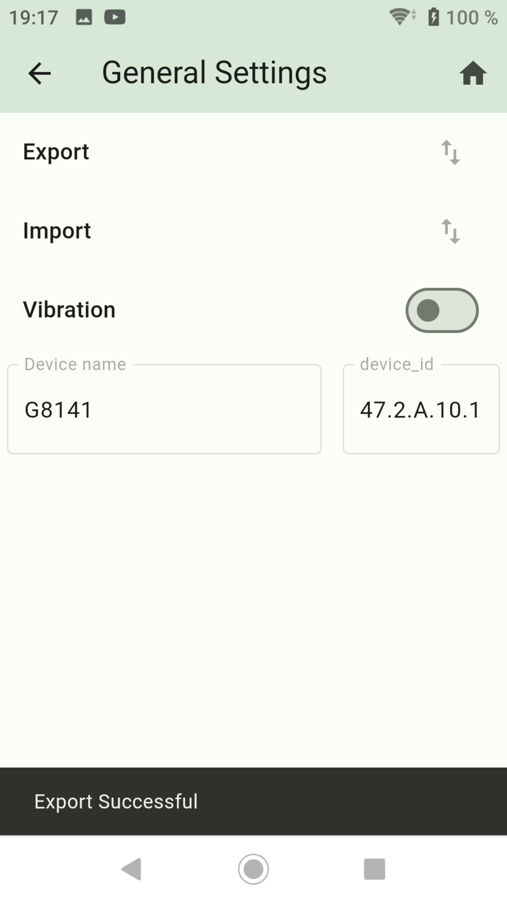

-   [Back to Summary](/docs/en/README.md)
-   [Step 1: Installation and APP setup](app.md)
-   [Step 2: Create Enums](enum.md)
-   [Step 3: Create Widgets](widgets.md)
-   [step 4: Create Screens](sreens.md)
-   [Step 5: Create Backups](backups.md)

## General Settings `General Settings`

- Here the settings can be saved or restored to the cell phone.
- Click export, select folder and save.
- Click import, select backup file and import.
- Vibration: No function
- Info Device Name and Device ID
- Click Export logs, select folder and save.
- Click Delete all logs, select folder and delete all files.

