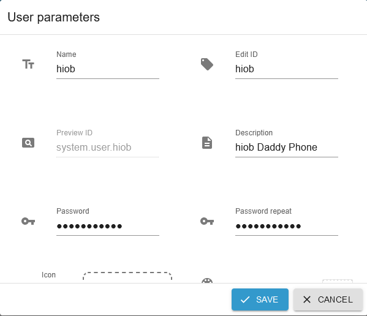
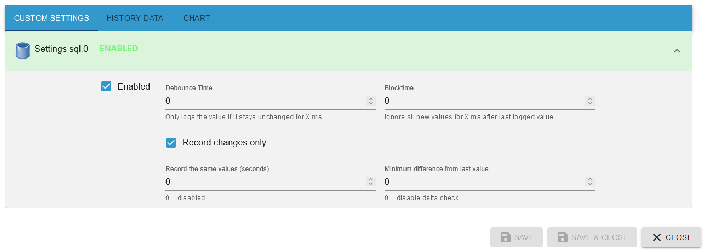

-   [Create Button](button.md)
-   [Create Value](value.md)
-   [Create Advanced](advanced.md)
-   [Create Switch with Slider](switch_w_slider.md)
-   [Create Division Line](division.md)
-   [Create Web View](webview.md)
-   [Create Table](table.md)
-   [Create Color Palette](color.md)
-   [Create Network Media Player](media_player.md)

## Graph (only sql Adapter)

### With Graph you can create graphs of states recorded by SQL or history adapters.

- Swipe left to delete a widget.
- Press the plus sign at the bottom right.

- A recording should first be started. The SQL adapter was used as an example in the 2 pictures. Click Custom Settings and enable SQL.

- Dropdown: select `Graph (only sql Adapter)`.
- Name: Name of the widget
- Title: Header text of the graph
- Y Axis: Open the Y Axis group and press the Add Y Axis button.

- Swipe left to delete a Y axis.
- Several Y Axis (vertical lines) can be created, which can then be selected when creating the line.
- Description: Description of the scaling
- min: Start scaling. Here I start with 1
- max: End of saclation. In example 100
- interval: Scaling interval. In the example 10 is entered. So 1,11,22,33,xxx is displayed

- Swipe left to delete an X axis.
- X Axis: Open the X Axis group and press `Button Add X Axis`.
- Several X Axis (horizontal lines) can be created, which can then be selected when creating the line.
- Description: Description of the scaling
- End of axis: End of scaling (see image for options).
- Scope: How often the scope unit should be displayed. If you now enter `hour` under Scope Unit, an hour will be displayed. If you enter 4, 4 hours will be displayed.
- Scope Unit: Select the unit here (see image for options).

- Swipe left to delete a line.
- Lines: Open the Lines group and click the Add Line button.
- Multiple lines (the diagram) can be created.
- Name: This name will be displayed in the diagram as a header
- Device: Select the desired listing.
- Datapoint: Selection of the state monitored by SQL.
- Line Type: Select the type of line (see image for options).
- x axis: Selection of all x axis(s).
- y axis: Selection of all Y axis(s).
- Min time for next Update: Time when the update should be updated at the latest. It updates automatically when the app starts.
- Show datapoint: The state name is displayed.

- Tracking ball: Set to on if markings should be set.

- Then press save.
- A long press on a widget switches to copy mode. Here you can select widgets from which a copy should be created.

- Adds the widget to a screen.

-   [Create Button](button.md)
-   [Create Value](value.md)
-   [Create Advanced](advanced.md)
-   [Create Switch with Slider](switch_w_slider.md)
-   [Create Division Line](division.md)
-   [Create Web View](webview.md)
-   [Create Table](table.md)
-   [Create Color Palette](color.md)
-   [Create Network Media Player](media_player.md)