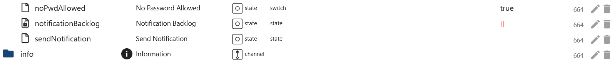
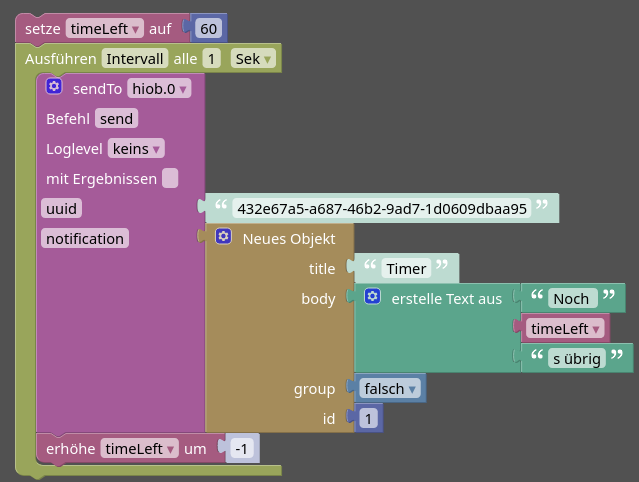
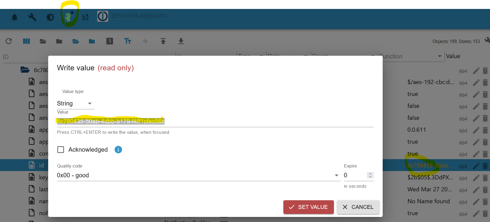
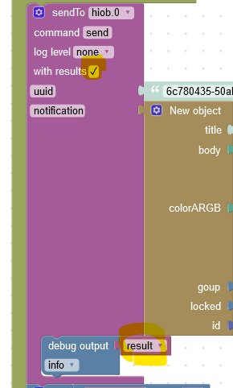
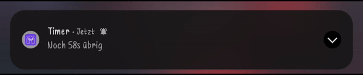

-   [Back to Summary](/docs/en/README.md)

## Notifications

❗**Important** ❗: This feature is still in the beta phase:
- If the app has **no** active connection to the ioBroker, up to **maximum** 250 messages are stored. And sent when reconnected
- There is **no** guarantee that notifications will be received
- There may be **considerable** battery consumption
- The app can **lose** the connection to the server **at any time** if it is in the background

### First steps
1. switch off the battery optimization on your device for the app. (Under the device settings)
    - This is to prevent Android from stopping the app in the background to save energy.
2. allow notifications for the app 
3. activate background notifications in the app under the settings
4. restart the app once

### Send notifications
- `notificationBacklog` Backlog messages
- `sendNotification` A message as text or JSON



### Custom notifications
#### Schema

```JSON
{
	"$schema": "https://json-schema.org/draft/2019-09/schema",
    "type": "object",
    "properties": {
      "title": {
      	"type": "string",
        "descreption": "The title of your notification",
        "exclusiveMinimum": 0
      },
      "body": {
      	"type": "string",
        "descreption": "The body of your notification",
        "exclusiveMinimum": 0
      },
      "locked": {
      	"type": "boolean",
        "descreption": "Wether it should be dissmisable ",
      },
      "group": {
      	"type": "boolean",
        "descreption": "Goups ",
      },
      "colorARGB": {
      	"type": "string",
        "descreption": "ARGB Color Hex code ",
        "exclusiveMinimum": 0
      },
      "id": {
      	"type": "number",
        "descreption": "Notification ID. If you do not want to send a new notification, give it the same ID and the old one will be overwritten",
      }
    }
}
```
#### Color - color`ARGB`

- `A` is the alpha value, with 0 being transparent and 255 being fully opaque - Convert decimal to Hex 255 == FF
- `R` is red, from 0 to 255 - Convert decimal to Hex 255 == FF
- `G` is green, from 0 to 255 - Convert decimal to Hex 255 == FF
- `B` is blue, from 0 to 255 - Convert decimal to Hex 255 == FF
- `ARGB` == FFFFFFFF
#### Example
```JSON
{
  "title": "Bewegung",
  "body": "Es wurde eine Bewungung in der Küche erkannt",
  "locked": false,
  "colorARGB": "FFFF0000"
}
```
#### Blockly sendTo Example
It is also possible to send notifications via Blockly using the sendTo function:
- Parameters
  - **uuid**: The id of the device. Can be found at hiob.x.devices
  - **notification**: The notification to be sent: Object scheme see above
- **Example** <br>

```JS
sendTo('hiob.0', 'send', { 'uuid': '52e34cca-c85a-423a-a07b-c711a0d1575a', 'notification': { 'title': 'Title', 'body': 'Bewegung erkannt' } });
```

#### Example of using the same id - Javascript Adapter >= 7.9.0
**Blockly** <br>
 <br>
 <br>
**Blockly with result** <br>
 <br>
**Notification** <br>


-   [Back to Summary](/docs/en/README.md)