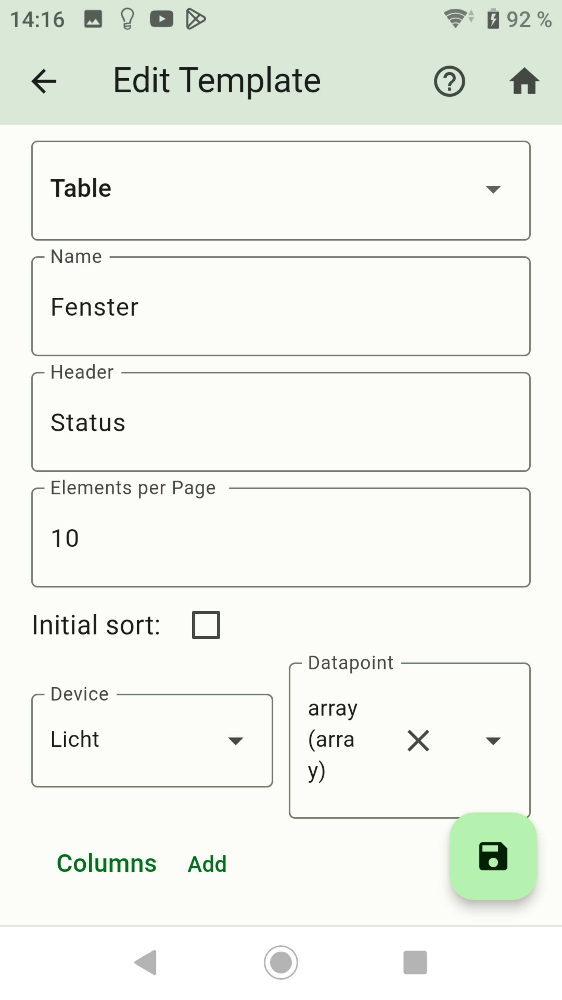
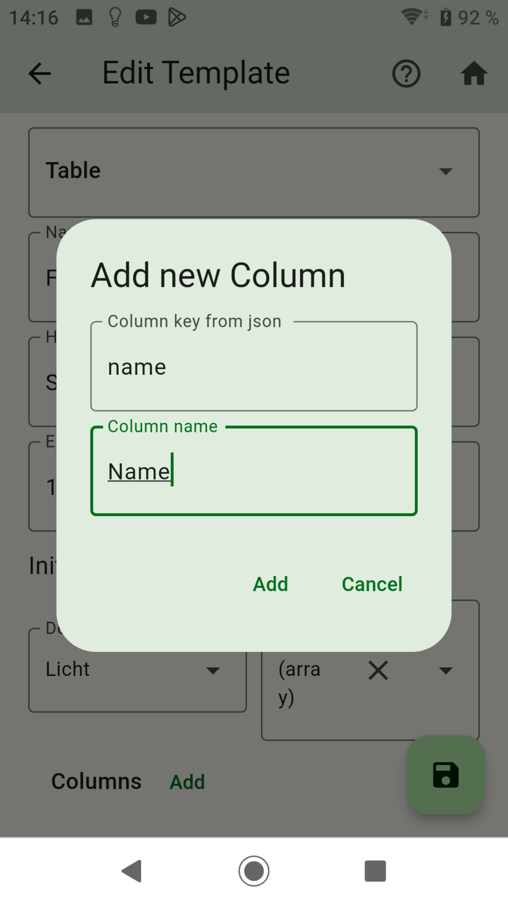
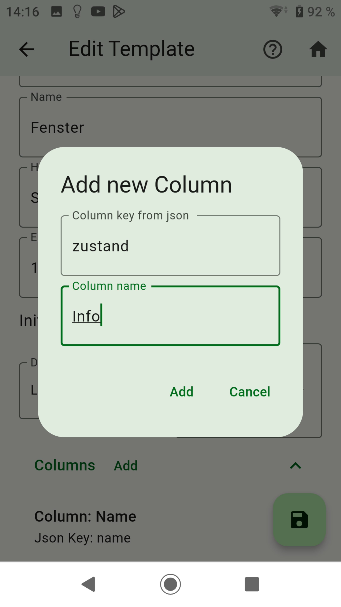
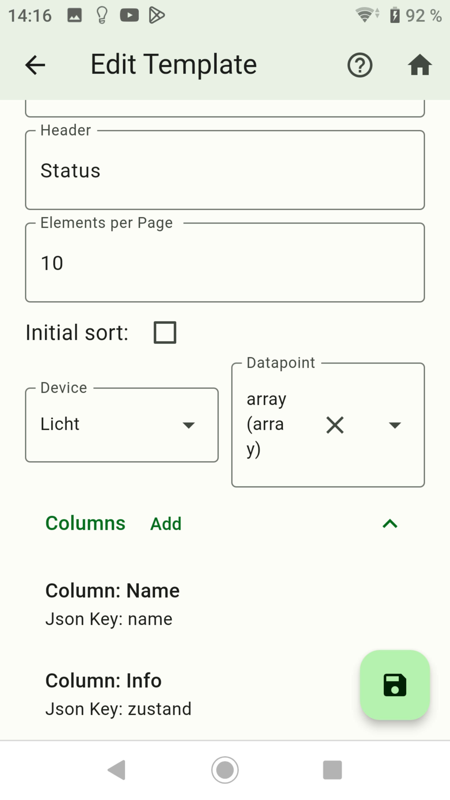
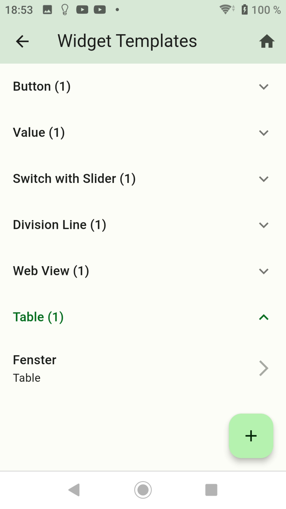
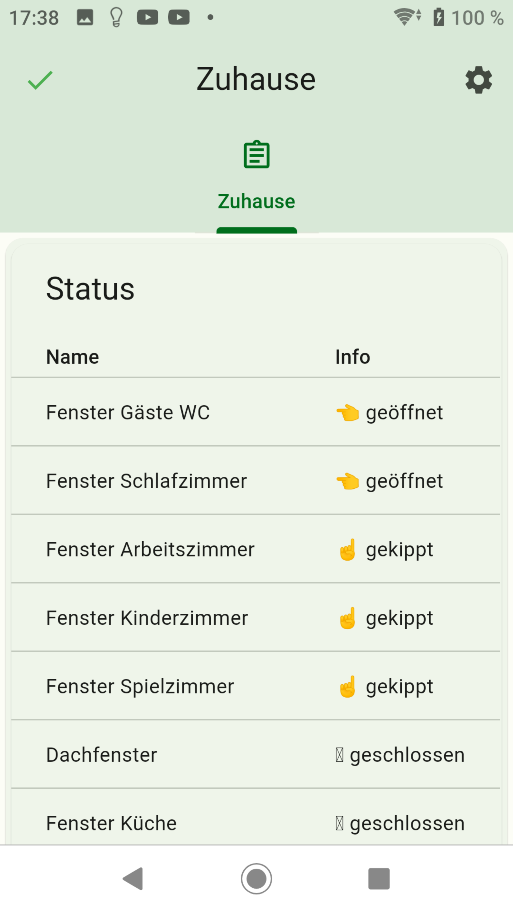

-   [Create Button](button.md)
-   [Create Value](value.md)
-   [Create Advanced](advanced.md)
-   [Create Switch with Slider](switch_w_slider.md)
-   [Create Division Line](division.md)
-   [Create Web View](webview.md)
-   [Create Graph (only sql Adapter)](graph.md)
-   [Create Color Palette](color.md)
-   [Create Network Media Player](media_player.md)

## Table

### With Table you can display JSON

- Swipe left to delete a widget.
- Press the plus sign at the bottom right.


- Dropdown: select `Table`.
- Name: Name of the widget
- Header: Header text from the table
- Elements per Page: How many elements are displayed per page.
- initial sort: Sorts the array (first element)
- Device: Select the desired listing.
- Datapoint: Selection of states from the selected collection - The value must have an array with JSON element.



- Example JSON
```json
[
  {
    "name": "Fenster Gäste WC",
    "zustand": "👈 geöffnet"
  },
  {
    "name": "Fenster Schlafzimmer",
    "zustand": "👈 geöffnet"
  },
  {
    "name": "Fenster Arbeitszimmer",
    "zustand": "☝️ gekippt"
  }
  {
    "name": "Dachfenster",
    "zustand": "🪟 geschlossen"
  }
]
```

- add: Now create the desired columns. Here in the example it is `name` and `state`. The key from the JSON must be entered in `column key`. You can assign a name in `column name`.





- Then press save.
- A long press on a widget switches to copy mode. Here you can select widgets from which a copy should be created.



- Add the widget to a screen.



-   [Create Button](button.md)
-   [Create Value](value.md)
-   [Create Advanced](advanced.md)
-   [Create Switch with Slider](switch_w_slider.md)
-   [Create Division Line](division.md)
-   [Create Web View](webview.md)
-   [Create Graph (only sql Adapter)](graph.md)
-   [Create Color Palette](color.md)
-   [Create Network Media Player](media_player.md)