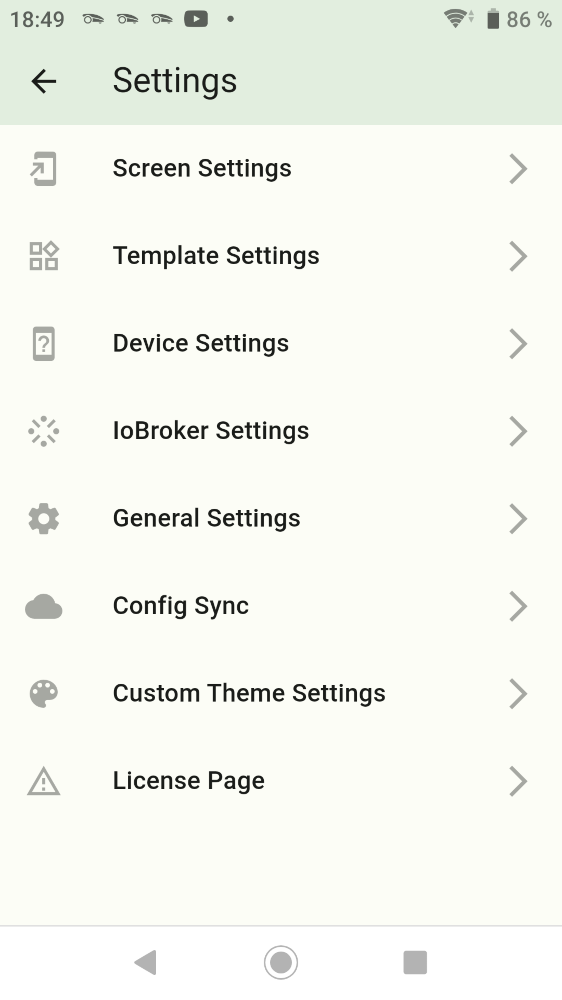

-   [Back to Summary](/docs/en/README.md)
-   [Step 1: Installation and APP setup](app.md)
-   [Step 2: Create Enums](enum.md)
-   [Step 3: Create Widgets](widgets.md)
-   [step 4: Create Screens](sreens.md)
-   [Step 5: Create Backups](backups.md)

## Create Widgets `Template Settings`

# Step 3: Create Widgets

-   [Create Button](button.md)
-   [Create Value](value.md)
-   [Create Advanced](advanced.md)
-   [Create Switch with Slider](switch_w_slider.md)
-   [Create Division Line](division.md)
-   [create Web View](webview.md)
-   [Create Table](table.md)
-   [Create Graph (only sql Adapter)](graph.md)
-   [Create Color Palette](color.md)
-   [Create Network Media Player](media_player.md)

