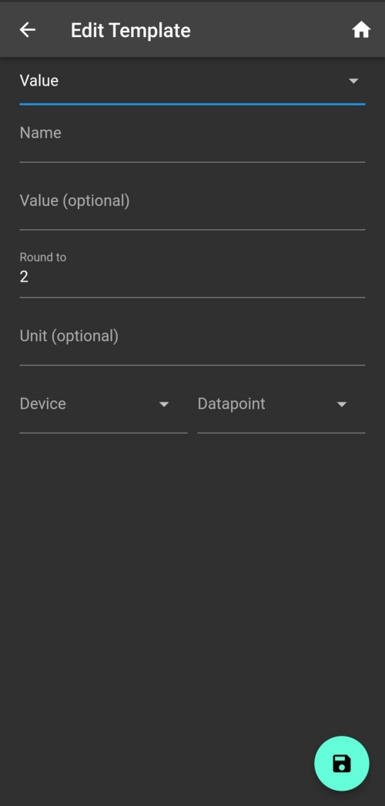

# Widgets

## Allgemein

* Alle Templates benötigen einen Namen, der (sofern Value nicht gesetzt wurde) auch als Anzeige Namen für das Widget benutzt wird
* Das Value Feld kann dabei optional auch ausgefüllt werden, falls der Anzeigename vom Template Namen abweichen soll

## Button

* Type: boolean
* Einfacher Schaltknopf
* Button Text: Dieser Text wird im Button angezeigt (siehe Bild)
* Device & Datapoint\*: Hier wird ausgewählt, welcher Datenpunkt beim Drücken geschalten wird

Einstellungsmenü

## Value

* Type: all
* Zeigt den aktuellen Wert eines Datenpunktes an
* Round to: Dieser Wert gibt an, auf wie viele Nachkommastellen gerundet werden soll
* Device & Datapoint\*: Hier wird ausgewählt, wessen Wert angezeigt werden soll

Einstellungsmenü

.jpg>)

## Switch with slider

* Type: boolean/int/boolean
* Ein einfacher Schalter
* optional mit Slider (für z.B. Dimmerfunktionen)
* Slider Menü lässt sich durch langes drücken (auf das Widget) öffnen

## Advanced

* This Widget is under development
* Dieses Widget bietet viele verschiedene Funktion und "Trigger" Optionen
* _Diese Widget soll in Zukunft die Design- und Gestaltungsfreiheit stark erhöhen_

## Web\_View

* Anzeige einer Webseite
* Bei dynamischen Seiten bitte JavaScript erlauben
